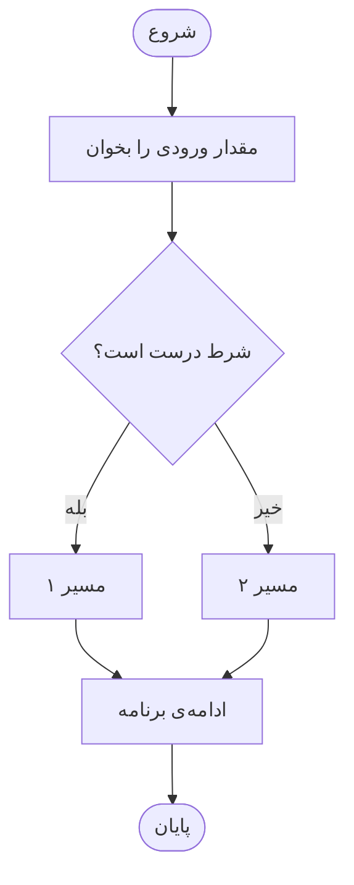
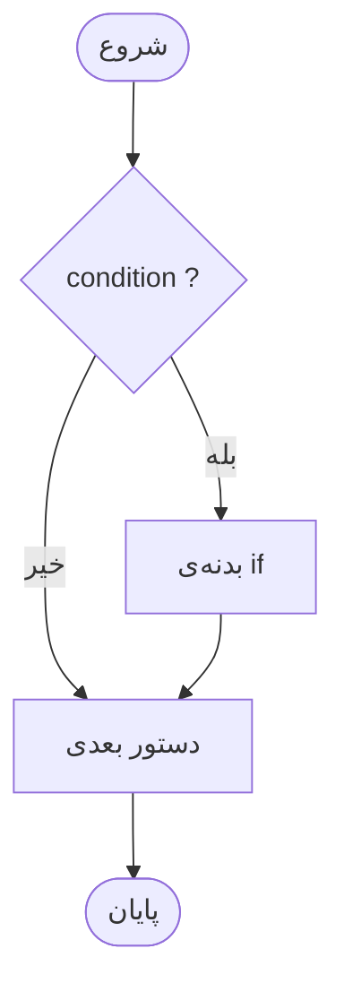
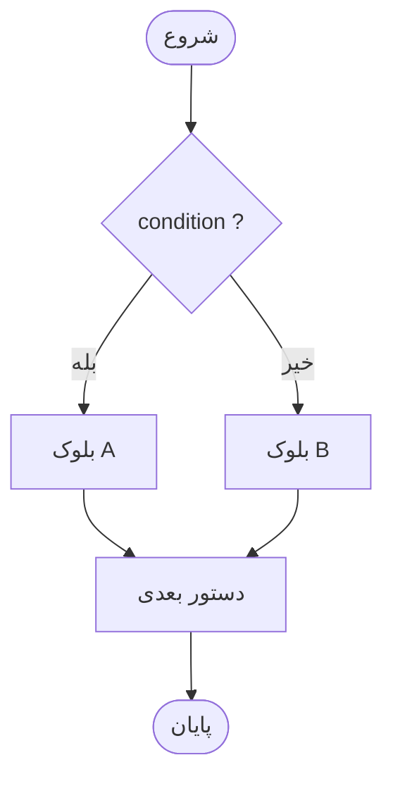
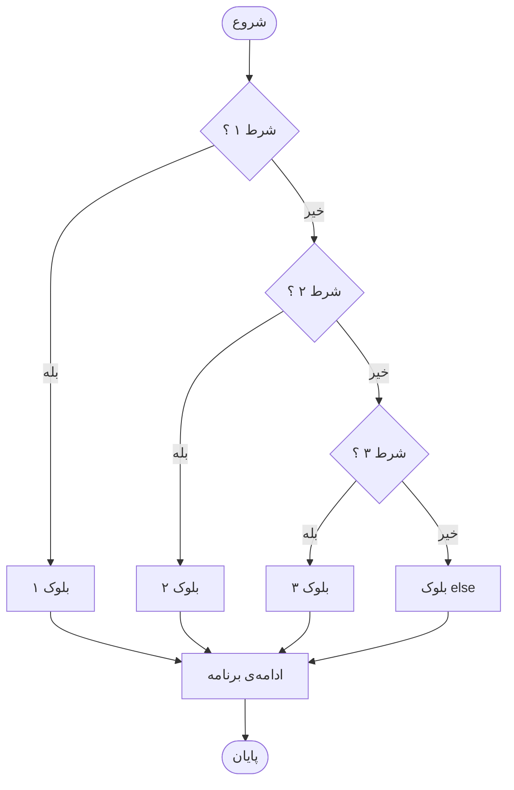
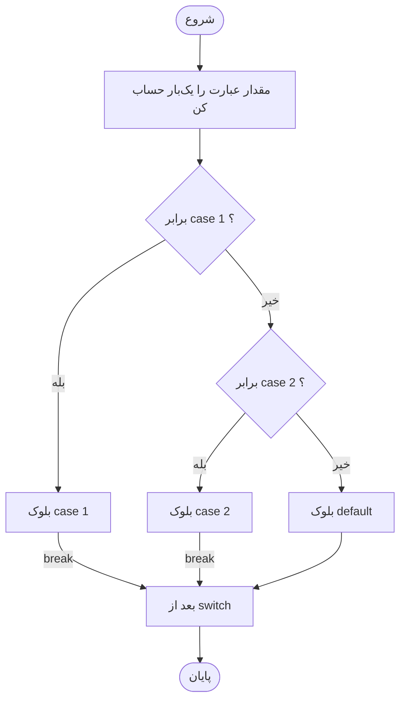
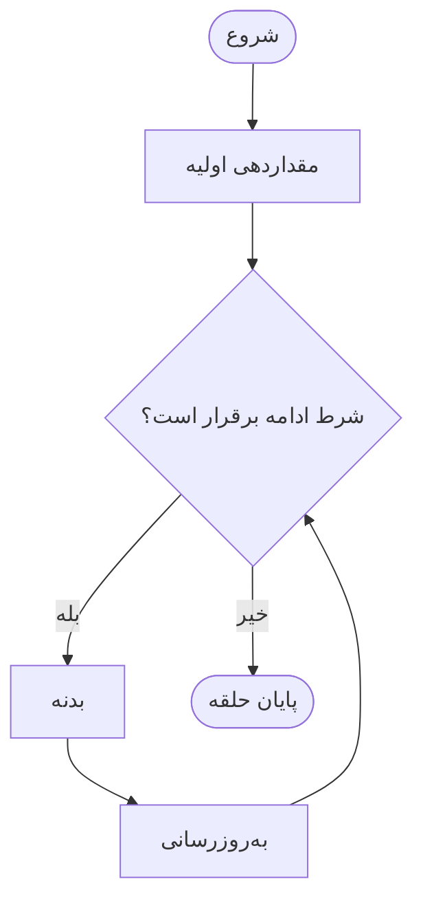
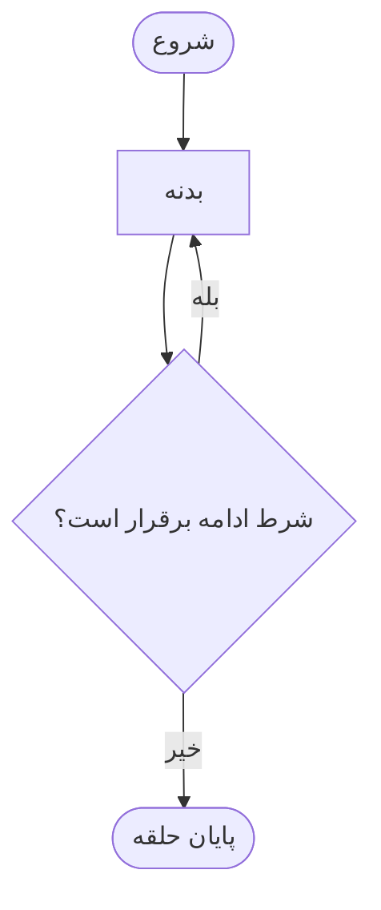
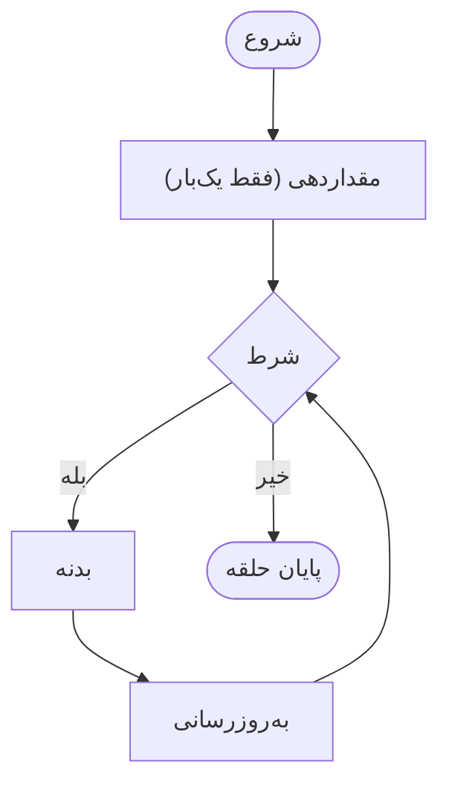
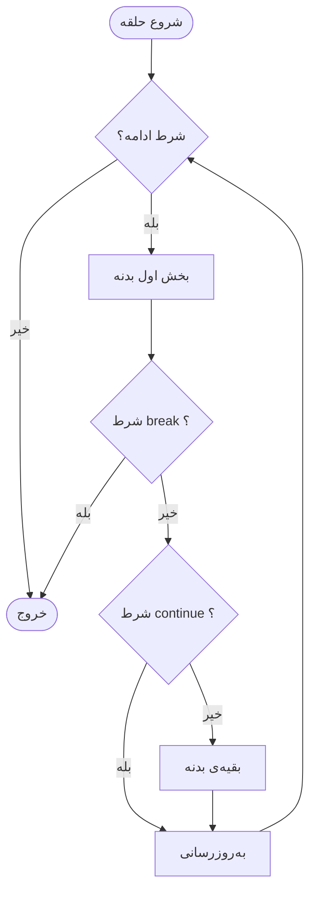
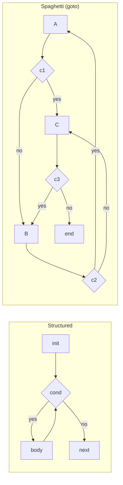

<!-- Part Four: Control Flow in C (Persian). Generated from the notebook content. -->

---

<div dir="rtl">

<h1>بخش چهارم : کنترل جریان برنامه</h1>

</div>

<div dir="rtl">

<h2>مقدمه</h2>

<p>تا اینجای درس، همه‌ی برنامه‌های ما یک ویژگی مشترک داشتند: دستورها از اولین خط تا آخرین خط، <strong>دقیقاً یک‌بار</strong> و <strong>به همان ترتیبی که نوشته شده‌اند</strong> اجرا می‌شدند. به این الگو <strong>اجرای ترتیبی (Sequence)</strong> می‌گوییم. اما مسئله‌های واقعی این‌طور نیستند. وقتی یک سیستم بانکی می‌خواهد برداشت از حساب را انجام دهد، باید ابتدا تصمیم بگیرد: «اگر موجودی کافی است، برداشت را ثبت کن؛ وگرنه پیام خطا بده». وقتی می‌خواهیم میانگین نمرات یک کلاس را حساب کنیم، باید یک کار مشخص را <strong>برای هر دانشجو</strong> تکرار کنیم، بدون این‌که تعداد دانشجویان در زمان نوشتن برنامه معلوم باشد. یعنی دو نیاز تازه پیدا کرده‌ایم: <strong>تصمیم‌گیری</strong> و <strong>تکرار</strong>.</p>

<p>این بخش دقیقاً به همین دو نیاز پاسخ می‌دهد. در <strong>فصل ۸</strong> با ساختارهای شرطی (<code>if</code>، <code>else if</code>، <code>else</code>، عمل‌گر <code>?:</code> و <code>switch</code>) یاد می‌گیریم برنامه چگونه بین چند مسیر یکی را انتخاب کند. در <strong>فصل ۹</strong> با حلقه‌ها (<code>while</code>، <code>do-while</code>، <code>for</code>) و ابزارهای کنترل آن‌ها (<code>break</code>، <code>continue</code>) یاد می‌گیریم برنامه چگونه یک کار را تکرار کند، و در پایان، دلیل این‌که چرا دستور <code>goto</code> را عملاً کنار می‌گذاریم بررسی می‌شود.</p>

<p>یک نکته‌ی مهم درباره‌ی هدف این بخش: <strong>هدف ما یادگیری سینتکس نیست؛ هدف ما یادگیری الگوریتم‌هاست.</strong> سینتکس <code>if</code> و <code>for</code> را می‌توان در ده دقیقه یاد گرفت. چیزی که زمان می‌برد و ارزشمند است، توانایی تبدیل یک مسئله به «تصمیم‌ها و تکرارهای دقیق» و اطمینان از درستی آن است: *کدام شرط‌ها لازم است؟ به چه ترتیبی؟ حلقه کجا باید شروع شود و کجا تمام شود؟ از کجا بدانیم تمام می‌شود؟ از کجا بدانیم جواب درست است؟* به همین دلیل در طول بخش، برای هر مسئله چهار ابزار را کنار هم می‌بینید:</p>

<ul>
<li><strong>Pseudocode:</strong> توصیف الگوریتم به زبان ساده و مستقل از زبان برنامه‌نویسی.</li>
<li><strong>Flowchart:</strong> نمایش تصویری مسیرهای ممکن اجرا.</li>
<li><strong>Trace (دنبال کردن دستی):</strong> نوشتن مقدار متغیرها در هر گام، مثل یک کامپیوتر.</li>
<li><strong>Test Cases (به‌ویژه مقادیر مرزی):</strong> انتخاب ورودی‌هایی که مطمئن شویم همه‌ی مسیرها و لبه‌ها درست کار می‌کنند.</li>
</ul>

<p>در طول این بخش از یک سناریوی واحد استفاده می‌کنیم تا مفاهیم پراکنده نمانند: <strong>برنامه‌ی ارزیابی نمرات کلاس</strong>. نمره‌ها را اعتبارسنجی می‌کنیم، درجه‌بندی می‌کنیم، از ورودی می‌خوانیم، میانگین و بیشترین و کمترین را حساب می‌کنیم و در نهایت یک منوی تعاملی می‌سازیم. در کنار آن، چند الگوریتم کلاسیک کوچک (سال کبیسه، شمارش ارقام، عدد اول، بزرگ‌ترین مقسوم‌علیه مشترک) هم می‌بینیم، چون بهترین محل برای تمرین «فکر کردن با شرط و حلقه» هستند.</p>

<blockquote><p><strong>نکته درباره‌ی ورودی:</strong> برای این‌که برنامه‌ها در همین نوت‌بوک بدون تعامل دستی اجرا شوند، ورودی را از طریق <code>echo ... | ./prog</code> به آن‌ها می‌دهیم. برای شما فقط همین مهم است که <code>scanf</code> مقدار را از ورودی می‌خواند و عدد برگشتی آن، تعداد مقادیر خوانده‌شده‌ی موفق است؛ به همین دلیل نتیجه‌اش را با <code>!= 1</code> بررسی می‌کنیم.</p></blockquote>

</div>

<div dir="rtl">

<h4>نقشه کلی بخش:</h4>

</div>

```text
اجرای ترتیبی (Sequence)
          │
          ├── نیاز به «تصمیم‌گیری» ──► Selection  (فصل ۸)
          │         if / if-else / else-if / ?: / switch
          │
          └── نیاز به «تکرار» ──────► Iteration   (فصل ۹)
                    while / do-while / for
                              │
                              ├── حلقه‌های تودرتو
                              ├── break / continue
                              └── goto  (و دلیل پرهیز از آن)

الگوهای مهم حلقه:
Counter / Accumulator / Min-Max / Search / Sentinel / Convergence
```
</br>

<hr>


<div dir="rtl">

<h2>فصل ۸ : ساختارهای شرطی (Conditional Structures)</h2>

</div>

<div dir="rtl">

<h3>8.1 چرا به شرط نیاز داریم؟</h3>

<p>فرض کنید در برنامه‌ی ارزیابی نمرات، می‌خواهیم برای یک دانشجو وضعیت «قبول» یا «مردود» را چاپ کنیم. نمره‌ی قبولی در این درس ۱۰ از ۲۰ است. با دانش فعلی‌مان چنین می‌نویسیم:</p>

</div>

<div dir="ltr" style="margin-bottom:30px">

```c
#include <stdio.h>

int main(void)
{
    int score = 8;

    printf("Score: %d\n", score);
    printf("Status: Pass\n");
    printf("Status: Fail\n");

    return 0;
}
```
</div>

<div dir="ltr" style="margin-bottom:30px">

**Output:**

```text
Score: 8
Status: Pass
Status: Fail
```
</div>

<div dir="rtl">

<p>خروجی بالا بی‌معنی است: برای نمره‌ی ۸ هر دو پیام «قبول» و «مردود» چاپ شده است. اگر مقدار <code>score</code> را عوض کنیم، باز هم <strong>همین دو خط</strong> چاپ می‌شود. دلیلش ساده است: در اجرای ترتیبی، برنامه هیچ راهی برای «نگاه کردن به داده و تصمیم گرفتن» ندارد؛ هر دستور فقط به این دلیل اجرا می‌شود که در فهرست قرار دارد. چند سؤال از خودتان بپرسید:</p>

<ul>
<li>اگر بخواهیم فقط برای نمره‌های کمتر از ۱۰ پیام «مردود» چاپ شود، این تصمیم را در کدام خط بگیریم؟</li>
<li>اگر بخواهیم برای نمره‌های ۱۷ به بالا پیام «عالی»، برای ۱۴ تا ۱۶ پیام «خوب» و برای بقیه‌ی قبولی‌ها پیام «قبول» چاپ شود، فقط با <code>printf</code> چه کار می‌توانیم بکنیم؟</li>
<li>اگر نمره از کاربر گرفته شود (و در زمان نوشتن برنامه معلوم نباشد)، چطور برنامه باید رفتارش را با آن تطبیق دهد؟</li>
</ul>

<p>مشکل اصلی این است: ما به سازه‌ای نیاز داریم که:</p>

<ol>
<li>یک <strong>شرط</strong> را بسنجد (نتیجه‌ی آن فقط «درست» یا «نادرست» باشد).</li>
<li>بر اساس نتیجه‌ی شرط، <strong>فقط یکی از چند مسیر</strong> را اجرا کند.</li>
<li>مسیرهای انتخاب‌نشده را کاملاً <strong>نادیده بگیرد</strong>.</li>
</ol>

<p>این دقیقاً همان چیزی است که <strong>ساختار انتخاب (Selection)</strong> فراهم می‌کند. شکل کلی آن را به‌صورت Flowchart ببینید:</p>

<div dir="ltr" style="margin-bottom:30px">


</div>

</div>

<div dir="rtl">

<h4>تمرین درون فصل ۸.۱</h4>

<p><strong>نوع تمرین: Quick Reasoning</strong></p>

<p>برنامه‌ی <code>sequential_naive</code> را در نظر بگیرید. فرض کنید مقدار <code>score</code> را به <code>19</code> تغییر دهیم. آیا خروجی برنامه تغییر می‌کند؟ بدون اجرای کد توضیح دهید چرا نمی‌توان فقط با تغییر ورودی، این برنامه را «درست» کرد و چه چیزی در <strong>ساختار</strong> برنامه کم است.</p>

</div>

<div dir="rtl">

<h3>8.2 شرط در زبان C: درست، نادرست و عمل‌گرهای منطقی</h3>

<p>پیش از دیدن <code>if</code>، باید دقیقاً بدانیم <strong>«شرط»</strong> چیست. شرط در برنامه‌نویسی هر عبارتی است که نتیجه‌اش به یکی از دو حالت «درست» یا «نادرست» تعبیر می‌شود. زبان C برخلاف زبان‌هایی مثل Python یا Java، در استاندارد کلاسیکش نوع داده‌ی مستقل <code>bool</code> ندارد و از <strong>اعداد صحیح</strong> برای این کار استفاده می‌کند. قرارداد C این است:</p>

<ul>
<li>مقدار <strong>صفر</strong> یعنی <strong>نادرست (False)</strong>.</li>
<li>هر مقدار <strong>غیرصفر</strong> (۱، ۵، ‎-۳ و ...) یعنی <strong>درست (True)</strong>.</li>
<li>عبارت‌های مقایسه‌ای و منطقی همیشه یکی از دو مقدار <code>1</code> (درست) یا <code>0</code> (نادرست) را تولید می‌کنند.</li>
</ul>

<h4>عمل‌گرهای مقایسه‌ای (Relational)</h4>

<table>
<thead>
<tr><th>عمل‌گر</th><th>معنی</th><th>مثال</th><th>نتیجه</th></tr>
</thead>
<tbody>
<tr><td><code>==</code></td><td>برابر است با</td><td><code>5 == 5</code></td><td>1</td></tr>
<tr><td><code>!=</code></td><td>برابر نیست با</td><td><code>5 != 5</code></td><td>0</td></tr>
<tr><td><code>&lt;</code> , <code>&lt;=</code></td><td>کوچک‌تر، کوچک‌تر یا مساوی</td><td><code>3 &lt; 5</code></td><td>1</td></tr>
<tr><td><code>&gt;</code> , <code>&gt;=</code></td><td>بزرگ‌تر، بزرگ‌تر یا مساوی</td><td><code>3 &gt;= 5</code></td><td>0</td></tr>
</tbody>
</table>

</br>

<h4>عمل‌گرهای منطقی (Logical)</h4>

<table>
<thead>
<tr><th>عمل‌گر</th><th>نام</th><th>معنی</th></tr>
</thead>
<tbody>
<tr><td><code>&amp;&amp;</code></td><td>AND</td><td>وقتی درست است که <strong>هر دو</strong> طرف درست باشند</td></tr>
<tr><td><code>||</code></td><td>OR</td><td>وقتی درست است که <strong>حداقل یکی</strong> از دو طرف درست باشد</td></tr>
<tr><td><code>!</code></td><td>NOT</td><td>نتیجه را برعکس می‌کند</td></tr>
</tbody>
</table>

</br>

<p>جدول درستی (Truth Table) دو عمل‌گر <code>&amp;&amp;</code> و <code>||</code> را ببینید (<code>A</code> و <code>B</code> دو شرط دلخواه‌اند):</p>

<table>
<thead>
<tr><th>A</th><th>B</th><th>A &amp;&amp; B</th><th>A || B</th></tr>
</thead>
<tbody>
<tr><td>0</td><td>0</td><td>0</td><td>0</td></tr>
<tr><td>0</td><td>1</td><td>0</td><td>1</td></tr>
<tr><td>1</td><td>0</td><td>0</td><td>1</td></tr>
<tr><td>1</td><td>1</td><td>1</td><td>1</td></tr>
</tbody>
</table>

</br>

</div>

<div dir="ltr" style="margin-bottom:30px">

```c
#include <stdio.h>

int main(void)
{
    int a = 7, b = 3;

    printf("a > b            -> %d\n", a > b);
    printf("a == b           -> %d\n", a == b);
    printf("a != b           -> %d\n", a != b);
    printf("a > 5 && b > 5   -> %d\n", a > 5 && b > 5);
    printf("a > 5 || b > 5   -> %d\n", a > 5 || b > 5);
    printf("!(a > b)         -> %d\n", !(a > b));
    printf("!!a (a is 7)     -> %d\n", !!a);

    return 0;
}
```
</div>

<div dir="ltr" style="margin-bottom:30px">

**Output:**

```text
a > b            -> 1
a == b           -> 0
a != b           -> 1
a > 5 && b > 5   -> 0
a > 5 || b > 5   -> 1
!(a > b)         -> 0
!!a (a is 7)     -> 1
```
</div>

<div dir="rtl">

<p>خط آخر نکته‌ی مهمی را نشان می‌دهد: <code>a</code> برابر ۷ است (نه ۱)، اما در یک شرط «درست» محسوب می‌شود، چون غیرصفر است؛ و عمل‌گر <code>!</code> دوبار روی آن اثر کرده و آن را به مقدار استاندارد <code>1</code> تبدیل کرده است.</p>

<h4>ارزیابی کوتاه‌مدار (Short-Circuit Evaluation)</h4>

<p>یک ویژگی بسیار مهم <code>&amp;&amp;</code> و <code>||</code> این است که <strong>طرف راست فقط در صورت لزوم ارزیابی می‌شود</strong>:</p>

<ul>
<li>در <code>A &amp;&amp; B</code>، اگر <code>A</code> نادرست باشد، نتیجه قطعاً نادرست است و <code>B</code> <strong>اصلاً ارزیابی نمی‌شود</strong>.</li>
<li>در <code>A || B</code>، اگر <code>A</code> درست باشد، نتیجه قطعاً درست است و <code>B</code> <strong>اصلاً ارزیابی نمی‌شود</strong>.</li>
</ul>

<p>این فقط یک بهینه‌سازی نیست؛ یک <strong>ابزار الگوریتمی</strong> است. با ترتیب دادن درست شرط‌ها می‌توانیم یک محاسبه‌ی خطرناک را «نگهبانی» کنیم (Guard):</p>

</div>

<div dir="ltr" style="margin-bottom:30px">

```c
#include <stdio.h>

int main(void)
{
    int x = 0;
    int calls = 0;

    /* Guard: the division is evaluated only when x != 0 */
    if (x != 0 && 10 / x > 1) {
        printf("10 / x is greater than 1\n");
    } else {
        printf("Skipped: x is zero, the division never ran\n");
    }

    /* Side effect on the right side of || */
    if (x == 0 || ++calls > 0) {
        printf("calls = %d (the right side did not run)\n", calls);
    }

    return 0;
}
```
</div>

<div dir="ltr" style="margin-bottom:30px">

**Output:**

```text
Skipped: x is zero, the division never ran
calls = 0 (the right side did not run)
```
</div>

<div dir="rtl">

<p>چرا ترتیب شرط‌ها در <code>x != 0 &amp;&amp; 10 / x &gt; 1</code> مهم است؟</br>
	اگر ترتیب را برعکس کنیم (<code>10 / x &gt; 1 &amp;&amp; x != 0</code>)، ابتدا تقسیم بر صفر ارزیابی می‌شود و برنامه دچار خطای زمان اجرا می‌شود. با قرار دادن «شرطِ نگهبان» در سمت چپ، تضمین می‌کنیم طرف راست فقط وقتی اجرا شود که امن است.</p>

<p>چرا در خط دوم برنامه مقدار <code>calls</code> هنوز صفر است؟</br>
	چون <code>x == 0</code> درست است و در <code>||</code> وقتی طرف چپ درست باشد، طرف راست (<code>++calls &gt; 0</code>) هرگز اجرا نمی‌شود؛ پس اثر جانبی آن (افزایش <code>calls</code>) هم رخ نمی‌دهد. به همین دلیل نوشتن عبارت‌هایی با اثر جانبی داخل شرط‌ها عادت خوبی نیست.</p>

<h4>اولویت عمل‌گرها</h4>

<p>وقتی چند عمل‌گر در یک عبارت هستند، ترتیب ارزیابی از بالا به پایین جدول زیر است:</p>

<table>
<thead>
<tr><th>اولویت</th><th>عمل‌گر</th></tr>
</thead>
<tbody>
<tr><td>۱ (بالاترین)</td><td><code>!</code></td></tr>
<tr><td>۲</td><td><code>&lt;</code> , <code>&lt;=</code> , <code>&gt;</code> , <code>&gt;=</code></td></tr>
<tr><td>۳</td><td><code>==</code> , <code>!=</code></td></tr>
<tr><td>۴</td><td><code>&amp;&amp;</code></td></tr>
<tr><td>۵ (پایین‌ترین)</td><td><code>||</code></td></tr>
</tbody>
</table>

</br>

<p>یعنی <code>&amp;&amp;</code> قوی‌تر از <code>||</code> است. این دقیقاً جایی است که خواننده‌ی کد را (و گاهی نویسنده‌ی آن را) به اشتباه می‌اندازد:</p>

</div>

<div dir="ltr" style="margin-bottom:30px">

```c
#include <stdio.h>

int main(void)
{
    printf("1 || 0 && 0     -> %d\n", 1 || 0 && 0);
    printf("(1 || 0) && 0   -> %d\n", (1 || 0) && 0);

    return 0;
}
```
</div>

<div dir="ltr" style="margin-bottom:30px">

**Output:**

```text
p04_c08_04_precedence.c: In function ‘main’:
p04_c08_04_precedence.c:5:41: warning: suggest parentheses around ‘&&’ within ‘||’ [-Wparentheses]
    5 |     printf("1 || 0 && 0     -> %d\n", 1 || 0 && 0);
      |                                         ^~
1 || 0 && 0     -> 1
(1 || 0) && 0   -> 0
```
</div>

<div dir="rtl">

<p>عبارت اول به‌صورت <code>1 || (0 &amp;&amp; 0)</code> ارزیابی می‌شود (چون <code>&amp;&amp;</code> اول انجام می‌شود) و نتیجه‌اش <code>1</code> است؛ در حالی که با پرانتز، نتیجه <code>0</code> می‌شود. توجه کنید کامپایلر با <code>-Wall</code> هم دقیقاً همین ابهام را هشدار داده است. <strong>قاعده‌ی عملی:</strong> هر جا ترکیب <code>&amp;&amp;</code> و <code>||</code> را کنار هم می‌نویسید، پرانتز بگذارید؛ حتی اگر لازم نباشد.</p>

<h4>قوانین دمورگان (De Morgan's Laws)</h4>

<p>برای ساختن «نقیض» یک شرط (مثلاً وقتی می‌خواهیم حالت‌های <strong>نامعتبر</strong> را از روی حالت‌های <strong>معتبر</strong> بسازیم) از دو قانون زیر استفاده می‌کنیم:</p>

<table>
<thead>
<tr><th>عبارت اصلی</th><th>عبارت معادل</th></tr>
</thead>
<tbody>
<tr><td><code>!(A &amp;&amp; B)</code></td><td><code>!A || !B</code></td></tr>
<tr><td><code>!(A || B)</code></td><td><code>!A &amp;&amp; !B</code></td></tr>
</tbody>
</table>

</br>

<p>مثال: نمره‌ی معتبر یعنی <code>score &gt;= 0 &amp;&amp; score &lt;= 20</code>. پس نمره‌ی <strong>نامعتبر</strong> یعنی <code>!(score &gt;= 0 &amp;&amp; score &lt;= 20)</code> که طبق دمورگان برابر است با <code>score &lt; 0 || score &gt; 20</code>. به عمل‌گر دقت کنید: <code>&amp;&amp;</code> تبدیل به <code>||</code> شد و هر مقایسه برعکس شد.</p>

</div>

<div dir="rtl">

<h4>تمرین درون فصل ۸.۲</h4>

<p><strong>نوع تمرین: Predict the Output</strong></p>

<div dir="ltr" style="margin-bottom:30px">

```c
int x = 5;
printf("%d %d\n", x > 3 && x < 10, x < 3 || x > 10);
```
</div>
</br>

<p>بدون اجرای کد، خروجی را پیش‌بینی کنید. سپس با استفاده از قوانین دمورگان، عبارت <code>!(x &gt; 3 &amp;&amp; x &lt; 10)</code> را بدون استفاده از <code>!</code> بازنویسی کنید.</p>

</div>

<div dir="rtl">

<h3>8.3 دستور if</h3>

</div>

<div dir="rtl">

<h4>ایده الگوریتم</h4>

<p>ساده‌ترین شکل تصمیم‌گیری: «<strong>اگر</strong> شرط برقرار بود، یک کار اضافه انجام بده؛ در غیر این صورت، همین مرحله را رد کن و ادامه بده.» در این حالت دو مسیر داریم، اما یکی از آن‌ها «هیچ کاری نکردن» است.</p>

</div>

<div dir="ltr">

<div dir="ltr">

<h4>Pseudocode</h4>
</div>

<div dir="ltr" style="margin-bottom:30px">

```text
if condition:
    statements          // only when the condition is true
next statement          // always runs
```
</div>
</br>

</div>

<div dir="ltr">

<div dir="ltr">

<h4>Flowchart</h4>
</div>

<div dir="ltr" style="margin-bottom:30px">


</div>

</div>

<div dir="ltr">

<div dir="ltr">

<h4>Example A - Simple: پاداش برای نمره‌ی بالا</h4>
</div>

</div>

<div dir="ltr" style="margin-bottom:30px">

```c
#include <stdio.h>

int main(void)
{
    int score;

    if (scanf("%d", &score) != 1) {
        return 1;
    }

    printf("Score: %d\n", score);
    if (score >= 18) {
        printf("Excellent! Bonus point awarded.\n");
    }
    printf("Report finished.\n");

    return 0;
}
```
</div>

<div dir="ltr" style="margin-bottom:30px">

**Output:**

```text
# input: 19
Score: 19
Excellent! Bonus point awarded.
Report finished.
# input: 12
Score: 12
Report finished.
```
</div>

<div dir="rtl">

<p>برنامه دو بار با ورودی‌های <code>19</code> و <code>12</code> اجرا شده است. در اجرای دوم، پیام پاداش چاپ نشده، اما خط آخر (<code>Report finished.</code>) در هر دو اجرا چاپ شده. چرا؟</p>

<p>کدام خط‌ها «زیر کنترل» <code>if</code> هستند؟</br>
	فقط دستورهای داخل آکولاد (<code>{ ... }</code>) بعد از شرط. خط <code>printf("Report finished.\n")</code> بیرون از آکولاد است و به شرط وابسته نیست؛ یعنی بعد از پایان <code>if</code> ــ چه بدنه اجرا شده باشد، چه نه ــ برنامه از همین خط ادامه می‌یابد. این همان گره‌ی «دو مسیر که دوباره به هم می‌رسند» در Flowchart است.</p>

<p>چرا برای بدنه‌ی <code>if</code> همیشه آکولاد می‌نویسیم، حتی برای یک دستور؟</br>
	چون اگر آکولاد نباشد، فقط <strong>اولین دستور</strong> بعد از شرط به آن وابسته است و هر خط بعدی (حتی اگر با تورفتگی نوشته شده باشد) مستقل می‌شود. این یکی از رایج‌ترین منابع باگ است (در «خطاهای رایج» همین فصل می‌بینیم).</p>

</div>

<div dir="ltr">

<div dir="ltr">

<h4>Example B - Real: اعتبارسنجی بازه‌ی نمره</h4>
</div>

</div>

<div dir="rtl">

<p>در برنامه‌ی واقعی، اولین کاری که با ورودی کاربر باید کرد این است که مطمئن شویم <strong>معتبر</strong> است. نمره باید بین ۰ تا ۲۰ باشد:</p>

</div>

<div dir="ltr" style="margin-bottom:30px">

```c
#include <stdio.h>

int main(void)
{
    int score;

    if (scanf("%d", &score) != 1) {
        return 1;
    }

    if (score < 0 || score > 20) {
        printf("%d: invalid score (must be between 0 and 20)\n", score);
        return 1;
    }

    printf("%d: valid score\n", score);
    return 0;
}
```
</div>

<div dir="ltr" style="margin-bottom:30px">

**Output:**

```text
# input: 15
15: valid score
# input: 20
20: valid score
# input: 0
0: valid score
# input: 21
21: invalid score (must be between 0 and 20)
# input: -1
-1: invalid score (must be between 0 and 20)
```
</div>

<div dir="rtl">

<p>چرا شرط نامعتبر را با <code>||</code> نوشته‌ایم، نه با <code>&amp;&amp;</code>؟</br>
	نمره وقتی نامعتبر است که <strong>از یک طرف</strong> بازه بیرون باشد: یا خیلی کوچک (<code>&lt; 0</code>) یا خیلی بزرگ (<code>&gt; 20</code>). عبارت <code>score &lt; 0 &amp;&amp; score &gt; 20</code> هیچ‌وقت درست نمی‌شود، چون هیچ عددی هم‌زمان هم از ۰ کوچک‌تر است و هم از ۲۰ بزرگ‌تر. این همان قانون دمورگان است که در ۸.۲ دیدیم.</p>

<p>چرا بعد از چاپ پیام خطا <code>return 1</code> نوشته‌ایم؟</br>
	<code>return</code> در <code>main</code> برنامه را فوراً تمام می‌کند. مقدار غیرصفر طبق قرارداد یعنی «برنامه با خطا تمام شد». این الگو (<strong>Guard Clause</strong>: «اگر ورودی بد است، همین‌جا کار را تمام کن») باعث می‌شود بقیه‌ی برنامه فقط با داده‌ی معتبر سروکار داشته باشد؛ در ۸.۶ بیشتر از آن استفاده می‌کنیم.</p>

</div>

<div dir="ltr">

<div dir="ltr">

<h4>Example C - Tricky: دستور بعد از شرط، بدون آکولاد</h4>
</div>

</div>

<div dir="rtl">

<div dir="ltr" style="margin-bottom:30px">

```c
if (score < 10)
    printf("Fail\n");
    printf("Please retake the course\n");
```
</div>
</br>

<p>برای <code>score = 15</code>، آیا پیام «Please retake the course» چاپ می‌شود؟ <strong>بله.</strong> تورفتگی فقط برای انسان است و کامپایلر آن را نمی‌بیند. کامپایلر کد بالا را این‌طور می‌خواند:</p>

<div dir="ltr" style="margin-bottom:30px">

```c
if (score < 10) {
    printf("Fail\n");
}
printf("Please retake the course\n");   // همیشه اجرا می‌شود
```
</div>
</br>

<p>برای همین است که هیچ‌وقت نباید به تورفتگی برای تشخیص حدود <code>if</code> اعتماد کرد؛ آکولاد تنها منبع حقیقت است.</p>

</div>

<div dir="rtl">

<h4>تمرین درون فصل ۸.۳</h4>

<p><strong>نوع تمرین: Predict the Output</strong></p>

<div dir="ltr" style="margin-bottom:30px">

```c
int x = 4;
if (x > 5)
    printf("A\n");
    printf("B\n");
```
</div>
</br>

<p>خروجی چیست؟ دلیل خود را با استناد به قاعده‌ی «یک دستور بدون آکولاد» توضیح دهید.</p>

</div>

<div dir="rtl">

<h3>تمرین‌های پایانی زیربخش: if</h3>

<p>★ <strong>سطح پایه</strong></p>

<ol>
<li><p><strong>Small Implementation:</strong></br>
 برنامه‌ای بنویسید که یک عدد صحیح بخواند و فقط اگر عدد <strong>منفی</strong> بود، پیام <code>Negative number</code> را چاپ کند. در هر حالت، در انتها <code>Done</code> چاپ شود.</p></li>
<li><strong>Predict the Output:</strong></li>
</ol>

<div dir="ltr" style="margin-bottom:30px">

```c
int a = 10, b = 20;
if (a > b) {
    printf("X\n");
}
printf("Y\n");
```
</div>
</br>

<p>خروجی را پیش‌بینی کنید و بگویید کدام خط‌ها به شرط وابسته‌اند.</p>

<p>★★ <strong>سطح متوسط</strong></p>

<ol start="3">
<li><p><strong>Small Implementation:</strong></br>
 برنامه‌ای بنویسید که سه عدد صحیح بگیرد و فقط اگر <strong>هر سه عدد مثبت</strong> بودند، مجموع آن‌ها را چاپ کند.</p></li>
<li><strong>Find the Bug:</strong></li>
</ol>

<div dir="ltr" style="margin-bottom:30px">

```c
if (score >= 0 && score <= 20);
{
    printf("Valid\n");
}
```
</div>
</br>

<p>این کد برای هر ورودی «Valid» چاپ می‌کند. علت را پیدا کنید و اصلاح کنید.</p>

<p>★★★ <strong>سطح چالشی</strong></p>

<ol start="5">
<li><p><strong>Design:</strong></br>
 شرط «عدد <code>x</code> در بازه‌ی [۱۰, ۲۰] <strong>نیست</strong>» را یک‌بار با <code>!</code> و یک‌بار بدون <code>!</code> (با دمورگان) بنویسید و ثابت کنید (با جدول مقادیر آزمایشی) که معادل‌اند.</p></li>
<li><p><strong>Explain Why:</strong></br>
 توضیح دهید چرا نوشتن <code>if (x = 0)</code> در C خطای کامپایل نمی‌دهد، اما تقریباً همیشه اشتباه است. این شرط برای چه مقادیری از <code>x</code> بدنه را اجرا می‌کند؟</p></li>
</ol>

</div>

<div dir="rtl">

<h3>8.4 دستور if-else</h3>

</div>

<div dir="rtl">

<h4>ایده الگوریتم</h4>

<p>در بسیاری از مسئله‌ها، هر دو حالت «شرط درست» و «شرط نادرست» کاری برای انجام دارند. <code>if-else</code> یک <strong>تقسیم دوشاخه</strong> است: <strong>دقیقاً یکی</strong> از دو مسیر اجرا می‌شود، نه هر دو و نه هیچ‌کدام. به همین دلیل مشکل برنامه‌ی <code>sequential_naive</code> (چاپ هم‌زمان «قبول» و «مردود») با آن حل می‌شود.</p>

</div>

<div dir="ltr">

<div dir="ltr">

<h4>Pseudocode</h4>
</div>

<div dir="ltr" style="margin-bottom:30px">

```text
if condition:
    statements A        // condition is true
else:
    statements B        // condition is false
next statement
```
</div>
</br>

</div>

<div dir="ltr">

<div dir="ltr">

<h4>Flowchart</h4>
</div>

<div dir="ltr" style="margin-bottom:30px">


</div>

</div>

<div dir="ltr">

<div dir="ltr">

<h4>Example A - Simple: زوج یا فرد</h4>
</div>

</div>

<div dir="ltr" style="margin-bottom:30px">

```c
#include <stdio.h>

int main(void)
{
    int n;

    if (scanf("%d", &n) != 1) {
        return 1;
    }

    if (n % 2 == 0) {
        printf("%d is even\n", n);
    } else {
        printf("%d is odd\n", n);
    }

    return 0;
}
```
</div>

<div dir="ltr" style="margin-bottom:30px">

**Output:**

```text
# input: 10
10 is even
# input: 7
7 is odd
# input: 0
0 is even
```
</div>

<div dir="rtl">

<p>ایده‌ی الگوریتم: باقی‌مانده‌ی تقسیم بر ۲ فقط دو مقدار ممکن دارد؛ پس مسئله‌ی «زوج یا فرد» دقیقاً با یک تصمیم دوشاخه حل می‌شود. به این‌که عدد <code>0</code> زوج حساب شده است دقت کنید: <code>0 % 2</code> برابر <code>0</code> است، پس الگوریتم بدون هیچ استثنای جداگانه درست کار می‌کند.</p>

</div>

<div dir="ltr">

<div dir="ltr">

<h4>Example B - Real: سال کبیسه (Leap Year)</h4>
</div>

</div>

<div dir="rtl">

<p>این مسئله یک نمونه‌ی کلاسیک از <strong>قاعده‌ی چندلایه</strong> است. قاعده‌ی تقویم میلادی این است: سالی کبیسه است که بر ۴ بخش‌پذیر باشد، <strong>مگر</strong> این‌که بر ۱۰۰ بخش‌پذیر باشد، <strong>مگر</strong> این‌که بر ۴۰۰ هم بخش‌پذیر باشد. دو راه برای تبدیل این قاعده به شرط وجود دارد: یک عبارت منطقی واحد، یا یک زنجیره‌ی تصمیم از <strong>خاص‌ترین استثنا</strong> به عمومی‌ترین قاعده (۴۰۰ ← ۱۰۰ ← ۴).</p>

</div>

<div dir="ltr">

<div dir="ltr">

<h4>Pseudocode</h4>
</div>

<div dir="ltr" style="margin-bottom:30px">

```text
function IS_LEAP(year):
    if year divisible by 400:  return TRUE
    else if year divisible by 100: return FALSE
    else if year divisible by 4:   return TRUE
    else:                          return FALSE
```
</div>
</br>

</div>

<div dir="ltr" style="margin-bottom:30px">

```c
#include <stdio.h>

int main(void)
{
    int year;

    if (scanf("%d", &year) != 1) {
        return 1;
    }

    /* Formulation 1: one logical expression */
    int leap_expr = (year % 4 == 0 && year % 100 != 0) || (year % 400 == 0);

    /* Formulation 2: from the most specific exception to the general rule */
    int leap_chain;
    if (year % 400 == 0) {
        leap_chain = 1;
    } else if (year % 100 == 0) {
        leap_chain = 0;
    } else {
        leap_chain = (year % 4 == 0);
    }

    if (leap_expr) {
        printf("%d: leap year\n", year);
    } else {
        printf("%d: common year\n", year);
    }

    if (leap_expr != leap_chain) {
        printf("MISMATCH between the two formulations!\n");
    }

    return 0;
}
```
</div>

<div dir="ltr" style="margin-bottom:30px">

**Output:**

```text
# input: 1900
1900: common year
# input: 2000
2000: leap year
# input: 2024
2024: leap year
# input: 2023
2023: common year
# input: 2100
2100: common year
# input: 1600
1600: leap year
```
</div>

<div dir="rtl">

<p>چرا این شش سال برای تست انتخاب شده‌اند؟</br>
	هر سال یک <strong>مسیر متفاوت</strong> از الگوریتم را آزمایش می‌کند: سال‌های <code>2000</code> و <code>1600</code> مسیر «بخش‌پذیر بر ۴۰۰» را؛ <code>1900</code> و <code>2100</code> مسیر «بخش‌پذیر بر ۱۰۰ ولی نه ۴۰۰» را؛ <code>2024</code> مسیر «بخش‌پذیر بر ۴ ولی نه ۱۰۰» را؛ و <code>2023</code> مسیر «هیچ‌کدام» را. این ایده را <strong>پوشش مسیرها (Path Coverage)</strong> می‌نامند: برای هر مسیر ممکن، حداقل یک ورودی آزمایشی. اگر فقط سال‌های «عادی» مثل ۲۰۲۴ و ۲۰۲۳ را تست می‌کردیم، یک پیاده‌سازی ساده‌ی <code>year % 4 == 0</code> هم قبول می‌شد، در حالی که برای ۱۹۰۰ غلط است.</p>

<p>چرا در فرمول دوم ترتیب ۴۰۰ ← ۱۰۰ ← ۴ مهم است؟</br>
	چون اگر ابتدا بپرسیم «آیا بر ۴ بخش‌پذیر است؟»، سال ۱۹۰۰ همان‌جا کبیسه تلقی می‌شود و استثنای ۱۰۰ هرگز فرصت اصلاح این تصمیم را پیدا نمی‌کند. در یک زنجیره‌ی تصمیم، <strong>هر شرط فقط وقتی بررسی می‌شود که همه‌ی شرط‌های قبلی نادرست بوده‌اند</strong>؛ پس شرط‌ها باید از خاص به عام مرتب شوند (در ۸.۵ این اصل را کامل بررسی می‌کنیم).</p>

<p>چرا برنامه دو فرمول را با هم مقایسه می‌کند؟</br>
	وقتی برای یک مسئله دو راه حل مستقل داریم، مقایسه‌ی نتیجه‌ی آن‌ها یک تکنیک ارزان برای کشف باگ است. اگر هیچ‌وقت <code>MISMATCH</code> چاپ نشود، احتمال اشتباه هر دو هم‌زمان کم می‌شود.</p>

</div>

<div dir="rtl">

<div dir="ltr">

<h4>Trace: دنبال کردن مسیر تصمیم برای سال ۱۹۰۰ و ۲۰۲۴</h4>
</div>

</div>

<div dir="rtl">

<p><em>🎬 (نمودار یا انیمیشن تعاملی؛ فقط در نسخه‌ی نوت‌بوک اجرا و نمایش داده می‌شود.)</em></p>

</div>

<div dir="rtl">

<p><em>🎬 (نمودار یا انیمیشن تعاملی؛ فقط در نسخه‌ی نوت‌بوک اجرا و نمایش داده می‌شود.)</em></p>

</div>

<div dir="ltr">

<div dir="ltr">

<h4>Example C - Tricky: باقی‌مانده‌ی اعداد منفی</h4>
</div>

</div>

<div dir="ltr" style="margin-bottom:30px">

```c
#include <stdio.h>

int main(void)
{
    int n = -7;

    printf("n %% 2 = %d\n", n % 2);

    if (n % 2 == 1) {
        printf("version 1 (n %% 2 == 1): odd\n");
    } else {
        printf("version 1 (n %% 2 == 1): even   <-- wrong!\n");
    }

    if (n % 2 != 0) {
        printf("version 2 (n %% 2 != 0): odd\n");
    } else {
        printf("version 2 (n %% 2 != 0): even\n");
    }

    return 0;
}
```
</div>

<div dir="ltr" style="margin-bottom:30px">

**Output:**

```text
n % 2 = -1
version 1 (n % 2 == 1): even   <-- wrong!
version 2 (n % 2 != 0): odd
```
</div>

<div dir="rtl">

<p>در C (از استاندارد C99 به بعد) تقسیم صحیح به سمت صفر گرد می‌شود و علامت باقی‌مانده با علامت <strong>مقسوم</strong> یکی است؛ پس <code>-7 % 2</code> برابر <code>-1</code> است، نه <code>1</code>. نسخه‌ی اول فقط برای عددهای نامنفی درست بود. نسخه‌ی دوم به‌جای «آیا باقی‌مانده دقیقاً ۱ است؟» می‌پرسد «آیا باقی‌مانده صفر <strong>نیست</strong>؟» که برای همه‌ی اعداد درست است. درس الگوریتمی: <strong>شرط را طوری بنویس که روی کل دامنه‌ی ورودی درست باشد، نه فقط روی مثال‌هایی که امتحان کرده‌ای.</strong></p>

</div>

<div dir="rtl">

<h4>تمرین درون فصل ۸.۴</h4>

<p><strong>نوع تمرین: Trace</strong></p>

<p>الگوریتم سال کبیسه را برای <code>year = 2100</code> و سپس <code>year = 2000</code> روی کاغذ دنبال کنید. برای هرکدام بنویسید کدام شرط‌ها به ترتیب بررسی می‌شوند و نتیجه‌ی هرکدام (درست/نادرست) چیست و در نهایت کدام مسیر انتخاب می‌شود.</p>

</div>

<div dir="rtl">

<h3>تمرین‌های پایانی زیربخش: if-else</h3>

<p>★ <strong>سطح پایه</strong></p>

<ol>
<li><p><strong>Small Implementation:</strong></br>
 برنامه‌ای بنویسید که یک عدد بخواند و بگوید مثبت است یا «غیر مثبت» (صفر یا منفی).</p></li>
<li><strong>Predict the Output:</strong></li>
</ol>

<div dir="ltr" style="margin-bottom:30px">

```c
int n = 15;
if (n % 5 == 0) {
    printf("A\n");
} else {
    printf("B\n");
}
printf("C\n");
```
</div>
</br>

<p>★★ <strong>سطح متوسط</strong></p>

<ol start="3">
<li><p><strong>Small Implementation:</strong></br>
 برنامه‌ای بنویسید که سه عدد بخواند و با فقط <code>if-else</code> و عمل‌گرهای منطقی بگوید آیا <strong>هر سه برابرند</strong> یا نه.</p></li>
<li><strong>Find the Bug:</strong></li>
</ol>

<div dir="ltr" style="margin-bottom:30px">

```c
if (year % 4 == 0)
    printf("Leap\n");
else
    printf("Common\n");
```
</div>
</br>

<p>این کد برای کدام سال‌ها (حداقل دو مثال بزنید) جواب غلط می‌دهد؟ چه شرط‌هایی باید اضافه شود؟</p>

<ol start="5">
<li><p><strong>Trace:</strong></br>
 برای <code>year = 1600</code> و <code>year = 1700</code> الگوریتم دو فرمول (عبارت واحد و زنجیره) را دنبال کنید و نشان دهید هر دو به یک نتیجه می‌رسند.</p></li>
</ol>

<p>★★★ <strong>سطح چالشی</strong></p>

<ol start="6">
<li><p><strong>Edge Case Reasoning:</strong></br>
 اگر در برنامه‌ی زوج/فرد به‌جای <code>n % 2 != 0</code> از <code>n % 2 == 1</code> استفاده شود، برای کدام ورودی‌ها پاسخ غلط می‌دهد؟ یک ورودی آزمایشی بنویسید که این باگ را فاش کند.</p></li>
<li><p><strong>Design:</strong></br>
 مسئله‌ی «بخش‌پذیری بر ۳ و ۵» (همه‌ی اعدادی که هم بر ۳ و هم بر ۵ بخش‌پذیرند) را با یک شرط واحد و سپس با دو <code>if</code> تو در تو بنویسید. کدام خواناتر است؟ چرا؟</p></li>
</ol>

</div>

<div dir="rtl">

<h3>8.5 زنجیره‌ی else if (انتخاب چندمسیره)</h3>

</div>

<div dir="rtl">

<h4>ایده الگوریتم</h4>

<p>گاهی بیش از دو مسیر داریم. مثلاً در برنامه‌ی ارزیابی نمرات، نمره باید به یکی از چند دسته تبدیل شود: «عالی» (۱۷ تا ۲۰)، «خوب» (۱۴ تا ۱۶)، «قبول» (۱۰ تا ۱۳) و «مردود» (زیر ۱۰). راه‌حل، یک <strong>زنجیره‌ی شرط‌ها</strong> است که از بالا به پایین یکی‌یکی بررسی می‌شوند و <strong>اولین شرطی که درست باشد برنده است</strong>؛ بقیه‌ی زنجیره اصلاً بررسی نمی‌شود.</p>

<p>این جمله‌ی کوتاه (<strong>«اولین شرط درست برنده است»</strong>) مهم‌ترین نکته‌ی این بخش است و تمام قاعده‌های بعدی از آن نتیجه می‌شوند.</p>

</div>

<div dir="ltr">

<div dir="ltr">

<h4>Pseudocode</h4>
</div>

<div dir="ltr" style="margin-bottom:30px">

```text
if condition 1:      statements 1
else if condition 2: statements 2
else if condition 3: statements 3
...
else:                statements N     // optional: if nothing above matched
```
</div>
</br>

</div>

<div dir="ltr">

<div dir="ltr">

<h4>Flowchart</h4>
</div>

<div dir="ltr" style="margin-bottom:30px">


</div>

</div>

<div dir="ltr">

<div dir="ltr">

<h4>Example A - Simple: درجه‌بندی نمره</h4>
</div>

</div>

<div dir="ltr" style="margin-bottom:30px">

```c
#include <stdio.h>

int main(void)
{
    int score;

    if (scanf("%d", &score) != 1) {
        return 1;
    }

    if (score < 0 || score > 20) {
        printf("%d: invalid score\n", score);
    } else if (score >= 17) {
        printf("%d: Excellent\n", score);
    } else if (score >= 14) {
        printf("%d: Good\n", score);
    } else if (score >= 10) {
        printf("%d: Pass\n", score);
    } else {
        printf("%d: Fail\n", score);
    }

    return 0;
}
```
</div>

<div dir="ltr" style="margin-bottom:30px">

**Output:**

```text
# input: 20
20: Excellent
# input: 17
17: Excellent
# input: 16
16: Good
# input: 14
14: Good
# input: 13
13: Pass
# input: 10
10: Pass
# input: 9
9: Fail
# input: 0
0: Fail
# input: 21
21: invalid score
# input: -5
-5: invalid score
```
</div>

<div dir="rtl">

<p>چرا در شرط سوم فقط <code>score &gt;= 14</code> نوشته‌ایم و <code>score &lt; 17</code> را ننوشته‌ایم؟</br>
	چون برای رسیدن به این شرط، شرط قبلی (<code>score &gt;= 17</code>) باید <strong>نادرست</strong> شده باشد؛ یعنی در این نقطه از برنامه، ما از قبل «می‌دانیم» که <code>score &lt; 17</code> است. هر شرط در زنجیره به‌طور ضمنی نقیضِ همه‌ی شرط‌های بالایی را هم در خود دارد. این ویژگی شرط‌ها را کوتاه و خوانا می‌کند، اما همزمان یعنی <strong>ترتیب شرط‌ها بخشی از منطق برنامه است</strong>.</p>

<p>چرا شرط اعتبارسنجی در ابتدای زنجیره آمده است؟</br>
	چون اگر نمره‌ی <code>25</code> را بدون بررسی اعتبار وارد زنجیره می‌کردیم، به شرط <code>score &gt;= 17</code> می‌رسید و «Excellent» چاپ می‌شد. حالت‌های <strong>خاص و استثنایی</strong> (ورودی نامعتبر) باید پیش از حالت‌های عمومی بررسی شوند.</p>

<p>چرا شاخه‌ی نهایی <code>else</code> شرط ندارد؟</br>
	<code>else</code> یعنی «هر حالتی که هیچ‌کدام از شرط‌های بالا پوشش نداده‌اند». چون در این‌جا آخرین دسته (مردود) دقیقاً «بقیه‌ی حالت‌ها» است، نیازی به نوشتن <code>score &gt;= 0 &amp;&amp; score &lt; 10</code> نیست.</p>

</div>

<div dir="rtl">

<div dir="ltr">

<h4>Trace: مسیر تصمیم برای نمره‌ی ۱۵</h4>
</div>

</div>

<div dir="rtl">

<p><em>🎬 (نمودار یا انیمیشن تعاملی؛ فقط در نسخه‌ی نوت‌بوک اجرا و نمایش داده می‌شود.)</em></p>

</div>

<div dir="rtl">

<h4>تست مرزی (Boundary Value Testing)</h4>

<p>«چه ورودی‌هایی را تست کنیم؟» سؤالی است که یک برنامه‌نویس حرفه‌ای هر بار از خودش می‌پرسد. برای زنجیره‌های شرطی، پاسخ استاندارد این است: <strong>روی مرز هر شرط</strong>، یک مقدار درست قبل از مرز، خود مرز، و یک مقدار درست بعد از آن را امتحان کنید؛ چون اکثر باگ‌های شرطی دقیقاً همان‌جا (اشتباه <code>&gt;</code> به‌جای <code>&gt;=</code>) پنهان می‌شوند.</p>

<table>
<thead>
<tr><th>مرز</th><th>مقادیر آزمایشی</th><th>خروجی مورد انتظار</th></tr>
</thead>
<tbody>
<tr><td>مرز اعتبار پایین</td><td><code>-1</code> , <code>0</code></td><td>invalid , Fail</td></tr>
<tr><td>مرز Fail/Pass</td><td><code>9</code> , <code>10</code></td><td>Fail , Pass</td></tr>
<tr><td>مرز Pass/Good</td><td><code>13</code> , <code>14</code></td><td>Pass , Good</td></tr>
<tr><td>مرز Good/Excellent</td><td><code>16</code> , <code>17</code></td><td>Good , Excellent</td></tr>
<tr><td>مرز اعتبار بالا</td><td><code>20</code> , <code>21</code></td><td>Excellent , invalid</td></tr>
</tbody>
</table>

</br>

<p>اگر دوباره به خروجی برنامه‌ی <code>grade_ladder</code> نگاه کنید، دقیقاً همین مقادیر آزمایش شده‌اند و همه با جدول بالا می‌خوانند. فرض کنید به‌جای <code>score &gt;= 14</code> اشتباهاً <code>score &gt; 14</code> نوشته بودیم؛ فقط ورودی <code>14</code> (که روی مرز است) این باگ را نشان می‌داد، در حالی که تست با <code>16</code> یا <code>12</code> هرگز آن را نمی‌دید.</p>

</div>

<div dir="ltr">

<div dir="ltr">

<h4>Example B - Real: دسته‌بندی مثلث</h4>
</div>

</div>

<div dir="rtl">

<p>مسئله: سه عدد صحیح به‌عنوان طول ضلع‌ها داده شده است. برنامه باید بگوید این سه عدد (۱) اصلاً ضلع معتبر هستند؟ (۲) تشکیل مثلث می‌دهند؟ (۳) مثلث متساوی‌الاضلاع، متساوی‌الساقین یا مختلف‌الاضلاع است؟ (۴) قائم‌الزاویه هست یا نه؟</p>

<p>ایده‌ی الگوریتم: سؤال‌ها را به <strong>ترتیب وابستگی</strong> مرتب می‌کنیم. تا وقتی ضلع‌ها مثبت نباشند، بحث نامساوی مثلث بی‌معناست؛ تا وقتی نامساوی مثلث برقرار نباشد، بحث نوع مثلث بی‌معناست. پس: اعتبار ← نامساوی مثلث ← نوع.</p>

</div>

<div dir="ltr">

<div dir="ltr">

<h4>Pseudocode</h4>
</div>

<div dir="ltr" style="margin-bottom:30px">

```text
read a, b, c
if a <= 0 or b <= 0 or c <= 0:       print "invalid"
else if a + b <= c or a + c <= b or b + c <= a:
                                      print "not a triangle"
else:
    if a = b = c:                     type ← "equilateral"
    else if two sides are equal:      type ← "isosceles"
    else:                             type ← "scalene"
    right ← (a² + b² = c²) or (a² + c² = b²) or (b² + c² = a²)
    print type, and "right-angled" if right
```
</div>
</br>

</div>

<div dir="ltr" style="margin-bottom:30px">

```c
#include <stdio.h>

int main(void)
{
    int a, b, c;

    if (scanf("%d %d %d", &a, &b, &c) != 3) {
        return 1;
    }

    if (a <= 0 || b <= 0 || c <= 0) {
        printf("%d %d %d: invalid (sides must be positive)\n", a, b, c);
    } else if (a + b <= c || a + c <= b || b + c <= a) {
        printf("%d %d %d: not a triangle\n", a, b, c);
    } else {
        int right = (a * a + b * b == c * c) ||
                    (a * a + c * c == b * b) ||
                    (b * b + c * c == a * a);

        printf("%d %d %d: ", a, b, c);
        if (a == b && b == c) {
            printf("equilateral");
        } else if (a == b || b == c || a == c) {
            printf("isosceles");
        } else {
            printf("scalene");
        }

        if (right) {
            printf(", right-angled");
        }
        printf("\n");
    }

    return 0;
}
```
</div>

<div dir="ltr" style="margin-bottom:30px">

**Output:**

```text
# input: 3 4 5
3 4 5: scalene, right-angled
# input: 5 5 5
5 5 5: equilateral
# input: 5 5 8
5 5 8: isosceles
# input: 6 7 9
6 7 9: scalene
# input: 1 2 3
1 2 3: not a triangle
# input: 0 4 4
0 4 4: invalid (sides must be positive)
# input: 5 12 13
5 12 13: scalene, right-angled
```
</div>

<div dir="rtl">

<p>چرا شرط نامساوی مثلث با <code>&lt;=</code> نوشته شده، نه <code>&lt;</code>؟</br>
	در یک مثلث واقعی مجموع هر دو ضلع <strong>اکیداً</strong> از ضلع سوم بزرگ‌تر است. حالت <code>1 2 3</code> (که <code>1 + 2 == 3</code>) یک «مثلث تباهیده» است: سه نقطه روی یک خط. اگر <code>&lt;</code> می‌نوشتیم، این ورودی به‌اشتباه مثلث معتبر شمرده می‌شد. همین ورودی یک <strong>تست مرزی</strong> عالی است.</p>

<p>چرا ساختار این برنامه ترکیبی از زنجیره‌ی <code>else if</code> و یک <code>if</code> تو در تو است؟</br>
	بخش اول (اعتبار ← مثلث بودن) یک انتخاب چندمسیره‌ی کلاسیک است. اما وقتی مطمئن شدیم مثلث معتبر است، <strong>دو سؤال مستقل</strong> از هم داریم: «نوع از نظر ضلع‌ها» و «قائم‌الزاویه بودن». این دو را نمی‌توان در یک زنجیره‌ی واحد گنجاند، چون در یک زنجیره فقط یک مسیر اجرا می‌شود، در حالی که ما باید <strong>هر دو</strong> پاسخ را بدهیم. ترکیب <code>right</code> (یک متغیر <code>0/1</code>) با چاپ شرطی انتهای خط، راه ساده‌ی ما برای ترکیب پاسخ هر دو سؤال است.</p>

</div>

<div dir="ltr">

<div dir="ltr">

<h4>Example C - Tricky: ترتیب اشتباه شرط‌ها</h4>
</div>

</div>

<div dir="rtl">

<p>فرض کنید یک برنامه‌نویس همان زنجیره‌ی درجه‌بندی را از <strong>پایین به بالا</strong> نوشته باشد:</p>

</div>

<div dir="ltr" style="margin-bottom:30px">

```c
#include <stdio.h>

int main(void)
{
    int score;

    if (scanf("%d", &score) != 1) {
        return 1;
    }

    /* BUG: conditions are in the wrong order */
    if (score >= 10) {
        printf("%d: Pass\n", score);
    } else if (score >= 14) {
        printf("%d: Good\n", score);
    } else if (score >= 17) {
        printf("%d: Excellent\n", score);
    } else {
        printf("%d: Fail\n", score);
    }

    return 0;
}
```
</div>

<div dir="ltr" style="margin-bottom:30px">

**Output:**

```text
# input: 18
18: Pass
# input: 15
15: Pass
# input: 12
12: Pass
# input: 5
5: Fail
```
</div>

<div dir="rtl">

<p>کد بدون هیچ خطا یا هشداری کامپایل می‌شود و حتی برای نمره‌های پایین درست کار می‌کند؛ اما برای <code>18</code> و <code>15</code> جواب غلط می‌دهد. چرا؟ چون شرط <code>score &gt;= 10</code> <strong>برای هر نمره‌ی قبولی درست است</strong> و طبق قانون «اولین شرط درست برنده است»، دو شاخه‌ی بعدی هرگز اجرا نمی‌شوند (به آن‌ها کد غیرقابل‌دسترس یا <strong>Unreachable Code</strong> می‌گوییم).</p>

<p><strong>قاعده‌ی طراحی:</strong> در یک زنجیره‌ی <code>else if</code> که روی بازه‌ها کار می‌کند، شرط‌ها را <strong>از محدودترین (سخت‌گیرانه‌ترین) به عمومی‌ترین</strong> بنویسید؛ یا برعکس، از عمومی‌ترین به محدودترین ولی با مقایسه‌ی <code>&lt;</code> (مثلاً <code>score &lt; 10</code>، سپس <code>score &lt; 14</code>، ...). هر دو درست‌اند؛ مهم این است که مرتب باشند.</p>

</div>

<div dir="rtl">

<h4>هزینه‌ی یک زنجیره‌ی else if</h4>

<p>در بدترین حالت (مقداری که با هیچ شرطی تطابق ندارد یا فقط با آخرین شرط تطابق دارد)، یک زنجیره‌ی <code>k</code> شرطی باید همه‌ی <code>k</code> شرط را ارزیابی کند؛ یعنی هزینه‌ی آن متناسب با <code>k</code> است. این عدد معمولاً کوچک است و تأثیری ندارد؛ اما همین نکته توجیه می‌کند چرا برای زنجیره‌های بزرگ و پرتکرار، شرط‌هایی را که <strong>محتمل‌تر</strong> هستند بالاتر می‌گذارند (به شرطی که منطق برنامه را به هم نریزد).</p>

</div>

<div dir="rtl">

<h4>تمرین درون فصل ۸.۵</h4>

<p><strong>نوع تمرین: Trace</strong></p>

<p>برای <code>score = 14</code> و سپس <code>score = 13</code> زنجیره‌ی درجه‌بندی را دنبال کنید. در هر مورد بنویسید کدام شرط‌ها به ترتیب بررسی می‌شوند و چرا نتیجه‌ی این دو ورودی که فقط یک واحد اختلاف دارند متفاوت است.</p>

</div>

<div dir="rtl">

<h4>تمرین درون فصل ۸.۶ : چرا ترتیب مهم است؟</h4>

<p><strong>نوع تمرین: Explain Why</strong></p>

<p>در برنامه‌ی <code>ladder_wrong_order</code> (ترتیب اشتباه)، برای چه نمره‌هایی خروجی <strong>درست</strong> است و برای چه نمره‌هایی غلط؟ آیا می‌توانید بدون تغییر ترتیب شرط‌ها، فقط با تغییر خود شرط‌ها (بدون جابه‌جایی) آن را درست کنید؟ یک راه پیشنهاد دهید و مقایسه‌اش با راه‌حل «اصلاح ترتیب» را بنویسید.</p>

</div>

<div dir="rtl">

<h3>تمرین‌های پایانی زیربخش: else if</h3>

<p>★ <strong>سطح پایه</strong></p>

<ol>
<li><p><strong>Trace:</strong></br>
 برای ورودی <code>3 4 5</code> در برنامه‌ی دسته‌بندی مثلث، شرط‌هایی که به ترتیب بررسی می‌شوند و مقدار <code>right</code> را بنویسید.</p></li>
<li><strong>Predict the Output:</strong></li>
</ol>

<div dir="ltr" style="margin-bottom:30px">

```c
int x = 7;
if (x > 10) {
    printf("A\n");
} else if (x > 5) {
    printf("B\n");
} else if (x > 0) {
    printf("C\n");
}
```
</div>
</br>

<p>★★ <strong>سطح متوسط</strong></p>

<ol start="3">
<li><p><strong>Small Implementation:</strong></br>
 برنامه‌ای بنویسید که دمای هوا (عدد صحیح) را بگیرد و آن را به یکی از دسته‌های «یخبندان» (زیر ۰)، «سرد» (۰ تا ۱۴)، «معتدل» (۱۵ تا ۲۵) و «گرم» (بالای ۲۵) تبدیل کند.</p></li>
<li><strong>Find the Bug:</strong></li>
</ol>

<div dir="ltr" style="margin-bottom:30px">

```c
if (age >= 18) {
    printf("Adult\n");
} else if (age >= 13) {
    printf("Teen\n");
} else if (age >= 0 && age < 13) {
    printf("Child\n");
}
```
</div>
</br>

<p>اگر <code>age = -4</code> باشد چه اتفاقی می‌افتد؟ چه چیزی در طراحی این زنجیره از نظر مدیریت ورودی نامعتبر کم است؟</p>

<ol start="5">
<li><p><strong>Edge Case Implementation:</strong></br>
 برای برنامه‌ی دسته‌بندی مثلث، یک جدول از حداقل هشت ورودی آزمایشی بنویسید که <strong>همه‌ی مسیرهای</strong> برنامه (invalid، not a triangle، سه نوع ضلعی، قائم‌الزاویه و غیرقائم) را پوشش دهد.</p></li>
</ol>

<p>★★★ <strong>سطح چالشی</strong></p>

<ol start="6">
<li><p><strong>Design:</strong></br>
 مالیات‌ها معمولاً پله‌ای محاسبه می‌شوند: تا ۱۰۰۰ واحد، معاف؛ از ۱۰۰۰ تا ۵۰۰۰ واحد، ۱۰٪ مقدار <strong>اضافه‌بر ۱۰۰۰</strong>؛ بالای ۵۰۰۰ واحد، ۴۰۰ واحد (مالیات کامل پله‌ی دوم) به‌اضافه‌ی ۲۰٪ مقدار <strong>اضافه‌بر ۵۰۰۰</strong>. با یک زنجیره‌ی <code>else if</code> مالیات را حساب کنید و مرزهای ۱۰۰۰ و ۵۰۰۰ را تست کنید.</p></li>
<li><p><strong>Modify the Algorithm:</strong></br>
 برنامه‌ی دسته‌بندی مثلث را طوری تغییر دهید که علاوه بر نوع ضلع‌ها، نوع زاویه‌ها را هم (حاده، قائمه، منفرجه) تشخیص دهد. (راهنمایی: فقط <strong>بزرگ‌ترین ضلع</strong> مهم است؛ چگونه آن را بدون آرایه پیدا می‌کنید؟)</p></li>
</ol>

</div>

<div dir="rtl">

<h3>8.6 شرط‌های تو در تو (Nested Conditions)</h3>

</div>

<div dir="rtl">

<h4>ایده الگوریتم</h4>

<p>یک <code>if</code> می‌تواند داخل بدنه‌ی <code>if</code> یا <code>else</code> دیگری قرار بگیرد. این کار زمانی طبیعی است که یک تصمیم <strong>فقط وقتی معنا دارد</strong> که تصمیم قبلی به نتیجه‌ی مشخصی رسیده باشد. مثال: برداشت از خودپرداز. پرسیدن «آیا مبلغ از موجودی کمتر است؟» وقتی مبلغ منفی باشد بی‌معنی است؛ پس باید ابتدا اعتبار مبلغ بررسی شود.</p>

<p>قواعد برداشت: مبلغ مثبت باشد؛ مضرب ۱۰ باشد؛ از موجودی (اینجا ۱۰۰۰) بیشتر نباشد؛ از سقف برداشت روزانه (اینجا ۵۰۰) بیشتر نباشد.</p>

</div>

<div dir="ltr">

<div dir="ltr">

<h4>Example A - Simple: نسخه‌ی تو در تو (Nested)</h4>
</div>

</div>

<div dir="ltr" style="margin-bottom:30px">

```c
#include <stdio.h>

int main(void)
{
    int balance = 1000, limit = 500, amount;

    if (scanf("%d", &amount) == 1) {
        if (amount > 0) {
            if (amount % 10 == 0) {
                if (amount <= balance) {
                    if (amount <= limit) {
                        balance -= amount;
                        printf("OK: withdrew %d, balance = %d\n", amount, balance);
                    } else {
                        printf("Denied: above the daily limit\n");
                    }
                } else {
                    printf("Denied: insufficient balance\n");
                }
            } else {
                printf("Denied: amount must be a multiple of 10\n");
            }
        } else {
            printf("Denied: amount must be positive\n");
        }
    }

    return 0;
}
```
</div>

<div dir="ltr" style="margin-bottom:30px">

**Output:**

```text
# input: 200
OK: withdrew 200, balance = 800
# input: 0
Denied: amount must be positive
# input: 25
Denied: amount must be a multiple of 10
# input: 700
Denied: above the daily limit
# input: 1500
Denied: insufficient balance
```
</div>

<div dir="rtl">

<p>برنامه درست کار می‌کند، اما دو مشکل دارد. اول: پیام خطای هر شرط <strong>از خود شرط دور افتاده</strong> است (پیام <code>positive</code> در انتهای برنامه است و شرطش در ابتدا). دوم: کد به‌شکل <strong>هرم (Pyramid)</strong> به سمت راست رشد می‌کند و هرچه شرط‌ها بیشتر شوند، خواندن آن سخت‌تر می‌شود. با هر سطح تو در تو، ذهن خواننده باید یک شرط دیگر را به‌خاطر بسپارد.</p>

</div>

<div dir="ltr">

<div dir="ltr">

<h4>Example B - Real: نسخه‌ی تخت (Flat) با Guard Clause</h4>
</div>

</div>

<div dir="ltr" style="margin-bottom:30px">

```c
#include <stdio.h>

int main(void)
{
    int balance = 1000, limit = 500, amount;

    if (scanf("%d", &amount) != 1) {
        return 1;
    }

    if (amount <= 0) {
        printf("Denied: amount must be positive\n");
    } else if (amount % 10 != 0) {
        printf("Denied: amount must be a multiple of 10\n");
    } else if (amount > balance) {
        printf("Denied: insufficient balance\n");
    } else if (amount > limit) {
        printf("Denied: above the daily limit\n");
    } else {
        balance -= amount;
        printf("OK: withdrew %d, balance = %d\n", amount, balance);
    }

    return 0;
}
```
</div>

<div dir="ltr" style="margin-bottom:30px">

**Output:**

```text
# input: 200
OK: withdrew 200, balance = 800
# input: 0
Denied: amount must be positive
# input: 25
Denied: amount must be a multiple of 10
# input: 700
Denied: above the daily limit
# input: 1500
Denied: insufficient balance
```
</div>

<div dir="rtl">

<p>خروجی هر دو نسخه برای ورودی‌های یکسان <strong>دقیقاً یکی</strong> است، اما ساختار دوم تخت و خواناتر است. ایده‌ی اصلی: به‌جای «اگر مبلغ معتبر بود، ادامه بده»، می‌نویسیم «اگر مبلغ <strong>نامعتبر</strong> است، همین‌جا رد کن». هر شرط، یک حالت خطا را فوراً کنار پیام خودش مدیریت می‌کند و حالت <strong>موفق</strong> در انتها (در <code>else</code>) می‌ماند. به این الگو <strong>Guard Clause</strong> یا «بررسی نگهبان» می‌گویند.</p>

<p><strong>قاعده‌ی سرانگشتی:</strong> اگر عمق تو در تویی از سه سطح گذشت، احتمالاً زنجیره‌ی تخت یا ترکیب شرط‌ها با <code>&amp;&amp;</code> ساده‌تر است.</p>

</div>

<div dir="ltr">

<div dir="ltr">

<h4>Example C - Tricky: Dangling Else</h4>
</div>

</div>

<div dir="rtl">

<p>وقتی در یک <code>if</code> تو در تو آکولاد نمی‌گذاریم، پرسش «این <code>else</code> متعلق به کدام <code>if</code> است؟» پیش می‌آید. قاعده‌ی C: **هر <code>else</code> به نزدیک‌ترین <code>if</code> بدون <code>else</code> متصل می‌شود**، صرف‌نظر از تورفتگی.</p>

</div>

<div dir="ltr" style="margin-bottom:30px">

```c
#include <stdio.h>

int main(void)
{
    int a = 1, b = 0;

    /* looks like "else belongs to the outer if", but it does not */
    if (a == 1)
        if (b == 1)
            printf("both are 1\n");
    else
        printf("else: runs when a == 1 and b != 1\n");

    /* braces make the intention explicit */
    if (a == 1) {
        if (b == 1) {
            printf("both are 1\n");
        }
    } else {
        printf("a is not 1\n");
    }

    printf("done\n");
    return 0;
}
```
</div>

<div dir="ltr" style="margin-bottom:30px">

**Output:**

```text
p04_c08_15_dangling_else.c: In function ‘main’:
p04_c08_15_dangling_else.c:8:8: warning: suggest explicit braces to avoid ambiguous ‘else’ [-Wdangling-else]
    8 |     if (a == 1)
      |        ^
else: runs when a == 1 and b != 1
done
```
</div>

<div dir="rtl">

<p>خط اول خروجی نشان می‌دهد <code>else</code> به <code>if (b == 1)</code> چسبیده است، نه به <code>if (a == 1)</code>؛ در حالی که ظاهر کد (و نیت نویسنده) چیز دیگری بود. کامپایلر هم با یک هشدار دقیقاً همین ابهام را گزارش کرده است. با آکولاد، نیت برنامه‌نویس بدون ابهام بیان می‌شود و بلوک دوم هیچ چیزی چاپ نمی‌کند (چون <code>a == 1</code> و <code>b != 1</code> است و <code>else</code> بیرونی هم اجرا نمی‌شود).</p>

</div>

<div dir="rtl">

<h4>تمرین درون فصل ۸.۷</h4>

<p><strong>نوع تمرین: Predict the Output</strong></p>

<div dir="ltr" style="margin-bottom:30px">

```c
int a = 0, b = 5;
if (a == 0)
    if (b > 10)
        printf("X\n");
    else
        printf("Y\n");
printf("Z\n");
```
</div>
</br>

<p>خروجی را پیش‌بینی کنید و بگویید <code>else</code> به کدام <code>if</code> تعلق دارد.</p>

</div>

<div dir="rtl">

<h3>تمرین‌های پایانی زیربخش: شرط‌های تو در تو</h3>

<p>★ <strong>سطح پایه</strong></p>

<ol>
<li><p><strong>Trace:</strong></br>
 در برنامه‌ی خودپرداز (نسخه‌ی تخت)، برای <code>amount = 700</code> شرط‌های بررسی‌شده و پیام نهایی را بنویسید.</p></li>
<li><p><strong>Predict the Output:</strong></br>
 در همان برنامه، برای <code>amount = 1000</code> خروجی چیست؟ (توجه: <code>limit</code> برابر ۵۰۰ است.)</p></li>
</ol>

<p>★★ <strong>سطح متوسط</strong></p>

<ol start="3">
<li><p><strong>Refactoring:</strong></br>
 کد زیر را بدون هیچ <code>if</code> تو در تو و فقط با <code>&amp;&amp;</code> بازنویسی کنید:</p></li>
</ol>

<div dir="ltr" style="margin-bottom:30px">

```c
if (age >= 18) {
    if (has_id) {
        printf("Entry allowed\n");
    }
}
```
</div>
</br>

<ol start="4">
<li><p><strong>Find the Bug:</strong></br>
 نسخه‌ی تخت خودپرداز را طوری تغییر دهید که ترتیب دو شرط <code>amount &gt; balance</code> و <code>amount &gt; limit</code> عوض شود. آیا خروجی برای همه‌ی ورودی‌ها یکسان می‌ماند؟ برای کدام ورودی تفاوت پیدا می‌شود؟</p></li>
</ol>

<p>★★★ <strong>سطح چالشی</strong></p>

<ol start="5">
<li><p><strong>Design:</strong></br>
 یک برنامه‌ی ورود (Login) ساده طراحی کنید که نام‌کاربری‌ها و رمز را به‌صورت عددی (مثلاً <code>user_id</code> و <code>pin</code>) بگیرد، ابتدا اعتبار <code>user_id</code> را بسنجد (فقط ۱۰۰۱ و ۱۰۰۲ معتبرند)، سپس درستی <code>pin</code> را بررسی کند و در هر مرحله پیام مخصوص خود را بدهد. هم نسخه‌ی تو در تو و هم نسخه‌ی تخت را بنویسید.</p></li>
<li><p><strong>Compare Approaches:</strong></br>
 دو نسخه‌ی «تو در تو» و «تخت» از یک مسئله را از نظر تعداد خطوط، خوانایی، و سهولت اضافه‌کردن یک قانون جدید (مثلاً «حداقل برداشت ۵۰») مقایسه کنید.</p></li>
</ol>

</div>

<div dir="rtl">

<h3>8.7 عمل‌گر شرطی سه‌تایی ?:</h3>

</div>

<div dir="rtl">

<h4>ایده الگوریتم</h4>

<p>گاهی تصمیم ما فقط برای <strong>انتخاب یک مقدار</strong> است، نه اجرای چند دستور. مثلاً «بزرگ‌ترین دو عدد» یا «قدر مطلق». در این حالت نوشتن یک <code>if-else</code> کامل فقط برای یک انتساب پرحرف است. C عمل‌گر <code>?:</code> را برای همین منظور دارد:</p>

<div dir="ltr" style="margin-bottom:30px">

```text
شرط ? مقدار_اگر_درست : مقدار_اگر_نادرست
```
</div>
</br>

<p>تفاوت بنیادین این عمل‌گر با <code>if</code>: **<code>if</code> یک دستور (Statement) است و مقدار تولید نمی‌کند؛ اما <code>?:</code> یک عبارت (Expression) است و خودش یک مقدار دارد.** به همین دلیل می‌توان آن را در سمت راست یک انتساب، داخل <code>printf</code> و یا هر جای دیگری که مقدار لازم است قرار داد.</p>

</div>

<div dir="ltr">

<div dir="ltr">

<h4>Pseudocode</h4>
</div>

<div dir="ltr" style="margin-bottom:30px">

```text
result ← (condition) ? value_if_true : value_if_false

// equivalent
if condition:
    result ← value_if_true
else:
    result ← value_if_false
```
</div>
</br>

</div>

<div dir="ltr">

<div dir="ltr">

<h4>Example A - Simple: بیشینه، قدر مطلق و علامت</h4>
</div>

</div>

<div dir="ltr" style="margin-bottom:30px">

```c
#include <stdio.h>

int main(void)
{
    int a = 12, b = 20;

    int max  = (a > b) ? a : b;
    int diff = (a > b) ? (a - b) : (b - a);                 /* |a - b| */
    int sign = (a - b > 0) ? 1 : ((a - b < 0) ? -1 : 0);   /* sign of a - b */

    printf("max = %d\n", max);
    printf("|a - b| = %d\n", diff);
    printf("sign(a - b) = %d\n", sign);
    printf("a is %s\n", (a % 2 == 0) ? "even" : "odd");

    return 0;
}
```
</div>

<div dir="ltr" style="margin-bottom:30px">

**Output:**

```text
max = 20
|a - b| = 8
sign(a - b) = -1
a is even
```
</div>

<div dir="rtl">

<p>چرا خط آخر <code>?:</code> را داخل <code>printf</code> گذاشته‌ایم؟</br>
	چون <code>?:</code> مقدار تولید می‌کند (اینجا یک رشته‌ی متنی، <code>"even"</code> یا <code>"odd"</code>) و <code>printf</code> به همان مقدار نیاز دارد. با <code>if</code> باید دو <code>printf</code> جداگانه می‌نوشتیم یا یک متغیر کمکی می‌ساختیم.</p>

<p>چرا برای محاسبه‌ی <code>sign</code> از <code>?:</code> تو در تو استفاده شد و آیا کار درستی است؟</br>
	از نظر عملکرد درست است، اما خواندنش سخت‌تر از معادل <code>if-else if-else</code> است. این نمونه نشان می‌دهد وقتی عمل‌گر <code>?:</code> را تو در تو می‌کنیم، به مرز <strong>کاهش خوانایی</strong> رسیده‌ایم.</p>

</div>

<div dir="ltr">

<div dir="ltr">

<h4>Example B - Real: جمع بستن درست کلمه‌ها (Plural)</h4>
</div>

</div>

<div dir="ltr" style="margin-bottom:30px">

```c
#include <stdio.h>

int main(void)
{
    int n;

    for (n = 0; n <= 2; n++) {
        printf("%d file%s selected\n", n, (n == 1) ? "" : "s");
    }

    return 0;
}
```
</div>

<div dir="ltr" style="margin-bottom:30px">

**Output:**

```text
0 files selected
1 file selected
2 files selected
```
</div>

<div dir="rtl">

<p>(این برنامه یک حلقه‌ی <code>for</code> دارد که در فصل بعد کامل می‌بینیم؛ فعلاً فقط بدانید <code>n</code> را یکی‌یکی از ۰ تا ۲ می‌شمارد.) پیام «1 file» در مقابل «0 files» و «2 files»، یک نمونه‌ی ایده‌آل برای <code>?:</code> است: فقط یک بخش کوچک از متن بر اساس یک شرط عوض می‌شود.</p>

</div>

<div dir="ltr">

<div dir="ltr">

<h4>Example C - Tricky: اولویت پایین ?:</h4>
</div>

</div>

<div dir="rtl">

<p>عمل‌گر <code>?:</code> از تقریباً همه‌ی عمل‌گرهای دیگر اولویت <strong>پایین‌تر</strong> دارد (فقط از انتساب بالاتر است). برای همین عبارت‌های بدون پرانتز می‌توانند نتیجه‌ی غیرمنتظره بدهند:</p>

<div dir="ltr" style="margin-bottom:30px">

```c
int a = 5, b = 3;
int r = a > b ? 100 : 200 + 1;      // r = 100  (چون شرط درست است)

a = 1;
r = a > b ? 100 : 200 + 1;          // r = 201  (200 + 1 کامل در شاخه‌ی نادرست است)
```
</div>
</br>

<p>در مثال دوم، <code>+ 1</code> جزو <strong>شاخه‌ی نادرست</strong> است، نه یک جمع بعد از کل <code>?:</code>. قاعده‌ی عملی: **هر عبارت <code>?:</code> را کامل داخل پرانتز بنویسید**، مخصوصاً وقتی با عمل‌گرهای دیگر ترکیب می‌شود.</p>

<p>همچنین اگر دو شاخه از نوع‌های مختلف باشند (مثلاً <code>int</code> و <code>double</code>)، نتیجه به نوع «بزرگ‌تر» (اینجا <code>double</code>) تبدیل می‌شود؛ پس باید <code>printf</code> را با مشخص‌کننده‌ی مناسب (<code>%f</code>) به کار برد.</p>

</div>

<div dir="rtl">

<h4>کدام یک: if-else یا ?:؟</h4>

<table>
<thead>
<tr><th>معیار</th><th><code>if-else</code></th><th><code>?:</code></th></tr>
</thead>
<tbody>
<tr><td>نوع</td><td>دستور (مقدار ندارد)</td><td>عبارت (مقدار دارد)</td></tr>
<tr><td>اجرای چند دستور</td><td>بله</td><td>خیر (فقط یک عبارت در هر شاخه)</td></tr>
<tr><td>مناسب برای</td><td>تصمیم‌گیری درباره‌ی «چه کاری انجام شود»</td><td>تصمیم‌گیری درباره‌ی «چه مقداری استفاده شود»</td></tr>
<tr><td>تو در تو کردن</td><td>خوانا (با تورفتگی)</td><td>به‌سرعت ناخوانا</td></tr>
</tbody>
</table>

</br>

</div>

<div dir="rtl">

<h4>تمرین درون فصل ۸.۸</h4>

<p><strong>نوع تمرین: Complete the Code</strong></p>

<p>عبارت زیر را با <code>?:</code> کامل کنید تا <code>abs_val</code> قدر مطلق <code>x</code> شود:</p>

<div dir="ltr" style="margin-bottom:30px">

```c
int x = -9;
int abs_val = /* ??? */;
```
</div>
</br>

<p>سپس همین کار را با <code>if-else</code> بنویسید و بگویید در این مسئله کدام نسخه را ترجیح می‌دهید و چرا.</p>

</div>

<div dir="rtl">

<h3>تمرین‌های پایانی زیربخش: عمل‌گر ?:</h3>

<p>★ <strong>سطح پایه</strong></p>

<ol>
<li><strong>Predict the Output:</strong></li>
</ol>

<div dir="ltr" style="margin-bottom:30px">

```c
int n = 3;
printf("%s\n", (n > 2) ? "big" : "small");
```
</div>
</br>

<ol start="2">
<li><p><strong>Small Implementation:</strong></br>
 با <code>?:</code> کوچک‌ترین دو عدد <code>a</code> و <code>b</code> را به متغیر <code>min</code> بدهید.</p></li>
</ol>

<p>★★ <strong>سطح متوسط</strong></p>

<ol start="3">
<li><strong>Find the Bug:</strong></li>
</ol>

<div dir="ltr" style="margin-bottom:30px">

```c
int a = 2, b = 7;
int r = a > b ? a : b + 10;
```
</div>
</br>

<p>مقدار <code>r</code> چیست؟ آیا نویسنده احتمالاً همین را می‌خواسته؟ با پرانتز، نیت «ده تا بیشتر از بزرگ‌ترین» را بنویسید.</p>

<ol start="4">
<li><p><strong>Refactoring:</strong></br>
 عبارت زیر را به یک <code>if-else if-else</code> خوانا تبدیل کنید و بگویید کدام را ترجیح می‌دهید:</p></li>
</ol>

<div dir="ltr" style="margin-bottom:30px">

```c
char c = (x > 0) ? '+' : (x < 0) ? '-' : '0';
```
</div>
</br>

<p>★★★ <strong>سطح چالشی</strong></p>

<ol start="5">
<li><p><strong>Design:</strong></br>
 بزرگ‌ترین <strong>سه</strong> عدد را (الف) با <code>?:</code> تو در تو، (ب) با دو <code>if</code>، و (ج) با ترکیب <code>&amp;&amp;</code> پیدا کنید. کدام خواناتر است؟ هر سه را روی ورودی‌هایی که دو عدد برابرند (مثلاً <code>5 5 3</code>) تست کنید.</p></li>
<li><p><strong>Explain Why:</strong></br>
 چرا نمی‌توان از <code>?:</code> به‌جای <code>if</code> برای اجرای دو دستور مثل <code>printf</code> و انتساب هم‌زمان استفاده کرد؟ تفاوت «دستور» و «عبارت» را در یک مثال توضیح دهید.</p></li>
</ol>

</div>

<div dir="rtl">

<div dir="ltr">

<h3>8.8 switch-case</h3>
</div>

</div>

<div dir="rtl">

<h4>ایده الگوریتم</h4>

<p>بعضی تصمیم‌ها یک الگوی خاص دارند: <strong>یک مقدار را با چند مقدار ثابت و مشخص مقایسه می‌کنیم.</strong> مثلاً شماره‌ی روز هفته، نوع عملگر ماشین‌حساب، یا انتخاب کاربر در یک منو. اگر این کار را با <code>else if</code> بنویسیم، مجبوریم عبارت <code>day == ...</code> را بارها تکرار کنیم:</p>

<div dir="ltr" style="margin-bottom:30px">

```c
if (day == 1) { ... } else if (day == 2) { ... } else if (day == 3) { ... }
```
</div>
</br>

<p>دستور <code>switch</code> برای همین الگو ساخته شده است: مقدار عبارت را <strong>یک‌بار</strong> حساب می‌کند، سپس مستقیماً به برچسب <code>case</code> مطابق «می‌پرد» و از آن‌جا شروع به اجرا می‌کند. اگر هیچ <code>case</code>ی تطابق نداشت، به <code>default</code> می‌رود (اگر وجود داشته باشد).</p>

</div>

<div dir="ltr">

<div dir="ltr">

<h4>Pseudocode</h4>
</div>

<div dir="ltr" style="margin-bottom:30px">

```text
evaluate expression once
jump to the case whose constant equals the value
    execute from there downwards, until "break" or the end of the switch
if no case matches: jump to default (if any)
```
</div>
</br>

</div>

<div dir="ltr">

<div dir="ltr">

<h4>Flowchart</h4>
</div>

<div dir="ltr" style="margin-bottom:30px">


</div>

</div>

<div dir="ltr">

<div dir="ltr">

<h4>Example A - Simple: نام روز هفته</h4>
</div>

</div>

<div dir="ltr" style="margin-bottom:30px">

```c
#include <stdio.h>

int main(void)
{
    int day;

    if (scanf("%d", &day) != 1) {
        return 1;
    }

    switch (day) {
        case 1:
            printf("Saturday\n");
            break;
        case 2:
            printf("Sunday\n");
            break;
        case 3:
            printf("Monday\n");
            break;
        case 4:
            printf("Tuesday\n");
            break;
        case 5:
            printf("Wednesday\n");
            break;
        case 6:
            printf("Thursday\n");
            break;
        case 7:
            printf("Friday\n");
            break;
        default:
            printf("Invalid day number\n");
    }

    return 0;
}
```
</div>

<div dir="ltr" style="margin-bottom:30px">

**Output:**

```text
# input: 1
Saturday
# input: 5
Wednesday
# input: 7
Friday
# input: 9
Invalid day number
```
</div>

<div dir="rtl">

<h4>قوانین مهم switch</h4>

<ul>
<li>عبارت داخل <code>switch (...)</code> باید از نوع <strong>صحیح</strong> باشد (<code>int</code>، <code>char</code>، <code>enum</code>). مقدار اعشاری (<code>double</code>) یا رشته‌ی متنی مجاز نیست.</li>
<li>هر <code>case</code> باید یک <strong>مقدار ثابت صحیح</strong> باشد (عدد، کاراکتر مثل <code>'a'</code>، یا ثابت <code>#define</code>)؛ متغیر و بازه (مثل <code>case 1..5</code>) مجاز نیست.</li>
<li>مقدار هر <code>case</code> باید <strong>منحصربه‌فرد</strong> باشد.</li>
<li><code>switch</code> فقط <strong>تساوی</strong> را می‌سنجد؛ برای شرط‌های «بزرگ‌تر از» یا «بین دو مقدار» ساختار مناسب نیست.</li>
<li><code>default</code> اختیاری است ولی برای دریافت <strong>ورودی‌های پیش‌بینی‌نشده</strong> بسیار مفید است.</li>
</ul>

<h4>نقش break و پدیده‌ی Fall-Through</h4>

<p>مهم‌ترین نکته‌ی <code>switch</code> این است: **پرش به <code>case</code> مناسب فقط نقطه‌ی شروع اجراست، نه نقطه‌ی پایان.** پس از رسیدن به <code>case</code>، برنامه به اجرای دستورها ادامه می‌دهد و از <code>case</code> بعدی هم رد می‌شود، مگر این‌که به دستور <code>break</code> برسد. این رفتار را <strong>Fall-Through</strong> (سقوط به بلوک بعدی) می‌نامند. دستور <code>break</code> کنترل را از <code>switch</code> خارج می‌کند.</p>

</div>

<div dir="ltr" style="margin-bottom:30px">

```c
#include <stdio.h>

int main(void)
{
    int level = 2;

    printf("--- without break ---\n");
    switch (level) {
        case 3:
            printf("A ");
        case 2:
            printf("B ");
        case 1:
            printf("C ");
        default:
            printf("D ");
    }
    printf("\n");

    printf("--- with break ---\n");
    switch (level) {
        case 3:
            printf("A ");
            break;
        case 2:
            printf("B ");
            break;
        case 1:
            printf("C ");
            break;
        default:
            printf("D ");
    }
    printf("\n");

    return 0;
}
```
</div>

<div dir="ltr" style="margin-bottom:30px">

**Output:**

```text
--- without break ---
B C D 
--- with break ---
B 
```
</div>

<div dir="rtl">

<p>مقدار <code>level</code> برابر ۲ است. در نسخه‌ی اول، پرش به <code>case 2</code> انجام می‌شود، اما چون <code>break</code> نداریم، <code>B</code> و بعد از آن <code>C</code> و حتی <code>D</code> (بلوک <code>default</code>) هم چاپ می‌شوند. در نسخه‌ی دوم، <code>break</code> بعد از <code>B</code> برنامه را از <code>switch</code> بیرون می‌برد. تفاوت را در انیمیشن‌های زیر خط‌به‌خط دنبال کنید:</p>

</div>

<div dir="rtl">

<p><em>🎬 (نمودار یا انیمیشن تعاملی؛ فقط در نسخه‌ی نوت‌بوک اجرا و نمایش داده می‌شود.)</em></p>

</div>

<div dir="rtl">

<p><em>🎬 (نمودار یا انیمیشن تعاملی؛ فقط در نسخه‌ی نوت‌بوک اجرا و نمایش داده می‌شود.)</em></p>

</div>

<div dir="rtl">

<p>Fall-Through همیشه باگ نیست؛ گاهی <strong>عمداً</strong> از آن استفاده می‌کنیم (مثلاً وقتی چند <code>case</code> باید یک کار مشترک کنند، در مثال C پایین). به همین دلیل زبان C آن را ممنوع نکرده است. اما چون فراموش کردن <code>break</code> یکی از رایج‌ترین خطاهاست، قرارداد خوبی است که اگر عمداً <code>break</code> نمی‌گذارید، با یک توضیح (<code>/* fall through */</code>) آن را مشخص کنید.</p>

</div>

<div dir="ltr">

<div dir="ltr">

<h4>Example B - Real: ماشین‌حساب</h4>
</div>

</div>

<div dir="ltr" style="margin-bottom:30px">

```c
#include <stdio.h>

int main(void)
{
    int a, b;
    char op;

    if (scanf("%d %c %d", &a, &op, &b) != 3) {
        printf("Bad input\n");
        return 1;
    }

    switch (op) {
        case '+':
            printf("%d + %d = %d\n", a, b, a + b);
            break;
        case '-':
            printf("%d - %d = %d\n", a, b, a - b);
            break;
        case '*':
            printf("%d * %d = %d\n", a, b, a * b);
            break;
        case '/':
            if (b == 0) {
                printf("Error: division by zero\n");
            } else {
                printf("%d / %d = %d (remainder %d)\n", a, b, a / b, a % b);
            }
            break;
        default:
            printf("Error: unknown operator '%c'\n", op);
    }

    return 0;
}
```
</div>

<div dir="ltr" style="margin-bottom:30px">

**Output:**

```text
# input: 8 + 2
8 + 2 = 10
# input: 8 - 12
8 - 12 = -4
# input: 6 * 7
6 * 7 = 42
# input: 17 / 5
17 / 5 = 3 (remainder 2)
# input: 8 / 0
Error: division by zero
# input: 8 ^ 2
Error: unknown operator '^'
```
</div>

<div dir="rtl">

<p>چرا شاخه‌ی <code>/</code> یک <code>if</code> داخلی دارد؟</br>
	<code>switch</code> فقط «کدام عملگر» را مشخص می‌کند؛ اما «آیا تقسیم امن است؟» یک تصمیم <strong>دیگر</strong> است و باید با ساختار شرطی دیگری گرفته شود. ساختارهای شرطی را می‌توان آزادانه داخل هم گذاشت.</p>

<p>چرا ورودی <code>8 ^ 2</code> به <code>default</code> می‌رود؟</br>
	چون <code>'^'</code> با هیچ‌یک از <code>case</code>ها برابر نیست. <code>default</code> همان جایی است که ورودی‌های پیش‌بینی‌نشده را با یک پیام روشن مدیریت می‌کنیم؛ بدون آن، برنامه در این حالت بی‌صدا هیچ کاری نمی‌کرد.</p>

</div>

<div dir="ltr">

<div dir="ltr">

<h4>Example C - Tricky: ترکیب چند case (و محدودیت بازه)</h4>
</div>

</div>

<div dir="rtl">

<p>فرض کنید می‌خواهیم بگوییم یک کاراکتر «حرف صدادار» است یا «بی‌صدا». پنج حرف صدادار داریم (در دو حالت کوچک و بزرگ) که همگی یک پاسخ مشترک دارند. با Fall-Through <strong>عمدی</strong>، چند <code>case</code> پشت‌سرهم را به یک بلوک وصل می‌کنیم. اما <code>switch</code> نمی‌تواند بپرسد «آیا اصلاً حرف الفبا است؟» (چون این یک بازه است)؛ آن را با <code>if</code> قبل از <code>switch</code> بررسی می‌کنیم:</p>

</div>

<div dir="ltr" style="margin-bottom:30px">

```c
#include <stdio.h>

int main(void)
{
    char ch;

    if (scanf(" %c", &ch) != 1) {
        return 1;
    }

    if (!((ch >= 'a' && ch <= 'z') || (ch >= 'A' && ch <= 'Z'))) {
        printf("'%c': not a letter\n", ch);
    } else {
        switch (ch) {
            case 'a': case 'A':
            case 'e': case 'E':
            case 'i': case 'I':
            case 'o': case 'O':
            case 'u': case 'U':
                printf("'%c': vowel\n", ch);
                break;
            default:
                printf("'%c': consonant\n", ch);
        }
    }

    return 0;
}
```
</div>

<div dir="ltr" style="margin-bottom:30px">

**Output:**

```text
# input: e
'e': vowel
# input: K
'K': consonant
# input: U
'U': vowel
# input: 7
'7': not a letter
```
</div>

<div dir="rtl">

<p>این مثال یک تقسیم کار روشن را نشان می‌دهد: **بازه‌ها را <code>if</code> مدیریت می‌کند، مقادیر گسسته را <code>switch</code>.** اگر همین مسئله را با <code>else if</code> می‌نوشتیم، شرطی با ده مقایسه‌ی <code>||</code> پشت‌سرهم لازم بود.</p>

</div>

<div dir="ltr">

<div dir="ltr">

<h4>Example D - Real: تعداد روزهای ماه (ترکیب با الگوریتم کبیسه)</h4>
</div>

</div>

<div dir="rtl">

<p>این مسئله ترکیب طبیعی دو الگوریتم قبلی است: ماه‌ها در سه گروه قرار می‌گیرند (۳۰ روزه، ۳۱ روزه، و فوریه). فوریه خودش یک تصمیم است (کبیسه بودن سال) که همان الگوریتم ۸.۴ را اجرا می‌کند.</p>

</div>

<div dir="ltr" style="margin-bottom:30px">

```c
#include <stdio.h>

int main(void)
{
    int month, year, days = 0;

    if (scanf("%d %d", &month, &year) != 2) {
        return 1;
    }

    switch (month) {
        case 4: case 6: case 9: case 11:
            days = 30;
            break;
        case 2:
            if ((year % 4 == 0 && year % 100 != 0) || year % 400 == 0) {
                days = 29;
            } else {
                days = 28;
            }
            break;
        case 1: case 3: case 5: case 7: case 8: case 10: case 12:
            days = 31;
            break;
        default:
            printf("Invalid month: %d\n", month);
            return 1;
    }

    printf("Month %d of year %d has %d days\n", month, year, days);
    return 0;
}
```
</div>

<div dir="ltr" style="margin-bottom:30px">

**Output:**

```text
# input: 2 2024
Month 2 of year 2024 has 29 days
# input: 2 1900
Month 2 of year 1900 has 28 days
# input: 4 2023
Month 4 of year 2023 has 30 days
# input: 12 2023
Month 12 of year 2023 has 31 days
# input: 13 2023
Invalid month: 13
```
</div>

<div dir="rtl">

<p>به ترکیب سه ایده دقت کنید: (۱) گروه‌بندی <code>case</code>ها برای مقادیر با پاسخ مشترک، (۲) تصمیم تو در تو در داخل یک <code>case</code>، (۳) <code>default</code> برای ورودی نامعتبر که با <code>return</code> برنامه را فوراً تمام می‌کند. همچنین مقدار اولیه‌ی <code>days = 0</code> تضمین می‌کند که متغیر در هیچ مسیری ناخواسته مقداردهی‌نشده باقی نماند.</p>

</div>

<div dir="ltr">

<div dir="ltr">

<h4>Example E - Trick: تبدیل بازه به مقدار گسسته</h4>
</div>

</div>

<div dir="rtl">

<p>گفتیم <code>switch</code> بازه را نمی‌فهمد. اما یک ترفند الگوریتمی وجود دارد: <strong>بازه را با یک محاسبه‌ی ساده به یک مقدار گسسته تبدیل کنیم.</strong> در سیستم نمره‌دهی ۱۰۰تایی، نمره‌ها را بر ۱۰ تقسیم صحیح می‌کنیم؛ همه‌ی نمره‌های ۹۰ تا ۹۹ می‌شوند ۹، همه‌ی ۸۰ تا ۸۹ می‌شوند ۸ و ...</p>

</div>

<div dir="ltr" style="margin-bottom:30px">

```c
#include <stdio.h>

int main(void)
{
    int score;
    char grade = '?';

    if (scanf("%d", &score) != 1) {
        return 1;
    }

    if (score < 0 || score > 100) {
        printf("%d: invalid score\n", score);
        return 1;
    }

    switch (score / 10) {
        case 10:            /* only 100 */
        case 9:
            grade = 'A';
            break;
        case 8:
            grade = 'B';
            break;
        case 7:
            grade = 'C';
            break;
        case 6:
            grade = 'D';
            break;
        default:
            grade = 'F';
    }

    printf("%d -> %c\n", score, grade);
    return 0;
}
```
</div>

<div dir="ltr" style="margin-bottom:30px">

**Output:**

```text
# input: 100
100 -> A
# input: 95
95 -> A
# input: 90
90 -> A
# input: 89
89 -> B
# input: 70
70 -> C
# input: 60
60 -> D
# input: 59
59 -> F
# input: 0
0 -> F
# input: 105
105: invalid score
# input: -5
-5: invalid score
```
</div>

<div dir="rtl">

<p>چرا <code>case 10</code> هم لازم است؟</br>
	چون <code>100 / 10</code> برابر <code>10</code> است و جزو بازه‌ی A محسوب می‌شود. این یک <strong>مورد مرزی</strong> است که فقط با تست <code>100</code> پیدا می‌شود.</p>

<p>چرا اعتبارسنجی بازه پیش از <code>switch</code> ضروری است؟</br>
	چون <code>105 / 10</code> برابر <code>10</code> است و بدون اعتبارسنجی «A» می‌گرفت؛ و <code>-5 / 10</code> در C برابر <code>0</code> است (گرد‌کردن به سمت صفر) که به شاخه‌ی <code>default</code> می‌رفت و «F» می‌داد. ترفند «تقسیم بر ۱۰» فقط وقتی امن است که ورودی از قبل در بازه‌ی مورد انتظار باشد.</p>

</div>

<div dir="rtl">

<div dir="ltr">

<h4>switch یا else if؟</h4>
</div>

<table>
<thead>
<tr><th>معیار</th><th><code>switch</code></th><th>زنجیره‌ی <code>else if</code></th></tr>
</thead>
<tbody>
<tr><td>نوع شرط</td><td>فقط تساوی با ثابت‌های صحیح</td><td>هر شرط دلخواه (بازه، ترکیب منطقی، اعشاری و ...)</td></tr>
<tr><td>تکرار عبارت مورد مقایسه</td><td>یک‌بار نوشته می‌شود</td><td>در هر شرط تکرار می‌شود</td></tr>
<tr><td>ترتیب <code>case</code>ها</td><td>معمولاً بی‌اثر (چون ثابت‌ها منحصربه‌فردند)</td><td>حیاتی (اولین شرط درست برنده است)</td></tr>
<tr><td>Fall-Through</td><td>وجود دارد (خطر و ابزار)</td><td>وجود ندارد</td></tr>
<tr><td>مناسب برای</td><td>منو، دستور، کد وضعیت، روز و ماه</td><td>بازه‌ها، شرط‌های مرکب، داده‌ی اعشاری</td></tr>
</tbody>
</table>

</br>

<p>نکته‌ی مهم: انتخاب بین این دو، اول از همه یک تصمیم درباره‌ی <strong>خوانایی</strong> است. ممکن است کامپایلر <code>switch</code> را بهینه‌تر ترجمه کند، اما روی برنامه‌های درسی تفاوت سرعت قابل‌توجهی ایجاد نمی‌شود.</p>

</div>

<div dir="rtl">

<h4>تمرین درون فصل ۸.۹</h4>

<p><strong>نوع تمرین: Predict the Output</strong></p>

<div dir="ltr" style="margin-bottom:30px">

```c
int x = 3;
switch (x) {
    case 1: printf("one ");
    case 3: printf("three ");
    case 4: printf("four "); break;
    case 5: printf("five ");
}
printf("end\n");
```
</div>
</br>

<p>خروجی را پیش‌بینی کنید. سپس بگویید اگر <code>x = 5</code> باشد خروجی چه می‌شود.</p>

</div>

<div dir="rtl">

<h4>تمرین درون فصل ۸.۱۰ : switch روی مقدار اعشاری</h4>

<p><strong>نوع تمرین: Explain Why</strong></p>

<p>چرا کد زیر در C خطای کامپایل می‌دهد؟ چه ساختار جایگزینی را پیشنهاد می‌کنید؟</p>

<div dir="ltr" style="margin-bottom:30px">

```c
double price = 9.5;
switch (price) {
    case 9.5:
        printf("Cheap\n");
        break;
}
```
</div>
</br>

</div>

<div dir="rtl">

<h3>تمرین‌های پایانی زیربخش: switch</h3>

<p>★ <strong>سطح پایه</strong></p>

<ol>
<li><p><strong>Small Implementation:</strong></br>
 برنامه‌ای بنویسید که شماره‌ی ماه (۱ تا ۱۲) را بگیرد و نام فصل (بهار، تابستان، پاییز، زمستان) را با <strong>Fall-Through عمدی</strong> چاپ کند.</p></li>
<li><strong>Predict the Output:</strong></li>
</ol>

<div dir="ltr" style="margin-bottom:30px">

```c
int n = 2;
switch (n) {
    case 1: printf("A"); break;
    case 2: printf("B");
    case 3: printf("C"); break;
    default: printf("D");
}
```
</div>
</br>

<p>★★ <strong>سطح متوسط</strong></p>

<ol start="3">
<li><strong>Find the Bug:</strong></li>
</ol>

<div dir="ltr" style="margin-bottom:30px">

```c
char op = '+';
switch (op) {
    case '+':
        printf("add\n");
    case '-':
        printf("subtract\n");
        break;
}
```
</div>
</br>

<p>خروجی چیست و چرا این‌طور است؟ اصلاح کنید.</p>

<ol start="4">
<li><p><strong>Modify the Algorithm:</strong></br>
 برنامه‌ی ماشین‌حساب را طوری تغییر دهید که علاوه بر چهار عمل اصلی، عمل‌گر <code>%</code> (باقی‌مانده) را هم پشتیبانی کند و برای <code>%</code> هم از تقسیم بر صفر محافظت کند.</p></li>
</ol>

<p>★★★ <strong>سطح چالشی</strong></p>

<ol start="5">
<li><p><strong>Design:</strong></br>
 برنامه‌ای بنویسید که نمره‌ی ۰ تا ۲۰ را بگیرد و با ترفند «تقسیم صحیح»، درجه‌بندی ۴تایی (۰ تا ۹ مردود، ۱۰ تا ۱۳ قبول، ۱۴ تا ۱۶ خوب، ۱۷ تا ۲۰ عالی) را فقط با <code>switch</code> انجام دهد. چه محاسبه‌ای مرزهای نامنظم این بازه‌ها را به مقدارهای گسسته تبدیل می‌کند؟ (راهنمایی: ممکن است ترکیب Fall-Through با تعداد زیادی <code>case</code> ساده‌تر از یک فرمول باشد.)</p></li>
<li><p><strong>Compare Approaches:</strong></br>
 دو نسخه‌ی <code>switch</code> و <code>else if</code> از «نمایش نام روز هفته» را مقایسه کنید. در چه موقعیتی نسخه‌ی <code>else if</code> کاملاً غیرقابل جایگزینی با <code>switch</code> است؟</p></li>
</ol>

</div>

<div dir="rtl">

<h3>8.9 انتخاب ساختار مناسب</h3>

</div>

<div dir="rtl">

<p>حالا که پنج ابزار شرطی در اختیار داریم، سؤال طبیعی این است: <strong>برای هر مسئله کدام را انتخاب کنیم؟</strong> جدول زیر یک راهنمای تصمیم‌گیری است:</p>

<table>
<thead>
<tr><th>نوع مسئله</th><th>ساختار پیشنهادی</th></tr>
</thead>
<tbody>
<tr><td>یک کار اضافه که فقط در صورت برقراری شرط انجام می‌شود</td><td><code>if</code></td></tr>
<tr><td>دو مسیر متقابل (دقیقاً یکی اجرا شود)</td><td><code>if-else</code></td></tr>
<tr><td>چند بازه یا شرط مرکب که <strong>دسته‌های ناسازگار</strong> تولید می‌کنند</td><td>زنجیره‌ی <code>else if</code></td></tr>
<tr><td>فقط انتخاب یک <strong>مقدار</strong> بر اساس شرط</td><td><code>?:</code></td></tr>
<tr><td>مقایسه‌ی یک عبارت صحیح با چند مقدار ثابت گسسته</td><td><code>switch</code></td></tr>
<tr><td>چند شرط <strong>مستقل</strong> که ممکن است هم‌زمان درست باشند</td><td>چند <code>if</code> جداگانه (نه زنجیره!)</td></tr>
</tbody>
</table>

</br>

<p>سطر آخر جدول مهم‌ترین و پنهان‌ترین تفاوت است. فرض کنید در یک فروشگاه، مشتری «عضو باشگاه» ۵٪ تخفیف و سفارش «بالای ۱۰۰۰» ۱۰٪ تخفیف می‌گیرد؛ و <strong>هر دو تخفیف قابل جمع هستند</strong>. اگر این دو شرط را با <code>else if</code> به هم بچسبانیم، فقط یکی اعمال می‌شود:</p>

</div>

<div dir="ltr" style="margin-bottom:30px">

```c
#include <stdio.h>

int main(void)
{
    int total, member;

    if (scanf("%d %d", &total, &member) != 2) {
        return 1;
    }

    /* Independent conditions: both discounts may apply */
    int discount_a = 0;
    if (member) {
        discount_a += 5;
    }
    if (total >= 1000) {
        discount_a += 10;
    }

    /* Chained conditions: only the first matching one applies */
    int discount_b = 0;
    if (member) {
        discount_b = 5;
    } else if (total >= 1000) {
        discount_b = 10;
    }

    printf("total=%d member=%d | independent: %d%% | chained: %d%%\n",
           total, member, discount_a, discount_b);
    return 0;
}
```
</div>

<div dir="ltr" style="margin-bottom:30px">

**Output:**

```text
# input: 1200 1
total=1200 member=1 | independent: 15% | chained: 5%
# input: 300 1
total=300 member=1 | independent: 5% | chained: 5%
# input: 1200 0
total=1200 member=0 | independent: 10% | chained: 10%
# input: 300 0
total=300 member=0 | independent: 0% | chained: 0%
```
</div>

<div dir="rtl">

<p>فقط در حالت اول (<code>1200 1</code>، یعنی مشتری عضو و سفارش بزرگ) دو نسخه تفاوت دارند: نسخه‌ی مستقل ۱۵٪ و نسخه‌ی زنجیره‌ای فقط ۵٪. <strong>سؤالی که باید همیشه بپرسید:</strong> «آیا این شرط‌ها متقابل (فقط یکی می‌تواند درست باشد) هستند، یا مستقل؟» پاسخ، انتخاب بین <code>else if</code> و چند <code>if</code> را تعیین می‌کند.</p>

</div>

<div dir="rtl">

<h4>تمرین درون فصل ۸.۱۱</h4>

<p><strong>نوع تمرین: Choose the Structure</strong></p>

<p>برای هر سناریوی زیر مشخص کنید کدام ساختار مناسب‌تر است (<code>if</code> ، <code>if-else</code> ، <code>else if</code> ، <code>?:</code> ، <code>switch</code> ، یا چند <code>if</code> مستقل) و دلیل بیاورید:</p>

<ol>
<li>تبدیل شماره‌ی ماه (۱ تا ۱۲) به نام فصل.</li>
<li>محاسبه‌ی هزینه‌ی ارسال: ۲۰ هزار تومان برای وزن زیر ۱ کیلو، ۳۵ هزار برای ۱ تا ۵ کیلو، ۶۰ هزار برای بالاتر.</li>
<li>چاپ هشدار «باتری ضعیف» و هشدار «حافظه‌ی پر» که ممکن است هم‌زمان رخ دهند.</li>
<li>انتخاب کوچک‌تر از دو عدد برای نمایش.</li>
<li>اجرای دستور کاربر از منوی «۱ ثبت‌نام، ۲ ورود، ۳ خروج».</li>
</ol>

</div>

<div dir="rtl">

<h3>8.10 خطاهای رایج در ساختارهای شرطی</h3>

</div>

<div dir="rtl">

<p>**❌ اشتباه ۱: استفاده از <code>=</code> به‌جای <code>==</code>**</p>

<div dir="ltr" style="margin-bottom:30px">

```c
if (x = 5) {
    printf("x is five\n");
}
```
</div>
</br>

<p>چرا اشتباه است؟</br>
	<code>x = 5</code> یک <strong>انتساب</strong> است: ابتدا مقدار ۵ را در <code>x</code> می‌ریزد و بعد خود مقدار ۵ را به‌عنوان نتیجه‌ی شرط برمی‌گرداند؛ پس شرط همیشه درست است و <code>x</code> هم بی‌سروصدا خراب می‌شود. کامپایلر معمولاً هشدار می‌دهد، پس هشدارها را (با <code>-Wall</code>) جدی بگیرید.</p>

<p><strong>✅ نسخه صحیح</strong></p>

<div dir="ltr" style="margin-bottom:30px">

```c
if (x == 5) {
    printf("x is five\n");
}
```
</div>
</br>

<p><strong>❌ اشتباه ۲: نقطه‌ویرگول بعد از شرط</strong></p>

<div dir="ltr" style="margin-bottom:30px">

```c
if (score >= 18);
{
    printf("Excellent\n");
}
```
</div>
</br>

<p>چرا اشتباه است؟</br>
	<code>;</code> یک «دستور خالی» است و بدنه‌ی <code>if</code> همان می‌شود. بلوک بعدی یک بلوک معمولی و <strong>مستقل</strong> است که همیشه اجرا می‌شود.</p>

<p><strong>✅ نسخه صحیح:</strong> <code>;</code> را حذف کنید.</p>

<p><strong>❌ اشتباه ۳: مقایسه‌ی زنجیره‌ای</strong></p>

<div dir="ltr" style="margin-bottom:30px">

```c
if (0 <= score <= 20) { ... }       // درست به نظر می‌رسد، اما نیست
```
</div>
</br>

<p>چرا اشتباه است؟</br>
	<code>0 &lt;= score</code> نتیجه‌اش <code>0</code> یا <code>1</code> است و بعد آن عدد با <code>20</code> مقایسه می‌شود؛ پس عبارت <strong>همیشه درست</strong> است.</p>

<p><strong>✅ نسخه صحیح</strong></p>

<div dir="ltr" style="margin-bottom:30px">

```c
if (score >= 0 && score <= 20) { ... }
```
</div>
</br>

<p><strong>❌ اشتباه ۴: مقایسه‌ی دقیق اعداد اعشاری</strong></p>

<div dir="ltr" style="margin-bottom:30px">

```c
if (0.1 + 0.2 == 0.3) { ... }       // نادرست است!
```
</div>
</br>

<p>چرا اشتباه است؟</br>
	اعداد اعشاری در حافظه به‌صورت <strong>تقریبی</strong> ذخیره می‌شوند و <code>0.1 + 0.2</code> دقیقاً برابر <code>0.3</code> نیست.</p>

<p><strong>✅ نسخه صحیح:</strong> فاصله‌ی دو عدد را با یک <strong>تلورانس</strong> (مثلاً <code>1e-9</code>) مقایسه کنید: <code>diff &lt; 1e-9</code>، که <code>diff</code> قدر مطلق تفاضل دو عدد است.</p>

<p>**❌ اشتباه ۵: <code>x == 1 || 2</code>**</p>

<div dir="ltr" style="margin-bottom:30px">

```c
if (x == 1 || 2) { ... }            // همیشه درست است
```
</div>
</br>

<p>چرا اشتباه است؟</br>
	این عبارت <code>(x == 1) || 2</code> خوانده می‌شود و <code>2</code> غیرصفر است و پس عبارت **برای هر <code>x</code>** درست است. مفهوم انسانی «x برابر ۱ یا ۲ باشد» باید کامل نوشته شود.</p>

<p><strong>✅ نسخه صحیح</strong></p>

<div dir="ltr" style="margin-bottom:30px">

```c
if (x == 1 || x == 2) { ... }
```
</div>
</br>

<p>**❌ اشتباه ۶: فراموش کردن <code>break</code> در <code>switch</code><strong> (در ۸.۸ دیدیم)، و </strong>❌ اشتباه ۷: ترتیب غلط در زنجیره‌ی <code>else if</code>** (در ۸.۵ دیدیم).</p>

</div>

<div dir="rtl">

<p>برای دیدن چهار مورد اول در عمل، برنامه‌ی زیر را اجرا کنید و به <strong>هشدارهای کامپایلر</strong> (قبل از خروجی) هم دقت کنید:</p>

</div>

<div dir="ltr" style="margin-bottom:30px">

```c
#include <stdio.h>

int main(void)
{
    int x = 3;

    /* 1. assignment instead of comparison */
    if (x = 5) {
        printf("1) entered the if, and x is now %d\n", x);
    }

    /* 2. chained comparison */
    if (3 > 2 > 1) {
        printf("2) 3 > 2 > 1 is true\n");
    } else {
        printf("2) 3 > 2 > 1 is FALSE (surprise!)\n");
    }

    /* 3. floating-point equality */
    double sum = 0.1 + 0.2;
    if (sum == 0.3) {
        printf("3) 0.1 + 0.2 equals 0.3\n");
    } else {
        printf("3) 0.1 + 0.2 != 0.3 (sum = %.17f)\n", sum);
    }

    /* 4. x == 1 || 2 */
    int y = 7;
    if (y == 1 || 2) {
        printf("4) y == 1 || 2 is true even for y = %d\n", y);
    }

    return 0;
}
```
</div>

<div dir="ltr" style="margin-bottom:30px">

**Output:**

```text
p04_c08_25_pitfalls.c: In function ‘main’:
p04_c08_25_pitfalls.c:8:9: warning: suggest parentheses around assignment used as truth value [-Wparentheses]
    8 |     if (x = 5) {
      |         ^
p04_c08_25_pitfalls.c:13:15: warning: comparisons like ‘X<=Y<=Z’ do not have their mathematical meaning [-Wparentheses]
   13 |     if (3 > 2 > 1) {
      |               ^
1) entered the if, and x is now 5
2) 3 > 2 > 1 is FALSE (surprise!)
3) 0.1 + 0.2 != 0.3 (sum = 0.30000000000000004)
4) y == 1 || 2 is true even for y = 7
```
</div>

<div dir="rtl">

<p>(اشتباه ۲، یعنی نقطه‌ویرگول بعد از <code>if</code>، به‌خاطر ایجاد بلوک خالی در برنامه‌ی بالا لحاظ نشده است؛ آن را در تمرین‌ها خودتان امتحان کنید.)</p>

</div>

<div dir="rtl">

<h3>8.11 کاربردهای واقعی ساختارهای شرطی</h3>

<ul>
<li>اعتبارسنجی ورودی کاربر (فرم‌ها، رمزها، سن، مبلغ) پیش از پردازش.</li>
<li>کنترل دسترسی و سطح مجوز در سیستم‌ها (مدیر / کاربر عادی / مهمان).</li>
<li>منوها و دستورهای واسط کاربری (<code>switch</code> روی کلید یا انتخاب).</li>
<li>کدهای خطا و وضعیت در سیستم‌عامل و پروتکل‌ها (تبدیل کد عددی به معنی).</li>
<li>محاسبه‌ی مالیات، تخفیف، تعرفه و هزینه‌ی پله‌ای.</li>
<li>بازی‌ها: تصمیم‌گیری شخصیت‌ها، تشخیص برخورد، قوانین امتیازدهی.</li>
<li>سیستم‌های کنترلی و حسگرها: روشن/خاموش شدن بر اساس آستانه‌ی دما یا فشار.</li>
<li>...</li>
</ul>

</div>

<div dir="rtl">

<h3>تمرین‌های پایانی فصل ۸</h3>

<p>توجه: این تمرین‌ها با آن‌چه در تمرین‌های زیربخش دیدید تفاوت دارند و ساختارهای شرطی، تست مرزی و طراحی را با هم ترکیب می‌کنند.</p>

<ol>
<li><strong>Predict the Output:</strong></li>
</ol>

<div dir="ltr" style="margin-bottom:30px">

```c
int a = 5, b = 10;
if (a > 3 && b < 5 || a == 5) {
    printf("X\n");
} else {
    printf("Y\n");
}
```
</div>
</br>

<p>خروجی را پیش‌بینی کنید و جای پرانتزهای «ضمنی» را با رعایت اولویت عمل‌گرها نشان دهید.</p>

<ol start="2">
<li><p><strong>Trace:</strong></br>
 برای ورودی <code>15</code> در برنامه‌ی درجه‌بندی ۲۰تایی، و سپس ورودی <code>100</code> در برنامه‌ی درجه‌بندی ۱۰۰تایی (<code>switch</code>)، مسیر اجرا را دنبال کنید و نتیجه را بنویسید.</p></li>
<li><strong>Find the Bug:</strong></li>
</ol>

<div dir="ltr" style="margin-bottom:30px">

```c
if (n % 2 == 0)
    printf("even\n");
    printf("divisible by two\n");
else
    printf("odd\n");
```
</div>
</br>

<p>این کد اصلاً کامپایل نمی‌شود. دلیل را توضیح دهید و راه اصلاح بدهید.</p>

<ol start="4">
<li><p><strong>Edge Case Reasoning:</strong></br>
 یک برنامه‌ی تشخیص «سال کبیسه» را با ورودی‌های <code>0</code>، <code>-4</code>، <code>4</code> و <code>100</code> در ذهن اجرا کنید. آیا الگوریتم برای سال‌های ≤ ۰ معنای تقویمی دارد؟ این یک مسئله‌ی الگوریتمی است یا مسئله‌ی داده‌ی ورودی؟</p></li>
<li><p><strong>Design + Implementation:</strong></br>
 برنامه‌ای بنویسید که ساعت (۰ تا ۲۳) را بخواند و پیام مناسب را چاپ کند: «صبح بخیر» (۵ تا ۱۱)، «ظهر بخیر» (۱۲ تا ۱۳)، «عصر بخیر» (۱۴ تا ۱۸)، «شب بخیر» (بقیه‌ی ساعت‌های معتبر) و برای ورودی خارج از ۰ تا ۲۳ پیام خطا. مرزها را تست کنید.</p></li>
<li><p><strong>Refactoring:</strong></br>
 برنامه‌ی خودپرداز نسخه‌ی تو در تو را با ایده‌ی Guard Clause و <code>return</code> زودهنگام (بدون <code>else if</code>) بازنویسی کنید.</p></li>
<li><p><strong>Compare Approaches:</strong></br>
 مسئله‌ی «تشخیص سال کبیسه» را (الف) با یک عبارت منطقی، (ب) با زنجیره‌ی <code>else if</code>، (ج) با <code>if</code> تو در تو بنویسید و از نظر خوانایی و احتمال خطا مقایسه کنید.</p></li>
<li><p><strong>Algorithm Design:</strong></br>
 سه عدد صحیح <code>a, b, c</code> را به ترتیب صعودی مرتب چاپ کنید (بدون آرایه و فقط با <code>if</code>). حداقل چند مقایسه لازم است؟ آیا یک ساختار مرتب‌سازی هست که برای هر ورودی دقیقاً همین تعداد مقایسه را انجام دهد؟</p></li>
<li><p><strong>Refactoring:</strong></br>
 عبارت زیر را با استفاده از قوانین دمورگان ساده کنید و ثابت کنید با عبارت اصلی معادل است:</p></li>
</ol>

<div dir="ltr" style="margin-bottom:30px">

```c
if (!(a > 0 && b > 0) && !(c < 0 || d < 0)) { ... }
```
</div>
</br>

</div>

<div dir="rtl">

<div dir="ltr">

<h3>Retrieval Practice فصل ۸</h3>
</div>

<ul>
<li>هنگام ارزیابی <code>A &amp;&amp; B</code>، چه وقت <code>B</code> اصلاً ارزیابی نمی‌شود؟</li>
<li>قوانین دمورگان چه کاربردی در نوشتن شرط «نامعتبر» دارند؟</li>
<li>چرا در یک زنجیره‌ی <code>else if</code>، <strong>ترتیب شرط‌ها</strong> بخشی از منطق برنامه است؟</li>
<li>تست مرزی (Boundary Test) یعنی چه و برای شرط <code>score &gt;= 14</code> چه ورودی‌هایی را شامل می‌شود؟</li>
<li>Guard Clause چیست و چه مشکلی از کد تو در تو را حل می‌کند؟</li>
<li>تفاوت «دستور» و «عبارت» در <code>if</code> و <code>?:</code> چیست؟</li>
<li>Fall-Through چیست؟ یک مورد که مفید و یک مورد که خطرناک است نام ببرید.</li>
<li>چرا <code>switch</code> نمی‌تواند شرط <code>score &gt;= 17</code> را مستقیماً بسنجد؟</li>
</ul>

</br>

<hr>

</div>

<div dir="rtl">

<h3>8.12 جمع‌بندی فصل ۸</h3>

<p>در این فصل یاد گرفتیم چرا اجرای ترتیبی برای مسئله‌های واقعی کافی نیست و <strong>شرط</strong> چگونه به برنامه امکان انتخاب بین چند مسیر را می‌دهد. دیدیم که در C مقدار صفر «نادرست» و هر مقدار غیرصفر «درست» است، که <code>&amp;&amp;</code> و <code>||</code> به‌صورت کوتاه‌مدار ارزیابی می‌شوند و قوانین دمورگان ابزار ساختن نقیض شرط‌ها هستند. سپس <code>if</code>، <code>if-else</code> و زنجیره‌ی <code>else if</code> را بررسی کردیم و به این نتیجه رسیدیم که «اولین شرط درست برنده است» و <strong>ترتیب شرط‌ها</strong> بخشی از الگوریتم است. با تست مرزی و پوشش مسیرها یاد گرفتیم درستی شرط‌ها را به‌صورت سیستماتیک بیازماییم. دیدیم که عمل‌گر <code>?:</code> برای انتخاب <strong>مقدار</strong> مناسب است و <code>switch</code> برای مقایسه‌ی یک عبارت با ثابت‌های گسسته، با نقش حیاتی <code>break</code> و پدیده‌ی Fall-Through. در نهایت یاد گرفتیم بین «شرط‌های متقابل» (زنجیره) و «شرط‌های مستقل» (چند <code>if</code>) تمایز بگذاریم.</p>

<p>حالا که می‌توانیم تصمیم بگیریم، سؤال طبیعی بعدی این است: چطور یک تصمیم یا یک محاسبه را <strong>چندین بار</strong> تکرار کنیم؟ مثلاً چطور همین درجه‌بندی را برای نمره‌ی ۵۰۰ دانشجو انجام دهیم، بدون این‌که ۵۰۰ بار کد را کپی کنیم؟ این موضوع فصل بعد است.</p>

</br>

<hr>

</div>

<div dir="rtl">

<h2>فصل ۹ : حلقه‌ها (Loops)</h2>

</div>

<div dir="rtl">

<h3>9.1 چرا به حلقه نیاز داریم؟</h3>

<p>فرض کنید می‌خواهیم اعداد ۱ تا ۵ را چاپ کنیم و مجموعشان را حساب کنیم. با دانش فعلی‌مان می‌نویسیم:</p>

</div>

<div dir="ltr" style="margin-bottom:30px">

```c
#include <stdio.h>

int main(void)
{
    int sum = 0;

    printf("1\n");
    sum += 1;
    printf("2\n");
    sum += 2;
    printf("3\n");
    sum += 3;
    printf("4\n");
    sum += 4;
    printf("5\n");
    sum += 5;

    printf("Sum: %d\n", sum);
    return 0;
}
```
</div>

<div dir="ltr" style="margin-bottom:30px">

**Output:**

```text
1
2
3
4
5
Sum: 15
```
</div>

<div dir="rtl">

<p>برای ۵ عدد قابل تحمل است. اما چند سؤال از خودتان بپرسید:</p>

<ul>
<li>اگر عدد ۱ تا ۱۰۰۰ بود، باید ۲۰۰۰ خط کد می‌نوشتیم؟</li>
<li>اگر تعداد اعداد را کاربر تعیین کند (یعنی در زمان نوشتن برنامه معلوم نباشد)، چند خط باید نوشت؟</li>
<li>کد بالا ده خط <strong>تقریباً یکسان</strong> دارد؛ اگر در یکی از آن‌ها اشتباه کنیم، چطور آن را پیدا کنیم؟</li>
</ul>

<p>مشکل اصلی: <strong>کدی که تعداد دفعات اجرایش در زمان نوشتن ثابت (و در عمل محدود به صبر ما) است، نمی‌تواند با اندازه‌ی مسئله رشد کند.</strong> ما به سازه‌ای نیاز داریم که:</p>

<ol>
<li>یک دسته دستور را <strong>بارها</strong> اجرا کند، بدون این‌که آن را کپی کنیم.</li>
<li>تعداد تکرار را بر اساس <strong>داده‌ی زمان اجرا</strong> (یک شرط) تعیین کند، نه بر اساس تعداد خطوط برنامه.</li>
<li>در هر تکرار، <strong>وضعیت</strong> را کمی تغییر دهد تا بالاخره به پایان برسد.</li>
</ol>

<p>این دقیقاً همان چیزی است که <strong>حلقه (Loop)</strong> فراهم می‌کند.</p>

<h4>آناتومی یک حلقه</h4>

<p>هر حلقه‌ی درست از چهار بخش ساخته می‌شود. تشخیص این چهار بخش، مهم‌ترین مهارت این فصل است:</p>

<table>
<thead>
<tr><th>بخش</th><th>پرسش</th><th>مثال (چاپ ۱ تا ۵)</th></tr>
</thead>
<tbody>
<tr><td><strong>مقداردهی اولیه (Initialization)</strong></td><td>حلقه از کجا شروع می‌شود؟</td><td><code>i = 1</code></td></tr>
<tr><td><strong>شرط ادامه (Condition)</strong></td><td>تا کی تکرار کنیم؟</td><td><code>i &lt;= 5</code></td></tr>
<tr><td><strong>بدنه (Body)</strong></td><td>در هر تکرار چه کار کنیم؟</td><td><code>printf</code>, <code>sum += i</code></td></tr>
<tr><td><strong>به‌روزرسانی (Update)</strong></td><td>چطور به پایان نزدیک شویم؟</td><td><code>i++</code></td></tr>
</tbody>
</table>

</br>

<p>اگر یکی از این چهار بخش غلط یا فراموش شود، حلقه یا اصلاً اجرا نمی‌شود، یا کار اشتباه می‌کند، یا هرگز تمام نمی‌شود. همچنین به یک ایده‌ی ذهنی عمیق عادت کنید: <strong>نامتغیر حلقه (Loop Invariant)</strong>، یعنی چیزی که <strong>در ابتدای هر تکرار</strong> درست است. مثلاً در حلقه‌ی جمع ۱ تا n، قبل از هر تکرار می‌دانیم «<code>sum</code> مجموع همه‌ی اعداد کوچک‌تر از <code>i</code> است». درستی الگوریتم یعنی این جمله از اول تا آخر برقرار بماند.</p>

</div>

<div dir="rtl">

<h4>تمرین درون فصل ۹.۱</h4>

<p><strong>نوع تمرین: Quick Reasoning</strong></p>

<p>در برنامه‌ی <code>loops_naive</code> تعیین کنید «مقداردهی اولیه»، «شرط ادامه» و «به‌روزرسانی» چه نقشی دارند، اگر بخواهیم آن را به یک حلقه تبدیل کنیم. چه چیزی در هر تکرار ثابت می‌ماند و چه چیزی تغییر می‌کند؟</p>

</div>

<div dir="rtl">

<h3>9.2 حلقه‌ی while</h3>

</div>

<div dir="rtl">

<h4>ایده الگوریتم</h4>

<p><code>while</code> ساده‌ترین حلقه است: «<strong>تا وقتی</strong> شرط برقرار است، بدنه را تکرار کن». شرط <strong>قبل از هر تکرار</strong> بررسی می‌شود؛ پس اگر از همان ابتدا نادرست باشد، بدنه حتی یک‌بار هم اجرا نمی‌شود (<strong>Pre-test Loop</strong>).</p>

</div>

<div dir="ltr">

<div dir="ltr">

<h4>Pseudocode</h4>
</div>

<div dir="ltr" style="margin-bottom:30px">

```text
initialise state
while condition:
    body
    update state        // must move the state toward making the condition false
```
</div>
</br>

</div>

<div dir="ltr">

<div dir="ltr">

<h4>Flowchart</h4>
</div>

<div dir="ltr" style="margin-bottom:30px">


</div>

</div>

<div dir="ltr">

<div dir="ltr">

<h4>Example A - Simple: شمارش معکوس و مجموع ۱ تا n</h4>
</div>

</div>

<div dir="ltr" style="margin-bottom:30px">

```c
#include <stdio.h>

int main(void)
{
    int n = 5;

    while (n > 0) {
        printf("%d ", n);
        n--;
    }
    printf("Liftoff!\n");

    return 0;
}
```
</div>

<div dir="ltr" style="margin-bottom:30px">

**Output:**

```text
5 4 3 2 1 Liftoff!
```
</div>

<div dir="ltr" style="margin-bottom:30px">

```c
#include <stdio.h>

int main(void)
{
    int n;

    if (scanf("%d", &n) != 1) {
        return 1;
    }

    int i = 1;
    long long sum = 0;
    while (i <= n) {
        sum += i;
        i++;
    }

    printf("n = %d: loop sum = %lld, formula n(n+1)/2 = %lld\n",
           n, sum, (long long)n * (n + 1) / 2);
    return 0;
}
```
</div>

<div dir="ltr" style="margin-bottom:30px">

**Output:**

```text
# input: 5
n = 5: loop sum = 15, formula n(n+1)/2 = 15
# input: 100
n = 100: loop sum = 5050, formula n(n+1)/2 = 5050
# input: 1
n = 1: loop sum = 1, formula n(n+1)/2 = 1
# input: 0
n = 0: loop sum = 0, formula n(n+1)/2 = 0
```
</div>

<div dir="rtl">

<p>چرا ورودی <code>0</code> جواب <code>0</code> می‌دهد و برنامه خراب نمی‌شود؟</br>
	چون شرط <code>i &lt;= n</code> از همان ابتدا نادرست است و بدنه <strong>اصلاً اجرا نمی‌شود</strong> (صفر تکرار). مجموع هیچ عددی، همان مقدار اولیه‌ی <code>sum</code> یعنی <code>0</code> است. این رفتار بدون نیاز به <code>if</code> اضافه، حالت‌های مرزی را درست پوشش می‌دهد.</p>

<p>چرا فرمول <code>n(n+1)/2</code> هم کنار حلقه چاپ شده است؟</br>
	یک درس الگوریتمی مهم: گاهی یک <strong>فرمول بسته</strong> همان نتیجه را بدون حلقه می‌دهد. حلقه‌ی بالا <code>n</code> جمع انجام می‌دهد (زمان متناسب با <code>n</code>)، اما فرمول فقط چند عمل (زمان ثابت). پیش از نوشتن حلقه بپرسید: «آیا راه ریاضی مستقیمی هست؟» با این حال حلقه عمومی‌تر است و هرجا فرمول نداریم کار می‌کند. نکته‌ی فنی: <code>long long</code> به کار رفته تا جمع‌های بزرگ سرریز نکنند.</p>

</div>

<div dir="rtl">

<div dir="ltr">

<h4>Trace: جدول مقادیر برای مجموع ۱ تا ۴</h4>
</div>

</div>

<div dir="rtl">

<p><em>🎬 (نمودار یا انیمیشن تعاملی؛ فقط در نسخه‌ی نوت‌بوک اجرا و نمایش داده می‌شود.)</em></p>

</div>

<div dir="ltr">

<div dir="ltr">

<h4>Example B - Real: جمع ارقام یک عدد</h4>
</div>

</div>

<div dir="rtl">

<p>مسئله: مجموع ارقام عدد <code>n</code> را حساب کنید (مثلاً <code>472</code> ← <code>4+7+2 = 13</code>). ایده‌ی الگوریتم: رقم آخر هر عدد را می‌توان با <code>n % 10</code> جدا کرد و با <code>n / 10</code> آن رقم را حذف کرد. پس تا وقتی عدد صفر نشده، رقم آخر را بردار، به مجموع اضافه کن و عدد را کوتاه کن. توجه: <strong>تعداد تکرارها از قبل معلوم نیست</strong> (به تعداد ارقام وابسته است)؛ این یک حلقه‌ی کلاسیک <code>while</code> است.</p>

</div>

<div dir="ltr">

<div dir="ltr">

<h4>Pseudocode</h4>
</div>

<div dir="ltr" style="margin-bottom:30px">

```text
sum ← 0, count ← 0
while n > 0:
    sum ← sum + (n mod 10)
    n ← n div 10
    count ← count + 1
```
</div>
</br>

</div>

<div dir="ltr" style="margin-bottom:30px">

```c
#include <stdio.h>

int main(void)
{
    int n;

    if (scanf("%d", &n) != 1 || n < 0) {
        printf("Please enter a non-negative integer\n");
        return 1;
    }

    int original = n;
    int sum = 0, count = 0;

    while (n > 0) {
        sum += n % 10;
        n /= 10;
        count++;
    }

    printf("%d: digit sum = %d, digit count = %d\n", original, sum, count);
    return 0;
}
```
</div>

<div dir="ltr" style="margin-bottom:30px">

**Output:**

```text
# input: 472
472: digit sum = 13, digit count = 3
# input: 999
999: digit sum = 27, digit count = 3
# input: 7
7: digit sum = 7, digit count = 1
# input: 1000
1000: digit sum = 1, digit count = 4
# input: 0
0: digit sum = 0, digit count = 0
```
</div>

<div dir="rtl">

<p><em>🎬 (نمودار یا انیمیشن تعاملی؛ فقط در نسخه‌ی نوت‌بوک اجرا و نمایش داده می‌شود.)</em></p>

</div>

<div dir="rtl">

<p>چرا ورودی <code>0</code> ارقام را صفر می‌شمارد؟</br>
	چون شرط <code>n &gt; 0</code> برای <code>0</code> از ابتدا نادرست است و بدنه اجرا نمی‌شود: <code>sum = 0</code> درست است، اما <code>count = 0</code> از نظر معنایی غلط است (عدد <code>0</code> یک رقم دارد). این یک <strong>باگ مرزی</strong> واقعی است. راه‌حل در بخش بعدی (<code>do-while</code>) می‌آید.</p>

</div>

<div dir="ltr">

<div dir="ltr">

<h4>Example C - Tricky: الگوی Sentinel (حلقه با مقدار نگهبان)</h4>
</div>

</div>

<div dir="rtl">

<p>گاهی تعداد داده از قبل معلوم نیست و کاربر «پایان داده‌ها» را با یک مقدار ویژه اعلام می‌کند؛ این مقدار را <strong>Sentinel</strong> می‌نامیم (اینجا <code>-1</code> که نمره‌ی معتبر نیست). <code>scanf</code> عدد برگشتی دارد: تعداد مقادیر خوانده‌شده‌ی موفق؛ پس <code>scanf(...) == 1</code> یعنی ورودی واقعاً خوانده شد (و در پایان ورودی، حلقه خودبه‌خود تمام می‌شود).</p>

</div>

<div dir="ltr" style="margin-bottom:30px">

```c
#include <stdio.h>

int main(void)
{
    int x, count = 0, sum = 0;

    while (scanf("%d", &x) == 1 && x != -1) {
        sum += x;
        count++;
    }

    if (count == 0) {
        printf("No scores entered\n");
    } else {
        printf("count = %d, sum = %d, average = %.2f\n",
               count, sum, (double)sum / count);
    }

    return 0;
}
```
</div>

<div dir="ltr" style="margin-bottom:30px">

**Output:**

```text
# input: 18 15 20 12 17 -1
count = 5, sum = 82, average = 16.40
# input: -1
No scores entered
# input: 14
count = 1, sum = 14, average = 14.00
```
</div>

<div dir="rtl">

<p>چرا قبل از تقسیم، <code>count == 0</code> را بررسی می‌کنیم؟</br>
	اگر کاربر بلافاصله <code>-1</code> بزند، <code>count</code> صفر است و تقسیم <code>sum / count</code> یک <strong>تقسیم بر صفر</strong> می‌شد. هر الگوریتم «میانگین‌گیر» باید حالت «ورودی خالی» را پیش‌بینی کند؛ این یک Edge Case کلاسیک است.</p>

<p>ورودی سوم (<code>14</code> بدون <code>-1</code>) چرا درست کار می‌کند؟</br>
	چون با تمام شدن ورودی، <code>scanf</code> مقدار <code>1</code> برنمی‌گرداند و شرط حلقه نادرست می‌شود. ترکیب <code>scanf(...) == 1 &amp;&amp; x != -1</code> هم پایان داده‌ها (EOF) و هم Sentinel را پوشش می‌دهد؛ و به لطف ارزیابی کوتاه‌مدار، <code>x</code> فقط وقتی با <code>-1</code> مقایسه می‌شود که واقعاً مقدار گرفته باشد.</p>

</div>

<div dir="rtl">

<h4>تمرین درون فصل ۹.۲</h4>

<p><strong>نوع تمرین: Trace</strong></p>

<p>برای <code>n = 305</code> الگوریتم جمع ارقام را دستی دنبال کنید و جدولی با ستون‌های <code>n</code> ، <code>n % 10</code> ، <code>sum</code> بعد از هر تکرار بسازید. توجه کنید چرا رقم صفر وسط عدد مشکلی ایجاد نمی‌کند.</p>

</div>

<div dir="rtl">

<h3>تمرین‌های پایانی زیربخش: while</h3>

<p>★ <strong>سطح پایه</strong></p>

<ol>
<li><strong>Predict the Output:</strong></li>
</ol>

<div dir="ltr" style="margin-bottom:30px">

```c
int i = 3;
while (i > 0) {
    printf("%d ", i * i);
    i--;
}
```
</div>
</br>

<ol start="2">
<li><p><strong>Small Implementation:</strong></br>
 برنامه‌ای بنویسید که با <code>while</code> همه‌ی مضرب‌های ۳ از ۳ تا ۳۰ را چاپ کند.</p></li>
</ol>

<p>★★ <strong>سطح متوسط</strong></p>

<ol start="3">
<li><strong>Find the Bug:</strong></li>
</ol>

<div dir="ltr" style="margin-bottom:30px">

```c
int i = 1;
while (i <= 5) {
    printf("%d ", i);
}
```
</div>
</br>

<p>این حلقه چه رفتاری دارد و کدام بخش از چهار بخش آناتومی حلقه فراموش شده است؟</p>

<ol start="4">
<li><p><strong>Small Implementation:</strong></br>
 برنامه‌ای بنویسید که عدد صحیح مثبت <code>n</code> را بگیرد و <strong>معکوس</strong> آن را چاپ کند (مثلاً <code>1234</code> ← <code>4321</code>). (راهنمایی: <code>rev = rev * 10 + n % 10</code>.)</p></li>
<li><p><strong>Trace:</strong></br>
 برای ورودی‌های <code>5 -2 8 -1</code> در الگوریتم میانگین با Sentinel، مقدار <code>count</code> و <code>sum</code> را بعد از هر تکرار بنویسید. آیا عدد منفی <code>-2</code> هم جزو داده‌ها حساب می‌شود؟ این رفتار مطلوب است؟</p></li>
</ol>

<p>★★★ <strong>سطح چالشی</strong></p>

<ol start="6">
<li><p><strong>Design:</strong></br>
 الگوریتمی بنویسید که تعداد دفعاتی که عدد <code>n</code> را می‌توان بر ۲ تقسیم صحیح کرد تا به ۱ برسد (یعنی <code>⌊log₂ n⌋</code>) را بشمارد. برای <code>n = 1000</code> و <code>n = 1</code> تست کنید.</p></li>
<li><p><strong>Explain Why:</strong></br>
 چرا در حلقه‌ی جمع ارقام، متغیر <code>n</code> تغییر می‌کند و ما مقدار اصلی را در <code>original</code> کپی کرده‌ایم؟ اگر کپی نمی‌کردیم چه مشکلی پیش می‌آمد؟</p></li>
</ol>

</div>

<div dir="rtl">

<h3>9.3 حلقه‌ی do-while</h3>

</div>

<div dir="rtl">

<h4>ایده الگوریتم</h4>

<p>گاهی بدنه باید <strong>حداقل یک‌بار</strong> اجرا شود و فقط بعد از آن بپرسیم آیا ادامه بدهیم. مثال کلاسیک: گرفتن ورودی معتبر از کاربر. قبل از این‌که بتوانیم «معتبر بودن» را بسنجیم، باید یک مقدار گرفته باشیم. <code>do-while</code> شرط را <strong>بعد از هر تکرار</strong> بررسی می‌کند (<strong>Post-test Loop</strong>).</p>

</div>

<div dir="ltr">

<div dir="ltr">

<h4>Pseudocode</h4>
</div>

<div dir="ltr" style="margin-bottom:30px">

```text
do:
    body
while condition        // checked AFTER the body, so the body runs at least once
```
</div>
</br>

</div>

<div dir="ltr">

<div dir="ltr">

<h4>Flowchart</h4>
</div>

<div dir="ltr" style="margin-bottom:30px">


</div>

</div>

<div dir="ltr">

<div dir="ltr">

<h4>Example A - Simple: رفع باگ شمارش ارقام</h4>
</div>

</div>

<div dir="ltr" style="margin-bottom:30px">

```c
#include <stdio.h>

int main(void)
{
    int n;

    if (scanf("%d", &n) != 1 || n < 0) {
        return 1;
    }

    int original = n;
    int count = 0;

    do {
        count++;
        n /= 10;
    } while (n > 0);

    printf("%d has %d digit(s)\n", original, count);
    return 0;
}
```
</div>

<div dir="ltr" style="margin-bottom:30px">

**Output:**

```text
# input: 0
0 has 1 digit(s)
# input: 7
7 has 1 digit(s)
# input: 472
472 has 3 digit(s)
# input: 1000
1000 has 4 digit(s)
```
</div>

<div dir="rtl">

<p>حالا <code>0</code> یک رقم دارد (درست). دلیل: بدنه حتماً یک‌بار اجرا می‌شود (<code>count = 1</code>)، و بعد <code>n</code> که صفر شده شرط را نادرست می‌کند. بقیه‌ی ورودی‌ها هم مثل قبل درست‌اند. این نمونه نشان می‌دهد انتخاب نوع حلقه فقط سلیقه نیست؛ گاهی <strong>درستی الگوریتم</strong> را تعیین می‌کند.</p>

</div>

<div dir="ltr">

<div dir="ltr">

<h4>Example B - Real: اعتبارسنجی با تکرار تا ورودی معتبر</h4>
</div>

</div>

<div dir="ltr" style="margin-bottom:30px">

```c
#include <stdio.h>

int main(void)
{
    int s;

    do {
        printf("Enter score (0-20): ");
        if (scanf("%d", &s) != 1) {
            printf("\nNo more input\n");
            return 1;
        }
        if (s < 0 || s > 20) {
            printf("Invalid: %d\n", s);
        }
    } while (s < 0 || s > 20);

    printf("Accepted: %d\n", s);
    return 0;
}
```
</div>

<div dir="ltr" style="margin-bottom:30px">

**Output:**

```text
# input: 25 -3 17
Enter score (0-20): Invalid: 25
Enter score (0-20): Invalid: -3
Enter score (0-20): Accepted: 17
# input: 12
Enter score (0-20): Accepted: 12
# input: 99
Enter score (0-20): Invalid: 99
Enter score (0-20): 
No more input
```
</div>

<div dir="rtl">

<p>الگوی «<strong>بخوان ← بررسی کن ← اگر نامعتبر بود تکرار کن</strong>» دقیقاً شکل <code>do-while</code> است. با <code>while</code> باید قبل از حلقه یک بار ورودی را می‌خواندیم (و یک بار هم داخل آن)، یعنی کد خواندن <strong>دو جا</strong> تکرار می‌شد. نکته‌ی احتیاط: اگر ورودی به پایان برسد (<code>scanf != 1</code>)، حلقه به‌دلیل نبود داده تا ابد تکرار می‌شد؛ پس این حالت جدا مدیریت شده است (ورودی سوم، <code>99</code> فقط یک مقدار نامعتبر دارد و بعد ورودی تمام می‌شود).</p>

</div>

<div dir="rtl">

<h4>مقایسه‌ی while و do-while</h4>

<table>
<thead>
<tr><th>معیار</th><th><code>while</code></th><th><code>do-while</code></th></tr>
</thead>
<tbody>
<tr><td>زمان بررسی شرط</td><td>قبل از بدنه</td><td>بعد از بدنه</td></tr>
<tr><td>حداقل تعداد اجرای بدنه</td><td>صفر</td><td>یک</td></tr>
<tr><td>مناسب برای</td><td>داده‌ای که ممکن است خالی باشد</td><td>«یک‌بار انجام بده، بعد بسنج» (ورودی، منو)</td></tr>
<tr><td>نقطه‌ویرگول</td><td>ندارد</td><td>بعد از <code>while(...)</code> <strong>الزامی</strong> است</td></tr>
</tbody>
</table>

</br>

</div>

<div dir="rtl">

<h4>تمرین درون فصل ۹.۳</h4>

<p><strong>نوع تمرین: Predict the Output</strong></p>

<div dir="ltr" style="margin-bottom:30px">

```c
int i = 10;
do {
    printf("%d ", i);
    i++;
} while (i < 5);
```
</div>
</br>

<p>خروجی چیست؟ اگر همین را با <code>while</code> بنویسیم خروجی چه می‌شود؟</p>

</div>

<div dir="rtl">

<h3>تمرین‌های پایانی زیربخش: do-while</h3>

<p>★ <strong>سطح پایه</strong></p>

<ol>
<li><strong>Predict the Output:</strong> برنامه‌ی بالا (در تمرین درون‌فصل) را برای <code>i = 1</code> دوباره پیش‌بینی کنید.</li>
<li><p><strong>Small Implementation:</strong></br>
 برنامه‌ای بنویسید که با <code>do-while</code> عددی را بخواند تا زمانی که <strong>مثبت</strong> باشد.</p></li>
</ol>

<p>★★ <strong>سطح متوسط</strong></p>

<ol start="3">
<li><strong>Find the Bug:</strong></li>
</ol>

<div dir="ltr" style="margin-bottom:30px">

```c
do {
    scanf("%d", &x);
} while (x < 0)
printf("ok\n");
```
</div>
</br>

<p>این کد چرا کامپایل نمی‌شود؟</p>

<ol start="4">
<li><p><strong>Choose the Algorithm:</strong></br>
 برای هر مورد مشخص کنید <code>while</code> بهتر است یا <code>do-while</code>: (الف) خواندن اعداد تا رسیدن به پایان فایل، (ب) نمایش منو و گرفتن انتخاب، (ج) شمارش ارقام یک عدد.</p></li>
</ol>

<p>★★★ <strong>سطح چالشی</strong></p>

<ol start="5">
<li><p><strong>Design:</strong></br>
 یک بازی «حدس عدد» طراحی کنید: عدد مخفی ثابت (مثلاً ۴۲) است و برنامه تا وقتی حدس‌ها (از ورودی) غلط‌اند «Higher» یا «Lower» چاپ می‌کند و در پایان تعداد حدس‌ها را نشان می‌دهد.</p></li>
</ol>

</div>

<div dir="rtl">

<h3>9.4 حلقه‌ی for</h3>

</div>

<div dir="rtl">

<h4>ایده الگوریتم</h4>

<p>در بسیاری از حلقه‌ها، چهار بخش آناتومی (مقداردهی، شرط، بدنه، به‌روزرسانی) به یک <strong>شمارنده</strong> مربوط‌اند. <code>for</code> این سه بخش (به‌جز بدنه) را در <strong>یک خط</strong> کنار هم می‌نویسد تا نگاه یک‌جا به «محدوده‌ی حلقه» ممکن شود:</p>

<div dir="ltr" style="margin-bottom:30px">

```text
for (مقداردهی ; شرط ; به‌روزرسانی) {
    بدنه
}
```
</div>
</br>

</div>

<div dir="ltr">

<div dir="ltr">

<h4>Pseudocode</h4>
</div>

<div dir="ltr" style="margin-bottom:30px">

```text
for i from start to end step s:
    body
```
</div>
</br>

</div>

<div dir="ltr">

<div dir="ltr">

<h4>Flowchart</h4>
</div>

<div dir="ltr" style="margin-bottom:30px">


</div>

</div>

<div dir="rtl">

<p>ترتیب اجرا بسیار مهم است: <strong>مقداردهی (۱ بار) ← شرط ← بدنه ← به‌روزرسانی ← شرط ← بدنه ← ... ← شرط (نادرست) ← خروج.</strong> به‌روزرسانی <strong>بعد از بدنه</strong> اجرا می‌شود، با این‌که در خط اول نوشته شده است:</p>

</div>

<div dir="rtl">

<p><em>🎬 (نمودار یا انیمیشن تعاملی؛ فقط در نسخه‌ی نوت‌بوک اجرا و نمایش داده می‌شود.)</em></p>

</div>

<div dir="ltr">

<div dir="ltr">

<h4>Example A - Simple: سه الگوی رایج شمارش</h4>
</div>

</div>

<div dir="ltr" style="margin-bottom:30px">

```c
#include <stdio.h>

int main(void)
{
    printf("Up:    ");
    for (int i = 1; i <= 5; i++) {
        printf("%d ", i);
    }

    printf("\nDown:  ");
    for (int i = 5; i >= 1; i--) {
        printf("%d ", i);
    }

    printf("\nStep 2: ");
    for (int i = 0; i <= 10; i += 2) {
        printf("%d ", i);
    }

    printf("\nTwo variables: ");
    for (int lo = 0, hi = 6; lo < hi; lo++, hi--) {
        printf("(%d,%d) ", lo, hi);
    }
    printf("\n");

    return 0;
}
```
</div>

<div dir="ltr" style="margin-bottom:30px">

**Output:**

```text
Up:    1 2 3 4 5 
Down:  5 4 3 2 1 
Step 2: 0 2 4 6 8 10 
Two variables: (0,6) (1,5) (2,4) 
```
</div>

<div dir="rtl">

<p>چرا <code>int i</code> داخل پرانتز <code>for</code> تعریف شده است؟</br>
	از C99 به بعد می‌توان متغیر شمارنده را داخل خود <code>for</code> تعریف کرد. دامنه‌ی چنین متغیری <strong>فقط همان حلقه</strong> است؛ یعنی بیرون از حلقه وجود ندارد و نمی‌توان از آن اشتباهاً استفاده کرد. همین کار باعث می‌شود در سه حلقه‌ی پشت‌سرهم بتوانیم هر بار نام <code>i</code> را استفاده کنیم.</p>

<p>چه چیز در حلقه‌ی دوم متفاوت است؟</br>
	هر سه بخش عوض شده‌اند: شروع از ۵، شرط <code>&gt;= 1</code> و به‌روزرسانی <code>i--</code>. <strong>جهت شرط باید با جهت به‌روزرسانی هماهنگ باشد</strong>؛ اگر در حلقه‌ی شمارش معکوس شرط <code>i &lt;= 5</code> را نگه دارید، همیشه درست می‌ماند.</p>

<h4>تعداد تکرارها: خطای یکی‌کم‌یکی‌زیاد (Off-by-One)</h4>

<p>برای حلقه‌ای که <code>i</code> را از <code>a</code> تا <code>b</code> با گام ۱ می‌شمارد:</p>

<ul>
<li>اگر شرط <code>i &lt;= b</code> باشد (<strong>بازه‌ی بسته</strong>): تعداد تکرارها <code>b - a + 1</code> است.</li>
<li>اگر شرط <code>i &lt; b</code> باشد (<strong>بازه‌ی نیمه‌باز</strong>): تعداد تکرارها <code>b - a</code> است.</li>
</ul>

<p>مثلاً <code>for (i = 1; i &lt;= 5; i++)</code> پنج بار و <code>for (i = 0; i &lt; 5; i++)</code> هم پنج بار اجرا می‌شود. بیشترین باگ‌های حلقه از اشتباه بین <code>&lt;</code> و <code>&lt;=</code> یا شروع از ۰ و ۱ می‌آید. عادت خوب: <strong>پیش از نوشتن حلقه، تعداد تکرار موردنیاز را بنویسید و با فرمول بالا چک کنید.</strong></p>

</div>

<div dir="ltr">

<div dir="ltr">

<h4>Example B - Real: فاکتوریل و محدودیت نوع داده</h4>
</div>

</div>

<div dir="ltr" style="margin-bottom:30px">

```c
#include <stdio.h>

int main(void)
{
    unsigned int small = 1;   /* 32-bit */
    long long big = 1;        /* 64-bit */

    for (int n = 1; n <= 15; n++) {
        small *= n;
        big *= n;
        if (n >= 11) {
            printf("%2d! = %-12lld | 32-bit unsigned: %u\n", n, big, small);
        }
    }

    return 0;
}
```
</div>

<div dir="ltr" style="margin-bottom:30px">

**Output:**

```text
11! = 39916800     | 32-bit unsigned: 39916800
12! = 479001600    | 32-bit unsigned: 479001600
13! = 6227020800   | 32-bit unsigned: 1932053504
14! = 87178291200  | 32-bit unsigned: 1278945280
15! = 1307674368000 | 32-bit unsigned: 2004310016
```
</div>

<div dir="rtl">

<p>الگوریتم ضرب‌های متوالی از ابتدا تا انتها درست است، اما <strong>نوع داده</strong> ظرفیت محدودی دارد: از <code>13!</code> به بعد مقدار ۳۲ بیتی با مقدار واقعی فاصله می‌گیرد (چون <code>13! = 6227020800</code> از ظرفیت ۳۲ بیت یعنی حدود ۴.۲۹ میلیارد بیشتر است و نتیجه «دور می‌زند»). نوع <code>long long</code> تا <code>20!</code> درست کار می‌کند. درس مهم: <strong>درستی الگوریتم = درستی منطق + کافی بودن نوع داده.</strong> (برای ارقام علامت‌دار سرریز رفتار نامشخص دارد و از آن استفاده نکنید؛ در این مثال عمداً از <code>unsigned</code> استفاده شد که دور زدن آن تعریف‌شده است.)</p>

</div>

<div dir="ltr">

<div dir="ltr">

<h4>Example C - Tricky: شمارنده‌ی اعشاری</h4>
</div>

</div>

<div dir="ltr" style="margin-bottom:30px">

```c
#include <stdio.h>

int main(void)
{
    /* Danger: counting with a double and testing with != */
    double x = 0.0;
    int k = 0;
    while (x != 1.0 && k < 12) {     /* k < 12 is a safety cap for this demo */
        x += 0.1;
        k++;
    }
    printf("after %d additions: x = %.17f, x == 1.0 ? %d\n", k, x, x == 1.0);

    /* Safer: count with an integer, derive the double from it */
    int hits = 0;
    for (int j = 0; j <= 10; j++) {
        double y = j * 0.1;
        if (y == 1.0) {
            hits++;
        }
    }
    printf("integer counter: reached 1.0 exactly %d time(s)\n", hits);

    return 0;
}
```
</div>

<div dir="ltr" style="margin-bottom:30px">

**Output:**

```text
after 12 additions: x = 1.19999999999999996, x == 1.0 ? 0
integer counter: reached 1.0 exactly 1 time(s)
```
</div>

<div dir="rtl">

<p>با ده بار جمع <code>0.1</code> به مقداری می‌رسیم که کمی کمتر از <code>1.0</code> است؛ پس شرط <code>x != 1.0</code> هرگز نادرست نمی‌شود و بدون سقف ایمنی، حلقه <strong>بی‌نهایت</strong> می‌شد. قاعده‌ی عملی: <strong>شمارنده‌ی حلقه را عدد صحیح بگیرید</strong> و مقدار اعشاری را از روی آن محاسبه کنید (<code>y = j * 0.1</code>)، یا برای حلقه‌های اعشاری از <code>&lt;</code> و <code>&lt;=</code> به‌جای <code>==</code> و <code>!=</code> استفاده کنید.</p>

</div>

<div dir="rtl">

<h4>کدام حلقه؟ راهنمای انتخاب</h4>

<table>
<thead>
<tr><th>وضعیت</th><th>حلقه‌ی مناسب</th></tr>
</thead>
<tbody>
<tr><td>تعداد تکرار <strong>از قبل معلوم</strong> است (یا شمارنده داریم)</td><td><code>for</code></td></tr>
<tr><td>تعداد تکرار <strong>نامعلوم</strong> و بستگی به شرطی دارد؛ ممکن است صفر بار هم اجرا نشود</td><td><code>while</code></td></tr>
<tr><td>بدنه باید <strong>حداقل یک‌بار</strong> اجرا شود (ورودی، منو)</td><td><code>do-while</code></td></tr>
</tbody>
</table>

</br>

<p>هر سه حلقه از نظر قدرت محاسباتی <strong>هم‌ارزند</strong>؛ هر <code>for</code> را می‌توان با <code>while</code> نوشت و بالعکس. تفاوت‌شان در <strong>صراحت نیت</strong> است: وقتی <code>for</code> می‌بینید، می‌دانید با یک شمارنده‌ی مشخص سروکار دارید.</p>

</div>

<div dir="rtl">

<h4>تمرین درون فصل ۹.۴</h4>

<p><strong>نوع تمرین: Complete the Code</strong></p>

<p>حلقه‌ی <code>for</code> زیر را با <code>while</code> بازنویسی کنید (چهار بخش آناتومی را مشخص کنید):</p>

<div dir="ltr" style="margin-bottom:30px">

```c
for (int i = 10; i > 0; i -= 3) {
    printf("%d ", i);
}
```
</div>
</br>

<p>خروجی چیست و بدنه چند بار اجرا می‌شود؟ تعداد را با فرمول مناسب بنویسید.</p>

</div>

<div dir="rtl">

<h3>تمرین‌های پایانی زیربخش: for</h3>

<p>★ <strong>سطح پایه</strong></p>

<ol>
<li><p><strong>Small Implementation:</strong></br>
 با <code>for</code> جدول مربع‌های ۱ تا ۱۰ را چاپ کنید.</p></li>
<li><strong>Predict the Output:</strong></li>
</ol>

<div dir="ltr" style="margin-bottom:30px">

```c
for (int i = 0; i < 5; i += 2) {
    printf("%d ", i);
}
```
</div>
</br>

<p>★★ <strong>سطح متوسط</strong></p>

<ol start="3">
<li><strong>Find the Bug:</strong></li>
</ol>

<div dir="ltr" style="margin-bottom:30px">

```c
int sum = 0;
for (int i = 1; i <= 10; i++);
{
    sum += i;
}
```
</div>
</br>

<p>خطا (یا خطاها) را پیدا کنید. چرا این کد حتی ممکن است کامپایل نشود؟</p>

<ol start="4">
<li><p><strong>Trace:</strong></br>
 برای <code>for (int i = 1; i &lt; 20; i *= 2)</code> مقدارهای <code>i</code> و تعداد تکرارها را بنویسید. این حلقه از چه مرتبه‌ای است (خطی یا لگاریتمی)؟</p></li>
<li><p><strong>Modify the Algorithm:</strong></br>
 برنامه‌ی فاکتوریل را طوری تغییر دهید که اگر <code>n</code> از ۲۰ بیشتر بود، به‌جای سرریز، پیام خطا چاپ کند.</p></li>
</ol>

<p>★★★ <strong>سطح چالشی</strong></p>

<ol start="6">
<li><p><strong>Design:</strong></br>
 مقدار <code>e ≈ 1 + 1/1! + 1/2! + 1/3! + ...</code> را تا ۱۰ جمله با یک حلقه‌ی <code>for</code> حساب کنید، بدون این‌که هر بار فاکتوریل را از ابتدا بشمارید. (راهنمایی: از جمله‌ی قبلی استفاده کنید.)</p></li>
<li><p><strong>Explain Why:</strong></br>
 چرا در <code>for (unsigned i = 3; i &gt;= 0; i--)</code> حلقه بی‌نهایت است؟ (راهنمایی: کوچک‌ترین مقدار <code>unsigned</code> چیست؟)</p></li>
</ol>

</div>

<div dir="rtl">

<h3>9.5 الگوهای رایج حلقه (Loop Patterns)</h3>

<p>اگر ده‌ها برنامه‌ی دارای حلقه را کنار هم بگذارید، متوجه می‌شوید اکثرشان از <strong>تعداد کمی الگوی تکرارشونده</strong> ساخته شده‌اند. شناختن این الگوها از حفظ کردن سینتکس ارزشمندتر است، چون هر مسئله‌ی جدید را به یکی از آن‌ها تبدیل می‌کند. در این بخش شش الگوی اصلی را می‌بینیم:</p>

<table>
<thead>
<tr><th>الگو</th><th>پرسش اصلی</th><th>نمونه</th></tr>
</thead>
<tbody>
<tr><td><strong>Counter</strong></td><td>چند مورد شرط را دارد؟</td><td>تعداد مضرب‌های ۳</td></tr>
<tr><td><strong>Accumulator</strong></td><td>مجموع (یا حاصل‌ضرب) چیست؟</td><td>جمع نمرات</td></tr>
<tr><td><strong>Min / Max</strong></td><td>کوچک‌ترین یا بزرگ‌ترین کدام است؟</td><td>بیشترین نمره</td></tr>
<tr><td><strong>Search + Flag</strong></td><td>آیا وجود دارد؟ اولین مورد کدام است؟</td><td>عدد اول بودن</td></tr>
<tr><td><strong>Sentinel</strong></td><td>تا کی داده می‌آید؟</td><td>ورودی تا <code>-1</code></td></tr>
<tr><td><strong>Convergence</strong></td><td>تا کی تکرار کنیم تا جواب به اندازه‌ی کافی خوب شود؟</td><td>ب.م.م، ریشه‌ی دوم</td></tr>
</tbody>
</table>

</br>

</div>

<div dir="ltr">

<div dir="ltr">

<h4>Pattern 1 &amp; 2 - Counter و Accumulator</h4>
</div>

</div>

<div dir="rtl">

<p>مسئله (مثال کلاسیک): مجموع و تعداد همه‌ی اعداد کوچک‌تر از ۱۰۰۰ که مضرب ۳ یا ۵ هستند. الگو: <strong>بگذرد از همه‌ی اعداد؛ برای هر عدد یک شرط بسنج؛ اگر برقرار بود، شمارنده را یکی بالا ببر و عدد را به جمع اضافه کن.</strong> دو متغیر کمکی (<code>count</code> و <code>sum</code>) را قبل از حلقه صفر می‌کنیم.</p>

</div>

<div dir="ltr" style="margin-bottom:30px">

```c
#include <stdio.h>

int main(void)
{
    int count = 0;
    int sum = 0;

    for (int i = 1; i < 1000; i++) {
        if (i % 3 == 0 || i % 5 == 0) {
            count++;
            sum += i;
        }
    }

    printf("count = %d, sum = %d\n", count, sum);
    return 0;
}
```
</div>

<div dir="ltr" style="margin-bottom:30px">

**Output:**

```text
count = 466, sum = 233168
```
</div>

<div dir="rtl">

<p>چرا شرط <code>i % 3 == 0 || i % 5 == 0</code> را با <code>||</code> نوشته‌ایم و دو <code>if</code> جدا نگذاشته‌ایم؟</br>
	اگر دو <code>if</code> مستقل می‌گذاشتیم، اعداد مضرب ۱۵ (مثل ۱۵ و ۳۰) <strong>دو بار</strong> شمرده می‌شدند. <code>||</code> هر عدد را فقط یک‌بار بررسی می‌کند. این همان تمایز «شرط‌های مستقل» در فصل قبل است، این بار در نقش یک اشتباه رایج.</p>

<p>چرا حلقه تا <code>i &lt; 1000</code> می‌رود، نه <code>i &lt;= 1000</code>؟</br>
	چون صورت مسئله «<strong>کوچک‌تر</strong> از ۱۰۰۰» را می‌گوید. اگر <code>&lt;=</code> می‌گذاشتیم، ۱۰۰۰ (که مضرب ۵ است) هم اضافه می‌شد. نوع مرز در صورت مسئله مستقیماً تعیین‌کننده‌ی علامت شرط است.</p>

</div>

<div dir="ltr">

<div dir="ltr">

<h4>Pattern 3 - Min / Max روی دنباله‌ی ورودی</h4>
</div>

</div>

<div dir="rtl">

<p>اگر همه‌ی داده‌ها را هم‌زمان در حافظه نداشته باشیم (چون هنوز آرایه نمی‌شناسیم)، می‌توانیم حین خواندن، «بهترین تا اینجا» را نگه داریم. نکته‌ی کلیدی: مقدار اولیه‌ی <code>max</code> و <code>min</code> را <strong>با اولین داده‌ی واقعی</strong> بسازیم، نه با یک عدد دلخواه مثل <code>0</code>؛ در غیر این صورت، اگر همه‌ی داده‌ها منفی باشند، نتیجه غلط می‌شود.</p>

</div>

<div dir="ltr">

<div dir="ltr">

<h4>Pseudocode</h4>
</div>

<div dir="ltr" style="margin-bottom:30px">

```text
count ← 0
for each value x in the input:
    if count = 0:  min ← x, max ← x        // first value initialises both
    else:
        if x < min: min ← x
        if x > max: max ← x
    count ← count + 1
```
</div>
</br>

</div>

<div dir="ltr" style="margin-bottom:30px">

```c
#include <stdio.h>

int main(void)
{
    int x, min = 0, max = 0, count = 0;

    while (scanf("%d", &x) == 1) {
        if (count == 0) {
            min = x;
            max = x;
        } else {
            if (x < min) {
                min = x;
            }
            if (x > max) {
                max = x;
            }
        }
        count++;
    }

    if (count == 0) {
        printf("No data\n");
    } else {
        printf("count = %d, min = %d, max = %d\n", count, min, max);
    }

    return 0;
}
```
</div>

<div dir="ltr" style="margin-bottom:30px">

**Output:**

```text
# input: 7 -3 12 0 9
count = 5, min = -3, max = 12
# input: 5
count = 1, min = 5, max = 5
# input: -8 -2 -15
count = 3, min = -15, max = -2
# input: (empty)
No data
```
</div>

<div dir="rtl">

<p>چهار ورودی چهار مسیر متفاوت را آزمایش می‌کنند: حالت عادی، <strong>تک‌عنصری</strong> (کوچک‌ترین و بزرگ‌ترین یکی‌اند)، <strong>همه منفی</strong> (اگر <code>max</code> را با <code>0</code> شروع می‌کردیم، <code>0</code> به‌اشتباه بیشترین می‌شد) و <strong>ورودی خالی</strong> (باید «No data» چاپ شود، نه مقدار بی‌معنی).</p>

</div>

<div dir="ltr">

<div dir="ltr">

<h4>Pattern 4 - Search + Flag: آیا عدد n اول است؟</h4>
</div>

</div>

<div dir="rtl">

<p>عدد اول، عددی بزرگ‌تر از ۱ است که <strong>فقط</strong> بر ۱ و خودش بخش‌پذیر است. الگوریتم: برای <code>d</code> از ۲ به بعد، ببین آیا <code>n</code> بر <code>d</code> بخش‌پذیر است؛ <strong>اگر حتی یک مقسوم‌علیه پیدا شد، جواب «اول نیست» است و دیگر ادامه دادن بی‌معنی است.</strong> این همان الگوی <strong>جستجو با پرچم</strong>: یک متغیر <code>is_prime</code> با فرض اولیه‌ی «اول است» و در صورت یافتن شاهد مخالف، تغییر می‌کند و حلقه با <code>break</code> متوقف می‌شود.</p>

<p>بهبود الگوریتمی مهم: اگر <code>n = a × b</code> باشد، دست‌کم یکی از <code>a</code> و <code>b</code> از <code>√n</code> بیشتر نیست. پس کافی است <code>d</code> را فقط تا <code>√n</code> بررسی کنیم (شرط <code>d * d &lt;= n</code>). این کار تعداد گام‌ها را از حدود <code>n</code> به حدود <code>√n</code> کاهش می‌دهد.</p>

</div>

<div dir="ltr">

<div dir="ltr">

<h4>Pseudocode</h4>
</div>

<div dir="ltr" style="margin-bottom:30px">

```text
if n < 2: return NOT PRIME
is_prime ← TRUE
for d from 2 while d × d ≤ n:
    if n mod d = 0:
        is_prime ← FALSE
        break
return is_prime
```
</div>
</br>

</div>

<div dir="ltr" style="margin-bottom:30px">

```c
#include <stdio.h>

int main(void)
{
    int n;

    if (scanf("%d", &n) != 1) {
        return 1;
    }

    if (n < 2) {
        printf("%d: not prime (must be at least 2)\n", n);
        return 0;
    }

    /* Version 1: try every d from 2 to n-1 */
    int prime_slow = 1, steps_slow = 0;
    for (int d = 2; d < n; d++) {
        steps_slow++;
        if (n % d == 0) {
            prime_slow = 0;
            break;
        }
    }

    /* Version 2: try d only while d*d <= n */
    int prime_fast = 1, steps_fast = 0;
    for (int d = 2; (long long)d * d <= n; d++) {
        steps_fast++;
        if (n % d == 0) {
            prime_fast = 0;
            break;
        }
    }

    printf("%d: %s | steps: slow = %d, fast = %d%s\n", n,
           prime_fast ? "prime" : "not prime", steps_slow, steps_fast,
           prime_slow != prime_fast ? "  MISMATCH!" : "");
    return 0;
}
```
</div>

<div dir="ltr" style="margin-bottom:30px">

**Output:**

```text
# input: 1
1: not prime (must be at least 2)
# input: 2
2: prime | steps: slow = 0, fast = 0
# input: 17
17: prime | steps: slow = 15, fast = 3
# input: 21
21: not prime | steps: slow = 2, fast = 2
# input: 97
97: prime | steps: slow = 95, fast = 8
# input: 1000003
1000003: prime | steps: slow = 1000001, fast = 999
```
</div>

<div dir="rtl">

<p>چرا برای <code>21</code> هر دو نسخه خیلی سریع تمام می‌شوند؟</br>
	چون <code>21 = 3 × 7</code> و در گام دوم (<code>d = 3</code>) مقسوم‌علیه پیدا شده و <code>break</code> حلقه را قطع کرده است. <strong>حلقه فقط در بدترین حالت تا آخر می‌رود</strong>، و بدترین حالت برای این الگوریتم همان <strong>اعداد اول</strong> هستند (هیچ شاهدی پیدا نمی‌شود).</p>

<p>چرا برای <code>2</code> و <code>3</code> نسخه‌ی سریع هیچ گامی برنمی‌دارد؟</br>
	برای <code>n = 2</code> شرط <code>2 × 2 &lt;= 2</code> از همان ابتدا نادرست است؛ حلقه اجرا نمی‌شود و <code>is_prime</code> همان مقدار اولیه‌ی <code>1</code> می‌ماند، که درست است. حالت مرزی بدون کد اضافه حل شده است.</p>

<p>چرا <code>(long long)d * d</code> نوشته شده است؟</br>
	برای <code>n</code> های بزرگ (نزدیک به حد <code>int</code>)، <code>d * d</code> می‌تواند از ظرفیت <code>int</code> بگذرد. تبدیل به <code>long long</code> از سرریز جلوگیری می‌کند.</p>

<p>تفاوت دو نسخه را برای <code>1000003</code> ببینید: نسخه‌ی کند حدود یک میلیون گام برمی‌دارد و نسخه‌ی سریع حدود هزار. این تفاوت <strong>تفاوت مرتبه‌ی رشد</strong> است: <code>O(n)</code> در برابر <code>O(√n)</code>.</p>

</div>

<div dir="rtl">

<p><em>🎬 (نمودار یا انیمیشن تعاملی؛ فقط در نسخه‌ی نوت‌بوک اجرا و نمایش داده می‌شود.)</em></p>

</div>

<div dir="ltr">

<div dir="ltr">

<h4>Pattern 6 - Convergence: الگوریتم اقلیدس (ب.م.م)</h4>
</div>

</div>

<div dir="rtl">

<p>بزرگ‌ترین مقسوم‌علیه مشترک (gcd) دو عدد، قدیمی‌ترین الگوریتم مشهور تاریخ است (حدود ۳۰۰ سال پیش از میلاد). ایده: <code>gcd(a, b) = gcd(b, a mod b)</code>؛ یعنی مسئله را هر بار به یک مسئله‌ی <strong>کوچک‌تر</strong> با همان جواب تبدیل می‌کنیم تا به حالت <code>b = 0</code> برسیم که در آن جواب همان <code>a</code> است. این یک حلقه‌ی <strong>همگرا</strong> است: شرط ادامه <code>b != 0</code> است و هر تکرار <code>b</code> را اکیداً کوچک‌تر می‌کند (چون <code>a mod b &lt; b</code>) ؛ پس تمام شدن حلقه تضمین‌شده است.</p>

</div>

<div dir="ltr">

<div dir="ltr">

<h4>Pseudocode</h4>
</div>

<div dir="ltr" style="margin-bottom:30px">

```text
while b ≠ 0:
    r ← a mod b
    a ← b
    b ← r
return a
```
</div>
</br>

</div>

<div dir="ltr" style="margin-bottom:30px">

```c
#include <stdio.h>

int main(void)
{
    int a, b;

    if (scanf("%d %d", &a, &b) != 2 || a < 0 || b < 0) {
        printf("Please enter two non-negative integers\n");
        return 1;
    }

    int x = a, y = b, steps = 0;
    while (y != 0) {
        int r = x % y;
        x = y;
        y = r;
        steps++;
    }

    printf("gcd(%d, %d) = %d  (%d step(s))\n", a, b, x, steps);
    return 0;
}
```
</div>

<div dir="ltr" style="margin-bottom:30px">

**Output:**

```text
# input: 48 18
gcd(48, 18) = 6  (3 step(s))
# input: 17 5
gcd(17, 5) = 1  (3 step(s))
# input: 100 0
gcd(100, 0) = 100  (0 step(s))
# input: 0 7
gcd(0, 7) = 7  (1 step(s))
# input: 270 192
gcd(270, 192) = 6  (4 step(s))
# input: 13 13
gcd(13, 13) = 13  (1 step(s))
```
</div>

<div dir="rtl">

<p><em>🎬 (نمودار یا انیمیشن تعاملی؛ فقط در نسخه‌ی نوت‌بوک اجرا و نمایش داده می‌شود.)</em></p>

</div>

<div dir="rtl">

<p>چرا ورودی <code>100 0</code> جواب <code>100</code> می‌دهد؟</br>
	چون <code>b = 0</code> از همان ابتدا شرط حلقه را نادرست می‌کند و <code>a</code> (یعنی ۱۰۰) به‌عنوان جواب بازمی‌گردد؛ و این از نظر ریاضی هم درست است (هر عدد، مقسوم‌علیه ۰ است). همچنین <code>0 7</code> در یک گام (<code>a = 7, b = 0</code>) به همان <code>7</code> می‌رسد: اگر <code>a &lt; b</code> باشد، اولین تکرار فقط جای دو عدد را عوض می‌کند.</p>

<p>از کجا بدانیم حلقه حتماً تمام می‌شود؟</br>
	باید یک <strong>کمیت نزولی</strong> پیدا کنیم که در هر تکرار اکیداً کم شود و هرگز از صفر پایین‌تر نرود؛ این اثبات پایان‌پذیری حلقه است. اینجا <code>b</code> چنین کمیتی است. هر حلقه‌ای که چنین کمیتی نداشته باشد، «شاید» تمام نشود.</p>

</div>

<div dir="ltr">

<div dir="ltr">

<h4>Pattern 6b - Convergence: ریشه‌ی دوم با روش نیوتن</h4>
</div>

</div>

<div dir="rtl">

<p>گاهی جواب دقیق نداریم و فقط می‌توانیم «هر بار بهتر» شویم. برای <code>√x</code> تقریب اولیه <code>g</code> را می‌گیریم و آن را با <code>g = (g + x / g) / 2</code> بهبود می‌دهیم. حلقه تا وقتی ادامه دارد که <strong>خطا</strong> از یک تلورانس کوچک بیشتر باشد. توجه کنید شرط توقف «برابر شدن» نیست (در اعداد اعشاری نمی‌توان به آن اعتماد کرد)، بلکه «به اندازه‌ی کافی نزدیک شدن» است.</p>

</div>

<div dir="ltr" style="margin-bottom:30px">

```c
#include <stdio.h>

int main(void)
{
    double x = 2.0;
    double g = x;                 /* initial guess */
    double eps = 1e-9;
    int steps = 0;

    double err = g * g - x;
    err = (err < 0) ? -err : err;          /* absolute value via ?: */

    while (err > eps && steps < 50) {      /* 50 = safety cap */
        g = (g + x / g) / 2.0;
        err = g * g - x;
        err = (err < 0) ? -err : err;
        steps++;
        printf("step %d: g = %.10f, error = %.3e\n", steps, g, err);
    }

    printf("sqrt(%.1f) ~ %.10f after %d step(s)\n", x, g, steps);
    return 0;
}
```
</div>

<div dir="ltr" style="margin-bottom:30px">

**Output:**

```text
step 1: g = 1.5000000000, error = 2.500e-01
step 2: g = 1.4166666667, error = 6.944e-03
step 3: g = 1.4142156863, error = 6.007e-06
step 4: g = 1.4142135624, error = 4.511e-12
sqrt(2.0) ~ 1.4142135624 after 4 step(s)
```
</div>

<div dir="rtl">

<p>خطا در هر گام تقریباً <strong>مجذور</strong> می‌شود (به همین دلیل از «۱.۴» به «۱.۴۱۴۲۱۳۵» بسیار سریع می‌رسیم): در کمتر از ۱۰ گام به دقت بالا می‌رسیم. سقف <code>steps &lt; 50</code> یک <strong>شبکه‌ی ایمنی</strong> است؛ هر حلقه‌ای که به «همگرایی» تکیه دارد، بهتر است سقف تکرار هم داشته باشد تا اگر مسئله شرط‌های روش را نقض کرد، برنامه برای همیشه نایستد.</p>

</div>

<div dir="ltr">

<div dir="ltr">

<h4>Example - Tricky: حلقه‌ای که نمی‌دانیم حتماً تمام می‌شود (Collatz)</h4>
</div>

</div>

<div dir="rtl">

<p>الگوریتم: عدد <code>n</code> را بگیر؛ تا وقتی <code>n != 1</code> است، اگر زوج بود نصفش کن، وگرنه <code>3n + 1</code> کن. حدس معروف <strong>Collatz</strong> می‌گوید این حلقه برای هر عدد مثبتی تمام می‌شود، اما <strong>هنوز ثابت نشده است</strong>! این مثال نشان می‌دهد چرا «کمیت نزولی» در حلقه‌ها چنین اهمیتی دارد: در اینجا چنین کمیتی نمی‌شناسیم.</p>

</div>

<div dir="ltr" style="margin-bottom:30px">

```c
#include <stdio.h>

int main(void)
{
    int start;

    if (scanf("%d", &start) != 1 || start < 1) {
        return 1;
    }

    long long n = start;
    long long peak = n;
    int steps = 0;

    while (n != 1) {
        if (n % 2 == 0) {
            n = n / 2;
        } else {
            n = 3 * n + 1;
        }
        if (n > peak) {
            peak = n;
        }
        steps++;
    }

    printf("start = %d: %d step(s), peak value = %lld\n", start, steps, peak);
    return 0;
}
```
</div>

<div dir="ltr" style="margin-bottom:30px">

**Output:**

```text
# input: 1
start = 1: 0 step(s), peak value = 1
# input: 6
start = 6: 8 step(s), peak value = 16
# input: 27
start = 27: 111 step(s), peak value = 9232
# input: 97
start = 97: 118 step(s), peak value = 9232
```
</div>

<div dir="rtl">

<p><em>🎬 (نمودار یا انیمیشن تعاملی؛ فقط در نسخه‌ی نوت‌بوک اجرا و نمایش داده می‌شود.)</em></p>

</div>

<div dir="rtl">

<h4>تمرین درون فصل ۹.۵</h4>

<p><strong>نوع تمرین: Trace</strong></p>

<p>الگوریتم اقلیدس را برای <code>a = 84</code> و <code>b = 36</code> دستی دنبال کنید و جدولی با ستون‌های <code>a</code> ، <code>b</code> ، <code>r</code> بسازید. در چه گامی <code>b</code> صفر می‌شود و جواب چیست؟</p>

</div>

<div dir="rtl">

<h4>تمرین درون فصل ۹.۶ : چرا max را با اولین داده شروع می‌کنیم؟</h4>

<p><strong>نوع تمرین: Explain Why</strong></p>

<p>اگر در الگوریتم Min/Max مقدار اولیه‌ی <code>max</code> را صفر بگیریم و ورودی <code>-8 -2 -15</code> باشد، نتیجه چه می‌شود؟ یک مقدار اولیه‌ی دیگر پیشنهاد دهید که بدون استفاده از اولین داده هم درست باشد و بگویید چرا آن معمولاً ایده‌ی بدی است (راهنمایی: <code>INT_MIN</code> در <code>limits.h</code>).</p>

</div>

<div dir="rtl">

<h3>تمرین‌های پایانی زیربخش: الگوهای حلقه</h3>

<p>★ <strong>سطح پایه</strong></p>

<ol>
<li><p><strong>Small Implementation (Counter):</strong></br>
 تعداد اعداد زوج بین ۱ تا ۱۰۰ را بشمارید.</p></li>
<li><p><strong>Small Implementation (Accumulator):</strong></br>
 حاصل‌ضرب اعداد فرد از ۱ تا ۹ را با یک حلقه حساب کنید.</p></li>
</ol>

<p>★★ <strong>سطح متوسط</strong></p>

<ol start="3">
<li><strong>Find the Bug:</strong></li>
</ol>

<div dir="ltr" style="margin-bottom:30px">

```c
int max = 0, x;
while (scanf("%d", &x) == 1) {
    if (x > max) max = x;
}
```
</div>
</br>

<p>کد برای کدام ورودی‌ها جواب غلط می‌دهد؟</p>

<ol start="4">
<li><p><strong>Modify the Algorithm:</strong></br>
 الگوریتم عدد اول را طوری تغییر دهید که علاوه بر «اول است یا نه»، <strong>کوچک‌ترین مقسوم‌علیه</strong> را هم چاپ کند.</p></li>
<li><p><strong>Small Implementation:</strong></br>
 با الگوی Counter، تعداد ارقام زوج یک عدد را بشمارید (مثلاً <code>2846</code> ← ۴).</p></li>
<li><p><strong>Design:</strong></br>
 با استفاده از gcd، کوچک‌ترین مضرب مشترک (lcm) دو عدد را با فرمول <code>lcm = a / gcd * b</code> حساب کنید. چرا ابتدا تقسیم و بعد ضرب بهتر از <code>a * b / gcd</code> است؟</p></li>
</ol>

<p>★★★ <strong>سطح چالشی</strong></p>

<ol start="7">
<li><p><strong>Algorithm Design:</strong></br>
 تعداد جفت‌های <code>(i, j)</code> با <code>1 ≤ i &lt; j ≤ 20</code> را پیدا کنید که <code>gcd(i, j) = 1</code> باشد. (مجبور به استفاده از حلقه‌ی تودرتو هستید؛ بخش بعد را ببینید.)</p></li>
<li><p><strong>Complexity Reasoning:</strong></br>
 در الگوریتم عدد اول با <code>√n</code>، برای <code>n = 10^12</code> چند تکرار لازم است؟ آیا این در یک ثانیه قابل اجراست؟ با نسخه‌ی کند مقایسه کنید.</p></li>
</ol>

</div>

<div dir="rtl">

<h3>9.6 حلقه‌های تودرتو (Nested Loops)</h3>

</div>

<div dir="rtl">

<h4>ایده الگوریتم</h4>

<p>بسیاری از داده‌ها و مسئله‌ها ذاتاً «دو‌بعدی» هستند: جدول ضرب (سطر × ستون)، جفت‌های ممکن بین دو مجموعه، الگوهای تصویری. برای این‌ها یک حلقه کافی نیست. وقتی یک حلقه را <strong>داخل بدنه‌ی</strong> حلقه‌ی دیگر می‌گذاریم، حلقه‌ی داخلی برای <strong>هر تکرار</strong> حلقه‌ی بیرونی، یک‌بار <strong>کامل</strong> اجرا می‌شود. تشبیه خوب: عقربه‌ی ساعت‌شمار و دقیقه‌شمار؛ دقیقه‌شمار برای هر قدم ساعت‌شمار یک دور کامل می‌چرخد.</p>

</div>

<div dir="ltr">

<div dir="ltr">

<h4>Pseudocode</h4>
</div>

<div dir="ltr" style="margin-bottom:30px">

```text
for i from 1 to n:                    // outer: runs n times
    for j from 1 to m:                // inner: runs m times, FOR EACH i
        body
// body runs  n × m  times in total
```
</div>
</br>

</div>

<div dir="ltr">

<div dir="ltr">

<h4>Example A - Simple: الگوهای ستاره‌ای</h4>
</div>

</div>

<div dir="ltr" style="margin-bottom:30px">

```c
#include <stdio.h>

int main(void)
{
    int n = 4;

    printf("Rectangle (3 x 5):\n");
    for (int i = 0; i < 3; i++) {
        for (int j = 0; j < 5; j++) {
            printf("*");
        }
        printf("\n");
    }

    printf("\nRight triangle (n = %d):\n", n);
    for (int i = 1; i <= n; i++) {
        for (int j = 1; j <= i; j++) {
            printf("*");
        }
        printf("\n");
    }

    printf("\nPyramid (n = %d):\n", n);
    for (int i = 1; i <= n; i++) {
        for (int s = 0; s < n - i; s++) {
            printf(" ");
        }
        for (int j = 0; j < 2 * i - 1; j++) {
            printf("*");
        }
        printf("\n");
    }

    return 0;
}
```
</div>

<div dir="ltr" style="margin-bottom:30px">

**Output:**

```text
Rectangle (3 x 5):
*****
*****
*****

Right triangle (n = 4):
*
**
***
****

Pyramid (n = 4):
   *
  ***
 *****
*******
```
</div>

<div dir="rtl">

<p>الگوی ذهنی: **حلقه‌ی بیرونی «سطرها» و حلقه‌ی داخلی «ستون‌ها» را تعیین می‌کند؛ و <code>printf("\n")</code> بعد از پایان حلقه‌ی داخلی (و نه داخل آن) سطر را می‌بندد.<strong> در مستطیل، تعداد ستون ثابت است؛ در مثلث، </strong>شرط حلقه‌ی داخلی به متغیر بیرونی وابسته است** (<code>j &lt;= i</code>)، و همین وابستگی شکل را تعیین می‌کند. در هرم، برای هر سطر سه کار انجام می‌دهیم: فاصله، ستاره، خط جدید، و تعداد ستاره از فرمول <code>2i - 1</code> می‌آید.</p>

</div>

<div dir="rtl">

<p><em>🎬 (نمودار یا انیمیشن تعاملی؛ فقط در نسخه‌ی نوت‌بوک اجرا و نمایش داده می‌شود.)</em></p>

</div>

<div dir="ltr">

<div dir="ltr">

<h4>Example B - Real: جدول ضرب</h4>
</div>

</div>

<div dir="ltr" style="margin-bottom:30px">

```c
#include <stdio.h>

int main(void)
{
    printf("    ");
    for (int j = 1; j <= 5; j++) {
        printf("%4d", j);
    }
    printf("\n");

    for (int i = 1; i <= 5; i++) {
        printf("%4d", i);
        for (int j = 1; j <= 5; j++) {
            printf("%4d", i * j);
        }
        printf("\n");
    }

    return 0;
}
```
</div>

<div dir="ltr" style="margin-bottom:30px">

**Output:**

```text
       1   2   3   4   5
   1   1   2   3   4   5
   2   2   4   6   8  10
   3   3   6   9  12  15
   4   4   8  12  16  20
   5   5  10  15  20  25
```
</div>

<div dir="ltr">

<div dir="ltr">

<h4>Example C - Real: همه‌ی اعداد اول تا ۵۰ (حلقه‌ی تودرتو + break)</h4>
</div>

</div>

<div dir="ltr" style="margin-bottom:30px">

```c
#include <stdio.h>

int main(void)
{
    for (int n = 2; n <= 50; n++) {
        int prime = 1;

        for (int d = 2; d * d <= n; d++) {
            if (n % d == 0) {
                prime = 0;
                break;           /* leaves only the inner loop */
            }
        }

        if (prime) {
            printf("%d ", n);
        }
    }
    printf("\n");

    return 0;
}
```
</div>

<div dir="ltr" style="margin-bottom:30px">

**Output:**

```text
2 3 5 7 11 13 17 19 23 29 31 37 41 43 47 
```
</div>

<div dir="rtl">

<p>حلقه‌ی بیرونی همه‌ی عددها را می‌پیماید و حلقه‌ی داخلی برای <strong>هر کدام</strong> همان آزمون اول بودن را اجرا می‌کند. دقت کنید <code>prime = 1</code> <strong>داخل</strong> حلقه‌ی بیرونی مقداردهی می‌شود، چون هر عدد جدید باید از «فرض اول بودن» شروع کند. اگر آن را بیرون از حلقه‌ی بیرونی می‌گذاشتیم، بعد از اولین عدد غیراول، همه‌ی اعداد بعدی هم غیراول تلقی می‌شدند.</p>

</div>

<div dir="ltr">

<div dir="ltr">

<h4>Complexity: هزینه‌ی حلقه‌ی تودرتو</h4>
</div>

</div>

<div dir="ltr" style="margin-bottom:30px">

```c
#include <stdio.h>

int main(void)
{
    int n = 10;

    int square = 0;
    for (int i = 1; i <= n; i++) {
        for (int j = 1; j <= n; j++) {
            square++;
        }
    }

    int triangle = 0;
    for (int i = 1; i <= n; i++) {
        for (int j = 1; j <= i; j++) {
            triangle++;
        }
    }

    printf("n = %d\n", n);
    printf("full square   : %d iterations (n * n)\n", square);
    printf("triangle j<=i : %d iterations (n(n+1)/2 = %d)\n", triangle, n * (n + 1) / 2);

    return 0;
}
```
</div>

<div dir="ltr" style="margin-bottom:30px">

**Output:**

```text
n = 10
full square   : 100 iterations (n * n)
triangle j<=i : 55 iterations (n(n+1)/2 = 55)
```
</div>

<div dir="rtl">

<p>اگر حلقه‌ی بیرونی <code>n</code> بار و حلقه‌ی داخلی (مستقل از آن) <code>m</code> بار اجرا شود، کل اجرای بدنه <code>n × m</code> است. اگر حلقه‌ی داخلی به متغیر بیرونی وابسته باشد (مثلث)، کل برابر مجموع <code>1 + 2 + ... + n = n(n+1)/2</code> می‌شود؛ که از نظر مرتبه‌ی رشد هنوز <code>O(n²)</code> است (ثابت <code>1/2</code> در مرتبه‌ی رشد بی‌اهمیت است). مهم‌ترین نتیجه: **دو حلقه‌ی تودرتو روی <code>n</code> عنصر، با دو برابر شدن <code>n</code> زمان را چهار برابر می‌کند.**</p>

</div>

<div dir="rtl">

<h4>خطاهای رایج در حلقه‌های تودرتو</h4>

<p><strong>❌ اشتباه ۱: استفاده از یک شمارنده برای هر دو حلقه</strong></p>

<div dir="ltr" style="margin-bottom:30px">

```c
for (int i = 0; i < 3; i++) {
    for (i = 0; i < 3; i++) {
        printf("*");
    }
}
```
</div>
</br>

<p>چرا اشتباه است؟</br>
	حلقه‌ی داخلی همان <code>i</code> بیرونی را دستکاری می‌کند: بعد از پایان داخلی، <code>i</code> برابر <code>3</code> است و حلقه‌ی بیرونی هم تمام می‌شود؛ پس به‌جای ۹ ستاره فقط ۳ ستاره چاپ می‌شود (و در حالت‌های دیگر ممکن است حلقه بی‌نهایت شود).</p>

<p><strong>✅ نسخه صحیح:</strong> از <code>j</code> برای حلقه‌ی داخلی استفاده کنید.</p>

<p>**❌ اشتباه ۲: <code>break</code> برای خروج از هر دو حلقه**</p>

<p>چرا اشتباه است؟</br>
	<code>break</code> فقط از <strong>نزدیک‌ترین</strong> حلقه‌ی دربرگیرنده خارج می‌شود. برای خروج از هر دو، به یک پرچم یا ساختاری دیگر نیاز داریم (در ۹.۹ می‌بینیم).</p>

</div>

<div dir="rtl">

<h4>تمرین درون فصل ۹.۷</h4>

<p><strong>نوع تمرین: Predict the Output</strong></p>

<div dir="ltr" style="margin-bottom:30px">

```c
for (int i = 1; i <= 3; i++) {
    for (int j = 1; j <= 3; j++) {
        if (i == j) printf("%d ", i);
    }
}
```
</div>
</br>

<p>خروجی چیست؟ بدنه‌ی <code>printf</code> در مجموع چند بار اجرا می‌شود و شرط <code>i == j</code> چند بار درست است؟</p>

</div>

<div dir="rtl">

<h3>تمرین‌های پایانی زیربخش: حلقه‌های تودرتو</h3>

<p>★ <strong>سطح پایه</strong></p>

<ol>
<li><p><strong>Small Implementation:</strong></br>
 مربع تو‌پُر <code>n × n</code> از ستاره را چاپ کنید (<code>n</code> را ثابت بگیرید).</p></li>
<li><p><strong>Trace:</strong></br>
 برای <code>n = 3</code> در الگوی مثلث، ترتیب <code>(i, j)</code> ها را بنویسید و تعداد کل تکرار بدنه را بشمارید.</p></li>
</ol>

<p>★★ <strong>سطح متوسط</strong></p>

<ol start="3">
<li><p><strong>Small Implementation:</strong></br>
 مثلث «وارونه» (سطر اول <code>n</code> ستاره، سطر آخر ۱ ستاره) را چاپ کنید.</p></li>
<li><p><strong>Modify the Algorithm:</strong></br>
 جدول ضرب را طوری تغییر دهید که فقط نیمه‌ی بالایی مثلث (<code>j &gt;= i</code>) چاپ شود.</p></li>
<li><strong>Find the Bug:</strong></li>
</ol>

<div dir="ltr" style="margin-bottom:30px">

```c
for (int i = 1; i <= 4; i++) {
    for (int j = 1; j <= i; j++) {
        printf("*");
        printf("\n");
    }
}
```
</div>
</br>

<p>خروجی اشتباه چیست و <code>printf("\n")</code> را کجا باید گذاشت؟</p>

<p>★★★ <strong>سطح چالشی</strong></p>

<ol start="6">
<li><p><strong>Design:</strong></br>
 الگوی «لوزی» (هرم و هرم وارونه زیر آن) را با حلقه‌های تودرتو چاپ کنید.</p></li>
<li><p><strong>Complexity Reasoning:</strong></br>
 اگر برای هر جفت <code>(i, j)</code> با <code>1 ≤ i &lt; j ≤ n</code> یک کار انجام شود، تعداد کل جفت‌ها چقدر است؟ (راهنمایی: <code>n(n-1)/2</code>.) برای <code>n = 1000</code> چند میلیون جفت داریم؟</p></li>
<li><p><strong>Design:</strong></br>
 همه‌ی سه‌تایی‌های فیثاغورسی <code>(a, b, c)</code> با <code>1 ≤ a &lt; b &lt; c ≤ 50</code> را با سه حلقه‌ی تودرتو پیدا کنید. چگونه می‌توان با حذف حلقه‌ی سوم (محاسبه‌ی <code>c</code> از روی <code>a</code> و <code>b</code>) آن را سریع‌تر کرد؟</p></li>
</ol>

</div>

<div dir="rtl">

<h3>9.7 دستورهای break و continue</h3>

</div>

<div dir="rtl">

<h4>ایده الگوریتم</h4>

<p>گاهی در <strong>میانه‌ی</strong> یک تکرار می‌فهمیم باید رفتار حلقه را تغییر دهیم:</p>

<ul>
<li>**<code>break</code>**: «کار تمام شد؛ همین الان کل حلقه را ترک کن.» (مثلاً پاسخ را پیدا کردیم.)</li>
<li>**<code>continue</code>**: «این تکرار را رها کن و برو به تکرار بعدی.» (مثلاً این مورد مشمول پردازش نیست.)</li>
</ul>

<p>تفاوت کلیدی: <code>break</code> <strong>کل</strong> حلقه را قطع می‌کند و <code>continue</code> فقط <strong>این دور</strong> را. هر دو فقط روی <strong>نزدیک‌ترین</strong> حلقه‌ی دربرگیرنده اثر می‌گذارند. توجه: وقتی <code>continue</code> در <code>for</code> اجرا شود، قسمت <strong>به‌روزرسانی</strong> هنوز اجرا می‌شود؛ اما در <code>while</code> و <code>do-while</code> کنترل مستقیماً به <strong>بررسی شرط</strong> می‌رود و هر به‌روزرسانیِ بعد از <code>continue</code> نادیده می‌ماند.</p>

</div>

<div dir="ltr">

<div dir="ltr">

<h4>Flowchart</h4>
</div>

<div dir="ltr" style="margin-bottom:30px">


</div>

</div>

<div dir="ltr">

<div dir="ltr">

<h4>Example A - Simple: پیدا کردن اولین مورد (break)</h4>
</div>

</div>

<div dir="ltr" style="margin-bottom:30px">

```c
#include <stdio.h>

int main(void)
{
    /* first number greater than 100 that is divisible by both 7 and 11 */
    int found = -1;
    for (int i = 101; i <= 1000; i++) {
        if (i % 7 == 0 && i % 11 == 0) {
            found = i;
            break;
        }
    }
    printf("first match = %d\n", found);

    /* break leaves only the INNER loop */
    printf("pairs:");
    for (int i = 1; i <= 3; i++) {
        for (int j = 1; j <= 3; j++) {
            if (j == 2) {
                break;
            }
            printf(" (%d,%d)", i, j);
        }
    }
    printf("\n");

    return 0;
}
```
</div>

<div dir="ltr" style="margin-bottom:30px">

**Output:**

```text
first match = 154
pairs: (1,1) (2,1) (3,1)
```
</div>

<div dir="rtl">

<p>مثال اول، همان الگوی «جستجو + <code>break</code>» است که در عدد اول دیدیم: بدون <code>break</code> حلقه تا ۱۰۰۰ ادامه می‌داد و <code>found</code> دوباره نوشته می‌شد (آخرین مضرب مشترک را به‌جای اولین می‌گرفتیم!). مثال دوم نشان می‌دهد <code>break</code> فقط حلقه‌ی داخلی را قطع کرده است: برای هر <code>i</code>، فقط <code>j = 1</code> چاپ شده و بعد حلقه‌ی داخلی تمام شده، اما حلقه‌ی بیرونی ادامه داده است.</p>

</div>

<div dir="ltr">

<div dir="ltr">

<h4>Example B - Real: پرش از روی موارد نامطلوب (continue)</h4>
</div>

</div>

<div dir="ltr" style="margin-bottom:30px">

```c
#include <stdio.h>

int main(void)
{
    int sum = 0;

    for (int i = 1; i <= 10; i++) {
        if (i % 3 == 0) {
            continue;            /* skip multiples of 3 */
        }
        sum += i;
    }
    printf("sum of 1..10 without multiples of 3 = %d\n", sum);

    return 0;
}
```
</div>

<div dir="ltr" style="margin-bottom:30px">

**Output:**

```text
sum of 1..10 without multiples of 3 = 37
```
</div>

<div dir="rtl">

<p><em>🎬 (نمودار یا انیمیشن تعاملی؛ فقط در نسخه‌ی نوت‌بوک اجرا و نمایش داده می‌شود.)</em></p>

</div>

<div dir="ltr">

<div dir="ltr">

<h4>Example C - Tricky: continue در while و خطر حلقه‌ی بی‌نهایت</h4>
</div>

</div>

<div dir="ltr" style="margin-bottom:30px">

```c
#include <stdio.h>

int main(void)
{
    /* BUGGY: continue skips "i++" so i stays 0 forever.
       guard < 5 is only a safety cap for this demo. */
    int i = 0, guard = 0;
    while (i < 10 && guard < 5) {
        guard++;
        if (i % 2 == 0) {
            continue;
        }
        i++;
    }
    printf("buggy version : after %d iterations i = %d (stuck)\n", guard, i);

    /* FIXED: update before continue */
    int sum = 0;
    int k = 0;
    while (k < 10) {
        k++;
        if (k % 2 == 0) {
            continue;
        }
        sum += k;
    }
    printf("fixed version : sum of odd numbers up to 10 = %d\n", sum);

    return 0;
}
```
</div>

<div dir="ltr" style="margin-bottom:30px">

**Output:**

```text
buggy version : after 5 iterations i = 0 (stuck)
fixed version : sum of odd numbers up to 10 = 25
```
</div>

<div dir="rtl">

<p>در نسخه‌ی اول، <code>continue</code> قبل از <code>i++</code> اجرا می‌شود و چون <code>i</code> هرگز تغییر نمی‌کند، شرط <code>i % 2 == 0</code> همیشه درست می‌ماند؛ بدون سقف ایمنی، این حلقه <strong>بی‌نهایت</strong> می‌شد. در <code>for</code> این مشکل پیش نمی‌آید چون به‌روزرسانی در سرِ حلقه است. <strong>قاعده:</strong> در <code>while</code> اگر <code>continue</code> دارید، مطمئن شوید به‌روزرسانی <strong>قبل</strong> از آن انجام شده است.</p>

<h4>مقایسه‌ی break، continue و return</h4>

<table>
<thead>
<tr><th>دستور</th><th>اثر</th><th>محدوده</th></tr>
</thead>
<tbody>
<tr><td><code>break</code></td><td>کل حلقه (یا <code>switch</code>) را ترک می‌کند</td><td>نزدیک‌ترین حلقه/<code>switch</code></td></tr>
<tr><td><code>continue</code></td><td>تکرار فعلی را رها می‌کند</td><td>نزدیک‌ترین حلقه</td></tr>
<tr><td><code>return</code></td><td>کل تابع (اینجا <code>main</code>) را تمام می‌کند</td><td>تمام توابع و حلقه‌ها</td></tr>
</tbody>
</table>

</br>

</div>

<div dir="rtl">

<h4>تمرین درون فصل ۹.۸</h4>

<p><strong>نوع تمرین: Predict the Output</strong></p>

<div dir="ltr" style="margin-bottom:30px">

```c
for (int i = 1; i <= 6; i++) {
    if (i == 2) continue;
    if (i == 5) break;
    printf("%d ", i);
}
```
</div>
</br>

<p>خروجی چیست و <code>i</code> پس از خروج از حلقه چه مقداری دارد؟ (اگر <code>i</code> بیرون از حلقه تعریف شده باشد.)</p>

</div>

<div dir="rtl">

<h3>تمرین‌های پایانی زیربخش: break و continue</h3>

<p>★ <strong>سطح پایه</strong></p>

<ol>
<li><p><strong>Small Implementation:</strong></br>
 با <code>break</code>، اولین مضرب ۱۳ بعد از ۱۰۰ را پیدا کنید.</p></li>
<li><p><strong>Small Implementation:</strong></br>
 با <code>continue</code>، فقط اعداد زوج بین ۱ تا ۱۰ را چاپ کنید.</p></li>
</ol>

<p>★★ <strong>سطح متوسط</strong></p>

<ol start="3">
<li><strong>Find the Bug:</strong></li>
</ol>

<div dir="ltr" style="margin-bottom:30px">

```c
int i = 0;
while (i < 10) {
    if (i == 5) continue;
    printf("%d ", i);
    i++;
}
```
</div>
</br>

<p>چه مشکلی دارد؟ دو راه اصلاح بنویسید.</p>

<ol start="4">
<li><p><strong>Modify the Algorithm:</strong></br>
 در برنامه‌ی میانگین با Sentinel، نمره‌های نامعتبر (خارج از ۰ تا ۲۰) را با <code>continue</code> نادیده بگیرید و فقط نمره‌های معتبر را به میانگین اضافه کنید.</p></li>
</ol>

<p>★★★ <strong>سطح چالشی</strong></p>

<ol start="5">
<li><p><strong>Design:</strong></br>
 عدد <code>n</code> را بگیرید و بزرگ‌ترین مقسوم‌علیه آن که از خودش کوچک‌تر است را با حلقه‌ی معکوس و <code>break</code> پیدا کنید. چرا حلقه‌ی معکوس این‌جا از حلقه‌ی صعودی ساده‌تر است؟</p></li>
<li><p><strong>Compare Approaches:</strong></br>
 یک حلقه‌ی دارای <code>continue</code> را بدون <code>continue</code> (با <code>if</code> معکوس) بازنویسی کنید. در چه شرایطی نسخه‌ی با <code>continue</code> خواناتر است؟</p></li>
</ol>

</div>

<div dir="rtl">

<h3>9.8 حلقه‌های بی‌نهایت (عمدی و سهوی)</h3>

<h4>بی‌نهایت سهوی</h4>

<p>حلقه‌ای که شرطش هرگز نادرست نمی‌شود. چهار علت رایج: (۱) فراموش کردن به‌روزرسانی، (۲) به‌روزرسانی در جهت اشتباه (<code>i--</code> در حلقه‌ای که شرطش <code>i &lt; n</code> است)، (۳) شرطی که با نوع داده جور نیست (شمارنده‌ی <code>unsigned</code> با <code>i &gt;= 0</code>، یا مقایسه‌ی دقیق اعشاری)، (۴) <code>continue</code> پیش از به‌روزرسانی در <code>while</code>. راه کشف: <strong>برای حلقه‌ی مشکوک، مقادیر متغیرهای شرط را داخل حلقه چاپ کنید</strong> و ببینید آیا به سمت پایان حرکت می‌کنند.</p>

<h4>بی‌نهایت عمدی</h4>

<p>گاهی ساختار «تا ابد تکرار کن مگر وقتی که...» بهترین شکل مسئله است؛ مثل منو یا سروری که منتظر درخواست می‌ماند. در این حالت شرط را ثابت درست (<code>while (1)</code>) می‌گذاریم و <strong>از داخل بدنه</strong> با <code>break</code> (یا <code>return</code>) خارج می‌شویم:</p>

</div>

<div dir="ltr" style="margin-bottom:30px">

```c
#include <stdio.h>

int main(void)
{
    int x, total = 0;

    while (1) {
        if (scanf("%d", &x) != 1) {
            printf("input ended\n");
            break;
        }
        if (x == 0) {
            printf("zero received: stop\n");
            break;
        }
        total += x;
        printf("running total = %d\n", total);
    }

    printf("final total = %d\n", total);
    return 0;
}
```
</div>

<div dir="ltr" style="margin-bottom:30px">

**Output:**

```text
# input: 5 10 -2 0 99
running total = 5
running total = 15
running total = 13
zero received: stop
final total = 13
# input: 4 6
running total = 4
running total = 10
input ended
final total = 10
```
</div>

<div dir="rtl">

<p>مزیت این شکل: دو شرط توقف مستقل (پایان ورودی و مقدار صفر) هرکدام جای مشخص و پیام مخصوص خود را دارند؛ فشرده کردن هر دو در شرط <code>while</code> باعث می‌شد خواندن کد سخت‌تر شود. هزینه: خواننده باید **همه‌ی <code>break</code>های بدنه** را بررسی کند تا بفهمد حلقه چگونه تمام می‌شود. پس این الگو را فقط وقتی استفاده کنید که شرط‌های توقف متعدد یا میانه‌ی بدنه باشند.</p>

</div>

<div dir="ltr" style="margin-bottom:30px">

```c
#include <stdio.h>

int main(void)
{
    /* 1. off-by-one: < versus <= */
    int sum_lt = 0, sum_le = 0, it_lt = 0, it_le = 0;
    for (int i = 1; i < 10; i++)  { sum_lt += i; it_lt++; }
    for (int i = 1; i <= 10; i++) { sum_le += i; it_le++; }
    printf("1) i < 10  : %d iterations, sum = %d\n", it_lt, sum_lt);
    printf("   i <= 10 : %d iterations, sum = %d\n", it_le, sum_le);

    /* 2. unsigned counter: i >= 0 is always true (capped here at 5 iterations) */
    printf("2) unsigned countdown from 2:");
    int guard = 0;
    for (unsigned int u = 2; u >= 0 && guard < 5; u--, guard++) {
        printf(" %u", u);
    }
    printf("\n");

    /* 3. a stray semicolon turns the body into an empty statement */
    int count = 0;
    for (int i = 0; i < 5; i++);
    {
        count++;
    }
    printf("3) count = %d (expected 5)\n", count);

    return 0;
}
```
</div>

<div dir="ltr" style="margin-bottom:30px">

**Output:**

```text
p04_c09_25_loop_pitfalls.c: In function ‘main’:
p04_c09_25_loop_pitfalls.c:22:5: warning: this ‘for’ clause does not guard... [-Wmisleading-indentation]
   22 |     for (int i = 0; i < 5; i++);
      |     ^~~
p04_c09_25_loop_pitfalls.c:23:5: note: ...this statement, but the latter is misleadingly indented as if it were guarded by the ‘for’
   23 |     {
      |     ^
1) i < 10  : 9 iterations, sum = 45
   i <= 10 : 10 iterations, sum = 55
2) unsigned countdown from 2: 2 1 0 4294967295 4294967294
3) count = 1 (expected 5)
```
</div>

<div dir="rtl">

<p>خروجی سه خطا را یکجا نشان می‌دهد. کامپایلر فقط برای مورد سوم هشدار داده، آن هم به‌دلیل <strong>تورفتگی گمراه‌کننده</strong>؛ دو مورد دیگر کاملاً بی‌صدا هستند. پس به نبودن هشدار اکتفا نکنید و <strong>به خروجی هم شک کنید</strong>: مقدار <code>count</code> برابر ۱ شد، نه ۵.</p>

</div>

<div dir="rtl">

<h3>9.9 دستور goto و دلیل پرهیز از آن</h3>

</div>

<div dir="rtl">

<div dir="ltr">

<h4>goto چیست؟</h4>
</div>

<p>زبان C دستوری به نام <code>goto</code> دارد که کنترل برنامه را <strong>بدون هیچ شرط ساختاری</strong> به یک <strong>برچسب (Label)</strong> دلخواه در همان تابع می‌برد:</p>

<div dir="ltr" style="margin-bottom:30px">

```c
goto label_name;
...
label_name:
    statement;
```
</div>
</br>

<p>هر ساختاری که تا اینجا دیدیم (<code>if</code>، <code>while</code>، <code>for</code>، <code>switch</code>) را می‌توان با ترکیب <code>goto</code> و <code>if</code> ساخت؛ در واقع کامپایلر در پایین‌ترین سطح دقیقاً همین کار را می‌کند. برای مقایسه، یک حلقه‌ی جمع ۱ تا ۵ با <code>goto</code> و همان حلقه با <code>while</code>:</p>

</div>

<div dir="ltr" style="margin-bottom:30px">

```c
#include <stdio.h>

int main(void)
{
    /* version 1: a loop built from goto */
    int i = 1, sum1 = 0;
loop:
    if (i > 5) {
        goto done;
    }
    sum1 += i;
    i++;
    goto loop;
done:
    printf("goto  version: sum = %d\n", sum1);

    /* version 2: the same loop with while */
    int sum2 = 0;
    int k = 1;
    while (k <= 5) {
        sum2 += k;
        k++;
    }
    printf("while version: sum = %d\n", sum2);

    return 0;
}
```
</div>

<div dir="ltr" style="margin-bottom:30px">

**Output:**

```text
goto  version: sum = 15
while version: sum = 15
```
</div>

<div dir="rtl">

<p>خروجی دو نسخه یکی است؛ پس <code>goto</code> از نظر <strong>قدرت</strong> چیزی کم ندارد. مشکل در <strong>قابل فهم بودن</strong> است:</p>

<ul>
<li>در نسخه‌ی <code>while</code> با یک نگاه می‌بینید شروع حلقه کجاست، شرط چیست و بدنه کجا تمام می‌شود. در نسخه‌ی <code>goto</code> باید برچسب‌ها را پیدا کنید و مسیر پرش‌ها را در ذهن دنبال کنید.</li>
<li>با <code>goto</code>، کنترل می‌تواند از <strong>هر جای</strong> تابع به <strong>هر جای دیگر</strong> بپرد؛ پس برای فهم یک خط باید همه‌ی راه‌های ممکن رسیدن به آن را بشناسید. نامتغیرهای حلقه (آن‌چه در ابتدای هر تکرار درست است) دیگر قابل استدلال نیستند.</li>
<li>هر چه تعداد <code>goto</code>ها بیشتر شود، کد به <strong>کد اسپاگتی (Spaghetti Code)</strong> نزدیک‌تر می‌شود: مسیر اجرا مثل یک کلاف درهم.</li>
</ul>

</div>

<div dir="rtl">

<p>تفاوت ساختار را در دو Flowchart زیر ببینید؛ سمت اول یک برنامه‌ی ساخت‌یافته (هر بلوک یک ورودی و یک خروجی دارد) و سمت دوم یک برنامه‌ی پرشی:</p>

</div>

<div dir="ltr" style="margin-bottom:30px">


</div>

<div dir="rtl">

<h4>داستان تاریخی</h4>

<p>در سال ۱۹۶۸، دانشمند هلندی <strong>ادسخر دایکسترا (Edsger W. Dijkstra)</strong> نامه‌ای کوتاه در مجله‌ی Communications of the ACM منتشر کرد که عنوان معروف آن «Go To Statement Considered Harmful» (دستور goto زیان‌بار شمرده می‌شود) بود. استدلال او: <strong>فاصله‌ی بین متن برنامه و رفتار آن در زمان اجرا</strong> باید تا حد امکان کم باشد؛ <code>goto</code> این فاصله را بی‌نهایت زیاد می‌کند. دو سال پیش‌تر (۱۹۶۶)، <strong>بوهم و ژاکوپینی</strong> ثابت کرده بودند هر برنامه‌ی قابل محاسبه را می‌توان تنها با سه ساختار <strong>ترتیب، انتخاب و تکرار</strong> نوشت؛ یعنی <code>goto</code> از نظر نظری <strong>هیچ‌وقت لازم نیست</strong>. این دقیقاً همان سه ساختاری است که در این بخش از ابتدا دیدید.</p>

<h4>جایگزین‌های goto</h4>

<p>مورد رایجی که وسوسه می‌شویم <code>goto</code> بزنیم، <strong>خروج از حلقه‌های تودرتو</strong> است. سه راه ساخت‌یافته: ۱) یک <strong>پرچم</strong>، ۲) انتقال حلقه‌ها به <strong>تابع</strong> و <code>return</code> (بعد از توابع)، ۳) بازنگری شرط‌ها. برنامه‌ی زیر همین مسئله (پیدا کردن اولین جفت <code>(i, j)</code> با <code>i * j == 24</code> و <code>i + j == 10</code>) را با <code>goto</code> و با پرچم حل می‌کند:</p>

</div>

<div dir="ltr" style="margin-bottom:30px">

```c
#include <stdio.h>

int main(void)
{
    /* Version 1: goto out of both loops */
    for (int i = 1; i <= 9; i++) {
        for (int j = 1; j <= 9; j++) {
            if (i * j == 24 && i + j == 10) {
                printf("goto version: i = %d, j = %d\n", i, j);
                goto found;
            }
        }
    }
    printf("goto version: not found\n");
found:

    /* Version 2: a flag in both loop conditions */
    int fi = 0, fj = 0, done = 0;
    for (int i = 1; i <= 9 && !done; i++) {
        for (int j = 1; j <= 9 && !done; j++) {
            if (i * j == 24 && i + j == 10) {
                fi = i;
                fj = j;
                done = 1;
            }
        }
    }
    if (done) {
        printf("flag version: i = %d, j = %d\n", fi, fj);
    } else {
        printf("flag version: not found\n");
    }

    return 0;
}
```
</div>

<div dir="ltr" style="margin-bottom:30px">

**Output:**

```text
goto version: i = 4, j = 6
flag version: i = 4, j = 6
```
</div>

<div dir="rtl">

<p>هر دو نسخه یک جواب می‌دهند. نسخه‌ی پرچم کمی بلندتر است، اما <strong>هر حلقه شرط خروج خودش را صریحاً دارد</strong> و خواننده بدون دنبال کردن برچسب می‌فهمد حلقه کی تمام می‌شود.</p>

<h4>استثنای مشهور: پاک‌سازی خطا</h4>

<p>در برخی کدهای حرفه‌ای زبان C (مثلاً هسته‌ی سیستم‌عامل‌ها) از <code>goto</code> در یک الگوی بسیار محدود استفاده می‌شود: وقتی چند منبع را پشت‌سرهم باز می‌کنیم و در هر مرحله ممکن است خطا رخ دهد، همه‌ی خطاها به یک برچسب <code>cleanup:</code> در انتهای تابع می‌پرند تا منابع آزاد شوند. این استفاده‌ی <strong>به‌شدت قاعده‌مند</strong> (فقط پرش رو به جلو، فقط به انتهای تابع) با اسپاگتی فرق دارد. اما در این درس شما <code>goto</code> لازم ندارید: **قاعده‌ی عملی: برای هر وسوسه‌ی <code>goto</code>، ابتدا بازنویسی با حلقه، <code>break</code>، پرچم یا تابع را امتحان کنید.**</p>

</div>

<div dir="rtl">

<h4>تمرین درون فصل ۹.۹</h4>

<p><strong>نوع تمرین: Explain Why</strong></p>

<p>حلقه‌ی <code>goto</code> برنامه‌ی <code>goto_vs_while</code> را در نظر بگیرید. چرا فهمیدن «اینجا کدام مقادیر <code>i</code> ممکن است؟» در نسخه‌ی <code>while</code> ساده‌تر است؟ نامتغیر حلقه را برای هر دو نسخه بنویسید.</p>

</div>

<div dir="rtl">

<h3>تمرین‌های پایانی زیربخش: goto</h3>

<p>★ <strong>سطح پایه</strong></p>

<ol>
<li><p><strong>Refactoring:</strong></br>
 کد زیر را با <code>while</code> بازنویسی کنید:</p></li>
</ol>

<div dir="ltr" style="margin-bottom:30px">

```c
int n = 5;
again:
if (n == 0) goto end;
printf("%d ", n);
n--;
goto again;
end:
```
</div>
</br>

<p>★★ <strong>سطح متوسط</strong></p>

<ol start="2">
<li><strong>Find the Bug:</strong></li>
</ol>

<div dir="ltr" style="margin-bottom:30px">

```c
int i = 0;
start:
printf("%d\n", i);
if (i < 3) goto start;
```
</div>
</br>

<p>این کد چه خروجی دارد؟ و چرا ممکن است نویسنده انتظار چیز دیگری داشته باشد؟ (توجه: <code>i</code> هرگز تغییر نمی‌کند.)</p>

<ol start="3">
<li><p><strong>Compare Approaches:</strong></br>
 مسئله‌ی «پیدا کردن اولین عنصر مشترک بین دو بازه‌ی عددی با دو حلقه‌ی تودرتو» را با <code>goto</code> و با پرچم بنویسید و خوانایی را مقایسه کنید.</p></li>
</ol>

<p>★★★ <strong>سطح چالشی</strong></p>

<ol start="4">
<li><p><strong>Reverse Engineering:</strong></br>
 توضیح دهید چرا قضیه‌ی بوهم–ژاکوپینی نمی‌گوید «<code>goto</code> بد است»، بلکه چیز دیگری را ثابت می‌کند. این قضیه چه چیزی درباره‌ی «لازم بودن» <code>goto</code> می‌گوید؟</p></li>
<li><p><strong>Design:</strong></br>
 یک الگوریتم «باز کردن سه منبع پشت‌سرهم با خروج در هر مرحله‌ی خطا» را با <code>if</code> تودرتو، با پرچم، و با <code>goto cleanup</code> بنویسید (به‌صورت شبه‌کد). هر سه را از نظر خوانایی مقایسه کنید و بگویید در کدام استفاده از <code>goto</code> قابل دفاع است.</p></li>
</ol>

</div>

<div dir="rtl">

<h3>9.10 هزینه‌ی حلقه‌ها: شمردن تکرارها</h3>

</div>

<div dir="rtl">

<p>برای مقایسه‌ی الگوریتم‌ها، نیاز به معیاری داریم که به سرعت کامپیوتر وابسته نباشد. ساده‌ترین معیار: <strong>بدنه‌ی حلقه چند بار اجرا می‌شود؟</strong> این عدد را به‌عنوان تابعی از اندازه‌ی ورودی <code>n</code> بنویسید:</p>

</div>

<div dir="ltr" style="margin-bottom:30px">

```c
#include <stdio.h>

int main(void)
{
    int n = 1000;

    int linear = 0;
    for (int i = 0; i < n; i++) {
        linear++;
    }

    int halving = 0;
    for (int m = n; m > 1; m /= 2) {
        halving++;
    }

    long long quadratic = 0;
    for (int i = 0; i < n; i++) {
        for (int j = 0; j < n; j++) {
            quadratic++;
        }
    }

    printf("n = %d\n", n);
    printf("single loop      : %d iterations   -> O(n)\n", linear);
    printf("halving loop     : %d iterations     -> O(log n)\n", halving);
    printf("two nested loops : %lld iterations -> O(n^2)\n", quadratic);

    return 0;
}
```
</div>

<div dir="ltr" style="margin-bottom:30px">

**Output:**

```text
n = 1000
single loop      : 1000 iterations   -> O(n)
halving loop     : 9 iterations     -> O(log n)
two nested loops : 1000000 iterations -> O(n^2)
```
</div>

<div dir="rtl">

<p><em>🎬 (نمودار یا انیمیشن تعاملی؛ فقط در نسخه‌ی نوت‌بوک اجرا و نمایش داده می‌شود.)</em></p>

</div>

<div dir="rtl">

<p>مهم‌ترین عادت‌های هزینه‌سنجی حلقه:</p>

<ul>
<li><strong>یک حلقه‌ی ساده با گام ثابت</strong> روی <code>n</code> مورد: <code>O(n)</code>.</li>
<li><strong>حلقه‌ای که مقدار را در هر گام نصف (یا دو برابر) می‌کند:</strong> <code>O(log n)</code> (خیلی سریع).</li>
<li>**دو حلقه‌ی تودرتو روی <code>n</code>:** <code>O(n²)</code>؛ سه‌تایی: <code>O(n³)</code>.</li>
<li>**حلقه تا <code>√n</code>** (مثل آزمون اول بودن): <code>O(√n)</code>.</li>
<li>**حلقه‌ی با <code>break</code>:** بدترین حالت همان‌قدر است، اما حالت میانگین ممکن است خیلی بهتر باشد.</li>
</ul>

</div>

<div dir="rtl">

<h4>تمرین درون فصل ۹.۱۰</h4>

<p><strong>نوع تمرین: Complexity Reasoning</strong></p>

<p>هر یک از حلقه‌های زیر چند بار بدنه را اجرا می‌کند (برحسب <code>n</code>) و از چه مرتبه‌ای است؟</p>

<div dir="ltr" style="margin-bottom:30px">

```c
for (int i = 1; i < n; i *= 2)         { ... }   // الف
for (int i = 0; i < n; i += 3)         { ... }   // ب
for (int i = 0; i < n; i++)
    for (int j = 0; j < 5; j++)        { ... }   // ج
```
</div>
</br>

</div>

<div dir="rtl">

<h3>9.11 خطاهای رایج در حلقه‌ها (جمع‌بندی)</h3>

<ul>
<li><strong>Off-by-One:</strong> اشتباه بین <code>&lt;</code> و <code>&lt;=</code>، یا شروع از ۰ و ۱. درمان: پیش از نوشتن، تعداد تکرار موردنیاز را بنویسید و با فرمول بازه بسنجید.</li>
<li><strong>فراموش کردن به‌روزرسانی / جهت اشتباه:</strong> حلقه هرگز تمام نمی‌شود. درمان: برای هر حلقه بپرسید «کدام کمیت هر بار به پایان نزدیک‌تر می‌شود؟»</li>
<li>**نقطه‌ویرگول بعد از <code>for</code> یا <code>while</code>:** بدنه به یک دستور خالی تبدیل می‌شود.</li>
<li>**شمارنده‌ی اعشاری یا <code>unsigned</code>:** <code>x != 1.0</code> یا <code>u &gt;= 0</code> ممکن است هرگز نادرست نشود.</li>
<li>**تغییر شمارنده داخل بدنه‌ی <code>for</code>:** پیش‌بینی رفتار حلقه را سخت می‌کند.</li>
<li><strong>مقداردهی اولیه‌ی اشتباه:</strong> <code>max = 0</code> به‌جای اولین داده؛ <code>prime = 1</code> بیرون از حلقه‌ی بیرونی.</li>
<li>**استفاده از <code>continue</code> پیش از به‌روزرسانی در <code>while</code>.**</li>
<li><strong>سرریز در Accumulator:</strong> مجموع یا حاصل‌ضرب بزرگ در <code>int</code>.</li>
<li><strong>عدم رسیدگی به ورودی خالی:</strong> تقسیم بر <code>count</code> وقتی <code>count = 0</code>.</li>
</ul>

</div>

<div dir="rtl">

<h3>9.12 کاربردهای واقعی حلقه‌ها</h3>

<ul>
<li>پردازش همه‌ی رکوردهای یک پایگاه‌داده یا خطوط یک فایل (خواندن تا پایان فایل).</li>
<li>حلقه‌ی اصلی بازی‌ها و برنامه‌های گرافیکی (دریافت ورودی ← به‌روزرسانی ← رسم، تا بسته شدن برنامه).</li>
<li>شبیه‌سازی‌های علمی: تکرار یک گام زمانی هزاران بار.</li>
<li>روش‌های عددی (نیوتن، نیمه‌کردن بازه) که تا رسیدن به دقت مطلوب تکرار می‌شوند.</li>
<li>سرورها و سیستم‌های ایمبدد که برای همیشه منتظر رویداد می‌مانند (<code>while (1)</code> عمدی).</li>
<li>...</li>
</ul>

</div>

<div dir="rtl">

<h3>تمرین‌های پایانی فصل ۹</h3>

<p>توجه: این تمرین‌ها با آن‌چه در تمرین‌های زیربخش دیدید تفاوت دارند و انواع حلقه، الگوهای حلقه و حالت‌های مرزی را با هم ترکیب می‌کنند.</p>

<ol>
<li><strong>Predict the Output:</strong></li>
</ol>

<div dir="ltr" style="margin-bottom:30px">

```c
int x = 20, count = 0;
while (x > 1) {
    x /= 2;
    count++;
}
printf("%d %d\n", x, count);
```
</div>
</br>

<p>خروجی را پیش‌بینی کنید و مرتبه‌ی رشد <code>count</code> را برحسب مقدار اولیه‌ی <code>x</code> بنویسید.</p>

<ol start="2">
<li><p><strong>Trace:</strong></br>
 برای <code>for (int i = 1; i &lt;= 4; i++) for (int j = i; j &lt;= 4; j++) count++;</code> تعداد نهایی <code>count</code> را با دنبال کردن جدول <code>(i, j)</code> به‌دست آورید و با فرمول مجموع مقایسه کنید.</p></li>
<li><strong>Find the Bug:</strong></li>
</ol>

<div dir="ltr" style="margin-bottom:30px">

```c
int n = 10, sum = 0;
for (int i = 1; i <= n; i++) {
    sum += i;
}
double avg = sum / n;
printf("%.2f\n", avg);
```
</div>
</br>

<p>حلقه درست است، اما میانگین چاپ‌شده برای <code>n = 10</code> دقیق نیست. خطا را پیدا کنید. (راهنمایی: به نوع تقسیم نگاه کنید.)</p>

<ol start="4">
<li><p><strong>Edge Case Reasoning:</strong></br>
 برای الگوریتم‌های «جمع ارقام»، «عدد اول» و «Min/Max» مشخص کنید ورودی‌های <code>0</code>، <code>1</code>، یک عدد منفی و یک عدد خیلی بزرگ چه رفتاری دارند و کدام یک مشکل‌دارند.</p></li>
<li><p><strong>Algorithm Design:</strong></br>
 برنامه‌ای بنویسید که تعداد ارقام <code>1</code> را در نمایش دودویی یک عدد بشمارد (راهنمایی: <code>n % 2</code> و <code>n / 2</code> در یک حلقه‌ی <code>while</code>).</p></li>
<li><p><strong>Design + Implementation:</strong></br>
 تعداد اعداد کامل (Perfect Number: عددی که برابر مجموع مقسوم‌علیه‌های کوچک‌تر از خود است، مثل ۶ و ۲۸) در بازه‌ی ۱ تا ۱۰۰۰ را بیابید. تعداد کل تکرارهای حلقه‌ی داخلی را برآورد کنید. چطور می‌توان آن را با <code>√n</code> سریع‌تر کرد؟</p></li>
<li><p><strong>Modify the Algorithm:</strong></br>
 الگوریتم عدد اول را طوری تغییر دهید که فقط <code>2</code> و سپس اعداد فرد را امتحان کند. تعداد گام‌ها تقریباً چند برابر کم می‌شود؟</p></li>
<li><p><strong>Compare Approaches:</strong></br>
 مسئله‌ی «چاپ اعداد ۱ تا ۱۰۰ که هم مربع کامل‌اند و هم زوج» را (الف) با <code>for</code> و <code>if</code>، (ب) با <code>for</code> که مستقیماً مربع‌ها را می‌سازد (<code>i * i</code>) بنویسید. کدام تعداد تکرار کمتری دارد؟</p></li>
<li><p><strong>Refactoring:</strong></br>
 حلقه‌ی <code>while (1)</code> با دو <code>break</code> در برنامه‌ی <code>infinite_loop_break</code> را به یک <code>while</code> با شرط مرکب تبدیل کنید. چه چیزی از خوانایی کم می‌شود؟</p></li>
</ol>

</div>

<div dir="rtl">

<div dir="ltr">

<h3>Retrieval Practice فصل ۹</h3>
</div>

<ul>
<li>چهار بخش آناتومی یک حلقه چیست؟ در <code>for</code> هرکدام کجا نوشته می‌شود؟</li>
<li>چه تفاوتی بین <code>while</code> و <code>do-while</code> از نظر حداقل تعداد اجرای بدنه وجود دارد؟</li>
<li>نامتغیر حلقه (Loop Invariant) یعنی چه؟ برای جمع ۱ تا n آن را بنویسید.</li>
<li>چرا الگوی Min/Max را با اولین داده شروع می‌کنیم، نه <code>0</code>؟</li>
<li>چرا در آزمون اول بودن کافی است تا <code>√n</code> بررسی کنیم؟</li>
<li>چرا الگوریتم اقلیدس حتماً تمام می‌شود؟ کمیت نزولی آن چیست؟</li>
<li>حلقه‌ی داخلی در حلقه‌های تودرتو چند بار اجرا می‌شود و کل تکرارها چگونه حساب می‌شود؟</li>
<li><code>break</code> و <code>continue</code> هرکدام روی کدام حلقه اثر می‌گذارند؟</li>
<li>چرا <code>continue</code> در <code>while</code> بدون به‌روزرسانی خطرناک است؟</li>
<li>دو دلیل برای پرهیز از <code>goto</code> و دو جایگزین ساخت‌یافته را نام ببرید.</li>
</ul>

</br>

<hr>

</div>

<div dir="rtl">

<h3>9.13 جمع‌بندی فصل ۹</h3>

<p>در این فصل یاد گرفتیم چرا تکرار دستی دستورها با رشد مسئله ناممکن می‌شود و <strong>حلقه</strong> چگونه با چهار بخش (مقداردهی، شرط، بدنه، به‌روزرسانی) آن را حل می‌کند. سه حلقه‌ی <code>while</code> (شرط اول، ممکن است هرگز اجرا نشود)، <code>do-while</code> (شرط آخر، حداقل یک‌بار) و <code>for</code> (برای شمارنده‌ی مشخص) را شناختیم و دیدیم انتخاب بین آن‌ها گاهی درستی الگوریتم را تعیین می‌کند. با شش <strong>الگوی حلقه</strong> (Counter، Accumulator، Min/Max، Search با Flag، Sentinel، Convergence) دیدیم بیشتر مسئله‌ها ترکیبی از چند الگوی آشنا هستند. حلقه‌های تودرتو را برای داده‌های دوبعدی و جفت‌ها به کار بردیم و فهمیدیم هزینه‌ی آن‌ها ضرب می‌شود. با <code>break</code> و <code>continue</code> رفتار حلقه را در میانه‌ی تکرار تغییر دادیم و خطرهای حلقه‌ی بی‌نهایت را بررسی کردیم. در پایان دلیل پرهیز از <code>goto</code> را از دید خوانایی و استدلال‌پذیری و با نگاهی تاریخی دیدیم. همچنین یاد گرفتیم تکرارها را بشماریم و الگوریتم‌ها را با <code>O(log n)</code>، <code>O(√n)</code>، <code>O(n)</code> و <code>O(n²)</code> مقایسه کنیم.</p>

</br>

<hr>

</div>

<div dir="rtl">

<h2>جمع‌بندی بخش چهارم</h2>

</div>

<div dir="rtl">
<h3>نقشه مفهومی</h3>
</div>

<div dir="ltr" style="margin-bottom:30px">

```text
                         Sequence (اجرای ترتیبی)
                                    │
                  ┌─────────────────┴─────────────────┐
                  ▼                                   ▼
       Selection (تصمیم‌گیری)                 Iteration (تکرار)
                  │                                   │
   ┌──────┬───────┼───────┬────────┐        ┌─────────┼──────────┐
   ▼      ▼       ▼       ▼        ▼        ▼         ▼          ▼
  if  if-else  else-if    ?:     switch   while   do-while      for
                  │                          │
          ترتیب شرط‌ها مهم است          الگوهای حلقه
                                  Counter / Accumulator / Min-Max
                                  Search+Flag / Sentinel / Convergence
                                             │
                          ┌──────────────────┼──────────────────┐
                          ▼                  ▼                  ▼
                    Nested Loops      break / continue        goto
                    (هزینه ضرب‌شونده)   (نزدیک‌ترین حلقه)   (پرهیز؛ جایگزین: پرچم/تابع)
```
</div>

<div dir="rtl">

<h3>جدول مرور سریع</h3>

<table>
<thead>
<tr><th>مفهوم</th><th>نکته کلیدی</th><th>هزینه (در صورت وجود)</th></tr>
</thead>
<tbody>
<tr><td>شرط در C</td><td>صفر = نادرست، غیرصفر = درست؛ <code>&amp;&amp;</code> و <code>||</code> کوتاه‌مدارند</td><td>-</td></tr>
<tr><td>قوانین دمورگان</td><td><code>!(A &amp;&amp; B)</code> = <code>!A || !B</code></td><td>-</td></tr>
<tr><td><code>else if</code></td><td>اولین شرط درست برنده است؛ ترتیب بخشی از منطق است</td><td>بدترین حالت: <code>k</code> مقایسه</td></tr>
<tr><td>تست مرزی</td><td>روی مرز هر شرط: قبل، خود مرز، بعد</td><td>-</td></tr>
<tr><td>Guard Clause</td><td>خطاها را زودتر رد کن؛ تو در تویی را کم کن</td><td>-</td></tr>
<tr><td><code>?:</code></td><td>یک عبارت است (مقدار دارد)؛ همیشه پرانتز بگذار</td><td>-</td></tr>
<tr><td><code>switch</code></td><td>فقط تساوی با ثابت صحیح؛ <code>break</code> را فراموش نکن</td><td>-</td></tr>
<tr><td><code>while</code></td><td>شرط قبل از بدنه؛ ممکن است صفر بار اجرا شود</td><td>بسته به مسئله</td></tr>
<tr><td><code>do-while</code></td><td>شرط بعد از بدنه؛ حداقل یک‌بار</td><td>بسته به مسئله</td></tr>
<tr><td><code>for</code></td><td>شمارنده‌ی مشخص؛ مراقب off-by-one باش</td><td>حلقه‌ی ساده: O(n)</td></tr>
<tr><td>Min/Max</td><td>با اولین داده شروع کن</td><td>O(n)</td></tr>
<tr><td>عدد اول</td><td>فقط تا <code>√n</code> بررسی کن</td><td>O(√n)</td></tr>
<tr><td>ب.م.م اقلیدس</td><td><code>gcd(a,b) = gcd(b, a mod b)</code></td><td>O(log n)</td></tr>
<tr><td>حلقه‌ی تودرتو</td><td>تعداد تکرارها ضرب می‌شود</td><td>دو سطح: O(n²)</td></tr>
<tr><td><code>break</code> / <code>continue</code></td><td>فقط نزدیک‌ترین حلقه</td><td>-</td></tr>
<tr><td><code>goto</code></td><td>از نظر نظری لازم نیست؛ خوانایی را نابود می‌کند</td><td>-</td></tr>
</tbody>
</table>

</br>

</div>

<div dir="rtl">

<div dir="ltr">

<h3>Retrieval Practice جامع بخش چهارم</h3>
</div>

<ul>
<li>چرا عبارت <code>x == 1 || 2</code> همیشه درست است؟</li>
<li>چرا در یک زنجیره‌ی <code>else if</code> فقط یک شاخه اجرا می‌شود، و در چند <code>if</code> پشت‌سرهم ممکن است چند شاخه اجرا شود؟</li>
<li>چه تفاوتی بین «پوشش مسیرها» و «تست مرزی» است؟</li>
<li>چرا ترفند <code>switch (score / 10)</code> بدون اعتبارسنجی ورودی خطرناک است؟</li>
<li>چرا می‌گوییم <code>break</code> در <code>switch</code> و <code>break</code> در حلقه یک کار شبیه ولی نه یکسان انجام می‌دهند؟</li>
<li>کدام الگوی حلقه برای «پیدا کردن بزرگ‌ترین» و کدام برای «پیدا کردن اولین» مناسب است؟</li>
<li>چرا هر حلقه‌ی همگرا باید سقف تکرار هم داشته باشد؟</li>
</ul>

</br>

<hr>

</div>

<div dir="rtl">

<h3>تمرین‌های نهایی بخش چهارم</h3>

<p>توجه: این تمرین‌ها با مثال‌های داخل درس متفاوت‌اند و نیازمند ترکیب چند مفهوم هستند.</p>

</div>

<div dir="rtl">

<div dir="ltr">

<h4>Level 1 : Fundamental</h4>
</div>

<ol>
<li>برنامه‌ای بنویسید که یک عدد صحیح بخواند و بگوید مثبت، منفی یا صفر است.</li>
<li>با یک حلقه‌ی <code>for</code>، مجموع همه‌ی اعداد فرد بین ۱ تا ۹۹ را چاپ کنید.</li>
<li>برنامه‌ای بنویسید که عدد <code>n</code> را بخواند و <code>n</code> بار پیام «Hello» را چاپ کند (برای <code>n ≤ 0</code> هیچ پیامی چاپ نشود).</li>
</ol>

</div>

<div dir="rtl">

<div dir="ltr">

<h4>Level 2 : Intermediate</h4>
</div>

<ol start="4">
<li>برنامه‌ای بنویسید که ساعت و دقیقه‌ی یک رویداد را بخواند، آن‌ها را اعتبارسنجی کند (ساعت ۰ تا ۲۳، دقیقه ۰ تا ۵۹) و بگوید «صبح»، «بعدازظهر» یا «شب» است.</li>
<li>اعداد ورودی را تا رسیدن به صفر بخوانید و تعداد اعداد مثبت، منفی و میانگین کل را چاپ کنید (با مدیریت حالت ورودی خالی).</li>
<li>فاکتوریل <code>n</code> را با <code>long long</code> حساب کنید و برای <code>n</code> که از ظرفیت نوع بیشتر است پیام خطا بدهید.</li>
</ol>

</div>

<div dir="rtl">

<div dir="ltr">

<h4>Level 3 : Advanced</h4>
</div>

<ol start="7">
<li>برنامه‌ای بنویسید که همه‌ی اعداد «آرمسترانگ» ۳ رقمی (عددی که مجموع مکعب ارقامش برابر خودش است، مثل ۱۵۳) را بین ۱۰۰ تا ۹۹۹ پیدا کند.</li>
<li>برنامه‌ای بنویسید که <code>n</code> را بخواند و <code>n</code> جمله‌ی اول دنباله‌ی فیبوناچی را چاپ کند (بدون آرایه، با دو متغیر کمکی). برای چه <code>n</code>ای از <code>int</code> سرریز می‌کند؟</li>
</ol>

</div>

<div dir="rtl">

<div dir="ltr">

<h4>Level 4 : Challenge</h4>
</div>

<ol start="9">
<li>بازی «حدس عدد با جستجوی دودویی»: برنامه عددی بین ۱ تا ۱۰۰۰ را (ثابت، مثلاً ۷۳۷) در نظر می‌گیرد و حدس‌ها را از ورودی می‌خواند. پس از هر حدس، «Higher» یا «Lower» چاپ می‌کند. سپس برنامه‌ی دومی بنویسید که خودش با روش نصف‌کردن بازه (<code>low</code>، <code>high</code>، <code>mid</code>) عدد را پیدا کند و تعداد حدس‌ها را بشمارد. بیشترین تعداد حدس لازم چند است؟ (راهنمایی: <code>log₂ 1000</code>.)</li>
</ol>

</div>

<div dir="rtl">

<div dir="ltr">

<h3>Final Challenge : مسئله جامع بخش چهارم</h3>
</div>

<p><strong>برنامه‌ی تحلیل نمرات کلاس</strong></p>

<p>برنامه‌ای بنویسید که یک منوی تعاملی داشته باشد:</p>

<ol>
<li><strong>افزودن نمره:</strong> یک نمره از ورودی بخواند. اگر خارج از بازه‌ی ۰ تا ۲۰ بود، تا گرفتن نمره‌ی معتبر دوباره بپرسد (حداکثر با ورودی تمام‌شدنی). نمره‌ی معتبر باید در آمار ثبت شود.</li>
<li><strong>نمایش آمار:</strong> تعداد نمره‌ها، میانگین، بیشترین و کمترین را چاپ کند. اگر هنوز نمره‌ای وارد نشده، پیام مناسب بدهد (و تقسیم بر صفر نکند).</li>
<li><strong>نمایش توزیع:</strong> تعداد نمره‌ها در هر دسته (مردود: زیر ۱۰، قبول: ۱۰ تا ۱۳، خوب: ۱۴ تا ۱۶، عالی: ۱۷ تا ۲۰) را به‌صورت هیستوگرام ستاره‌ای چاپ کند (یک سطر برای هر دسته، به‌تعداد نمره‌ها ستاره).</li>
<li><strong>خروج.</strong></li>
</ol>

<p>این مسئله عمداً چند مفهوم بخش را ترکیب می‌کند: منو با <code>do-while</code> (یا <code>while (1)</code>) و <code>switch</code>؛ اعتبارسنجی نمره با <code>do-while</code>؛ آمار با الگوهای Counter/Accumulator/Min-Max (بدون آرایه، با متغیرهای کمکی)؛ درجه‌بندی با زنجیره‌ی <code>else if</code> مرتب‌شده؛ و هیستوگرام با حلقه‌های تودرتو.</p>

<p>پیش از دیدن راهنمایی‌ها، سعی کنید مسئله را خودتان تحلیل و پیاده‌سازی کنید. اگر گیر کردید، به‌ترتیب از راهنمایی‌های زیر استفاده کنید:</p>

<p><strong>راهنمایی 1:</strong></p>

<p>برای نگه‌داری آمار بدون آرایه، قبل از حلقه‌ی منو این متغیرها را تعریف کنید: <code>count</code>، <code>sum</code>، <code>min</code>، <code>max</code>، و چهار شمارنده‌ی <code>fail</code>، <code>pass</code>، <code>good</code>، <code>excellent</code>. فراموش نکنید <code>min</code> و <code>max</code> را با <strong>اولین نمره</strong> مقداردهی کنید، نه با یک عدد دلخواه (چطور می‌فهمید اولین نمره است؟ از <code>count == 0</code>).</p>

<p><strong>راهنمایی 2:</strong></p>

<p>چون منو باید حداقل یک‌بار نمایش داده شود، ساختار کلی <code>do { ...نمایش منو، خواندن انتخاب، switch... } while (choice != 4);</code> مناسب است. مراقب باشید <code>scanf</code> در پایان ورودی شکست می‌خورد؛ این حالت را با یک <code>break</code> یا <code>return</code> مدیریت کنید تا حلقه بی‌نهایت نشود.</p>

<p><strong>راهنمایی 3:</strong></p>

<p>برای هیستوگرام، برای هر دسته یک <code>printf</code> برای نام دسته و سپس یک <code>for</code> ساده برای چاپ ستاره‌ها بنویسید. اگر بخواهید همین کار را برای چهار دسته با کمتر تکرار کد انجام دهید، فعلاً کد تکراری قابل قبول است؛ در بخش توابع، راه تمیزتری یاد می‌گیرید.</p>

<p><strong>راهنمایی 4:</strong></p>

<p>حالت‌های مرزی را حتماً تست کنید: خروج بدون هیچ نمره‌ای، نمایش آمار قبل از ثبت نمره، نمره‌ی <code>0</code> و <code>20</code> (مرزهای بازه)، و نمره‌های <code>9</code>، <code>10</code>، <code>13</code>، <code>14</code>، <code>16</code>، <code>17</code> که مرزهای دسته‌بندی‌اند.</p>

</br>

<hr>

</div>

<div dir="rtl">

<p>با پایان این بخش، شما اکنون دو ابزار بنیادین برنامه‌نویسی را در اختیار دارید: <strong>تصمیم‌گیری</strong> (Selection) و <strong>تکرار</strong> (Iteration). همراه با اجرای ترتیبی، این سه ساختار برای نوشتن هر الگوریتمی کافی‌اند. اما شما فقط سینتکس را یاد نگرفتید؛ شما یاد گرفتید یک مسئله را به الگوی مناسب تبدیل کنید، درستی آن را با Trace و تست مرزی بسنجید و هزینه‌اش را بشمارید. این مهارت‌ها پایه‌ی بسیاری از موضوع‌های بعدی (آرایه‌ها، جستجو، مرتب‌سازی) هستند، که هر کدام با یک حلقه روی مجموعه‌ای از داده شروع می‌شوند.</p>

</br>

<hr>

</div>

<div dir="rtl">

<h2>نگاهی به یک دانشمند تأثیرگذار در این حوزه</h2>

<p>خب، حالا که با ساختارهای تصمیم و تکرار آشنا شدیم و دیدیم چرا از <code>goto</code> پرهیز می‌کنیم، بد نیست کمی هم با دانشمندی آشنا شویم که این نگاه را در علوم کامپیوتر جا انداخت.</p>

<p><strong>ادسخر ویبه دایکسترا (Edsger W. Dijkstra)</strong> دانشمند علوم کامپیوتر هلندی (۱۹۳۰ تا ۲۰۰۲) بود. او الگوریتم معروف <strong>کوتاه‌ترین مسیر</strong> در گراف‌ها را (که تقریباً هر نقشه‌یاب امروزی ریشه‌ای از آن دارد) در دهه‌ی ۱۹۵۰ ابداع کرد. اما شاید تأثیرگذارترین کار او در نگاه ما به «<strong>ساختار برنامه</strong>» باشد: در سال ۱۹۶۸ نامه‌ی کوتاه او درباره‌ی دستور <code>goto</code> منتشر شد و بحثی را آغاز کرد که به <strong>برنامه‌نویسی ساخت‌یافته (Structured Programming)</strong> انجامید. استدلال او فنی بود، نه سلیقه‌ای: اگر نتوانیم از روی <strong>متن برنامه</strong> رفتار آن در <strong>زمان اجرا</strong> را پیش‌بینی کنیم، نمی‌توانیم درستی‌اش را اثبات یا حتی با اطمینان بررسی کنیم. او در سال ۱۹۷۲ جایزه‌ی <strong>تورینگ</strong> را دریافت کرد.</p>

<p>جالب است که اگر به کاری که در این بخش کردیم نگاه کنیم، مسیر فکری دایکسترا چندان دور از آن نیست: <strong>یک برنامه‌ی پیچیده ← تشخیص این‌که فهمش سخت است ← پیدا کردن ساختارهایی که استدلال درباره‌ی آن‌ها آسان است (یک ورودی، یک خروجی) ← ساختن همه‌چیز از همان‌ها</strong>. نامتغیر حلقه، شرط توقف و Trace که در این بخش تمرین کردید، همه ابزارهای همین نگاه‌اند.</p>

<blockquote><p><strong>شاید یکی از نکات جالب این داستان این باشد که یکی از مؤثرترین ایده‌های برنامه‌نویسی، نه افزودن یک قابلیت جدید، بلکه «محدود کردن» قدرت برنامه‌نویس به ساختارهای قابل فهم بود.</strong></p></blockquote>

</div>
