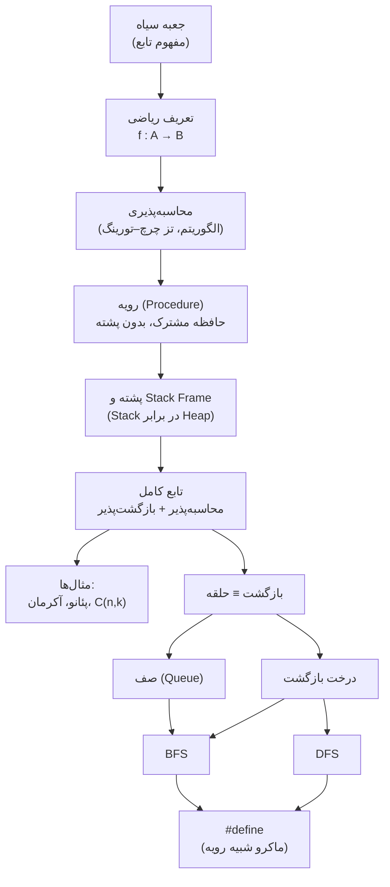
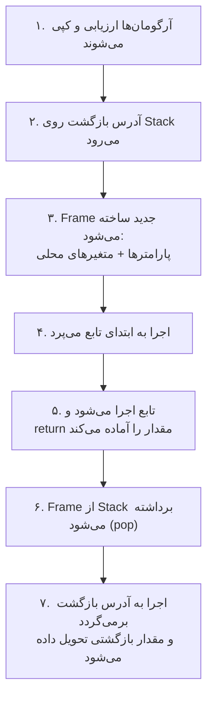
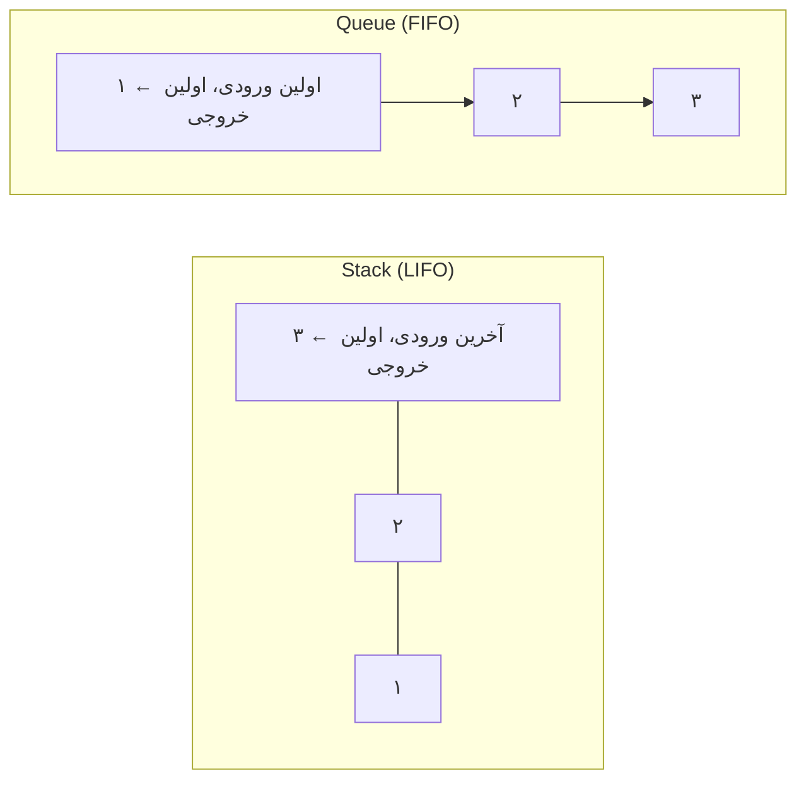
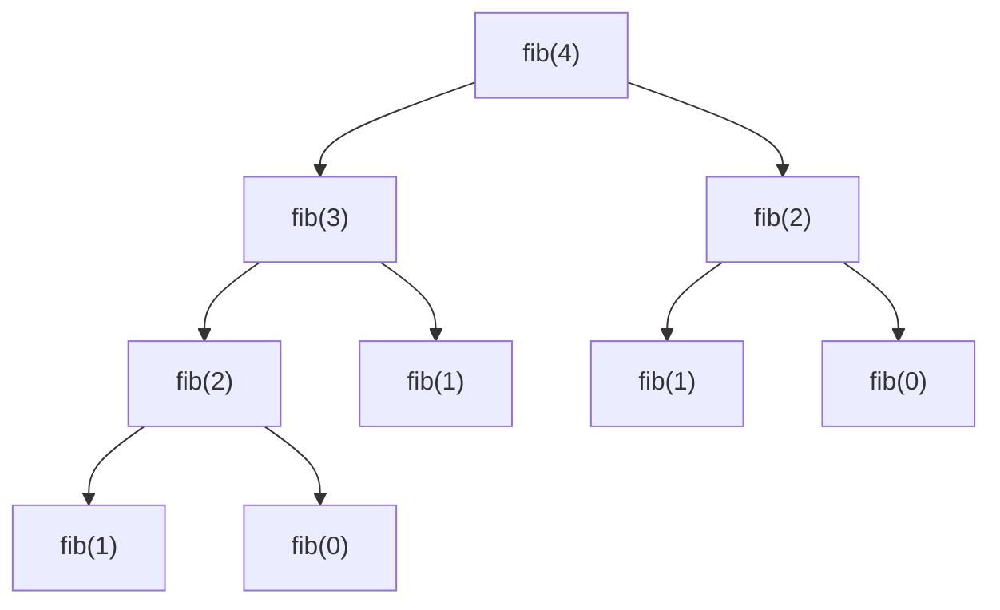

# بخش چهارم : توابع و بازگشت

## مقدمه

تا اینجای درس، هر برنامه‌ای که نوشته‌ایم یک «رشتهٔ بلند از دستورها» بوده است که از ابتدای `main` شروع می‌شود و با کمک شرط و حلقه به انتها می‌رسد. این مدل برای مسائل کوچک کافی است، اما به‌سرعت به سه مشکل برمی‌خورد: **تکرار** (یک محاسبهٔ مشابه را در چند جای برنامه کپی می‌کنیم)، **پیچیدگی** (خواندن یک `main` چندصدخطی تقریباً ناممکن است) و **محدودیت بیان** (بعضی مسئله‌ها ذاتاً «خودمشابه» هستند و حلقهٔ ساده بیان طبیعی آن‌ها نیست).

راه‌حل بنیادی علوم کامپیوتر برای هر سه مشکل یک ایده است: **انتزاع (Abstraction)**؛ یعنی یک قطعه از محاسبه را «بسته‌بندی» کنیم، به آن نام بدهیم و از این به بعد فقط بپرسیم *چه کار می‌کند*، نه *چطور کار می‌کند*. نام این بسته‌بندی در ریاضیات و برنامه‌نویسی **تابع (Function)** است.

اما «تابع» در این درس فقط یک ساختار نحوی (Syntax) زبان C نیست. مسیر ما این است که تابع را از **پایه‌ترین شکل مفهومی** آن بسازیم و گام‌به‌گام ببینیم هر قطعه از آن چرا لازم است:

1. تابع به‌عنوان یک **جعبهٔ سیاه** مفهومی، مستقل از هر زبان و نمادگذاری؛
2. **تعریف ریاضی** تابع (ارتباط مستقیم با درس مبانی علوم ریاضی)؛
3. **محاسبه‌پذیری**: چه توابعی را اصلاً می‌توان با یک الگوریتم نوشت؟ (نقطهٔ ورود ما به علوم کامپیوتر)؛
4. **رویه (Procedure)**: ساده‌ترین شکل اجرایی؛ قطعه‌ای از دستورها که هر وقت لازم باشد اجرا می‌شود؛
5. **پشته (Stack) و فراخوانی تابع**: چیزی که رویه را به یک تابع کامل و بازگشت‌پذیر تبدیل می‌کند؛
6. **بازگشت (Recursion)** و مثال‌های عمیق آن (حساب پئانو، تابع آکرمان، ضرایب دوجمله‌ای)؛
7. **برابری توان بازگشت و حلقه**، **صف (Queue)**، **درخت بازگشت** و پیمایش‌های **DFS** و **BFS**؛
8. در پایان، ابزار کمکی **`#define`** که شباهت عجیبی به «رویه» دارد و دلیل این شباهت را می‌فهمیم.

#### قرارداد نوشتاری این بخش

برای اینکه «چرا» و «چگونه» با هم قاطی نشوند، هر زیربخش دو قسمت مشخص دارد:

- **معناشناسی (Semantics)**: مفهوم چیست و چه معنایی دارد؟ (مستقل از زبان)
- **نحو (Syntax)**: همین مفهوم را در ریاضیات یا زبان C دقیقاً چگونه می‌نویسیم؟

همچنین پیش از هر مثال مهم، یک بخش کوتاه «مفهوم نظری مثال» می‌آید تا بدانید آن مثال قرار است چه چیزی را نشان دهد.

#### سناریوی واحد: ساختن حساب از صفر

در طول بخش، یک رشتهٔ فکری ثابت داریم: ببینیم با فقط دو عمل `inc` (یک واحد بیشتر) و `dec` (یک واحد کمتر) و ایدهٔ بازگشت، چطور می‌شود جمع، تفریق، ضرب، تقسیم و باقی‌مانده را ساخت. این دقیقاً همان راهی است که ریاضی‌دانان برای تعریف اعداد طبیعی رفته‌اند، و در انتهای فصل ۹ آن را کامل اجرا می‌کنیم.

#### نقشه کلی بخش:



---

## فصل ۸ : از جعبه سیاه تا رویه

### 8.1 تابع به‌عنوان جعبه سیاه

#### معناشناسی (Semantics)

یک دستگاه فروش خودکار نوشیدنی را در نظر بگیرید. شما مبلغ را وارد می‌کنید و شمارهٔ نوشیدنی را می‌زنید؛ بعد از چند لحظه، نوشیدنی بیرون می‌آید. نیازی نیست بدانید داخل دستگاه چه می‌گذرد: بازو، موتور یا سنسورها چگونه کار می‌کنند. تنها چیزی که می‌دانید **قرارداد (Contract)** دستگاه است: «با این ورودی، این خروجی را می‌دهد».

این دقیقاً ایدهٔ **جعبهٔ سیاه (Black Box)** است و ساده‌ترین تعریف مفهومی تابع:

> **تابع** یک جعبه است که ورودی می‌گیرد و خروجی می‌دهد، و تنها راه ارتباط ما با آن همین ورودی و خروجی است.

از این تعریف ساده، چهار نتیجهٔ مهم می‌گیریم:

1. **تعیین‌پذیری (Determinism):** اگر دو بار ورودی یکسان بدهیم، خروجی یکسان می‌گیریم. (جعبه «حافظه یا حال و هوا» ندارد.)
2. **انتزاع (Abstraction):** استفاده‌کننده فقط قرارداد را می‌داند، نه درون جعبه را.
3. **قابلیت جایگزینی:** اگر دو جعبه برای همهٔ ورودی‌ها خروجی یکسان بدهند، از بیرون **غیرقابل‌تشخیص** هستند، حتی اگر درونشان کاملاً متفاوت باشد.
4. **قابلیت ترکیب (Composition):** خروجی یک جعبه می‌تواند ورودی جعبه‌ای دیگر شود و جعبهٔ بزرگ‌تری بسازد.


نتیجهٔ سوم نکتهٔ ظریفی دارد که در تمام این بخش به آن برمی‌گردیم: **«تابع»** (آنچه جعبه از بیرون انجام می‌دهد) با **«الگوریتم»** (روشی که درون جعبه انجام می‌دهد) دو چیز متفاوت هستند. یک تابع می‌تواند چندین الگوریتم متفاوت داشته باشد.

#### مثال: یک تابع، دو الگوریتم

تابعی را در نظر بگیرید که عدد $n$ را می‌گیرد و مجموع $1 + 2 + \cdots + n$ را برمی‌گرداند. دو جعبهٔ متفاوت برای آن می‌سازیم: یکی با **حلقه** (جمع‌کردن یکی‌یکی) و دیگری با **فرمول گاوس** $\frac{n(n+1)}{2}$. برنامهٔ زیر هر دو را برای چند ورودی امتحان می‌کند و نشان می‌دهد از بیرون نمی‌توان آن‌ها را از هم تشخیص داد.

```c
#include <stdio.h>

int main(void)
{
    for (int n = 1; n <= 10; n += 3) {

        /* جعبه ۱: حلقه */
        int by_loop = 0;
        for (int i = 1; i <= n; i++) {
            by_loop += i;
        }

        /* جعبه ۲: فرمول */
        int by_formula = n * (n + 1) / 2;

        printf("n = %2d | loop = %2d | formula = %2d | same? %s\n",
               n, by_loop, by_formula, by_loop == by_formula ? "yes" : "no");
    }
    return 0;
}
```

خروجی:

```text
n =  1 | loop =  1 | formula =  1 | same? yes
n =  4 | loop = 10 | formula = 10 | same? yes
n =  7 | loop = 28 | formula = 28 | same? yes
n = 10 | loop = 55 | formula = 55 | same? yes
```

#### نحو (Syntax)

در این مرحله هنوز نیازی به نحو زبان C نداریم؛ فقط **نمادگذاری** جعبه‌ها را یاد می‌گیریم که در تمام درس‌های علوم کامپیوتر استفاده می‌شود:

| مفهوم | نمایش نموداری | نمایش متنی |
| --- | --- | --- |
| ورودی (Input / Argument) | فلش ورودی به جعبه | $x$ داخل پرانتز: $f(x)$ |
| خروجی (Output / Result) | فلش خروجی از جعبه | $y = f(x)$ |
| جعبه (Function) | مستطیل با نام | $f$ |
| چند ورودی | چند فلش به یک جعبه | $f(x, y)$ |
| ترکیب جعبه‌ها | زنجیرهٔ جعبه‌ها | $g(f(x))$ |

توجه کنید در نمایش $g(f(x))$ ابتدا **درونی‌ترین** جعبه اجرا می‌شود؛ ترتیب نوشتن از چپ به راست است، اما ترتیب اجرا از درون به بیرون.

#### تمرین درون فصل ۸.۱

**نوع تمرین: Explain Why**

دو جعبهٔ زیر را در نظر بگیرید: جعبهٔ ۱ هر عدد را در ۲ ضرب می‌کند و جعبهٔ ۲ هر عدد را با خودش جمع می‌کند. آیا این دو «یک تابع» هستند یا «دو تابع»؟ آیا یک «الگوریتم» هستند یا دو الگوریتم؟ دلیل بیاورید.

### 8.2 تعریف ریاضی تابع

#### معناشناسی (Semantics)

جعبهٔ سیاه یک تصویر شهودی بود. ریاضیات همین شهود را دقیق می‌کند، و مهم‌تر از همه **درون جعبه را کاملاً کنار می‌گذارد**: در تعریف ریاضی، تابع یک «مجموعه از زوج‌های مرتب» است و هیچ حرفی از «روش محاسبه» نیست.

**ضرب دکارتی:** برای دو مجموعهٔ $A$ و $B$، مجموعهٔ همهٔ زوج‌های مرتب را $A \times B$ می‌نامیم:

$$A \times B = \{ (a, b) \mid a \in A,\ b \in B \}$$

**رابطه:** هر زیرمجموعه $R \subseteq A \times B$ یک رابطه است.

**تابع:** رابطه‌ای $f \subseteq A \times B$ که برای **هر** $a \in A$، **دقیقاً یک** $b \in B$ با $(a, b) \in f$ وجود داشته باشد. در این صورت می‌نویسیم $f(a) = b$.

دو شرط داخل این تعریف دقیقاً همان «قرارداد جعبهٔ سیاه» است:

- «**برای هر** $a$»: جعبه به ازای هر ورودی مجاز، خروجی دارد.
- «**دقیقاً یک**»: جعبه تعیین‌پذیر است؛ یک ورودی نمی‌تواند دو خروجی همزمان بدهد.

**واژگان:** $A$ را **دامنه (Domain)**، $B$ را **همدامنه (Codomain)** و مجموعهٔ خروجی‌های واقعی $\{ f(a) \mid a \in A \}$ را **برد (Image / Range)** می‌نامیم. برد همیشه زیرمجموعه‌ای از همدامنه است، اما لزوماً با آن برابر نیست.

**برابری توابع:** دو تابع **برابرند** اگر دامنه و همدامنهٔ یکسان و برای هر ورودی خروجی یکسان داشته باشند. (همان نتیجهٔ سوم بخش قبل: تابع یعنی «رفتار بیرونی»، نه روش محاسبه.)

**انواع مهم** (که در درس مبانی علوم ریاضی با اثبات دیده‌اید): تابع **یک‌به‌یک (Injective)** اگر ورودی‌های متفاوت همیشه خروجی متفاوت بدهند؛ **پوشا (Surjective)** اگر برد با همدامنه برابر باشد؛ و **دوسویی (Bijective)** اگر هر دو.

**توابع جزئی (Partial Functions):** گاهی «برای هر $a$» برقرار نیست؛ یعنی برای بعضی ورودی‌ها خروجی تعریف نشده است. مثلاً تقسیم صحیح روی اعداد طبیعی برای مقسوم‌علیه صفر. چنین تابعی را **جزئی** می‌گوییم و با $f : A \rightharpoonup B$ نشان می‌دهیم؛ در مقابل، تابعی که برای همهٔ ورودی‌ها تعریف شده **کامل (Total)** است. این تفکیک در بخش بعد نقش بسیار مهمی پیدا می‌کند.

#### مثال: تابع به‌عنوان مجموعه‌ای از زوج‌ها

تابع $f : A \to A$ با $A = \{0, 1, \dots, 7\}$ و $f(x) = x^2 \bmod 8$ را در نظر بگیرید. برنامهٔ زیر **گراف** این تابع (همهٔ زوج‌های مرتب) را چاپ می‌کند و با کمک حلقه‌های تودرتو، یک‌به‌یک بودن و پوشا بودن آن را وارسی می‌کند. این همان محاسبه‌ای است که در درس ریاضی روی کاغذ انجام می‌دهید.

```c
#include <stdio.h>

int main(void)
{
    /* A = {0, 1, ..., 7}  و  f(x) = x^2 mod 8 */
    printf("graph of f = { ");
    for (int x = 0; x < 8; x++) {
        printf("(%d,%d) ", x, (x * x) % 8);
    }
    printf("}\n");

    /* برد: تعداد y هایی که حداقل یک x به آن‌ها می‌رسد */
    int image_size = 0;
    for (int y = 0; y < 8; y++) {
        int reached = 0;
        for (int x = 0; x < 8; x++) {
            if ((x * x) % 8 == y) reached = 1;
        }
        image_size += reached;
    }

    /* یک‌به‌یک؟ آیا دو x متفاوت با خروجی یکسان وجود دارد؟ */
    int injective = 1;
    for (int x1 = 0; x1 < 8; x1++)
        for (int x2 = x1 + 1; x2 < 8; x2++)
            if ((x1 * x1) % 8 == (x2 * x2) % 8) injective = 0;

    printf("image size  = %d (codomain size = 8)\n", image_size);
    printf("injective?    %s\n", injective ? "yes" : "no");
    printf("surjective?   %s\n", image_size == 8 ? "yes" : "no");
    return 0;
}
```

خروجی:

```text
graph of f = { (0,0) (1,1) (2,4) (3,1) (4,0) (5,1) (6,4) (7,1) }
image size  = 3 (codomain size = 8)
injective?    no
surjective?   no
```

#### نحو (Syntax)

نمادگذاری ریاضی تابع، دقیقاً اطلاعاتی را می‌دهد که یک «امضا (Signature)» در برنامه‌نویسی باید بدهد: **نوع ورودی‌ها** و **نوع خروجی**.

| نماد ریاضی | معنی | معادل در C (بخش ۹.۲) |
| --- | --- | --- |
| $f : A \to B$ | $f$ تابعی کامل از $A$ به $B$ | `B f(A x)` |
| $f : A \times B \to C$ | تابعی با دو ورودی | `C f(A x, B y)` |
| $x \mapsto x^2$ | «قاعدهٔ» تابع (روش) | `return x * x;` |
| $f : A \rightharpoonup B$ | تابع جزئی | تابعی که ممکن است برای بعضی ورودی‌ها هرگز تمام نشود |
| $g \circ f$ | ترکیب: $(g \circ f)(x) = g(f(x))$ | `g(f(x))` |
| تابع بدون ورودی (ثابت) | $c : () \to B$ | `B c(void)` |
| تابع بدون خروجی | (در ریاضیات بی‌معنی؛ در برنامه‌نویسی «اثر جانبی») | `void f(A x)` |

نوع‌های مجموعه‌ای ریاضی را به این صورت به نوع‌های C نگاشت می‌کنیم:

| مجموعهٔ ریاضی | نوع در C | نکته |
| --- | --- | --- |
| $\mathbb{N}$ (اعداد طبیعی) | `unsigned int` | **متناهی** است: $\{0, \dots, 2^{32}-1\}$ |
| $\mathbb{Z}$ (اعداد صحیح) | `int` | متناهی است: حدود $\pm 2^{31}$ |
| $\mathbb{R}$ (اعداد حقیقی) | `double` | فقط یک **تقریب** با دقت محدود |

> **هشدار مهم:** یک مجموعهٔ ریاضی می‌تواند نامتناهی باشد، اما نوع‌های C همیشه متناهی هستند. مثلاً `unsigned int` در واقع حساب **پیمانه‌ای** $\mathbb{Z}_{2^{32}}$ است؛ یعنی `0u - 1` برابر $4294967295$ می‌شود، نه «تعریف‌نشده». بنابراین تابع `uint add(uint, uint)` در C دقیقاً همان تابع $+ : \mathbb{N} \times \mathbb{N} \to \mathbb{N}$ ریاضی نیست، بلکه تابعی روی یک مجموعهٔ متناهی است. در بخش ۹.۶ پیامد این تفاوت را به‌طور عملی می‌بینیم.

#### تمرین درون فصل ۸.۲

**نوع تمرین: Classify**

برای هر مورد مشخص کنید آیا تابع (کامل) است، تابع جزئی است، یا اصلاً تابع نیست:

1. $f : \mathbb{N} \to \mathbb{N}$ با $f(x) = x - 1$
2. $g : \mathbb{Z} \to \mathbb{Z}$ با $g(x) = x - 1$
3. $R = \{(x, y) \in \mathbb{N} \times \mathbb{N} \mid y^2 = x\}$ از $\mathbb{N}$ به $\mathbb{N}$
4. $h : \mathbb{N} \times \mathbb{N} \rightharpoonup \mathbb{N}$ با $h(a, b) = a / b$ (تقسیم صحیح)

### 8.3 محاسبه‌پذیری

#### معناشناسی (Semantics)

تعریف ریاضی تابع یک ویژگی عجیب دارد: **هیچ‌جا نگفته چگونه خروجی را پیدا کنیم.** تابع فقط یک جدول (یک مجموعهٔ زوج‌های مرتب) است. اینجا نقطه‌ای است که علوم کامپیوتر از ریاضیات جدا می‌شود:

> آیا برای **هر** تابعی که در ریاضیات تعریف می‌شود، می‌توان **روشی مکانیکی و متناهی** نوشت که خروجی را بسازد؟

پاسخ شگفت‌انگیز این است: **خیر.** و حتی بدتر: بیشتر توابع این‌گونه‌اند.

#### مفهوم نظری: چرا «بیشتر» توابع محاسبه‌پذیر نیستند؟ (استدلال شمارشی)

- هر **برنامه** یک متن متناهی روی یک الفبای متناهی است. مجموعهٔ همهٔ متن‌های متناهی **شمارا (Countable)** است؛ پس مجموعهٔ همهٔ برنامه‌های ممکن (در هر زبان) شمارا است.
- اما مجموعهٔ توابع $f : \mathbb{N} \to \{0, 1\}$ **ناشماراست** (استدلال قطری کانتور، ۱۸۹۱): هر تابع معادل یک دنبالهٔ نامتناهی از ۰ و ۱ است و تعداد این دنباله‌ها $2^{\aleph_0}$ است.

پس تعداد توابع، به‌طرز بی‌نهایت‌باری بیشتر از تعداد برنامه‌هاست. یعنی «تقریباً همهٔ» توابع **هیچ برنامه‌ای ندارند.** هر برنامه‌ای که می‌نویسیم، یک نقطهٔ بسیار نادر از جهان توابع را نشان می‌دهد.

**تعریف (غیررسمی).** تابع $f$ را **محاسبه‌پذیر (Computable)** می‌گوییم اگر الگوریتمی وجود داشته باشد که به ازای هر ورودی $x$ از دامنه، پس از تعداد متناهی گام **متوقف شود** و $f(x)$ را بدهد. (الگوریتم: دنباله‌ای متناهی و دقیق از دستورهای مکانیکی.)

برای توابع جزئی، نمادگذاری زیر استاندارد است:

- $f(x)\downarrow$ : الگوریتم روی ورودی $x$ **متوقف می‌شود** (خروجی تعریف شده است).
- $f(x)\uparrow$ : الگوریتم روی ورودی $x$ **هرگز تمام نمی‌شود** (خروجی تعریف نشده است).

بنابراین یک نتیجهٔ ظریف: **«ممکن است برنامه تمام نشود» دقیقاً معادل «تابع جزئی است».** (در بخش ۹.۶ یک نمونهٔ عملی می‌بینید: تقسیم بر صفر در حساب پئانو.)

#### پیشینهٔ تاریخی

مفهوم «روش مکانیکی» قدیمی است، اما تعریف **دقیق** آن تنها در قرن بیستم ممکن شد:

| زمان | رویداد |
| --- | --- |
| حدود ۳۰۰ ق.م. | الگوریتم اقلیدس برای بزرگ‌ترین مقسوم‌علیه مشترک؛ یکی از قدیمی‌ترین الگوریتم‌های ثبت‌شده |
| حدود قرن ۹ میلادی | محمد بن موسی خوارزمی، ریاضی‌دان ایرانی، روش‌های گام‌به‌گام حساب و جبر را مدون کرد؛ واژهٔ **Algorithm** از نام لاتینی‌شدهٔ او (Algoritmi) آمده است |
| ۱۸۸۸ | ددکیند «تعریف با بازگشت» روی اعداد طبیعی را صورت‌بندی کرد |
| ۱۹۰۰ و ۱۹۲۸ | هیلبرت فهرست مسائل مشهور خود را ارائه کرد و بعدها (با آکرمان) **مسئلهٔ تصمیم (Entscheidungsproblem)** را مطرح کرد: آیا الگوریتمی هست که درستی هر حکم منطقی را تصمیم بدهد؟ |
| ۱۹۲۸ | آکرمان تابعی ساخت که کامل و محاسبه‌پذیر است اما «ساده‌ترین نوع بازگشت» برای تعریف آن کافی نیست (بخش ۹.۷) |
| ۱۹۳۱ | گودل با قضایای ناتمامیت و استفاده از «توابع بازگشتی اولیه»، حدود بیان صوری را نشان داد |
| ۱۹۳۴ تا ۱۹۳۶ | هربراند–گودل و سپس **کلینی** (توابع μ-بازگشتی)؛ **چرچ** (حساب λ) |
| ۱۹۳۶ | **آلن تورینگ** با «ماشین تورینگ» تعریفی ملموس از محاسبه ارائه داد و نشان داد مسئلهٔ تصمیم **پاسخ منفی** دارد؛ چرچ نیز مستقل به همین نتیجه رسید |
| ۱۹۳۷ به بعد | اثبات شد که همهٔ این تعریف‌های ظاهراً متفاوت **دقیقاً یک دسته از توابع** را می‌سازند |

از این هم‌ارزی شگفت‌انگیز، **تز چرچ–تورینگ** نتیجه می‌شود:

> هر تابعی که «به‌طور شهودی» محاسبه‌پذیر باشد، با یک ماشین تورینگ (و معادل آن، با یک برنامه در زبان C با حافظهٔ نامحدود) قابل محاسبه است.

این یک **تز** است، نه قضیه، چون «محاسبه‌پذیری شهودی» تعریف ریاضی ندارد. اما شواهد به‌قدری قوی است که امروز آن را مبنای علوم کامپیوتر می‌دانیم. نتیجهٔ عملی: هر زبانی که شرط و حلقه (یا بازگشت) داشته باشد، **از نظر توان محاسباتی هم‌ارز** زبان‌های دیگر است.

#### یک تابع که هیچ برنامه‌ای ندارد: مسئلهٔ توقف

تابع $\text{halts} : \text{Programs} \times \text{Inputs} \to \{0, 1\}$ را در نظر بگیرید: مقدار آن ۱ است اگر برنامهٔ $p$ روی ورودی $x$ سرانجام متوقف شود و در غیر این صورت ۰. این تابع **کامل** و کاملاً خوش‌تعریف است. تورینگ ثابت کرد **محاسبه‌پذیر نیست.** ایدهٔ اثبات (به زبان شبه‌C):

```text
فرض (برای رسیدن به تناقض): تابع halts(p, x) نوشتنی است.

void paradox(program p) {
    if (halts(p, p))      // اگر p روی ورودی خودش متوقف می‌شود ...
        while (1) { }     // ... پس من تا ابد حلقه بزنم
    else
        return;           // وگرنه، من فوراً تمام می‌کنم
}

سؤال: paradox(paradox) متوقف می‌شود؟
  - اگر متوقف شود  → halts(paradox, paradox) = 1 → حلقهٔ بی‌پایان  → متوقف نمی‌شود!
  - اگر متوقف نشود → halts(paradox, paradox) = 0 → return         → متوقف می‌شود!
تناقض؛ پس halts نمی‌تواند وجود داشته باشد.
```

پیام این بخش: **«تعریف‌پذیر» با «محاسبه‌پذیر» یکی نیست.** ما همیشه دنبال تابع‌هایی هستیم که در دستهٔ کوچک اما بسیار مفید محاسبه‌پذیرها قرار دارند.

#### مفهوم نظری مثال بعدی: دنبالهٔ کولاتس

برای دیدن اینکه «متوقف شدن» حتی برای یک الگوریتم ساده هم می‌تواند سؤال باز باشد، تابع $s : \mathbb{N}_{>0} \rightharpoonup \mathbb{N}$ را تعریف می‌کنیم: عدد $n$ را بگیر؛ تا وقتی $n \neq 1$ است، اگر $n$ زوج بود آن را نصف کن و اگر فرد بود $3n + 1$ بساز؛ تعداد گام‌ها را بشمار. این الگوریتم کاملاً مشخص است. اما هیچ‌کس نمی‌داند آیا **به ازای هر** $n$ سرانجام متوقف می‌شود (حدس کولاتس، ۱۹۳۷). یعنی نمی‌دانیم $s$ تابعی **کامل** است یا فقط جزئی!

#### نحو (Syntax)

محاسبه‌پذیری را با «نوشتن الگوریتم» نشان می‌دهیم. در C، سه ابزار پایه برای بیان هر الگوریتمی کافی است: **ترتیب** (دستورها پشت‌سرهم)، **انتخاب** (`if`) و **تکرار** (`while`). برنامهٔ زیر الگوریتم کولاتس را به همین ابزارها می‌نویسد.

```c
#include <stdio.h>

int main(void)
{
    int tests[] = {1, 6, 7, 27};

    for (int t = 0; t < 4; t++) {
        unsigned long long n = tests[t];
        int steps = 0;

        while (n != 1) {                      /* تکرار  */
            if (n % 2 == 0) n = n / 2;        /* انتخاب */
            else            n = 3 * n + 1;
            steps++;                          /* ترتیب  */
        }
        printf("s(%2d) = %d steps\n", tests[t], steps);
    }
    return 0;
}
```

خروجی:

```text
s( 1) = 0 steps
s( 6) = 8 steps
s( 7) = 16 steps
s(27) = 111 steps
```

چرا برنامه برای ۱ تا ۲۷ همیشه تمام شد؟ چون **تا امروز** برای همهٔ ورودی‌های آزمایش‌شده متوقف شده است، نه به این دلیل که کسی ثابت کرده باشد همیشه متوقف می‌شود. یک آزمایش، هرگز اثبات نیست.

#### تمرین درون فصل ۸.۳

**نوع تمرین: Explain Why**

1. با توجه به اثبات مسئلهٔ توقف، چرا نمی‌توانیم برای تشخیص اینکه «آیا برنامه‌ای تمام می‌شود» صرفاً آن را اجرا کنیم و صبر کنیم؟ (راهنمایی: تفاوت «بعد از یک ساعت هنوز تمام نشده» با «هرگز تمام نمی‌شود» چیست؟)
2. فرض کنید `halts` وجود داشت. با آن چگونه می‌شد حدس کولاتس را حل کرد؟ (این نشان می‌دهد چرا «غیرمحاسبه‌پذیری» تنها یک مسئلهٔ تئوریک نیست.)

### 8.4 رویه (Procedure)

#### معناشناسی (Semantics)

حالا که می‌دانیم «محاسبه» یعنی اجرای یک الگوریتم، ساده‌ترین راهِ استفادهٔ مجدد از یک الگوریتم این است که **قطعه‌ای از دستورها را نام‌گذاری کنیم** و هر وقت لازم شد، آن نام را «صدا بزنیم». به این قطعهٔ نام‌دار **رویه (Procedure)** می‌گوییم.

معنای «فراخوانی (Call)» یک رویه ساده است:

1. اجرای برنامه از محل فراخوانی **متوقف** می‌شود؛
2. دستورهای رویه **یک‌به‌یک** اجرا می‌شوند؛
3. اجرا به **دستور بعد از محل فراخوانی** برمی‌گردد.

به بیان دیگر رویه تقریباً مثل این است که متن آن قطعه را در محل فراخوانی «کپی» کرده باشیم، با این فرق که فقط یک نسخه از آن در برنامه وجود دارد. (در بخش ۱۰.۷ می‌بینیم ماکروهای `#define` دقیقاً همین کپی‌کردن واقعی هستند.)

اما رویه به دلیل سادگی‌اش سه محدودیت اساسی دارد:

- **ورودی و خروجی ندارد.** تنها راه رد و بدل کردن داده، **متغیرهای مشترک (Global)** است که همه‌جا دیده می‌شوند. «ورودی» و «خروجی» فقط یک قرارداد نانوشته بین برنامه‌نویس‌ها می‌شود.
- **حافظهٔ خصوصی ندارد.** هر متغیر فقط یک نسخه در کل برنامه دارد؛ پس اگر رویه دوباره خودش را صدا بزند، مقدارهای قبلی را **بازنویسی** می‌کند.
- **محل بازگشت تکی.** رویه فقط می‌داند «بعد از پایان به کجا برگردد» برای *یک* فراخوانی؛ اگر پیش از تمام شدن، دوباره صدا زده شود، آن اطلاعات از دست می‌رود.

یعنی رویه، **تابع جعبه‌سیاه** نیست؛ فقط «قطعهٔ کد نام‌دار» است. در ادامه مشکل بالا را عملاً می‌بینیم.

#### نحو (Syntax)

در C، رویه را با یک **تابع بدون ورودی و بدون خروجی** می‌نویسیم: نوع `void` به معنای «هیچ» است. متغیرهای مشترک را **بیرون از همهٔ توابع** تعریف می‌کنیم.

```text
void  نام_رویه ( void )
{
    دستورها
}

نام_رویه();          // فراخوانی
```

برنامهٔ زیر یک رویهٔ جمع می‌سازد. دقت کنید «ورودی‌ها» با نوشتن در `a` و `b` داده می‌شوند و «خروجی» از `result` خوانده می‌شود.

```c
#include <stdio.h>

int a, b, result;            /* حافظهٔ مشترک: ورودی و خروجی‌های رویه */

void add_proc(void)          /* رویه: بدون ورودی، بدون خروجی */
{
    result = a + b;
}

int main(void)
{
    a = 3; b = 4;
    add_proc();
    printf("3 + 4  = %d\n", result);

    a = 10; b = 25;
    add_proc();
    printf("10 + 25 = %d\n", result);

    return 0;
}
```

خروجی:

```text
3 + 4  = 7
10 + 25 = 35
```

این کد کار می‌کند، و **استفادهٔ مجدد** را هم نشان می‌دهد. اما ببینید وقتی بخواهیم رویه‌ای بنویسیم که خودش را صدا بزند (**بازگشت**) چه می‌شود.

#### مفهوم نظری مثال بعدی: تعریف بازگشتی فاکتوریل

فاکتوریل را ریاضیات این‌طور تعریف می‌کند:

$$0! = 1, \qquad n! = n \cdot (n-1)! \quad (n \ge 1)$$

این تعریف از نوع **خودمشابه** است: مقدار $n!$ بر حسب مقدار یک نمونهٔ کوچک‌تر از همان مسئله بیان شده. برای ترجمهٔ مستقیم آن به رویه، می‌خواهیم رویه برای $n$ خودش را برای $n-1$ صدا بزند و نتیجه را در $n$ ضرب کند. ورودی را در `n` می‌گذاریم و خروجی را از `result` می‌خوانیم.

```c
#include <stdio.h>

int  n;                      /* «ورودی» رویه */
long result;                 /* «خروجی» رویه */

void fact_proc(void)
{
    if (n <= 1) {
        result = 1;
        return;
    }
    n = n - 1;               /* می‌خواهیم برای n-1 حل کنیم ... */
    fact_proc();             /* ... پس خودمان را صدا می‌زنیم */
    result = result * n;     /* و حالا می‌خواهیم در n «اصلی» ضرب کنیم */
}

int main(void)
{
    n = 5;
    fact_proc();
    printf("5! = %ld (expected 120)\n", result);
    return 0;
}
```

خروجی:

```text
5! = 1 (expected 120)
```

نتیجه **اشتباه** است. چرا؟ چون `n` فقط **یک نسخه** دارد. هنگام بازگشت از فراخوانی داخلی، `n` دیگر مقدار اصلی خود (۵) را ندارد؛ فراخوانی‌های داخلی آن را تا ۱ کم کرده‌اند. پس `result * n` همیشه در ۱ ضرب می‌شود.

برای اطمینان، حالت $n = 3$ را دستی دنبال کنید:

```text
n=3 → n=2 → فراخوانی →
          n=2 → n=1 → فراخوانی →
                  n=1 → پایه: result = 1، بازگشت
          result = result * n  = 1 * 1 = 1      ← n دیگر ۲ نیست
result = result * n  = 1 * 1 = 1                ← n دیگر ۳ نیست
```

آیا راهی برای اصلاح هست؟ بله، **اگر خودمان دستی مقدار قبلی را نگه داریم و برگردانیم:** پیش از فراخوانی `n` را کم می‌کنیم و بعد از بازگشت دوباره زیادش می‌کنیم تا مقدار اصلی برگردد.

```c
#include <stdio.h>

int  n;
long result;

void fact_proc(void)
{
    if (n <= 1) {
        result = 1;
        return;
    }
    n = n - 1;
    fact_proc();
    n = n + 1;               /* مقدار اصلی n را «دستی» بازگردان */
    result = result * n;
}

int main(void)
{
    n = 5;
    fact_proc();
    printf("5! = %ld\n", result);
    return 0;
}
```

خروجی:

```text
5! = 120
```

این بار درست شد، اما به چه قیمتی؟ ما **دستی** یک «پشته» ساخته‌ایم: ذخیره و بازگرداندن مقدار قبلی به ترتیب برعکس. این همان کاری است که **هر** فراخوانی بازگشتی باید انجام دهد؛ و برای هر متغیر، هر رویه، و هر فراخوانی، باید دقیقاً درست انجام شود. هیچ برنامه‌نویسی نمی‌خواهد این کار را دستی انجام دهد.

> **نتیجهٔ فصل:** رویه «اجرای یک قطعه کد نام‌دار» را حل می‌کند، اما برای ساختن یک **تابع واقعی** که ورودی خصوصی دارد، خروجی برمی‌گرداند و می‌تواند خودش را صدا بزند، چیزی کم داریم: **حافظه‌ای که به ازای هر فراخوانی، یک نسخهٔ جدید و مستقل بسازد.** این حافظه **پشته (Stack)** نام دارد و موضوع فصل بعد است.

| ویژگی | رویه (Procedure) | تابع کامل (Function) |
| --- | --- | --- |
| ورودی صریح | ندارد؛ از متغیرهای مشترک استفاده می‌کند | دارد (پارامتر) |
| خروجی صریح | ندارد؛ در متغیر مشترک می‌نویسد | دارد (مقدار بازگشتی) |
| حافظهٔ خصوصی هر فراخوانی | ندارد | دارد (متغیرهای محلی) |
| بازگشت (Recursion) | عملاً ممکن نیست مگر با دستکاری دستی | طبیعی |
| نیاز به Stack | خیر | **بله** |

#### تمرین درون فصل ۸.۴

**نوع تمرین: Trace**

در برنامهٔ `p04_c08_06_procedure_fact_manual` برای ورودی `n = 4`، مقدار `n` و `result` را **پس از بازگشت هر فراخوانی** مشخص کنید. سپس توضیح دهید چرا خط `n = n + 1;` باید *پیش از* `result = result * n;` بیاید.

### 8.5 جمع‌بندی فصل ۸

در این فصل تابع را از پایه ساختیم. ابتدا آن را یک **جعبهٔ سیاه** دیدیم که فقط با قراردادِ ورودی و خروجی شناخته می‌شود؛ سپس دیدیم ریاضیات آن را به‌صورت **مجموعه‌ای از زوج‌های مرتب** $f \subseteq A \times B$ تعریف می‌کند و دقیقاً بر «نوع ورودی و خروجی» تأکید دارد؛ همان چیزی که بعداً امضای تابع در C می‌شود. بعد پرسیدیم همهٔ این توابع را می‌توان با الگوریتم نوشت؟ و دیدیم پاسخ **خیر** است: توابع **محاسبه‌پذیر** گروهی بسیار کوچک‌اند و مسئلهٔ توقف نمونهٔ کلاسیک یک تابع غیرمحاسبه‌پذیر است. در پایان، **رویه** را به‌عنوان ساده‌ترین قطعهٔ اجرایی قابل‌استفادهٔ مجدد ساختیم و دیدیم چرا بدون **حافظهٔ خصوصی برای هر فراخوانی**، بازگشت ممکن نیست.

سؤال طبیعی بعدی: این حافظه دقیقاً چیست و چطور کار می‌کند؟ موضوع فصل ۹.

### Retrieval Practice فصل ۸

- در تعریف ریاضی تابع، دو شرط «برای هر $a$» و «دقیقاً یک $b$» چه معنایی در مفهوم جعبهٔ سیاه دارند؟
- تفاوت **تابع** و **الگوریتم** چیست؟ مثالی از یک تابع با دو الگوریتم بزنید.
- تفاوت تابع کامل و تابع جزئی چیست و چه ارتباطی با «متوقف شدن الگوریتم» دارد؟
- چرا بیشتر توابع محاسبه‌پذیر نیستند؟ (به شمارا و ناشمارا اشاره کنید.)
- چرا یک رویه‌ای که فقط از متغیرهای مشترک استفاده می‌کند، نمی‌تواند به‌طور مطمئن خودش را صدا بزند؟

### تمرین‌های پایانی فصل ۸

★ **سطح پایه**

1. **Predict the Output:** در برنامهٔ `p04_c08_02_function_graph`، اگر `8` را در همه‌جا با `5` عوض کنیم (یعنی $f(x) = x^2 \bmod 5$ روی $\{0,\dots,4\}$)، اندازهٔ برد چه می‌شود؟ آیا تابع یک‌به‌یک است؟
2. **Classify:** تابع $\text{len} : \text{Strings} \to \mathbb{N}$ (طول رشته) یک‌به‌یک است؟ پوشا است؟ دلیل بیاورید.

★★ **سطح متوسط**

3. **Small Implementation:** برنامه‌ای بنویسید که با حلقه‌های تودرتو بررسی کند تابع $f(x) = (3x + 1) \bmod 7$ روی $\{0, \dots, 6\}$ دوسویی است یا نه.
4. **Write a Procedure:** یک رویهٔ بدون ورودی و خروجی بنویسید که مقدار دو متغیر مشترک `x` و `y` را با هم عوض کند (Swap). سپس آن را سه بار پشت‌سرهم فراخوانی کنید و بگویید نتیجهٔ نهایی چیست.

★★★ **سطح چالشی**

5. **Explain Why:** نشان دهید اگر مجموعهٔ $A$ متناهی با $n$ عضو باشد، تعداد توابع $f : A \to \{0, 1\}$ برابر $2^n$ است. سپس با استفاده از این، توضیح دهید چرا «ناشمارا بودن» توابع $\mathbb{N} \to \{0, 1\}$ شهود معقولی دارد.
6. **Design:** یک تابع جزئی روی اعداد طبیعی تعریف کنید که برای ورودی‌های فرد تعریف نشده باشد، و یک الگوریتم با حلقه بنویسید که دقیقاً روی همان ورودی‌ها تا ابد حلقه بزند.

---

## فصل ۹ : پشته، فراخوانی و تابع

### 9.1 حافظهٔ برنامه: Stack و Heap

#### معناشناسی (Semantics)

در فصل قبل دیدیم رویه‌ها به یک «حافظهٔ تازه برای هر فراخوانی» نیاز دارند. برای فهمیدن اینکه این حافظه از کجا می‌آید، باید ببینیم یک برنامهٔ در حال اجرا چه حافظه‌ای در اختیار دارد.

وقتی برنامه اجرا می‌شود، سیستم‌عامل یک فضای آدرس‌پذیر (حافظهٔ مجازی) به آن می‌دهد که به چند **ناحیه** تقسیم شده است:

```text
آدرس‌های بالا
┌──────────────────────────┐
│  Stack                   │  ← متغیرهای محلی و فراخوانی‌ها (رشد به سمت پایین)
│          ↓               │
│                          │
│     (فضای آزاد)          │
│                          │
│          ↑               │
│  Heap                    │  ← حافظهٔ پویا (رشد به سمت بالا)
├──────────────────────────┤
│  Static / Global data    │  ← متغیرهای سراسری و static
├──────────────────────────┤
│  Code (Text)             │  ← خود دستورهای برنامه
└──────────────────────────┘
آدرس‌های پایین
```

سه ناحیهٔ پایین را از قبل می‌شناسید: کد برنامه، و **متغیرهای سراسری** که رویه‌های فصل ۸ از آن‌ها استفاده می‌کردند (دقیقاً به همین دلیل فقط «یک نسخه» داشتند: یک جا در حافظهٔ ایستا). دو ناحیهٔ بالا تفاوت اصلی بحث ما هستند:

- **Stack (پشته):** حافظه‌ای که **با هر فراخوانی تابع بزرگ می‌شود و با هر بازگشت کوچک می‌شود.** همان ساختار LIFO (آخرین ورودی، اولین خروجی) که پیش‌تر دیدیم: فراخوانی = `push` و بازگشت = `pop`. چون آخرین تابعی که صدا زده شده، اولین تابعی است که تمام می‌شود، **الگوی LIFO مدل طبیعی** فراخوانی تابع است.
- **Heap (هیپ):** حافظه‌ای برای داده‌هایی که طول عمر یا اندازه‌شان به یک فراخوانی گره نخورده است؛ مثلاً داده‌ای که بخواهیم بعد از پایان تابع هم باقی بماند، یا اندازه‌اش را در زمان اجرا بفهمیم. مدیریت آن **دستی** است.

| ویژگی | Stack | Heap |
| --- | --- | --- |
| مدیریت | **خودکار** (با ورود و خروج تابع) | **دستی** (درخواست و آزادسازی توسط برنامه‌نویس) |
| طول عمر | تا پایان همان فراخوانی | تا زمانی که برنامه آزاد کند |
| سرعت | بسیار سریع (فقط جابه‌جایی یک اشاره‌گر) | کندتر (پیدا کردن بلوک آزاد مناسب) |
| اندازه | محدود و کوچک (معمولاً چند مگابایت) | بزرگ (تا حد حافظهٔ ماشین) |
| الگوی دسترسی | LIFO | دلخواه |
| محتوا | پارامترها، متغیرهای محلی، آدرس بازگشت | داده‌های با اندازه یا عمر پویا |
| خطاهای رایج | **Stack Overflow** | نشت حافظه (Memory Leak)، استفادهٔ پس از آزادسازی، تکه‌تکه شدن |

#### نحو (Syntax)

برای دیدن این نواحی با چشم خودمان، از سه ابزار استفاده می‌کنیم که **فعلاً فقط به‌صورت پیش‌نمایش** هستند و در بخش‌های بعدی (اشاره‌گرها و حافظهٔ پویا) به‌طور کامل می‌آیند:

- `&x` : **آدرس** متغیر `x` در حافظه؛
- `%p` : قالب چاپ یک آدرس در `printf`؛
- `malloc(n)` : درخواست `n` بایت از **Heap**.

اگر این ابزارها را نمی‌شناسید، نگران نباشید؛ فقط به **ترتیب آدرس‌های چاپ‌شده** نگاه کنید.

```c
#include <stdio.h>
#include <stdlib.h>

int global_counter = 42;            /* ناحیهٔ Static / Global */

void some_function(void) { }        /* ناحیهٔ Code */

int main(void)
{
    static int static_var = 7;      /* ناحیهٔ Static */
    int local_var = 1;              /* Stack */
    int *heap_var = malloc(sizeof(int));   /* Heap */

    printf("code  (function) : %p\n", (void *)some_function);
    printf("data  (global)   : %p\n", (void *)&global_counter);
    printf("data  (static)   : %p\n", (void *)&static_var);
    printf("heap  (malloc)   : %p\n", (void *)heap_var);
    printf("stack (local)    : %p\n", (void *)&local_var);

    free(heap_var);
    return 0;
}
```

خروجی:

```text
code  (function) : 0x563e1eec91a9
data  (global)   : 0x563e1eecc010
data  (static)   : 0x563e1eecc014
heap  (malloc)   : 0x563e40b382a0
stack (local)    : 0x7ffe4a3606bc
```

خروجی روی هر ماشین و هر بار اجرا **اعداد متفاوتی** دارد (سیستم‌عامل آدرس‌ها را عمداً تصادفی می‌کند)، اما معمولاً **ترتیب** نواحی همان است که در نمودار دیدیم: کد در پایین‌ترین آدرس، سپس داده‌های ایستا، سپس Heap و در بالاترین آدرس Stack.

#### تمرین درون فصل ۹.۱

**نوع تمرین: Classify**

برای هر متغیر مشخص کنید در کدام ناحیه (Stack، Heap یا Static) قرار می‌گیرد:

```c
int g = 10;

int f(int p) {
    int a = p + 1;
    static int s = 0;
    int *h = malloc(100);
    return a;
}
```

متغیرهای `g`، `p`، `a`، `s` و بلوکی که `h` به آن اشاره می‌کند را بررسی کنید.

### 9.2 فراخوانی تابع و Stack Frame

#### معناشناسی (Semantics)

به ازای **هر فراخوانی** تابع، سیستم یک بستهٔ حافظه روی Stack می‌سازد که **Stack Frame** (یا Activation Record) نام دارد. این بسته شامل چهار چیز است:

1. **پارامترها:** *نسخه‌هایی* از مقدارهای ورودی؛
2. **آدرس بازگشت (Return Address):** اینکه بعد از پایان تابع باید به کجای برنامه برگردیم؛
3. **متغیرهای محلی:** حافظهٔ خصوصی همین فراخوانی؛
4. (اطلاعات نگهدارنده مثل اشاره‌گر فریم قبلی).

مراحل یک فراخوانی از نظر مفهومی به این ترتیب است:



(در پیاده‌سازی واقعی، بعضی پارامترها و مقدار بازگشتی از طریق ثبات‌های پردازنده منتقل می‌شوند؛ اما مدل ذهنی بالا برای فهمیدن رفتار برنامه کاملاً کافی و درست است.)

تصویری از Stack در عمیق‌ترین نقطهٔ محاسبهٔ `fact(3)` (که در بخش ۹.۳ می‌نویسیم):

```text
┌─────────────────────────────────┐
│ main                            │
├─────────────────────────────────┤
│ fact(3):  n = 3   بازگشت → main │
├─────────────────────────────────┤
│ fact(2):  n = 2   بازگشت → fact(3)
├─────────────────────────────────┤
│ fact(1):  n = 1   بازگشت → fact(2)   ← فریم فعال (بالای Stack)
└─────────────────────────────────┘
```

دقت کنید سه فراخوانی مختلف از `fact` هر کدام **متغیر `n` مخصوص به خود** را دارند. دقیقاً همین چیزی بود که در رویهٔ فصل ۸ نداشتیم.

**فراخوانی با مقدار (Call by Value):** چون پارامترها **کپی** مقدارها هستند، تابع نمی‌تواند متغیر متعلق به فراخواننده را تغییر بدهد؛ فقط نسخهٔ خودش را تغییر می‌دهد. این همان «تعیین‌پذیری جعبهٔ سیاه» است: جعبه به دنیای بیرون دست‌درازی نمی‌کند.

#### نحو (Syntax)

**تعریف تابع** در C این شکل را دارد:

```text
نوع_خروجی  نام_تابع ( نوع۱ پارامتر۱ , نوع۲ پارامتر۲ , ... )
{
    دستورها
    return عبارت;
}
```

این دقیقاً همان **امضای ریاضی** فصل ۸ است: برای $f : A \times B \to C$ می‌نویسیم `C f(A x, B y)`. چند اصطلاح:

- **پارامتر (Parameter):** نام متغیر در تعریف تابع؛ **آرگومان (Argument):** مقداری که هنگام فراخوانی می‌دهیم.
- **`return`:** مقدار خروجی را تعیین می‌کند و **تابع را فوراً تمام می‌کند.**
- **`void`:** «هیچ». تابعی که `void` برمی‌گرداند خروجی ندارد.
- **پروتوتایپ (Prototype):** اعلان امضای تابع (بدون بدنه)، که به کامپایلر اجازه می‌دهد پیش از دیدن تعریف، فراخوانی را بپذیرد: `unsigned square(unsigned x);`
- **حوزهٔ متغیر (Scope):** پارامترها و متغیرهای محلی فقط **درون همان تابع** دیده می‌شوند.
- خود `main` هم یک تابع است که سیستم‌عامل آن را فراخوانی می‌کند.

برنامهٔ زیر همهٔ این‌ها را کنار هم می‌گذارد. توضیح امضای ریاضی هر تابع در توضیح بالای آن آمده است.

```c
#include <stdio.h>

/* پروتوتایپ‌ها: اعلان امضا */
unsigned square(unsigned x);         /* square  : N -> N        */
unsigned add_one(unsigned x);        /* add_one : N -> N        */
int      max2(int a, int b);         /* max2    : Z x Z -> Z    */
void     print_line(void);           /* بدون خروجی (اثر جانبی)  */

int main(void)
{
    printf("square(7)         = %u\n", square(7));
    printf("max2(-3, 8)       = %d\n", max2(-3, 8));
    printf("square(add_one(4)) = %u\n", square(add_one(4)));  /* ترکیب: square ∘ add_one */
    print_line();
    return 0;
}

unsigned square(unsigned x)  { return x * x; }
unsigned add_one(unsigned x) { return x + 1; }
int      max2(int a, int b)  { if (a > b) return a; return b; }
void     print_line(void)    { printf("--------------------\n"); }
```

خروجی:

```text
square(7)         = 49
max2(-3, 8)       = 8
square(add_one(4)) = 25
--------------------
```

ترکیب $\text{square} \circ \text{add\_one}$ ابتدا `add_one(4)` را حساب می‌کند (۵) و سپس `square(5)` (۲۵): از **درون به بیرون**، دقیقاً مثل ریاضیات.

حالا مستقیماً Stack Frame را ببینیم. تابع زیر خودش را سه بار صدا می‌زند و در هر فراخوانی، متغیر محلی `local` و **فاصلهٔ آدرس آن را از متغیر فریم اول** چاپ می‌کند.

```c
#include <stdio.h>

static char *first;

void level(int depth)
{
    int local = depth * 10;                       /* متغیر محلی همین فریم */

    if (depth == 0) first = (char *)&local;
    printf("depth=%d  local=%2d  distance_from_first_frame=%ld bytes\n",
           depth, local, (long)(first - (char *)&local));

    if (depth < 3) level(depth + 1);

    printf("returning from depth=%d  (local is still %d)\n", depth, local);
}

int main(void)
{
    level(0);
    return 0;
}
```

خروجی:

```text
depth=0  local= 0  distance_from_first_frame=0 bytes
depth=1  local=10  distance_from_first_frame=48 bytes
depth=2  local=20  distance_from_first_frame=96 bytes
depth=3  local=30  distance_from_first_frame=144 bytes
returning from depth=3  (local is still 30)
returning from depth=2  (local is still 20)
returning from depth=1  (local is still 10)
returning from depth=0  (local is still 0)
```

سه نکته در خروجی:

1. هر فراخوانی `local` مخصوص خودش را دارد و مقدارش بعد از بازگشت از فراخوانی‌های عمیق‌تر، **دست‌نخورده** مانده است.
2. فاصله‌ها **افزایشی** هستند؛ یعنی هر فریم جدید، در آدرسی **پایین‌تر** (دورتر از اولین فریم) ساخته شده و Stack به سمت آدرس‌های کوچک‌تر رشد می‌کند.
3. فریم‌ها به **ترتیب عکس** از بین می‌روند (پیام‌های بازگشت از `depth=3` تا `depth=0`): این همان LIFO است.

(اندازهٔ هر فریم بسته به کامپایلر و تنظیمات، ممکن است روی ماشین شما متفاوت باشد.)

حالا Call by Value را با یک آزمایش ببینیم.

```c
#include <stdio.h>

void try_to_change(int x)
{
    x = 99;                                   /* فقط نسخهٔ محلی تغییر می‌کند */
    printf("inside  : x = %d\n", x);
}

int main(void)
{
    int x = 5;
    try_to_change(x);
    printf("outside : x = %d\n", x);
    return 0;
}
```

خروجی:

```text
inside  : x = 99
outside : x = 5
```

هر دو متغیر نام `x` دارند اما در **دو فریم متفاوت** هستند؛ پس تغییر یکی، دیگری را تغییر نمی‌دهد.

#### تمرین درون فصل ۹.۲

**نوع تمرین: Draw the Stack**

برنامهٔ زیر را در نظر بگیرید:

```c
int f(int a) { return g(a + 1) * 2; }
int g(int b) { return b * b; }
int main(void) { printf("%d\n", f(3)); return 0; }
```

در لحظه‌ای که `g` در حال اجراست، Stack شامل کدام فریم‌هاست؟ ترتیب آن‌ها از پایین به بالا و مقدار پارامتر هر فریم را رسم کنید. خروجی برنامه چیست؟

### 9.3 تابع کامل و بازگشت (Recursion)

#### معناشناسی (Semantics)

حالا همهٔ قطعه‌های لازم را داریم و می‌توانیم تعریف نهایی **تابع** را در این درس بگوییم:

> **تابع (Function)** = یک نگاشت با **نوع ورودی و خروجی مشخص** (فصل ۸.۲) + که با یک **الگوریتم محاسبه‌پذیر** تعریف شده (فصل ۸.۳) + و روی **Stack** اجرا می‌شود؛ پس هر فراخوانی **حافظهٔ خصوصی** دارد (فصل ۹.۲).

نتیجهٔ مستقیم این ترکیب، که در رویه ممکن نبود: **یک تابع می‌تواند خودش را فراخوانی کند**، چون هر فراخوانی فریم جداگانه دارد.

**بازگشت (Recursion)** یعنی تعریف یک چیز بر حسب نمونه‌های **کوچک‌تر** از خودش. هر تعریف بازگشتی درست، دو بخش دارد:

1. **حالت پایه (Base Case):** کوچک‌ترین نمونه‌ها که مستقیماً جواب دارند و دیگر خودشان را صدا نمی‌زنند؛
2. **گام بازگشتی (Recursive Step):** جواب نمونهٔ بزرگ را از جواب نمونهٔ(های) کوچک‌تر می‌سازد.

این دقیقاً ساختار **استقرای ریاضی** است: حالت پایه همان «پایهٔ استقرا» و گام بازگشتی همان «گام استقرا». و همان‌طور که استقرا فقط وقتی معتبر است که به پایه برسد، **بازگشت فقط وقتی تمام می‌شود که هر فراخوانی، مسئله را به پایه نزدیک‌تر کند.** (یک «اندازهٔ کاهنده»؛ مثلاً $n$ که هر بار کمتر می‌شود و از صفر پایین‌تر نمی‌رود.) اگر چنین نباشد، فراخوانی‌ها تمام نمی‌شوند و تابع در عمل **جزئی** می‌شود.

#### نحو (Syntax)

الگوی عمومی تابع بازگشتی در C:

```text
نوع f ( پارامترها )
{
    if ( شرط حالت پایه )
        return مقدار_مستقیم;

    return ترکیب( ... f( نمونهٔ کوچک‌تر ) ... );
}
```

#### مفهوم نظری مثال بعدی: فاکتوریل

فاکتوریل $n! = n \cdot (n-1)!$ با $0! = 1$ همان مثالی است که در فصل ۸ با رویه خراب شد. در اینجا هر فراخوانی `n` مخصوص خودش را دارد. برنامهٔ زیر علاوه بر محاسبه، **ورود** و **خروج** از هر فراخوانی را با تورفتگی چاپ می‌کند تا ساختار Stack دیده شود. (عبارت `%*s` یعنی «رشتهٔ خالی را با عرض مشخص‌شده چاپ کن»، که ما برای ایجاد تورفتگی استفاده می‌کنیم.)

```c
#include <stdio.h>

static int depth = 0;                 /* فقط برای تورفتگی در خروجی */

unsigned long long fact(unsigned n)   /* fact : N -> N */
{
    printf("%*s-> fact(%u)\n", depth * 3, "", n);
    depth++;

    unsigned long long r = (n <= 1) ? 1ULL : n * fact(n - 1);

    depth--;
    printf("%*s<- fact(%u) = %llu\n", depth * 3, "", n, r);
    return r;
}

int main(void)
{
    fact(4);
    return 0;
}
```

خروجی:

```text
-> fact(4)
   -> fact(3)
      -> fact(2)
         -> fact(1)
         <- fact(1) = 1
      <- fact(2) = 2
   <- fact(3) = 6
<- fact(4) = 24
```

خطوط `->` نشان‌دهندهٔ **push** و خطوط `<-` نشان‌دهندهٔ **pop** شدن فریم‌ها هستند. توجه کنید هیچ ضربی تا رسیدن به پایه انجام نمی‌شود: ضرب‌ها همه **در مسیر برگشت** انجام می‌شوند، یعنی مقدارهای `n` در Stack منتظر مانده‌اند. دقیقاً همان کاری که در فصل ۸ دستی می‌کردیم.

**محدودیت نوع (یادآوری ۸.۲):** مقدار $n!$ خیلی سریع از ظرفیت نوع متناهی `unsigned long long` (حداکثر حدود $1.8 \times 10^{19}$) بیرون می‌زند. بنابراین تابعی که کدمان محاسبه می‌کند، همان تابع ریاضی نیست.

```c
#include <stdio.h>

unsigned long long fact(unsigned n)
{
    return (n <= 1) ? 1ULL : n * fact(n - 1);
}

int main(void)
{
    for (unsigned n = 18; n <= 22; n++) {
        printf("%2u! = %llu\n", n, fact(n));
    }
    return 0;
}
```

خروجی:

```text
18! = 6402373705728000
19! = 121645100408832000
20! = 2432902008176640000
21! = 14197454024290336768
22! = 17196083355034583040
```

از ۲۱! به بعد، نتیجه **به‌طور خاموش** دور می‌زند (حساب پیمانه‌ای $2^{64}$) و عددی کاملاً نامربوط چاپ می‌شود: نه خطا، نه هشدار.

#### تمرین درون فصل ۹.۳

**نوع تمرین: Find the Bug**

```c
unsigned long long fact(unsigned n) {
    return n * fact(n - 1);
}
```

چه چیزی در این تابع **کم** است؟ با فراخوانی `fact(3)` چه اتفاقی برای Stack می‌افتد؟ (راهنمایی: `n` از نوع `unsigned` است؛ وقتی `0 - 1` حساب شود چه می‌شود؟)

### 9.4 هزینهٔ بازگشت: عمق پشته و Stack Overflow

#### معناشناسی (Semantics)

بازگشت رایگان نیست. تا وقتی یک فراخوانی تمام نشده، **فریم آن روی Stack می‌ماند.** پس اگر عمق بازگشت $d$ باشد، فضای مصرفی Stack متناسب با $d$ است (یعنی $O(d)$):

$$\text{حافظهٔ پشته} \approx (\text{اندازهٔ هر فریم}) \times (\text{عمق بازگشت})$$

چون Stack اندازهٔ محدودی دارد (در Linux به‌طور پیش‌فرض ۸ مگابایت)، اگر عمق از حدی بیشتر شود، برنامه **Stack Overflow** می‌کند و سیستم‌عامل آن را متوقف می‌کند (معمولاً با پیام `Segmentation fault`).

این هزینه با مفهوم «اندازهٔ کاهنده» در ۹.۳ یک ارتباط جالب دارد: یک بازگشت که **درست** تعریف شده اما عمقش خیلی زیاد است هم می‌تواند در عمل شکست بخورد. **درست بودن** با **عملی بودن** یکی نیست؛ همان تفاوتی که در محاسبه‌پذیری هم دیدیم.

#### نحو (Syntax)

برنامهٔ زیر تابعی بازگشتی برای $\sum_{i=1}^{N} i$ دارد و مقدار $N$ را هنگام کامپایل با گزینهٔ `-DN=...` تعیین می‌کنیم (این دقیقاً همان `#define` است که در ۱۰.۷ یاد می‌گیریم؛ فعلاً فقط یک «پارامتر زمان کامپایل» تصور کنید). از `-O0` استفاده می‌کنیم تا کامپایلر هیچ بهینه‌سازی روی بازگشت انجام ندهد.

```c
#include <stdio.h>

#ifndef N
#define N 1000
#endif

unsigned long long sum_to(unsigned long long n)     /* sum_to(n) = 1 + 2 + ... + n */
{
    return (n == 0) ? 0 : n + sum_to(n - 1);
}

int main(void)
{
    printf("sum_to(%d) = %llu\n", N, sum_to(N));
    return 0;
}
```

خروجی:

```text
sum_to(1000) = 500500
```

خروجی:

```text
sum_to(100000) = 5000050000
```

خروجی:

```text
exit code: 139
```

با عمق ۱۰۰۰ و ۱۰۰٬۰۰۰ مشکلی نیست، اما با عمق ۱٬۰۰۰٬۰۰۰ برنامه **Stack Overflow** می‌کند (کد خروج ۱۳۹ یعنی `128 + 11`، یعنی سیگنال ۱۱ = `SIGSEGV`). با فریم‌های حدود ۴۸ بایتی که در ۹.۲ دیدیم، سقف تقریبی ۸ مگابایت برابر با حدود ۱۷۰ هزار فراخوانی است، که با این نتایج سازگار است.

> **نکتهٔ ظریف:** استاندارد C تضمین نمی‌کند که کامپایلر بازگشت را «حفظ» کند. اگر همین برنامه را با `-O2` کامپایل کنید، گاهی کامپایلر تابع را به یک **حلقه** تبدیل می‌کند و هیچ Stack Overflow رخ نمی‌دهد. این دقیقاً همان هم‌ارزی «بازگشت ≡ حلقه» است که در فصل ۱۰ به‌طور کامل بررسی می‌کنیم؛ اما نباید روی چنین بهینه‌سازی‌ای حساب کرد.

#### تمرین درون فصل ۹.۴

**نوع تمرین: Quick Reasoning**

اگر اندازهٔ هر فریم ۴۸ بایت و اندازهٔ Stack برابر ۸ مگابایت ($8 \times 1024 \times 1024$ بایت) باشد، حداکثر عمق بازگشت تقریباً چقدر است؟ اگر اندازهٔ فریم را با اضافه کردن چند متغیر محلی بزرگ‌تر کنیم، این سقف چه تغییری می‌کند؟

### 9.5 بازگشت دوشاخه: فیبوناچی و تکرار محاسبات

#### معناشناسی (Semantics)

در فاکتوریل هر فراخوانی **یک** فراخوانی دیگر می‌ساخت؛ پس ساختار فراخوانی‌ها یک **زنجیر** بود. حالا اگر گام بازگشتی به **دو** نمونهٔ کوچک‌تر نیاز داشته باشد چه می‌شود؟ مثال کلاسیک، دنبالهٔ فیبوناچی است (لئوناردو پیزایی، ۱۲۰۲):

$$F(0) = 0, \qquad F(1) = 1, \qquad F(n) = F(n-1) + F(n-2) \quad (n \ge 2)$$

با دو فراخوانی در هر گام، ساختار فراخوانی‌ها از زنجیر به یک **درخت** تبدیل می‌شود (در ۱۰.۳ به آن می‌پردازیم). مشکل: بسیاری از زیرمسئله‌ها **بارها** دوباره حل می‌شوند؛ مثلاً $F(2)$ هم در محاسبهٔ $F(4)$ و هم در محاسبهٔ $F(3)$ لازم است. به این پدیده **زیرمسئله‌های همپوشان (Overlapping Subproblems)** می‌گویند.

اگر $T(n)$ تعداد کل فراخوانی‌ها باشد، $T(n) = 1 + T(n-1) + T(n-2)$ و می‌توان با استقرا نشان داد:

$$T(n) = 2F(n+1) - 1$$

چون $F(n)$ تقریباً به‌صورت نمایی ($\approx 1.618^n$) رشد می‌کند، تعداد فراخوانی‌ها هم **نمایی** است.

#### نحو (Syntax)

برنامهٔ زیر یک شمارندهٔ سراسری `calls` دارد (استفاده‌ای مشروع از حافظهٔ ایستا: ما عمداً می‌خواهیم **همهٔ فراخوانی‌ها** یک شمارندهٔ مشترک را ببینند).

```c
#include <stdio.h>

static unsigned long calls = 0;       /* شمارندهٔ مشترک بین همهٔ فراخوانی‌ها */

unsigned long fib(int n)
{
    calls++;
    return (n < 2) ? (unsigned long)n : fib(n - 1) + fib(n - 2);
}

int main(void)
{
    int tests[] = {10, 20, 30};

    for (int i = 0; i < 3; i++) {
        calls = 0;
        unsigned long value = fib(tests[i]);
        printf("fib(%2d) = %7lu   calls = %lu\n", tests[i], value, calls);
    }
    return 0;
}
```

خروجی:

```text
fib(10) =      55   calls = 177
fib(20) =    6765   calls = 21891
fib(30) =  832040   calls = 2692537
```

بررسی با فرمول: $F(11) = 89 \Rightarrow T(10) = 2 \cdot 89 - 1 = 177$ ✓. برای $n = 30$ تقریباً **۲٫۷ میلیون** فراخوانی برای محاسبهٔ عددی که با یک حلقهٔ ۳۰ مرحله‌ای به‌دست می‌آید! این نشان می‌دهد «یک تعریف بازگشتی زیبا» لزوماً «یک الگوریتم کارآمد» نیست. در فصل ۱۰ و در بخش C(n,k) (۹.۸) راه‌های مقابله را می‌بینیم.

#### تمرین درون فصل ۹.۵

**نوع تمرین: Predict**

بدون اجرا پیش‌بینی کنید `fib(5)` چند فراخوانی انجام می‌دهد. سپس با فرمول $T(n) = 2F(n+1) - 1$ پاسخ را وارسی کنید.

### 9.6 ساختن حساب از صفر: توابع پئانو

#### معناشناسی (Semantics)

سؤالی که هر دانشجوی علوم کامپیوتر باید یک بار از خودش بپرسد: «واقعاً **چه چیزی** پشت `+` و `*` است؟» پاسخ ریاضی‌دانان در پایان قرن نوزدهم این بود که اعداد طبیعی را می‌توان فقط از **دو ایده** ساخت (جوزپه پئانو، ۱۸۸۹):

- یک عدد آغازین: $0$؛
- یک تابع **پی‌آمد (Successor)** $S$ که «یکی بعدی» را می‌دهد: $1 = S(0)$، $2 = S(S(0))$، ...

و سپس تمام عمل‌های حسابی را می‌توان با **تعریف بازگشتی** روی همین دو ایده ساخت. به این شیوه **بازگشت اولیه (Primitive Recursion)** می‌گویند (ددکیند ۱۸۸۸؛ اسکولم ۱۹۲۳): تابع $h$ را برای ورودی $0$ مستقیماً تعریف می‌کنیم و برای $S(y)$ بر حسب $h(\cdot, y)$:

$$h(x, 0) = g(x), \qquad h(x, S(y)) = f\big(x, y, h(x, y)\big)$$

در برنامهٔ ما، $S$ و تابع **پیشین (Predecessor)** $P$ با `inc` و `dec` نشان داده می‌شوند. تعریف‌ها به‌صورت زیر است:

| تابع | حالت پایه | گام بازگشتی |
| --- | --- | --- |
| $\text{add}(a, b)$ | $\text{add}(a, 0) = a$ | $\text{add}(a, b) = \text{add}(S(a), P(b))$ |
| $\text{sub}(a, b)$ | $\text{sub}(a, 0) = a$ | $\text{sub}(a, b) = \text{sub}(P(a), P(b))$ |
| $\text{mul}(a, b)$ | $\text{mul}(a, 0) = 0$ | $\text{mul}(a, b) = \text{add}(\text{mul}(a, P(b)),\ a)$ |
| $\text{mod}(a, b)$ | $a < b \Rightarrow a$ | $\text{mod}(a, b) = \text{mod}(\text{sub}(a, b),\ b)$ |
| $\text{div}(a, b)$ | $a < b \Rightarrow 0$ | $\text{div}(a, b) = S(\text{div}(\text{sub}(a, b),\ b))$ |

دو لایه در این تعریف‌ها دیده می‌شود. اول، هر تابع روی تابع **قبلی** ساخته شده است: `mul` روی `add` و `add` روی `inc`. (این الگو ادامه دارد: توان را می‌توان روی `mul` ساخت و بعد روی آن... این «برج» دقیقاً همان است که در ۹.۷ به تابع آکرمان می‌رسد.) دوم، `mod` و `div` از نوع «تکرار تا کوچک‌شدن» هستند: تا وقتی $a \ge b$ است، $b$ را از $a$ کم می‌کنند.

**تابع جزئی در عمل.** در `div` و `mod` اگر $b = 0$ باشد، $\text{sub}(a, 0) = a$ است و $a$ هرگز **کوچک‌تر** نمی‌شود؛ پس شرط پایه ($a < b$، یعنی $a < 0$) هرگز برقرار نمی‌شود. این دقیقاً همان $f(x)\uparrow$ فصل ۸.۳ است: **تقسیم بر صفر تابعی جزئی می‌سازد.** در حافظهٔ متناهی، «تا ابد ادامه دادن» به شکل Stack Overflow ظاهر می‌شود.

**نتیجهٔ نوع متناهی.** در ۸.۲ دیدیم `unsigned int` در واقع حساب پیمانه‌ای است. اینجا `dec(0)` برابر $2^{32} - 1$ می‌شود. پس `sub(a, b)` برای $b > a$ هم «تعریف‌شده» است، اما نتیجه‌اش **تفریق ریاضی طبیعی** (که باید صفر یا تعریف‌نشده باشد) نیست. این را بعد از اجرای مثال بررسی می‌کنیم.

#### نحو (Syntax)

سه ابزار نحوی تازه در برنامهٔ زیر هست:

- **عملگر شرطی `? :`**: عبارت `cond ? x : y` یک **عبارت** است (نه یک دستور) که اگر `cond` درست باشد مقدار `x` و در غیر این صورت مقدار `y` را دارد. تابع‌های بالا با آن در یک خط نوشته می‌شوند: `return` همان عبارت است.
- **`++a` و `--a` (پیشوندی):** مقدار را یکی زیاد یا کم می‌کنند **و مقدار جدید را به‌عنوان نتیجه می‌دهند.** چون `a` پارامتر است (کپی)، فقط نسخهٔ محلی تغییر می‌کند (Call by Value، ۹.۲).
- **`#define uint unsigned int`:** فعلاً یعنی «هر جا `uint` نوشتم، همان `unsigned int` بخوان» (در ۱۰.۷ دقیقاً توضیح می‌دهیم چه اتفاقی می‌افتد، و می‌بینیم چرا راه بهتری هم هست).

برنامهٔ زیر هر پنج تابع را تعریف و با یک مقدار امتحان می‌کند.

```c
#include <stdio.h>
#define uint    unsigned int

uint inc(uint a){ return ++a; }
uint dec(uint a){ return --a; }

uint add(uint a, uint b){ return b == 0 ? a : add(inc(a), dec(b)); }
uint sub(uint a, uint b){ return b == 0 ? a : sub(dec(a), dec(b)); }
uint mul(uint a, uint b){ return b == 0 ? 0 : add(mul(a, dec(b)), a); }
uint mod(uint a, uint b){ return a < b  ? a : mod(sub(a, b), b); }
uint div(uint a, uint b){ return a < b  ? 0 : inc(div(sub(a, b), b)); }

int main(void){
    printf("add(7, 5)   = %u\n", add(7, 5));
    printf("sub(7, 5)   = %u\n", sub(7, 5));
    printf("mul(7, 5)   = %u\n", mul(7, 5));
    printf("mod(23, 4)  = %u\n", mod(23, 4));
    printf("div(23, 4)  = %u\n", div(23, 4));
    return 0;
}
```

خروجی:

```text
add(7, 5)   = 12
sub(7, 5)   = 2
mul(7, 5)   = 35
mod(23, 4)  = 3
div(23, 4)  = 5
```

چند نکته در فهم این برنامه:

**۱) `add` یک زنجیر است.** در هر گام یک واحد از $b$ به $a$ منتقل می‌شود. نتیجه بدون هیچ کار اضافه‌ای مستقیماً بالا می‌رود:

```text
add(2, 3) → add(3, 2) → add(4, 1) → add(5, 0) = 5
```

**۲) `mul` یک درخت (در واقع زنجیر دوگانه) است.** ابتدا آرگومان `mul(a, dec(b))` ارزیابی می‌شود، سپس `add`. برای `mul(2, 3)`:

```text
mul(2, 3)
 ├─ mul(2, 2)
 │   ├─ mul(2, 1)
 │   │   ├─ mul(2, 0) = 0
 │   │   └─ add(0, 2) = 2
 │   └─ add(2, 2) = 4
 └─ add(4, 2) = 6
```

**۳) هزینه متناسب با «مقدار» است، نه «اندازه».** `add(a, b)` دقیقاً $b + 1$ فراخوانی انجام می‌دهد. پردازنده‌های واقعی جمع را با یک دستور روی نمایش دودویی انجام می‌دهند؛ این برنامه عملاً به‌صورت **یکانی (Unary)** می‌شمارد. هدف این مثال **فهم ساختار** است، نه سرعت.

**۴) `mod` و `div` از `sub` استفاده می‌کنند**، و `sub` از `dec`. پس تمام چیزهایی که می‌بینید فقط از `inc` و `dec` و شرط ساخته شده‌اند.

حالا دو پیامد نظری بالا را ببینیم: ابتدا نوع متناهی، سپس تقسیم بر صفر.

```c
#include <stdio.h>
#define uint    unsigned int

uint inc(uint a){ return ++a; }
uint dec(uint a){ return --a; }
uint sub(uint a, uint b){ return b == 0 ? a : sub(dec(a), dec(b)); }

/* تفریق طبیعی (Monus): هرگز از صفر پایین‌تر نمی‌رود */
uint monus(uint a, uint b){ return a < b ? 0 : sub(a, b); }

int main(void){
    printf("dec(0)             = %u\n", dec(0));
    printf("inc(4294967295)    = %u\n", inc(4294967295u));
    printf("sub(3, 5)          = %u   (3 - 5 mod 2^32)\n", sub(3, 5));
    printf("monus(3, 5)        = %u\n", monus(3, 5));
    return 0;
}
```

خروجی:

```text
dec(0)             = 4294967295
inc(4294967295)    = 0
sub(3, 5)          = 4294967294   (3 - 5 mod 2^32)
monus(3, 5)        = 0
```

`sub(3, 5)` برابر `4294967294` شد، یعنی $-2 \bmod 2^{32}$. در ریاضیات اعداد طبیعی چنین نتیجه‌ای ندارد؛ باید قرارداد کنیم که یا **تعریف‌نشده** باشد (تابع جزئی) یا **تفریق طبیعی (Monus)** که برابر صفر است. تابع `monus` همین قرارداد دوم را با یک شرط اضافه پیاده‌سازی می‌کند. پس **انتخاب یک مدل** (حساب پیمانه‌ای، تفریق طبیعی، یا تابع جزئی) بخشی از **طراحی تابع** است، نه یک جزئیات فنی.

حالا تقسیم بر صفر:

```c
#include <stdio.h>
#define uint    unsigned int

uint inc(uint a){ return ++a; }
uint dec(uint a){ return --a; }
uint sub(uint a, uint b){ return b == 0 ? a : sub(dec(a), dec(b)); }
uint div(uint a, uint b){ return a < b ? 0 : inc(div(sub(a, b), b)); }

int main(void){
    printf("div(23, 4) = %u\n", div(23, 4));
    printf("about to compute div(5, 0) ...\n");
    fflush(stdout);
    printf("div(5, 0)  = %u\n", div(5, 0));      /* هرگز به پایه نمی‌رسد */
    return 0;
}
```

خروجی:

```text
div(23, 4) = 5
about to compute div(5, 0) ...
exit code: 139
```

چاپ نتیجهٔ `div(5, 0)` هرگز اتفاق نمی‌افتد: فراخوانی‌ها بی‌پایان ادامه پیدا می‌کنند تا Stack پر شود. تابع $\text{div}$ همان **تابع جزئی** است و $\text{div}(5, 0)\uparrow$.

#### تمرین درون فصل ۹.۶

**نوع تمرین: Write a Function**

با استفاده از `mul` یک تابع بازگشتی `power(a, b)` بنویسید که $a^b$ را حساب کند. حالت پایه و گام بازگشتی را مثل جدول بالا نخست روی کاغذ بنویسید. سپس بگویید `power(0, 0)` چه نتیجه‌ای می‌دهد و آیا از نظر ریاضی منطقی است.

### 9.7 تابع آکرمان

#### معناشناسی (Semantics)

در ۹.۶ دیدیم هر تابع روی تابع قبلی ساخته می‌شود: جمع روی «یکی بعدی»، ضرب روی جمع، و اگر ادامه دهیم، توان روی ضرب، و بعد «برج توان» روی توان، و ... هر مرحله یک «بازگشت اولیه» روی مرحلهٔ قبل است. یک پرسش طبیعی است:

> آیا می‌توان **همهٔ** توابع محاسبه‌پذیر و کامل را با ترکیب چنین بازگشت‌های اولیه ساخت؟

در سال ۱۹۲۸ ویلهلم آکرمان (شاگرد هیلبرت) و مستقل از او، گابریل سودان (۱۹۲۷)، نشان دادند که **پاسخ منفی است**. تابعی ساختند که **کامل** و **محاسبه‌پذیر** است، اما با هیچ تعداد بازگشت اولیه قابل تعریف نیست. نسخهٔ دو‌متغیرهٔ مشهور امروزی، حاصل ساده‌سازی‌های رزا پیتر و رافائل رابینسون است:

$$A(0, n) = n + 1$$
$$A(m + 1,\ 0) = A(m,\ 1)$$
$$A(m + 1,\ n + 1) = A\big(m,\ A(m + 1,\ n)\big)$$

**چرا این تابع خاص است؟** دو ویژگی دارد:

1. **هر سطر، تکرار سطر قبلی است.** از قاعدهٔ دوم و سوم نتیجه می‌شود $A(m+1, n)$ برابر است با اعمال $n + 1$ بار تابع $A(m, \cdot)$ روی عدد ۱. بنابراین:

| $m$ | $A(m, n)$ | عملیات متناظر |
| --- | --- | --- |
| ۰ | $n + 1$ | پی‌آمد |
| ۱ | $n + 2$ | جمع |
| ۲ | $2n + 3$ | ضرب |
| ۳ | $2^{n+3} - 3$ | **توان** |
| ۴ | $\underbrace{2^{2^{\cdot^{\cdot^{2}}}}}_{n+3} - 3$ | برج توان (Tetration) |

2. **رشد آن از هر تابع بازگشتی اولیه سریع‌تر است.** برای هر تابع بازگشتی اولیه $f$ یک $k$ هست که $f(n) < A(k, n)$. پس $A$ نمی‌تواند خودش بازگشتی اولیه باشد. (به همین دلیل، «حلقه‌هایی که تعداد تکرارشان پیش از شروع حلقه مشخص است» نمی‌توانند آن را حساب کنند؛ در ۱۰.۱ توضیح می‌دهیم.)

بعضی مقدارها: $A(4, 0) = 13$ و $A(4, 1) = 65533$ و $A(4, 2) = 2^{65536} - 3$ که یک عدد با **۱۹٬۷۲۹ رقم** است. $A(4, 3) = 2^{2^{65536}} - 3$ بیشتر از تعداد اتم‌های جهان رقم دارد. این تابع **محاسبه‌پذیر** است (الگوریتمش زیر را ببینید)، اما برای ورودی‌های نه‌چندان بزرگ **عملاً محاسبه‌ناپذیر** است. **محاسبه‌پذیری در تئوری** با **امکان‌پذیری در عمل** یکی نیست.

#### نحو (Syntax)

نکتهٔ نحوی کلیدی، **فراخوانی تو‌در‌تو** در آرگومان است: `ack(m - 1, ack(m, n - 1))`. چون C آرگومان‌ها را **قبل از فراخوانی** حساب می‌کند (Call by Value)، فراخوانی داخلی اول تمام می‌شود و **نتیجه‌اش** آرگومان دوم فراخوانی بیرونی می‌شود. یعنی ما این‌جا یک «بازگشتی که ورودی‌اش خروجی یک بازگشت دیگر است» داریم؛ ساختاری که در `fib` و `fact` ندیده بودیم.

برای دیدن هزینهٔ واقعی، دو شمارنده می‌گذاریم: **تعداد کل فراخوانی‌ها** و **بیشینهٔ عمق** (حداکثر تعداد فریم‌های هم‌زمان روی Stack).

```c
#include <stdio.h>

static unsigned long calls, depth, max_depth;

unsigned long ack(unsigned long m, unsigned long n)
{
    unsigned long r;

    calls++;
    depth++;
    if (depth > max_depth) max_depth = depth;

    if (m == 0)       r = n + 1;
    else if (n == 0)  r = ack(m - 1, 1);
    else              r = ack(m - 1, ack(m, n - 1));

    depth--;
    return r;
}

void report(unsigned long m, unsigned long n)
{
    calls = depth = max_depth = 0;
    unsigned long v = ack(m, n);
    printf("A(%lu,%lu) = %-4lu calls = %-7lu max_depth = %lu\n",
           m, n, v, calls, max_depth);
}

int main(void)
{
    printf("Table of A(m, n):\n");
    printf("      n=0  n=1  n=2  n=3  n=4  n=5  n=6\n");
    for (unsigned long m = 0; m <= 3; m++) {
        printf("m=%lu ", m);
        for (unsigned long n = 0; n <= 6; n++) {
            printf("%5lu", ack(m, n));
        }
        printf("\n");
    }

    printf("\nCost:\n");
    report(2, 3);
    report(3, 3);
    report(3, 6);
    report(4, 0);
    return 0;
}
```

خروجی:

```text
Table of A(m, n):
      n=0  n=1  n=2  n=3  n=4  n=5  n=6
m=0     1    2    3    4    5    6    7
m=1     2    3    4    5    6    7    8
m=2     3    5    7    9   11   13   15
m=3     5   13   29   61  125  253  509

Cost:
A(2,3) = 9    calls = 44      max_depth = 10
A(3,3) = 61   calls = 2432    max_depth = 63
A(3,6) = 509  calls = 172233  max_depth = 511
A(4,0) = 13   calls = 107     max_depth = 16
```

سه مشاهدهٔ مهم:

1. سطرها دقیقاً همان جدول بالا هستند: سطر $m = 1$ برابر $n + 2$، سطر $m = 2$ برابر $2n + 3$ و سطر $m = 3$ برابر $2^{n+3} - 3$ (مثلاً $A(3, 6) = 2^9 - 3 = 509$).
2. تعداد فراخوانی‌ها **انفجاری** است: با اضافه شدن هر واحد به $n$ در $m = 3$ تعداد فراخوانی‌ها حدود **چهار برابر** می‌شود.
3. **عمق** بازگشت برای $m = 3$ تقریباً برابر خود **مقدار** تابع است ($A(3,6) = 509$ و عمق ۵۱۱). پس Stack هم باید به اندازهٔ نتیجه بزرگ باشد؛ ربط مستقیم به ۹.۴.

#### تمرین درون فصل ۹.۷

**نوع تمرین: Trace**

مقدار $A(1, 2)$ را با دست و با استفاده از سه قاعدهٔ بالا حساب کنید. تمام فراخوانی‌ها را به‌ترتیب بنویسید و تعدادشان را بشمارید. نتیجه را با فرمول $A(1, n) = n + 2$ وارسی کنید.

### 9.8 تعریف بازگشتی ضریب دوجمله‌ای $C(n, k)$

#### معناشناسی (Semantics)

$C(n, k)$ (بخوانید «$n$ انتخاب $k$») تعداد راه‌های انتخاب $k$ عضو از یک مجموعهٔ $n$ عضوی است. برای نوشتن آن به‌صورت بازگشتی، یک **استدلال ترکیبیاتی** کافی است:

یک عضو مشخص $x$ از مجموعه را «شاهد» بگیرید. هر زیرمجموعهٔ $k$ عضوی **دقیقاً یکی** از دو حالت دارد:

- شامل $x$ است: بقیهٔ $k - 1$ عضو را از $n - 1$ عضو دیگر انتخاب می‌کنیم: $C(n - 1,\ k - 1)$ راه؛
- شامل $x$ نیست: همهٔ $k$ عضو را از $n - 1$ عضو دیگر انتخاب می‌کنیم: $C(n - 1,\ k)$ راه.

چون این دو حالت جدا و فراگیرند:

$$C(n, k) = C(n-1,\ k-1) + C(n-1,\ k), \qquad C(n, 0) = C(n, n) = 1$$

این همان **قاعدهٔ پاسکال** و تولید‌کنندهٔ مثلث پاسکال است؛ که در ایران قرن‌ها پیش از پاسکال (توسط کرجی و خیام)، و در هند و چین هم شناخته بود.

**حالت پایه** دو تا است ($k = 0$ و $k = n$) و **اندازهٔ کاهنده** $n$ است (در هر گام یکی کم می‌شود)، پس بازگشت تمام می‌شود.

**هزینهٔ بازگشت.** اینجا یک ویژگی زیبا داریم. هر برگ درخت فراخوانی (فراخوانی‌ای که حالت پایه است) مقدار $1$ برمی‌گرداند و هر گره‌ٔ داخلی مجموع دو فرزندش را. پس مقدار ریشه، یعنی $C(n, k)$، **دقیقاً برابر تعداد برگ‌هاست.** یک درخت دودویی کامل با $L$ برگ، $2L - 1$ گره دارد؛ بنابراین:

$$\text{تعداد فراخوانی‌ها} = 2\,C(n, k) - 1$$

یعنی برای محاسبهٔ $C(20, 10) = 184756$ باید **۳۶۹٬۵۱۱** فراخوانی انجام شود. دلیلش، همان تکرار زیرمسئله‌هاست که در فیبوناچی دیدیم.

#### نحو (Syntax)

برنامهٔ زیر سه کار می‌کند: با تابع بازگشتی، مثلث پاسکال را تا ردیف ۶ چاپ می‌کند؛ هزینهٔ بازگشت را اندازه می‌گیرد؛ و **الگوریتم دومی برای همان تابع** (بدون بازگشت) را کنار آن می‌گذارد تا یادآوری شود تابع و الگوریتم دو چیز متفاوت‌اند:

$$C(n, k) = \prod_{i=0}^{k-1} \frac{n - i}{i + 1}$$

در حلقهٔ زیر، تقسیم در هر مرحله دقیقاً بدون باقی‌مانده است، چون نتیجهٔ جزئی، خودش یک ضریب دوجمله‌ای (یعنی عدد صحیح) است.

```c
#include <stdio.h>

static unsigned long calls;

/* الگوریتم ۱: بازگشتی، مستقیماً از قاعدهٔ پاسکال */
unsigned long long binom(int n, int k)
{
    calls++;
    return (k == 0 || k == n) ? 1ULL : binom(n - 1, k - 1) + binom(n - 1, k);
}

/* الگوریتم ۲: حلقه، همان تابع */
unsigned long long binom_loop(int n, int k)
{
    unsigned long long r = 1;
    for (int i = 0; i < k; i++) {
        r = r * (n - i) / (i + 1);
    }
    return r;
}

int main(void)
{
    printf("Pascal's triangle:\n");
    for (int n = 0; n <= 6; n++) {
        for (int k = 0; k <= n; k++) {
            printf("%llu ", binom(n, k));
        }
        printf("\n");
    }

    printf("\n  (n,k)     value     calls   loop-version\n");
    int tests[][2] = { {5, 2}, {10, 5}, {20, 10}, {25, 12} };
    for (int i = 0; i < 4; i++) {
        int n = tests[i][0], k = tests[i][1];
        calls = 0;
        unsigned long long v = binom(n, k);
        printf("(%2d,%2d)  %8llu  %8lu   %llu\n", n, k, v, calls, binom_loop(n, k));
    }
    return 0;
}
```

خروجی:

```text
Pascal's triangle:
1 
1 1 
1 2 1 
1 3 3 1 
1 4 6 4 1 
1 5 10 10 5 1 
1 6 15 20 15 6 1 

  (n,k)     value     calls   loop-version
( 5, 2)        10        19   10
(10, 5)       252       503   252
(20,10)    184756    369511   184756
(25,12)   5200300  10400599   5200300
```

فرمول $\text{calls} = 2C(n, k) - 1$ را وارسی کنید: برای $(10, 5)$: $2 \cdot 252 - 1 = 503$ ✓. هر دو الگوریتم همان **تابع** را محاسبه می‌کنند (ستون‌های `value` و `loop-version` برابرند) اما یکی ۱۰ میلیون فراخوانی و دیگری ۱۲ ضرب لازم دارد.

> **نگاه به آینده:** وقتی در بخش بعد با آرایه‌ها آشنا شدید، می‌توانید نتایج $C(n, k)$ را در یک جدول ذخیره کنید و هر زیرمسئله را فقط **یک بار** حل کنید. این ایده با نام **Memoization** و **برنامه‌ریزی پویا (Dynamic Programming)** شناخته می‌شود و تعداد فراخوانی‌ها را از نمایی به $O(n \cdot k)$ می‌رساند.

#### تمرین درون فصل ۹.۸

**نوع تمرین: Explain Why**

چرا برای محاسبهٔ `binom(25, 12)` و `binom(25, 13)` تعداد فراخوانی‌ها **یکسان** است؟ چه خاصیتی از $C(n, k)$ در اینجا نقش دارد و چطور می‌توان از آن برای کاهش کار استفاده کرد؟

### 9.9 جمع‌بندی فصل ۹

در این فصل دیدیم رویه‌ها فقط به یک چیز نیاز داشتند تا به **تابع کامل** تبدیل شوند: **Stack**. Stack یکی از نواحی حافظهٔ برنامه است که با هر فراخوانی، یک **Stack Frame** شامل پارامترها (کپی مقدارها)، آدرس بازگشت و متغیرهای محلی روی آن ساخته می‌شود و با بازگشت برداشته می‌شود؛ الگوی LIFO. همین حافظهٔ خصوصی هر فراخوانی، **بازگشت** را ممکن می‌کند. دیدیم هزینهٔ بازگشت، **فضای Stack** متناسب با عمق است و عمق بیش از حد باعث **Stack Overflow** می‌شود.

با این ابزار، سه خانوادهٔ مثال را ساختیم: **حساب پئانو** با `inc` و `dec` که نشان داد جمع و ضرب و تقسیم همه «بازگشت اولیه» هستند و تقسیم بر صفر یک **تابع جزئی** می‌سازد؛ **تابع آکرمان** که کامل و محاسبه‌پذیر است اما از بازگشت اولیه فراتر می‌رود؛ و **ضریب دوجمله‌ای** که تعریف بازگشتی ساده‌ای دارد اما با تکرار زیرمسئله‌ها هزینهٔ نمایی می‌پردازد.

در فصل بعد پرسشی بنیادی‌تر می‌پرسیم: بازگشت و حلقه، **از نظر توان محاسباتی** چه نسبتی دارند؟ و ساختار فراخوانی‌های یک تابع بازگشتی را چطور می‌توان به‌صورت یک **درخت** دید و پیمود؟

### Retrieval Practice فصل ۹

- محتوای یک Stack Frame چیست؟ چرا هر فراخوانی `n` مخصوص خودش را دارد؟
- تفاوت Stack و Heap از نظر مدیریت، طول عمر و محدودیت اندازه چیست؟
- چرا آرگومان‌ها در C «با مقدار» پاس داده می‌شوند و چه پیامدی دارد؟
- دو بخش لازم هر تعریف بازگشتی چیست و چرا «اندازهٔ کاهنده» لازم است؟
- چرا `div(a, 0)` تابع جزئی می‌سازد و در برنامه چگونه خودش را نشان می‌دهد؟
- چرا تابع آکرمان بازگشتی اولیه نیست؟ چرا کامپیوتر نمی‌تواند $A(4, 3)$ را حساب کند با اینکه تابع محاسبه‌پذیر است؟
- چرا تعداد فراخوانی‌های `binom(n, k)` برابر $2C(n,k) - 1$ است؟

### تمرین‌های پایانی فصل ۹

★ **سطح پایه**

1. **Predict the Output:** خروجی `add(2, 2)` و تعداد فراخوانی‌های `add` که اجرا می‌شود را پیش‌بینی کنید.
2. **Complete the Code:** تابع `uint inc2(uint a)` را بنویسید که فقط با `inc` مقدار را دو واحد زیاد کند. سپس `uint add2(uint a, uint b)` بنویسید که فقط با `inc2` و `dec` کار کند و $a + 2b$ را بدهد.

★★ **سطح متوسط**

3. **Find the Bug:** در تابع زیر چه چیزی غلط است و برای `count_down(3)` چه می‌شود؟
   ```c
   void count_down(int n) {
       printf("%d\n", n);
       count_down(n - 1);
   }
   ```
4. **Small Implementation:** با فقط `add` و `sub` و `mod` یک تابع بازگشتی بنویسید که **بزرگ‌ترین مقسوم‌علیه مشترک** دو عدد را بدهد (الگوریتم اقلیدس: $\gcd(a, 0) = a$ و $\gcd(a, b) = \gcd(b,\ a \bmod b)$). چرا این الگوریتم همیشه تمام می‌شود؟ (راهنمایی: اندازهٔ کاهنده کدام است؟)
5. **Trace:** درخت فراخوانی `binom(4, 2)` را رسم کنید و تعداد برگ‌ها و گره‌ها را بشمارید. با فرمول $2C(4,2)-1$ مقایسه کنید.

★★★ **سطح چالشی**

6. **Prove:** با استقرا روی $b$ ثابت کنید برای هر $a, b \in \mathbb{N}$ تابع `add(a, b)` همان مقدار $a + b$ را برمی‌گرداند. حالت پایه و گام استقرا را مشخص کنید.
7. **Design:** مقدار $A(2, 2)$ و $A(3, 1)$ را با دست حساب کنید. سپس نشان دهید چرا به ازای هر $m$ ثابت، تابع $n \mapsto A(m, n)$ بازگشتی اولیه است، اما $m \mapsto A(m, m)$ نیست.
8. **Analyze:** چرا اگر در `fib` دو شاخهٔ بازگشتی را جابه‌جا بنویسیم (`fib(n-2) + fib(n-1)`) نتیجه و تعداد فراخوانی‌ها تغییر نمی‌کند، اما ترتیب اجرای فراخوانی‌ها تغییر می‌کند؟ (به ۱۰.۳ نگاه کنید.)

---

## فصل ۱۰ : بازگشت، حلقه و درخت بازگشت

### 10.1 توان محاسباتی: بازگشت در برابر حلقه

#### معناشناسی (Semantics)

دو ابزار تکرار داریم: **حلقه** و **بازگشت**. پرسش بنیادی: آیا یکی می‌تواند چیزی را حساب کند که دیگری نمی‌تواند؟ پاسخ در دو جهت است.

**حلقه ⇒ بازگشت.** هر حلقه را می‌توان به یک تابع بازگشتی تبدیل کرد: متغیرهای حلقه تبدیل به **پارامترها** می‌شوند، شرط ادامه به **شرط بازگشت** و «بدنه + رفتن به دور بعد» به **فراخوانی خود تابع با مقدارهای تازه**. به تابعی که فراخوانی بازگشتی‌اش **آخرین کار** آن است (و نتیجه را بدون تغییر برمی‌گرداند) **بازگشت دُم‌دار (Tail Recursion)** می‌گویند. چنین تابعی بعد از بازگشت هیچ کاری ندارد، پس فریم آن اضافی است و کامپایلر می‌تواند آن را به حلقه تبدیل کند (همان چیزی که در ۹.۴ با `-O2` دیدیم).

**بازگشت ⇒ حلقه.** هر تابع بازگشتی را می‌توان با یک **حلقه و یک Stack صریح** (که خودمان می‌سازیم) شبیه‌سازی کرد: به‌جای اینکه سیستم فریم‌ها را push و pop کند، ما این کار را انجام می‌دهیم. (در ۱۰.۵ این کار را عملاً انجام می‌دهیم.)

بنابراین **این دو، از نظر توان محاسباتی هم‌ارزند**: هر چه یکی بتواند، دیگری هم می‌تواند. این نتیجه با قضیهٔ **بوم–یاکوپینی (۱۹۶۶)** هم سازگار است: هر الگوریتم را می‌توان فقط با سه ساختار **ترتیب، انتخاب و تکرار** نوشت.

**یک ظرافت.** باید دقیق باشیم که منظورمان از «حلقه» چیست:

| مدل | توان | مثال |
| --- | --- | --- |
| دنباله + شرط (بدون تکرار) | فقط توابعی که تعداد گامشان ثابت است | $\max(a, b)$ |
| حلقه‌ای که **تعداد تکرارش پیش از شروع مشخص است** (مدل LOOP؛ مایر و ریچی، ۱۹۶۷) | دقیقاً **بازگشتی‌های اولیه**: جمع، ضرب، توان، ... | `for (i=0; i<b; i++)` با `b` ثابت در طول حلقه |
| حلقهٔ **بدون سقف** (`while` با شرط دلخواه) | **همهٔ** توابع (جزئی) محاسبه‌پذیر | الگوریتم کولاتس، تابع آکرمان |
| بازگشت عمومی | **همهٔ** توابع (جزئی) محاسبه‌پذیر | آکرمان، فیبوناچی |

پس **تابع آکرمان** (که بازگشتی اولیه نیست) را با «حلقه‌های کراندار» نمی‌توان نوشت، اما با `while` یا با بازگشت می‌توان. (جالب است که دنیس ریچی، نویسندهٔ همین مقاله، سازندهٔ زبان C هم هست.) در C، `for` و `while` هر دو شرط دلخواه می‌پذیرند، پس هر دو در دستهٔ سوم قرار می‌گیرند.

#### نحو (Syntax)

قواعد تبدیل یک تابع دُم‌دار به حلقه:

| در تابع بازگشتی | در حلقه |
| --- | --- |
| پارامترها | متغیرهای حلقه (با مقدار اولیه برابر آرگومان‌های اولیه) |
| شرط حالت پایه | منفیِ شرط ادامه (`while (!پایه)`) |
| نتیجهٔ حالت پایه | مقداری که بعد از حلقه برمی‌گردانیم |
| فراخوانی `f(e1, e2)` | **به‌روزرسانی هم‌زمان** پارامترها به `e1`, `e2` و رفتن به دور بعد |

#### مفهوم نظری مثال بعدی: الگوریتم اقلیدس

$\gcd(a, 0) = a$ و $\gcd(a, b) = \gcd(b,\ a \bmod b)$. فراخوانی بازگشتی آخرین کار است (دُم‌دار) و اندازهٔ کاهندهٔ آن $b$ است ($a \bmod b < b$). دو نسخه را کنار هم می‌گذاریم. دقت کنید در نسخهٔ حلقه، **به‌روزرسانی هم‌زمان** `a` و `b` با یک متغیر کمکی `t` انجام می‌شود.

```c
#include <stdio.h>

/* بازگشتی (دُم‌دار): gcd(a, 0) = a ;  gcd(a, b) = gcd(b, a mod b) */
unsigned gcd_rec(unsigned a, unsigned b)
{
    return b == 0 ? a : gcd_rec(b, a % b);
}

/* حلقه: پارامترها → متغیرهای حلقه */
unsigned gcd_loop(unsigned a, unsigned b)
{
    while (b != 0) {
        unsigned t = a % b;       /* مقدار جدید b */
        a = b;                    /* به‌روزرسانی هم‌زمان (a, b) ← (b, a mod b) */
        b = t;
    }
    return a;
}

int main(void)
{
    unsigned tests[][2] = { {48, 18}, {17, 5}, {100, 75}, {7, 0} };

    for (int i = 0; i < 4; i++) {
        unsigned a = tests[i][0], b = tests[i][1];
        printf("gcd(%3u, %3u): recursive = %2u   loop = %2u\n",
               a, b, gcd_rec(a, b), gcd_loop(a, b));
    }
    return 0;
}
```

خروجی:

```text
gcd( 48,  18): recursive =  6   loop =  6
gcd( 17,   5): recursive =  1   loop =  1
gcd(100,  75): recursive = 25   loop = 25
gcd(  7,   0): recursive =  7   loop =  7
```

هر دو تابع یک **تابع ریاضی** هستند با دو الگوریتم (همان نتیجهٔ جعبهٔ سیاه ۸.۱). توجه کنید که `mul` در ۹.۶ دُم‌دار **نیست** (بعد از بازگشت از `mul(a, dec(b))` هنوز `add` باقی است) و `fib` هم نیست؛ تبدیل آن‌ها به حلقه به Stack صریح یا الگوی دیگری نیاز دارد.

#### تمرین درون فصل ۱۰.۱

**نوع تمرین: Convert**

تابع `add` از ۹.۶ را (که دُم‌دار است) به یک حلقهٔ `while` تبدیل کنید. سپس بگویید چرا `mul` به همین شکل ساده قابل تبدیل **نیست**.

### 10.2 داده‌ساختار صف (Queue)

#### معناشناسی (Semantics)

پیش‌تر **Stack** را معرفی کردیم: مجموعه‌ای که عنصرها را از **یک سر** وارد و خارج می‌کند (LIFO). ابزار مکمل آن **صف** است.

**صف (Queue)** مجموعه‌ای مرتب از عنصرهاست که ورود عنصر تازه فقط از **انتها (Rear)** و خروج فقط از **ابتدا (Front)** ممکن است. پس **اولین واردشده، اولین خارج‌شونده** است: **FIFO (First In, First Out)**. مثال‌های روزمره: صف نانوایی، صف چاپگر.

مانند هر «نوع داده انتزاعی (Abstract Data Type)»، صف را **با قرارداد رفتارش** تعریف می‌کنیم، نه با نحوهٔ ذخیره‌سازی (دقیقاً همان فلسفهٔ جعبهٔ سیاه ۸.۱):

| عمل | معنی | پیش‌شرط |
| --- | --- | --- |
| `enqueue(x)` | $x$ را به انتهای صف اضافه کن | — |
| `dequeue()` | عنصر ابتدای صف را **بردار و برگردان** | صف خالی نباشد |
| `is_empty()` | آیا صف خالی است؟ | — |

**اصل رفتاری:** عنصرها دقیقاً به همان ترتیبی خارج می‌شوند که وارد شده‌اند.



**تنها تفاوت** Stack و Queue این است که خروج از کدام سر انجام می‌شود. اما همین تفاوت کوچک، ترتیب پردازش عنصرها را **کاملاً** عوض می‌کند، و در ۱۰.۳ می‌بینیم این تفاوت دقیقاً همان تفاوت **DFS** و **BFS** است.

(نحوهٔ ذخیره‌سازی صف، مثلاً یک آرایهٔ حلقوی یا لیست پیوندی، یک **جزئیات پیاده‌سازی** است و بعداً می‌آموزید؛ ما فعلاً مثل استفاده‌کنندهٔ یک جعبهٔ سیاه فقط از «رابط» آن استفاده می‌کنیم.)

#### نحو (Syntax)

در ادامه از پرونده‌ای به نام `adt.h` استفاده می‌کنیم که یک **Stack** و یک **Queue** از اعداد صحیح را در اختیارمان می‌گذارد. اسم عمل‌ها این‌هاست:

| عمل | Stack | Queue |
| --- | --- | --- |
| افزودن | `s_push(x)` | `q_push(x)` |
| برداشتن | `s_pop()` | `q_pop()` |
| خالی بودن | `s_empty()` | `q_empty()` |

متن پرونده در سلول زیر آمده است. **نیازی نیست آن را بفهمید**؛ فقط رابط بالا مهم است. (سلول فقط پرونده را می‌نویسد؛ یک `#include "adt.h"` در برنامه‌های بعد کافی است.)

```c
/* adt.h - «جعبهٔ سیاه»: رابط Stack و Queue برای اعداد صحیح.
   فعلاً فقط «رابط» (نام و رفتار توابع) مهم است. درون آن آرایه به کار رفته که در بخش پنجم می‌آموزید. */
#ifndef ADT_H
#define ADT_H
#define ADT_CAP (1 << 22)

/* ---------- Stack (LIFO) ---------- */
static int s_data[ADT_CAP];
static int s_top = 0, s_max = 0;                 /* s_max: بیشینهٔ اندازه (برای اندازه‌گیری) */
static inline void s_push(int x) { s_data[s_top++] = x; if (s_top > s_max) s_max = s_top; }
static inline int  s_pop(void)   { return s_data[--s_top]; }
static inline int  s_empty(void) { return s_top == 0; }

/* ---------- Queue (FIFO)، حلقوی ---------- */
static int q_data[ADT_CAP];
static int q_head = 0, q_size = 0, q_max = 0;    /* q_max: بیشینهٔ اندازه (برای اندازه‌گیری) */
static inline void q_push(int x) { q_data[(q_head + q_size++) % ADT_CAP] = x; if (q_size > q_max) q_max = q_size; }
static inline int  q_pop(void)   { int x = q_data[q_head]; q_head = (q_head + 1) % ADT_CAP; q_size--; return x; }
static inline int  q_empty(void) { return q_size == 0; }
#endif
```

آزمایش ساده: سه عدد ۱، ۲ و ۳ را به هر دو ساختار می‌دهیم و بعد همه را برمی‌داریم.

```c
#include <stdio.h>
#include "adt.h"

int main(void)
{
    for (int x = 1; x <= 3; x++) {
        s_push(x);
        q_push(x);
    }

    printf("stack pops : ");
    while (!s_empty()) printf("%d ", s_pop());
    printf("\n");

    printf("queue pops : ");
    while (!q_empty()) printf("%d ", q_pop());
    printf("\n");
    return 0;
}
```

خروجی:

```text
stack pops : 3 2 1 
queue pops : 1 2 3 
```

#### تمرین درون فصل ۱۰.۲

**نوع تمرین: Predict the Output**

دنبالهٔ عمل‌های `push(1), push(2), pop(), push(3), pop(), pop()` را یک بار روی Stack و یک بار روی Queue اعمال کنید. خروجی هر `pop` را بنویسید.

### 10.3 درخت بازگشت و پیمایش‌های DFS و BFS

#### معناشناسی (Semantics)

در ۹.۵ و ۹.۸ دیدیم فراخوانی‌های یک تابع بازگشتی دوشاخه، ساختار **درخت** می‌سازند. این ساختار را دقیق کنیم.

**درخت بازگشت (Recursion Tree):**

- هر **فراخوانی** یک **گره** است (برچسب آن آرگومان‌هاست)؛
- ریشه، فراخوانی اولیه است؛
- اگر فراخوانی $u$ در حین اجرا، فراخوانی $v$ را بسازد، یک **یال** از $u$ به $v$ هست؛ ترتیب فرزندها همان ترتیب فراخوانی‌ها در کد است؛
- **برگ‌ها** فراخوانی‌هایی هستند که به حالت پایه رسیده‌اند؛
- **ارتفاع** درخت، بیشینهٔ عمق بازگشت است (که همان عمق Stack در ۹.۴ است).

درخت فراخوانی `fib(4)`:



برای «پیمایش» یک درخت، یعنی دیدن هر گره دقیقاً یک بار، دو راهبرد اساسی داریم:

- **DFS (Depth-First Search، جست‌وجوی عمق‌اول):** تا جایی که ممکن است **عمیق** برو؛ وقتی به برگ رسیدی، به نزدیک‌ترین گرهٔ دارای فرزند ندیده **برگرد (Backtrack)**. گره‌های در انتظار در یک **Stack** هستند.
- **BFS (Breadth-First Search، جست‌وجوی سطحی یا عرض‌اول):** **سطح‌به‌سطح** برو: اول ریشه، بعد همهٔ فرزندان ریشه، بعد همهٔ نوه‌ها، و ... گره‌های در انتظار در یک **Queue** هستند.

ترتیب دیدن گره‌ها در درخت `fib(4)` بالا (فرزند چپ پیش از راست؛ فقط آرگومان را می‌نویسیم):

```text
DFS : 4, 3, 2, 1, 0, 1, 2, 1, 0
BFS : 4, 3, 2, 2, 1, 1, 0, 1, 0
        └ سطح ۱ ┘└──── سطح ۲ ────┘└ سطح ۳ ┘
```

در DFS ابتدا کل زیردرخت چپِ `fib(3)` را می‌پیماییم و بعد سراغ `fib(2)` سمت راست ریشه می‌رویم. در BFS هیچ‌گاه از سطح بعد نمی‌رویم، مگر آنکه کل سطح فعلی دیده شده باشد.

در DFS دو زمان برای هر گره داریم: **ورود (Pre-order)** هنگام اولین دیدن، و **خروج (Post-order)** پس از دیدن همهٔ فرزندان. این دو زمان در تابع بازگشتی دقیقاً «لحظهٔ فراخوانی» و «لحظهٔ بازگشت» هستند.

#### نحو (Syntax)

الگوریتم هر دو پیمایش **تقریباً یکسان** است؛ فقط **ظرف** گره‌های در انتظار فرق می‌کند:

```text
function TRAVERSE(root, container):
    container.add(root)
    while container is not empty:
        node ← container.remove()          // Stack: آخرین‌ورودی   |   Queue: اولین‌ورودی
        visit(node)
        for each child of node:
            container.add(child)

container = Stack  ⇒  DFS      (برای فرزند چپ‌اول، فرزندان را به ترتیب معکوس اضافه کنید)
container = Queue  ⇒  BFS
```

#### تمرین درون فصل ۱۰.۳

**نوع تمرین: Traverse**

درخت فراخوانی `binom(4, 2)` را رسم کنید و ترتیب DFS و BFS گره‌ها را بنویسید (فرزند $(n-1, k-1)$ را چپ بگیرید).

### 10.4 اجرای تابع بازگشتی، یک DFS روی درخت بازگشت

#### معناشناسی (Semantics)

نتیجهٔ اصلی این بخش:

> **وقتی یک تابع بازگشتی اجرا می‌شود، سیستم دقیقاً یک DFS روی درخت بازگشت آن انجام می‌دهد.**

دلیل: بعد از فراخوانی هر فرزند، **تا تمام نشدن آن فرزند (و کل زیردرخت آن)** سراغ فرزند بعدی نمی‌رویم؛ این همان «تا جایی که ممکن است عمیق برو» است. تناظر کامل این است:

| در درخت DFS | در اجرای تابع |
| --- | --- |
| ورود به گره (Pre-order) | **فراخوانی** تابع (push فریم) |
| خروج از گره (Post-order) | **بازگشت** تابع (pop فریم) |
| گره‌های در انتظار (Stack) | **Call Stack** سیستم |
| مسیر ریشه تا گرهٔ فعلی | فریم‌های موجود روی Call Stack |

پس **Call Stack در هر لحظه دقیقاً مسیر ریشه تا گرهٔ جاری است**، و بیشینهٔ حافظهٔ Stack برابر **ارتفاع درخت** است (نه تعداد کل گره‌ها!). به همین دلیل `fib(30)` با درختی که ۲٫۷ میلیون گره دارد، فقط ۳۰ فریم روی Stack دارد و Stack Overflow نمی‌کند؛ بیشینهٔ ۲٫۷ میلیون فراخوانی **در طول زمان** رخ می‌دهد، نه هم‌زمان.

همچنین **مقدارها در Post-order محاسبه می‌شوند:** مقدار هر گره بعد از بازگشت از فرزندانش به‌دست می‌آید (برای `fib`: جمع دو مقدار برگشتی).

#### نحو (Syntax)

برنامهٔ زیر درخت `fib(4)` را به‌صورت **ردیابی** چاپ می‌کند: `->` یعنی ورود (Pre-order) و `<-` یعنی خروج (Post-order) با مقدار محاسبه‌شده. ترتیب خطوط `->` همان ترتیب DFS بخش قبل است و تورفتگی، عمق گره (طول مسیر در Stack) را نشان می‌دهد.

```c
#include <stdio.h>

static int depth = 0;

int fib(int n)
{
    printf("%*s-> fib(%d)\n", depth * 3, "", n);          /* ورود: Pre-order */
    depth++;

    int r = (n < 2) ? n : fib(n - 1) + fib(n - 2);

    depth--;
    printf("%*s<- fib(%d) = %d\n", depth * 3, "", n, r);  /* خروج: Post-order */
    return r;
}

int main(void)
{
    fib(4);
    return 0;
}
```

خروجی:

```text
-> fib(4)
   -> fib(3)
      -> fib(2)
         -> fib(1)
         <- fib(1) = 1
         -> fib(0)
         <- fib(0) = 0
      <- fib(2) = 1
      -> fib(1)
      <- fib(1) = 1
   <- fib(3) = 2
   -> fib(2)
      -> fib(1)
      <- fib(1) = 1
      -> fib(0)
      <- fib(0) = 0
   <- fib(2) = 1
<- fib(4) = 3
```

ترتیب خطوط `->` را بخوانید: ۴، ۳، ۲، ۱، ۰، ۱، ۲، ۱، ۰؛ دقیقاً همان ترتیب DFS. نکتهٔ مهم: **هر مقدار `<-` فقط بعد از تمام شدن همهٔ `->` های زیردرختش چاپ می‌شود.**

#### تمرین درون فصل ۱۰.۴

**نوع تمرین: Explain Why**

برای `fib(5)`، بیشینهٔ تعداد فریم‌های هم‌زمان روی Stack چقدر است؟ تعداد کل فراخوانی‌ها چقدر است؟ تفاوت این دو عدد چه چیزی دربارهٔ «حافظهٔ لازم» و «زمان لازم» یک تابع بازگشتی می‌گوید؟

### 10.5 حذف بازگشت: حلقه با Stack صریح و حلقه با Queue

#### معناشناسی (Semantics)

برای تبدیل یک تابع بازگشتی به حلقه (جهت «بازگشت ⇒ حلقه» در ۱۰.۱)، دو روش داریم که هر دو روی **درخت بازگشت** عمل می‌کنند:

**روش اول: Stack صریح (DFS).** سیستم Call Stack را خودمان شبیه‌سازی می‌کنیم: گره‌های در انتظار را در یک Stack می‌گذاریم. این روش **همیشه** ممکن است و **ترتیب اجرا را دقیقاً حفظ می‌کند** (چون خودش DFS است).

**روش دوم: Queue (BFS).** به‌جای Stack از Queue استفاده می‌کنیم، یعنی درخت را **سطح‌به‌سطح** باز می‌کنیم. اما این روش ترتیب اجرا را عوض می‌کند، پس **فقط وقتی معتبر است** که پاسخ نهایی به **ترتیب پردازش گره‌ها وابسته نباشد.** دو شرط لازم است:

1. پاسخ از **ترکیب جابه‌جاپذیر و شرکت‌پذیر** مقدار برگ‌ها (مثلاً جمع) ساخته شود؛
2. آرگومان‌های فرزندان فقط از آرگومان‌های **والد** ساخته شوند، نه از **نتیجهٔ** گره‌های دیگر.

**تابع $C(n, k)$ هر دو شرط را دارد.** در ۹.۸ دیدیم مقدار آن برابر **تعداد برگ‌هاست**، پس کافی است درخت را به هر ترتیبی بپیماییم و **برگ‌ها را بشماریم**؛ همین.

**تابع آکرمان شرط دوم را ندارد.** در `ack(m-1, ack(m, n-1))` آرگومان دوم فراخوانی بیرونی، **نتیجهٔ** فراخوانی داخلی است. پس نمی‌توان درخت را پیش از محاسبه «باز کرد»، چون شکل درخت به مقدارهایی بستگی دارد که هنوز حساب نشده‌اند. اینجا فقط Stack صریح (DFS) کار می‌کند. به همین ترتیب در مسئله‌هایی مثل برج هانوی که **ترتیب خروجی** اهمیت دارد، BFS ترتیب غلط می‌دهد.

**هزینهٔ حافظه** تفاوت اساسی این دو روش است:

- DFS فقط **مسیر جاری** را نگه می‌دارد: حافظه $\sim$ **ارتفاع** درخت؛
- BFS **یک سطح کامل** را نگه می‌دارد: حافظه $\sim$ **عرض** درخت، که می‌تواند نمایی شود.

#### نحو (Syntax)

هر گره $(n, k)$ را با **دو عدد** در Stack یا Queue ذخیره می‌کنیم. دقت کنید در DFS، چون Stack برعکس خارج می‌کند، فرزند را به ترتیب معکوس اضافه می‌کنیم تا ترتیب مثل بازگشت شود. هر دو تابع ساختار یکسانی دارند و فقط `s_` یا `q_` در آن‌ها فرق می‌کند، دقیقاً همان‌طور که در شبه‌کد ۱۰.۳ دیدیم.

```c
#include <stdio.h>
#include "adt.h"

/* C(n,k) با حلقه + Stack صریح (DFS). nodes = تعداد گره‌های دیده‌شده */
unsigned long binom_dfs(int n, int k, unsigned long *nodes)
{
    unsigned long leaves = 0;
    *nodes = 0;
    s_push(n); s_push(k);
    while (!s_empty()) {
        int kk = s_pop(), nn = s_pop();
        (*nodes)++;
        if (kk == 0 || kk == nn) {
            leaves++;                                   /* برگ: مقدار ۱ */
        } else {
            s_push(nn - 1); s_push(kk);                 /* فرزند راست (n-1, k)   */
            s_push(nn - 1); s_push(kk - 1);             /* فرزند چپ  (n-1, k-1)  */
        }
    }
    return leaves;
}

/* C(n,k) با حلقه + Queue (BFS) */
unsigned long binom_bfs(int n, int k, unsigned long *nodes)
{
    unsigned long leaves = 0;
    *nodes = 0;
    q_push(n); q_push(k);
    while (!q_empty()) {
        int nn = q_pop(), kk = q_pop();
        (*nodes)++;
        if (kk == 0 || kk == nn) {
            leaves++;
        } else {
            q_push(nn - 1); q_push(kk - 1);             /* فرزند چپ  */
            q_push(nn - 1); q_push(kk);                 /* فرزند راست */
        }
    }
    return leaves;
}

int main(void)
{
    int cases[][2] = { {5, 2}, {10, 5}, {16, 8}, {20, 10} };

    printf("  (n,k)   result   nodes   max Stack size   max Queue size\n");
    for (int i = 0; i < 4; i++) {
        int n = cases[i][0], k = cases[i][1];
        unsigned long nodes_dfs, nodes_bfs;

        unsigned long by_dfs = binom_dfs(n, k, &nodes_dfs);
        unsigned long by_bfs = binom_bfs(n, k, &nodes_bfs);

        printf("(%2d,%2d)  %7lu  %6lu  %14d  %14d   %s\n",
               n, k, by_dfs, nodes_dfs, s_max / 2, q_max / 2,
               (by_dfs == by_bfs && nodes_dfs == nodes_bfs) ? "(same)" : "(DIFFERENT!)");

        s_top = s_max = 0;  q_head = q_size = q_max = 0;      /* بازنشانی برای آزمایش بعد */
    }
    return 0;
}
```

خروجی:

```text
  (n,k)   result   nodes   max Stack size   max Queue size
( 5, 2)       10      19               3               7   (same)
(10, 5)      252     503               6             141   (same)
(16, 8)    12870   25739               9            6865   (same)
(20,10)   184756  369511              11           97241   (same)
```

نتایج دو درس مهم می‌دهند:

1. هر دو روش **جواب و تعداد گره‌ها یکسان** دارند (تابع یکی است؛ تعداد گره‌ها $2C(n,k)-1$ است). تفاوت‌شان فقط در **ترتیب دیدن** است.
2. تفاوت **حافظه** عظیم است. برای $C(20, 10)$ پیمایش DFS فقط ۱۱ گره (جفت) هم‌زمان در Stack نگه می‌دارد (از مرتبهٔ ارتفاع درخت که ۲۰ فریم است)، اما BFS در بدترین لحظه **نزدیک ۱۰۰ هزار** گره در Queue دارد (حدود عرض درخت). حافظهٔ لازم DFS خطی در ارتفاع است و BFS در عرض، که با عمق به‌صورت نمایی رشد می‌کند.

حالا آکرمان: چون ورودی فراخوانی بیرونی به نتیجهٔ فراخوانی درونی بستگی دارد، **فقط Stack** کار می‌کند. ایدهٔ استاندارد: Stack فقط مقدارهای $m$ در انتظار را نگه می‌دارد و مقدار جاری $n$ را در یک متغیر ساده کنار آن. فرض کنید می‌خواهیم $A(m, n)$ را حساب کنیم:

```text
Stack ← [m]
while Stack is not empty:
    m ← pop()
    if m = 0:           n ← n + 1                          // A(0, n) = n + 1
    else if n = 0:      push(m - 1);  n ← 1                // A(m, 0) = A(m-1, 1)
    else:               push(m - 1);  push(m);  n ← n - 1  // A(m, n) = A(m-1, A(m, n-1))
return n
```

در خط آخر: ابتدا باید $A(m, n-1)$ را حساب کنیم (پس `m` را دوباره push می‌کنیم و `n` را کم می‌کنیم)، و سپس نتیجه‌اش را به $A(m-1, \cdot)$ بدهیم (پس `m-1` را زیر آن push می‌کنیم). Stack دقیقاً همان «کارهای به تعویق افتاده» است.

```c
#include <stdio.h>
#include "adt.h"

/* نسخهٔ بازگشتی، برای مقایسه */
unsigned long ack_rec(unsigned long m, unsigned long n)
{
    return m == 0 ? n + 1 : n == 0 ? ack_rec(m - 1, 1) : ack_rec(m - 1, ack_rec(m, n - 1));
}

/* نسخهٔ حلقه + Stack صریح؛ steps = تعداد دفعات اجرای حلقه */
unsigned long ack_iter(unsigned long m, unsigned long n, unsigned long *steps)
{
    s_top = s_max = 0;
    *steps = 0;
    s_push((int)m);

    while (!s_empty()) {
        m = (unsigned long)s_pop();
        (*steps)++;
        if (m == 0) {
            n = n + 1;
        } else if (n == 0) {
            s_push((int)m - 1);
            n = 1;
        } else {
            s_push((int)m - 1);
            s_push((int)m);
            n = n - 1;
        }
    }
    return n;
}

int main(void)
{
    unsigned long steps, value;

    int same = 1, count = 0;
    for (unsigned long m = 0; m <= 3; m++) {
        for (unsigned long n = 0; n <= 5; n++) {
            count++;
            if (ack_iter(m, n, &steps) != ack_rec(m, n)) same = 0;
        }
    }
    printf("iterative == recursive on %d inputs?  %s\n\n", count, same ? "yes" : "NO");

    value = ack_iter(3, 3, &steps);
    printf("A(3,3) = %-4lu steps = %-7lu max Stack size = %d\n", value, steps, s_max);
    value = ack_iter(3, 6, &steps);
    printf("A(3,6) = %-4lu steps = %-7lu max Stack size = %d\n", value, steps, s_max);
    value = ack_iter(4, 0, &steps);
    printf("A(4,0) = %-4lu steps = %-7lu max Stack size = %d\n", value, steps, s_max);
    return 0;
}
```

خروجی:

```text
iterative == recursive on 24 inputs?  yes

A(3,3) = 61   steps = 2432    max Stack size = 60
A(3,6) = 509  steps = 172233  max Stack size = 508
A(4,0) = 13   steps = 107     max Stack size = 12
```

دو مشاهده:

- تعداد **گام‌های حلقه** (مثلاً ۱۷۲٬۲۳۳ برای $A(3,6)$) **دقیقاً برابر** تعداد فراخوانی‌های نسخهٔ بازگشتی در ۹.۷ است؛ نسخهٔ حلقه همان کار را انجام می‌دهد، فقط Stack را خودمان مدیریت می‌کنیم.
- Stack صریح ما را از Stack **سیستم** رها می‌کند: ظرفیت آن را خودمان تعیین می‌کنیم (اینجا حدود چهار میلیون عنصر، بسیار بیشتر از Call Stack پیش‌فرض ۸ مگابایتی)، و پر شدن آن یک خطای قابل کنترل است نه کرش سیستم‌عامل. (اگر نسخهٔ حلقه را برای $A(4,1) = 65533$ هم اجرا کنید، درست جواب می‌دهد اما چون حدود ۲٫۹ میلیارد گام لازم دارد، چند ده ثانیه طول می‌کشد.)

#### تمرین درون فصل ۱۰.۵

**نوع تمرین: Explain Why**

۱) چرا در `binom_dfs` فرزند راست را **پیش از** فرزند چپ push می‌کنیم؟ اگر ترتیب را عوض کنیم، «نتیجه» تغییر می‌کند یا فقط «ترتیب دیدن گره‌ها»؟ ۲) آیا می‌توان `fib` را هم با BFS و شمردن برگ‌ها حل کرد؟ (راهنمایی: مقدار هر برگ را بررسی کنید: `fib(1)` برابر ۱ و `fib(0)` برابر ۰ است.)

### 10.6 جمع‌بندی هم‌ارزی بازگشت و حلقه

| | تابع بازگشتی | حلقه + Stack صریح | حلقه + Queue |
| --- | --- | --- | --- |
| پیمایش درخت بازگشت | **DFS** | **DFS** | **BFS** |
| مدیریت حافظه | Call Stack سیستم (خودکار) | Stack برنامه (دستی) | Queue برنامه (دستی) |
| بیشینهٔ حافظه | ارتفاع درخت | ارتفاع درخت | **عرض** درخت |
| ترتیب اجرا | حفظ می‌شود | **حفظ می‌شود** | تغییر می‌کند |
| کاربرد | همهٔ توابع | همهٔ توابع | وقتی ترتیب مهم نیست (مثل شمارش برگ‌ها) |
| ریسک | Stack Overflow | پر شدن ظرفیت Stack | پر شدن ظرفیت Queue (سریع‌تر) |

نتیجه: **توان محاسباتی بازگشت و حلقه یکسان است**؛ تفاوت‌ها در **خوانایی**، **مدیریت حافظه** و **ترتیب پردازش** است.
- تعریف‌های بازگشتی معمولاً **خواناتر** و به ساختار ریاضی مسئله نزدیک‌ترند.
- حلقه و Stack صریح **کنترل بیشتری** بر حافظه می‌دهند و از محدودیت Call Stack رها می‌کنند.
- BFS زمانی مفید است که ترتیب مهم نباشد یا بخواهیم **کم‌عمق‌ترین** جواب را زودتر ببینیم.

---

### 10.7 مطلب تکمیلی: `#define` و ماکروها

#### معناشناسی (Semantics)

پیش از آنکه کامپایلر اصلی کار کند، یک مرحلهٔ مقدماتی به نام **پیش‌پردازنده (Preprocessor)** برنامه را به‌صورت **متن** پردازش می‌کند. خط‌هایی که با `#` شروع می‌شوند (`#include`، `#define`، `#ifndef`) دستور خود پیش‌پردازنده‌اند، نه C.

`#define` یک **ماکرو (Macro)** می‌سازد: یک **جایگزینی متنی** از نام به یک تکه متن. پیش‌پردازنده هر جا آن نام را ببیند، همان تکه متن را **کپی** می‌کند و جلو می‌رود. نه نوعی وجود دارد، نه ارزیابی، نه Stack Frame؛ فقط **متن** است.

**چرا شکل تابعی `#define` شبیه رویه است؟** چون ماکرو دقیقاً همان «تصویر ساده» رویه در ۸.۴ است: *قطعه‌ای از متن که با یک نام صدا می‌زنیم و در محل فراخوانی «کپی» می‌شود.* رویه حتی در همان جا «کپی» نبود و فقط یک نسخه داشت؛ اما ماکرو به معنای واقعی کپی می‌کند. و همین کپی‌کردن متنی دلیل **تفاوت‌های خطرناک** با تابع واقعی است:

| | تابع واقعی | ماکرو |
| --- | --- | --- |
| مکانیزم | فراخوانی (فریم روی Stack) | جایگزینی **متنی** پیش از کامپایل |
| بررسی نوع | بله | **خیر** |
| ارزیابی آرگومان | **یک بار**، پیش از فراخوانی | هر بار که پارامتر در متن می‌آید (ممکن است **چند بار**) |
| حق تقدم عملگرها | محفوظ است (آرگومان یک مقدار است) | **ممکن است به‌هم بریزد** (آرگومان یک متن است) |
| بازگشت | ممکن | **ناممکن** (ماکرو درون بسط خودش دوباره بسط داده نمی‌شود) |
| کارایی | کمی سربار فراخوانی | بدون سربار فراخوانی |

نکتهٔ آخر، یک پیوند جالب با ۹.۳ دارد: **ماکرو ذاتاً بازگشت ندارد** چون «Stack» ندارد؛ دقیقاً مثل رویه.

#### نحو (Syntax)

**ماکرو بدون پارامتر (Object-like):**

```text
#define  NAME  متن_جایگزین
```

بدون `=` و بدون `;` در پایان. مثال: `#define MAX_N 100`. اگر بنویسیم `#define N 10;` آنگاه `x = N + 1;` به `x = 10; + 1;` تبدیل می‌شود (خطا).

**ماکرو با پارامتر (Function-like):**

```text
#define  NAME(p1, p2)  متن_جایگزین
```

بین `NAME` و `(` **نباید فاصله** باشد.

**قاعدهٔ طلایی پرانتزگذاری.** چون ماکرو متن را کپی می‌کند، **هر پارامتر** و **کل بدنه** را در پرانتز بگذارید:

```text
#define SQUARE_BAD(x)  x * x             // خطرناک
#define SQUARE(x)      ((x) * (x))       // امن
```

**ماکروی شرطی** برای مقدار پیش‌فرض قابل تغییر (که در ۹.۴ دیدید):

```text
#ifndef N          // اگر N پیش‌تر تعریف نشده ...
#define N 1000     // ... مقدار پیش‌فرض را بده
#endif
```

و گزینهٔ `-DN=100000` در خط فرمان همان `#define N 100000` است.

برای دیدن اینکه پیش‌پردازنده دقیقاً چه کرده، از `gcc -E` استفاده می‌کنیم که **فقط پیش‌پردازش** می‌کند و متن حاصل را چاپ می‌کند (`-P` خطوط اضافه را حذف می‌کند). برنامهٔ زیر فقط ماکروها را تعریف و استفاده می‌کند.

```c
#define SQUARE_BAD(x)  x * x
#define SQUARE(x)      ((x) * (x))
#define DOUBLE_BAD(x)  x + x
#define DOUBLE(x)      ((x) + (x))

int r1 = SQUARE_BAD(3 + 1);
int r2 = SQUARE(3 + 1);
int r3 = 3 * DOUBLE_BAD(2);
int r4 = 3 * DOUBLE(2);
```

خروجی:

```text
int r1 = 3 + 1 * 3 + 1;
int r2 = ((3 + 1) * (3 + 1));
int r3 = 3 * 2 + 2;
int r4 = 3 * ((2) + (2));
```

خروجی `gcc -E` سرنخ همه چیز است:

- `SQUARE_BAD(3 + 1)` شد `3 + 1 * 3 + 1`، که طبق اولویت عملگرها برابر $3 + 3 + 1 = 7$ است نه $16$.
- `3 * DOUBLE_BAD(2)` شد `3 * 2 + 2`، یعنی $8$ نه $12$.

مشکل دوم، **ارزیابی چندباره** است: چون ماکرو آرگومان را کپی می‌کند، اگر آرگومان **اثر جانبی** داشته باشد (مثلاً یک فراخوانی که چاپ می‌کند)، چند بار اجرا می‌شود.

```c
#include <stdio.h>

#define SQUARE_BAD(x)  x * x
#define SQUARE(x)      ((x) * (x))
#define DOUBLE_BAD(x)  x + x
#define DOUBLE(x)      ((x) + (x))
#define MAX(a, b)      ((a) > (b) ? (a) : (b))

static int counter = 0;

int next(void)                         /* هر بار صدا زده شود، شمارنده را زیاد می‌کند */
{
    counter++;
    printf("   next() called -> %d\n", counter);
    return counter;
}

int max_fn(int a, int b) { return a > b ? a : b; }     /* نسخهٔ تابع واقعی */

int main(void)
{
    printf("SQUARE_BAD(3 + 1)  = %d\n", SQUARE_BAD(3 + 1));
    printf("SQUARE(3 + 1)      = %d\n", SQUARE(3 + 1));
    printf("3 * DOUBLE_BAD(2)  = %d\n", 3 * DOUBLE_BAD(2));
    printf("3 * DOUBLE(2)      = %d\n", 3 * DOUBLE(2));

    printf("\nMAX macro: MAX(next(), 0)\n");
    int m1 = MAX(next(), 0);
    printf("   result = %d\n", m1);

    counter = 0;
    printf("max_fn function: max_fn(next(), 0)\n");
    int m2 = max_fn(next(), 0);
    printf("   result = %d\n", m2);
    return 0;
}
```

خروجی:

```text
SQUARE_BAD(3 + 1)  = 7
SQUARE(3 + 1)      = 16
3 * DOUBLE_BAD(2)  = 8
3 * DOUBLE(2)      = 12

MAX macro: MAX(next(), 0)
   next() called -> 1
   next() called -> 2
   result = 2
max_fn function: max_fn(next(), 0)
   next() called -> 1
   result = 1
```

با ماکروی `MAX`، `next()` **دو بار** صدا زده شد (یک بار در مقایسه و یک بار برای نتیجه)، و نتیجه ۲ شد نه ۱. با تابع واقعی، آرگومان **یک بار** حساب می‌شود (Call by Value) و نتیجه ۱ است. پس ماکرو «یک تابع سریع‌تر» نیست؛ یک **جایگزینی متنی** است، با تمام پیامدهایش.

**نکتهٔ پایانی دربارهٔ `#define uint unsigned int`.** این استفاده در برنامهٔ ۹.۶ کار می‌کند، اما `#define` برای نام‌گذاری **نوع** بهترین انتخاب نیست؛ چون هیچ درکی از نوع ندارد و فقط متن را عوض می‌کند. راه استاندارد‌تر `typedef unsigned int uint;` است که نام مستعار واقعی برای یک نوع می‌سازد و پیش‌پردازنده درگیر آن نیست. هر دو برای `uint a, b;` یکسان کار می‌کنند؛ تفاوت وقتی ظاهر می‌شود که نوع پیچیده‌تر شود (مثلاً اشاره‌گر).

**راهنمای عملی انتخاب:**

- ثابت‌ها: `#define` (یا `const`) مناسب است؛ مقدارها را یک‌جا نگه می‌دارد.
- «تابع‌های کوچک»: ترجیحاً **تابع واقعی** (و در صورت لزوم `static inline`)؛ ماکرو فقط وقتی که واقعاً لازم است و با پرانتزگذاری کامل.
- هرگز آرگومانی با **اثر جانبی** (`i++`، فراخوانی تابع) به ماکرو ندهید.

#### تمرین درون فصل ۱۰.۷

**نوع تمرین: Fix the Macro**

ماکروی `#define CUBE(x) x * x * x` را برای `CUBE(1 + 2)` بسط دهید و نتیجه را حساب کنید. سپس نسخهٔ امن آن را بنویسید. نشان دهید با `CUBE(i++)` حتی نسخهٔ امن هم مشکل دارد.

### 10.8 جمع‌بندی فصل ۱۰

در این فصل دیدیم **بازگشت و حلقه از نظر توان محاسباتی هم‌ارزند**: هر حلقه را می‌توان با بازگشت دُم‌دار و هر بازگشت را با حلقه و Stack صریح نوشت؛ با این ظرافت که منظور از «حلقه» باید حلقهٔ بدون سقف (`while`) باشد، چون حلقهٔ کراندار فقط به بازگشتی‌های اولیه می‌رسد و تابع آکرمان از آن‌ها بیرون است. سپس **صف (Queue)** را به‌عنوان ساختار FIFO و مکمل Stack معرفی کردیم و **درخت بازگشت** را ساختیم: هر فراخوانی یک گره. دیدیم **اجرای یک تابع بازگشتی، یک DFS روی درخت بازگشت** است و Call Stack همیشه مسیر ریشه تا گرهٔ جاری را نگه می‌دارد. با Stack صریح همین DFS را در یک حلقه شبیه‌سازی کردیم، و برای $C(n,k)$ که پاسخش جمع روی برگ‌هاست، با Queue یک BFS انجام دادیم و **هزینهٔ حافظهٔ عرض** را در برابر **ارتفاع** دیدیم. در پایان `#define` را به‌عنوان «رویهٔ متنی» دیدیم و فهمیدیم چرا پرانتزگذاری و پرهیز از اثر جانبی در آن حیاتی است.

### Retrieval Practice فصل ۱۰

- چرا هر حلقه را می‌توان به بازگشت دُم‌دار تبدیل کرد؟ و چرا برعکس به یک Stack صریح نیاز داریم؟
- چرا تابع آکرمان با «حلقه‌های کراندار» نوشتنی نیست اما با `while` هست؟
- تفاوت Stack و Queue چیست و کدام در DFS و کدام در BFS به کار می‌رود؟
- چرا می‌گوییم اجرای تابع بازگشتی یک DFS روی درخت بازگشت است؟ Call Stack چه چیزی را نگه می‌دارد؟
- چرا BFS برای $C(n,k)$ معتبر است اما برای آکرمان نیست؟
- چرا حافظهٔ DFS با ارتفاع و حافظهٔ BFS با عرض درخت متناسب است؟
- چرا `SQUARE(x)` باید `((x) * (x))` نوشته شود؟ ارزیابی چندباره یعنی چه؟

### تمرین‌های پایانی فصل ۱۰

★ **سطح پایه**

1. **Predict the Output:** خروجی `gcc -E` برای `#define TWICE(x) 2 * x` و عبارت `TWICE(1 + 2)` چیست؟ مقدار عددی آن چند می‌شود؟
2. **Convert:** تابع بازگشتی دُم‌دار `uint sub(uint a, uint b)` از ۹.۶ را به یک حلقهٔ `while` تبدیل کنید.

★★ **سطح متوسط**

3. **Small Implementation:** تابع بازگشتی $\text{sum\_digits}(n)$ (مجموع ارقام) را یک بار بازگشتی و یک بار با حلقه بنویسید. کدام یک دُم‌دار است؟
4. **Traverse:** با کمک `adt.h` یک پیمایش BFS بنویسید که درخت بازگشت `fib(5)` را سطح‌به‌سطح بپیماید و تعداد گره‌های هر سطح را چاپ کند. عرض بیشینه چند است؟
5. **Find the Bug:** `#define MAX(a,b) a > b ? a : b` را در عبارت `MAX(1,2) + 10` بسط دهید و نشان دهید چرا نتیجه اشتباه است.

★★★ **سطح چالشی**

6. **Analyze:** برای درخت بازگشت `binom(n, k)` (با $0 < k < n$) ثابت کنید بیشینهٔ تعداد فریم‌های هم‌زمان در نسخهٔ بازگشتی برابر $n$ است. چرا Stack **صریح** در جدول ۱۰.۵ برای $C(20, 10)$ فقط ۱۱ جفت نگه داشت، با اینکه ارتفاع درخت ۲۰ فریم است؟ (راهنمایی: Stack صریح چه چیزی را نگه می‌دارد: مسیر جاری یا گره‌های در انتظار؟)
7. **Design:** نسخه‌ای از `fib` بنویسید که با یک حلقه و **بدون Stack و Queue** فقط در $O(n)$ زمان کار کند. این الگوریتم از کدام ویژگی تعریف بازگشتی استفاده می‌کند که BFS و DFS نادیده می‌گیرند؟
8. **Explain Why:** چرا نمی‌توان گفت «BFS همیشه از DFS بهتر است» یا برعکس؟ برای هر یک یک مسئلهٔ مناسب مثال بزنید.

---

## جمع‌بندی بخش چهارم

### نقشه مفهومی

```text
                    جعبه سیاه (ورودی ← خروجی)
                               │
                               ▼
                   تعریف ریاضی  f : A → B
                               │
                               ▼
                       محاسبه‌پذیری
            (تابع کامل/جزئی، الگوریتم، تز چرچ–تورینگ)
                               │
                               ▼
                    رویه (Procedure)
              حافظه مشترک، بدون ورودی/خروجی صریح
                               │  + Stack (Stack Frame)
                               ▼
                 تابع کامل و بازگشت‌پذیر
        ┌──────────────┬───────┴────────┬──────────────────┐
        ▼              ▼                ▼                  ▼
   حساب پئانو       آکرمان          C(n, k)         فیبوناچی/فاکتوریل
        └──────────────┴───────┬────────┴──────────────────┘
                               ▼
                 درخت بازگشت  ← DFS (اجرای عادی)
                               │
        ┌──────────────────────┼─────────────────────────┐
        ▼                      ▼                         ▼
 حلقه + Stack صریح       حلقه + Queue (BFS)       بازگشت ≡ حلقه
  (همیشه ممکن)        (وقتی ترتیب مهم نیست)       (توان یکسان)
                               │
                               ▼
                #define: «رویهٔ متنی» (جایگزینی پیش از کامپایل)
```

هر پیکان یک وابستگی مفهومی است: رویه «تابع» نیست چون Stack ندارد؛ بازگشت بدون Stack ممکن نیست؛ درخت بازگشت از **دو شاخه شدن** فراخوانی‌ها می‌آید؛ و DFS همان رفتار طبیعی Call Stack است.

### جدول مرور سریع

| مفهوم | نکتهٔ کلیدی | یادآوری |
| --- | --- | --- |
| جعبهٔ سیاه | فقط ورودی/خروجی مهم است؛ درون جعبه پنهان است | یک تابع می‌تواند چند الگوریتم داشته باشد |
| تابع ریاضی | $f \subseteq A \times B$، برای هر $a$ دقیقاً یک $b$ | امضا = نوع ورودی و خروجی |
| تابع جزئی | برای بعضی ورودی‌ها تعریف‌نشده | $f(x)\uparrow$ یعنی الگوریتم تمام نمی‌شود |
| محاسبه‌پذیری | وجود الگوریتمی که تمام شود و $f(x)$ را بدهد | بیشتر توابع محاسبه‌پذیر نیستند (مسئلهٔ توقف) |
| رویه | قطعهٔ نام‌دار روی حافظهٔ مشترک | بازگشت ندارد (فقط یک نسخه از متغیرها) |
| Stack Frame | پارامترها (کپی)، آدرس بازگشت، متغیرهای محلی | هر فراخوانی نسخهٔ مستقل دارد |
| Stack در برابر Heap | Stack خودکار و LIFO، Heap دستی و بزرگ | Stack Overflow در عمق زیاد |
| بازگشت | حالت پایه + گام بازگشتی + اندازهٔ کاهنده | هم‌ساختار با استقرا |
| پئانو | جمع، ضرب، ... از `inc` و `dec` | تقسیم بر صفر = تابع جزئی |
| آکرمان | کامل و محاسبه‌پذیر، غیربازگشتی‌اولیه | رشد انفجاری؛ فقط با `while` یا بازگشت |
| $C(n,k)$ | قاعدهٔ پاسکال؛ فراخوانی‌ها $=2C(n,k)-1$ | تکرار زیرمسئله‌ها |
| بازگشت ≡ حلقه | هر دو توان کامل محاسباتی | حلقه‌ای که تعداد تکرارش ثابت است ≠ `while` |
| Queue | FIFO؛ مکمل Stack | تنها تفاوت: سر خروج |
| درخت بازگشت | گره = فراخوانی؛ ارتفاع = عمق Stack | اجرای عادی = DFS |
| BFS | سطح‌به‌سطح با Queue | حافظه ~ عرض؛ ترتیب تغییر می‌کند |
| `#define` | جایگزینی **متنی**؛ پرانتزگذاری ضروری | ارزیابی چندباره، بدون بازگشت |

### Retrieval Practice جامع بخش چهارم

- چه چیزی «تابع» را از «الگوریتم» جدا می‌کند و چرا این تفکیک مهم است؟
- چرا یک تابع می‌تواند خوش‌تعریف ولی غیرمحاسبه‌پذیر باشد؟ نمونه بزنید.
- رویه چه چیزهایی کم دارد که تابع دارد؟ کدام‌یک مستقیماً بازگشت را ممکن می‌کند؟
- مراحل فراخوانی یک تابع را از دید Stack بنویسید.
- چرا بازگشت و حلقه هم‌توان‌اند؟ ظرافت «حلقهٔ کراندار» چیست؟
- چرا اجرای تابع بازگشتی یک DFS است؟ چرا حافظهٔ Stack با ارتفاع متناسب است؟
- چه موقع می‌توان بازگشت را با BFS بازنویسی کرد و چه موقع نه؟
- چرا ماکرو شبیه رویه است و چرا باید در آن پرانتز گذاشت؟

### تمرین‌های نهایی بخش چهارم

#### Level 1 : Fundamental

1. **Classify:** برای هر یک بگویید تابع کامل، جزئی یا تابع نیست: (الف) $x \mapsto 1/x$ روی $\mathbb{R}$؛ (ب) $x \mapsto \sqrt{x}$ روی $\mathbb{N}$ به $\mathbb{N}$؛ (ج) «ریشهٔ دوم» به‌عنوان رابطهٔ $\{(x,y) \mid y^2 = x\}$ روی $\mathbb{R}$.
2. **Trace:** `fact(3)` را با رسم Stack در هر لحظه دنبال کنید (چهار لحظه).
3. **Predict the Output:** `mod(10, 3)`، `div(10, 3)` و `mul(3, 3)` را حساب کنید و تعداد فراخوانی `sub` در `mod(10, 3)` را بشمارید.

#### Level 2 : Intermediate

4. **Write a Function:** تابع بازگشتی `power(a, n)` را با `mul` از ۹.۶ بنویسید و سپس یک نسخهٔ سریع‌تر بر پایهٔ $a^n = (a^{n/2})^2$ برای $n$ زوج بنویسید. عمق بازگشت هر دو را مقایسه کنید.
5. **Find the Bug:** تابع زیر برای چه ورودی‌هایی تمام نمی‌شود؟ چرا؟
   ```c
   int f(int n) { return n == 0 ? 0 : f(n - 2); }
   ```
6. **Convert:** `fib` را به یک حلقه با دو متغیر کمکی تبدیل کنید و تعداد عمل‌ها را با ۹.۵ مقایسه کنید.

#### Level 3 : Advanced

7. **Explain Why:** نشان دهید در درخت بازگشت `fib(n)` تعداد گره‌ها $2F(n+1) - 1$ و ارتفاع $n$ است. این دو عدد چه نتیجه‌ای دربارهٔ فضا و زمان می‌دهد؟
8. **Design:** با `adt.h` یک BFS بنویسید که تعداد گره‌های هر سطح درخت `binom(n, k)` را چاپ کند. در کدام سطح بیشترین گره است؟
9. **Prove:** ثابت کنید برای هر $m$، تابع $n \mapsto A(m, n)$ بازگشتی اولیه است (راهنمایی: استقرا روی $m$ و جدول ۹.۷).

#### Level 4 : Challenge

10. **Research:** تابع $\text{BB}(n)$ (Busy Beaver) را جست‌وجو کنید. چرا از آکرمان هم سریع‌تر رشد می‌کند و چرا محاسبه‌پذیر نیست؟ این با مسئلهٔ توقف چه ارتباطی دارد؟
11. **Design:** نشان دهید `fib` را می‌توان با «ضرب ماتریس» در $O(\log n)$ عمل نوشت (با استفاده از توان‌رسانی سریع بازگشتی).

### Final Challenge : برج‌های هانوی

**مسئلهٔ جامع بخش چهارم** (ادوار لوکا، ۱۸۸۳): سه میله و $n$ دیسک با اندازه‌های متفاوت روی میلهٔ اول (بزرگ‌تر پایین‌تر) داریم. می‌خواهیم همهٔ دیسک‌ها را به میلهٔ سوم ببریم، با دو قید: در هر حرکت فقط **یک دیسک** جابه‌جا شود و **هیچ دیسک بزرگی روی کوچک‌تر** قرار نگیرد.

۱. **تعریف بازگشتی:** برای انتقال $n$ دیسک از `from` به `to` با کمک `via`: ابتدا $n-1$ دیسک را از `from` به `via` ببرید، سپس بزرگ‌ترین دیسک را از `from` به `to` ببرید و در پایان $n-1$ دیسک را از `via` به `to` ببرید. تابع `hanoi(n, from, to, via)` را بنویسید که هر حرکت را چاپ کند. حالت پایه چیست؟ اندازهٔ کاهنده کدام است؟

۲. **تحلیل:** نشان دهید تعداد حرکات $T(n) = 2T(n-1) + 1$ و $T(n) = 2^n - 1$ است. درخت بازگشت چه شکلی دارد (درخت دودویی کامل)؟ ارتفاع و تعداد گره‌های آن چقدر است؟

۳. **اندازه‌گیری:** با شمارندهٔ سراسری، تعداد فراخوانی‌ها و بیشینهٔ عمق را برای $n = 1, \dots, 20$ چاپ کنید و نتیجه را با تحلیل خود بسنجید. برای $n$ چند Stack Overflow رخ می‌دهد (اگر رخ دهد)؟

۴. **حذف بازگشت:** `hanoi` را با یک حلقه و Stack صریح بنویسید که **همان ترتیب حرکات** را چاپ کند. چه چیزی را در Stack می‌گذارید؟ («کار انجام‌نشده»: یا «انتقال $n$ دیسک» یا «یک حرکت تکی»؛ هر دو را تمرین کنید.)

۵. **چرا BFS نه؟** آیا می‌توان این مسئله را با Queue (BFS) حل کرد و **همان ترتیب حرکات** را گرفت؟ دلیل بیاورید. (راهنمایی: هر حرکت به موقعیت دیسک‌ها پس از حرکت‌های قبلی بستگی دارد؛ ربطش به شرط دوم ۱۰.۵ چیست؟)

پیش از دیدن راهنمایی‌ها خودتان تلاش کنید:

**راهنمایی ۱:**
 حالت پایه $n = 0$ است (هیچ کاری نکن) یا $n = 1$ (یک حرکت). بازگشت دو بار با $n-1$ فراخوانی می‌شود و یک حرکت چاپی بین آن‌هاست. ترتیب چاپ، **درون-ترتیب (In-order)** درخت بازگشت است.

**راهنمایی ۲:**
 برای حذف بازگشت با Stack صریح، به‌جای «انتقال $n$ دیسک»، سه گام «انتقال $n-1$»، «حرکت دیسک $n$»، «انتقال $n-1$» را به ترتیب **معکوس** push کنید. «حرکت تکی» را باید با یک نشانه از «انتقال» تمیز دهید (مثلاً یک عدد صفر در کنار).

**راهنمایی ۳:**
 BFS گره‌های درخت را سطح‌به‌سطح می‌بیند، پس حرکت بزرگ‌ترین دیسک (ریشه) را پیش از حرکت‌های کوچک‌تر می‌بیند، که با ترتیب درست حرکات (ابتدا انتقال $n-1$ دیسک کوچک) در تضاد است.

---

با پایان این بخش، شما اکنون تابع را از چند زاویه می‌شناسید: به‌عنوان **جعبهٔ سیاه**، **نگاشت ریاضی**، **الگوریتم محاسبه‌پذیر** و **ساختاری اجرایی روی Stack**. می‌دانید بازگشت **چرا** کار می‌کند، **چه هزینه‌ای** دارد، و چطور با **حلقه** و **Queue** معادل آن را بسازید. این ایده‌ها در بخش‌های بعدی (آرایه‌ها، اشاره‌گرها، ساختارهای داده، الگوریتم‌های مرتب‌سازی مثل Quicksort و جست‌وجوی دودویی) بارها تکرار می‌شوند.

---
## نگاهی به یک دانشمند تأثیرگذار در این حوزه

خب، حالا که با بازگشت، تابع آکرمان و درخت فراخوانی آشنا شدیم، بد نیست کمی هم دربارهٔ کسی بدانیم که **بازگشت را به یک شاخهٔ مستقل از ریاضیات تبدیل کرد**.

**رزا پیتر (Rózsa Péter)**، ریاضی‌دان مجار (۱۹۰۵ تا ۱۹۷۷)، در دههٔ ۱۹۳۰ به مطالعهٔ توابع بازگشتی پرداخت؛ زمانی که این مفهوم بیشتر یک «ابزار تعریف در منطق» بود. او دریافت که می‌توان **خودِ بازگشت** را موضوع مطالعه قرار داد: چه توابعی با چه نوع بازگشتی ساخته می‌شوند و چه توابعی از آن‌ها فراتر می‌روند. همین پرسش او را به بررسی تابع آکرمان کشاند و ساده‌سازی‌هایی که در آن انجام داد، سبب شد نسخهٔ دو‌متغیرهٔ آن (همان که در ۹.۷ نوشتیم) در کتاب‌ها رایج شود.

کتاب او با عنوان **«توابع بازگشتی» (Rekursive Funktionen, 1951)** از نخستین کتاب‌هایی است که این نظریه را به‌صورت منسجم ارائه کرد و او را از بنیان‌گذاران **نظریهٔ توابع بازگشتی** می‌شناسند. پیتر همچنین به‌خاطر کتاب مشهور **«بازی با بی‌نهایت» (Playing with Infinity)** شناخته می‌شود، که در آن بدون فرمول‌های سنگین، ایده‌های ریاضی را برای عموم توضیح می‌دهد؛ کاری که نشان می‌دهد ریاضیات عمیق و بیان ساده با هم قابل جمع‌اند.

جالب است که مسیر فکری او شبیه کاری است که در این بخش کردیم: **یک تعریف ساده (بازگشت اولیه) ← پرسش از حدود آن ← پیدا کردن تابعی که از حدود بیرون می‌زند (آکرمان) ← ساختن نظریه‌ای برای فهم این حدود.**

> **شاید یکی از نکات جالب این داستان این باشد که بازگشت، از یک «ترفند تعریف» شروع شد و به یکی از ستون‌های تعریف «محاسبه» تبدیل شد.** امروز هر بار که یک تابع بازگشتی می‌نویسید، از نتیجهٔ همین نظریه استفاده می‌کنید.

---
## تیم تهیه و تدوین

> **TODO:** این بخش پیش‌نویس است؛ نام و نقش اعضای تیم بخش چهارم را مطابق واقعیت جایگزین کنید.

اعضای تیم بخش چهارم را به همان قالب بخش پنجم در اینجا فهرست کنید:

### اعضای تیم

#### 👤 (نام عضو ۱)

**نقش:**
- (طراحی ساختار و معماری محتوا)
- (تدوین و یکپارچه‌سازی)

**نوع مشارکت:** (...)

---

#### 👤 (نام عضو ۲)

**نقش:**
- (بررسی صحت علمی)

**نوع مشارکت:** (...)

---

### فرایند تولید و بازبینی

(در صورت استفاده از ابزارهای هوش مصنوعی در تولید یا بازبینی، مانند بخش پنجم، نقش آن را به‌عنوان ابزار کمکی و با تأیید نهایی اعضای تیم ذکر کنید.)

#### 🤝 حاصل یک کار تیمی

از تمام افرادی که در شکل‌گیری، بازبینی و بهبود این بخش مشارکت داشته‌اند، سپاسگزاریم.
